# Entregable Bloque 1: Arquitectura de Negocio
## Clínica SanaRed Integrada | Hito 1 — TOGAF ADM
### Fases: Preliminar, A y B

---

## Resumen Ejecutivo

El Bloque 1 establece los cimientos de la arquitectura empresarial de Clínica SanaRed Integrada siguiendo el marco TOGAF ADM. La Fase Preliminar define los siete drivers del negocio que justifican la transformación — encabezados por los 126,000 registros duplicados de pacientes y el ciclo de facturación de 17 días — y fija los once principios arquitectónicos que gobernarán todas las decisiones del hito. La Fase A formaliza la visión de una red de salud digitalmente integrada, identificando ocho stakeholders clave, trazando los siete objetivos estratégicos del directorio a artefactos concretos y constituyendo el Comité de Arquitectura Empresarial. La Fase B modela el negocio AS-IS en tres artefactos complementarios: el Business Model Canvas de Osterwalder revela una propuesta de valor clínicamente sólida pero comprometida por la fragmentación tecnológica; la Cadena de Valor de Porter localiza siete puntos de quiebre donde esa fragmentación erosiona el valor entregado al paciente; y el Mapa de Capacidades jerarquiza las seis capacidades de negocio, identificando trece sub-capacidades de alta prioridad que concentran los riesgos operacionales, clínicos y financieros más críticos de la organización.

---

## Sección 1: Marco Preliminar y Visión de Arquitectura

### PARTE I — FASE PRELIMINAR TOGAF

#### 1.1 Propósito de la Fase Preliminar

La Fase Preliminar establece el contexto organizacional, define los principios que gobernarán
todas las decisiones arquitectónicas del Hito 1 y constituye el Comité de Arquitectura
Empresarial de SanaRed. Sin este marco, las fases posteriores carecerían de criterios comunes
de evaluación y decisión.

---

#### 1.2 Drivers del Negocio

Los drivers del negocio son las fuerzas internas y externas que justifican la transformación
arquitectónica y priorizan las inversiones tecnológicas de SanaRed.

| # | Driver | Categoría | Evidencia en el Caso |
|---|--------|-----------|----------------------|
| D1 | **Fragmentación de la identidad del paciente** — 126,000 registros duplicados generan errores clínicos, re-procesos administrativos y riesgo legal. | Integridad operacional | Auditoría interna; caso del paciente anticoagulado en emergencia |
| D2 | **Presión competitiva por experiencia digital** — Clínicas digitales ofrecen teleconsulta en minutos. SanaRed pierde preferencia cuando los canales fallan o los resultados no están disponibles. | Competitividad del mercado | 18,400 reclamos por demora; caída de 4 horas del portal en campaña corporativa |
| D3 | **Riesgo regulatorio y de privacidad** — La distribución de datos clínicos sensibles en múltiples nubes, SaaS y on-premises aumenta la exposición ante regulaciones de salud y protección de datos. | Cumplimiento regulatorio | Riesgo 1 del Anexo 3b: accesos heterogéneos sin correlación de auditoría |
| D4 | **Ciclo de facturación ineficiente** — El promedio de 17 días (hasta 35 en convenios) deteriora el flujo de caja y la relación con aseguradoras; USD 1.8 M acumulados en un convenio corporativo. | Eficiencia financiera | Fase 5 del caso; 13% de expedientes observados por documentación incompleta |
| D5 | **Disponibilidad insuficiente de canales críticos** — La arquitectura actual no soporta picos de demanda; los integradores HL7 y las APIs intermedias son puntos únicos de falla. | Resiliencia operacional | 18,600 resultados pendientes durante 11 h por caída del integrador; pico de campaña corporativa |
| D6 | **Demanda de continuidad asistencial** — Médicos necesitan vista longitudinal del paciente en tiempo real para tomar decisiones seguras; hoy el 9% de órdenes presenta demora en resultados. | Calidad y seguridad clínica | Fase 3 y 4 del caso; 2.4 M episodios anuales con 14% de órdenes diagnósticas |
| D7 | **Crecimiento acelerado y adquisiciones** — La red creció por compras de clínicas y apertura de centros, heredando sistemas heterogéneos sin arquitectura unificada. | Gobernanza tecnológica | Contexto organizacional del caso: 4 clínicas + 9 centros médicos con sistemas propios |

---

#### 1.3 Principios Arquitectónicos

Los principios arquitectónicos son reglas que guían las decisiones de diseño en todos los dominios.
Se organizan en cuatro categorías TOGAF: Negocio, Datos, Aplicaciones y Tecnología.

##### 1.3.1 Principios de Negocio

| ID | Principio | Enunciado | Implicación |
|----|-----------|-----------|-------------|
| PN-01 | **El paciente es el centro de la arquitectura** | Toda decisión arquitectónica debe evaluarse en función del impacto en la experiencia, seguridad y continuidad asistencial del paciente. | Los sistemas que afectan la atención clínica tienen mayor prioridad de estabilización que los administrativos. |
| PN-02 | **Continuidad asistencial garantizada** | La información clínica del paciente debe estar disponible para el médico tratante en cualquier sede, canal y momento, sin depender de sincronizaciones manuales. | Requiere una capa de integración confiable y un repositorio de historia clínica con disponibilidad mínima del 99.9%. |
| PN-03 | **Decisiones basadas en datos** | SanaRed adoptará una cultura de gestión basada en métricas clínicas, operativas y financieras, soportada por capacidades de analítica. | La arquitectura debe contemplar pipelines de datos y plataformas de Business Intelligence desde el diseño, no como adición posterior. |

##### 1.3.2 Principios de Datos

| ID | Principio | Enunciado | Implicación |
|----|-----------|-----------|-------------|
| PD-01 | **Identidad única del paciente (Golden Record)** | Cada paciente tendrá un identificador maestro único y canónico que consolide todos sus registros a través de sedes, canales y sistemas. | Requiere implementar un servicio de Master Patient Index (MPI) con reglas de deduplicación automática y resolución manual de conflictos. |
| PD-02 | **Calidad de datos como responsabilidad compartida** | Los sistemas que producen datos son responsables de su integridad y completitud antes de propagarlos; no se aceptarán datos sucios en la capa de integración. | Cada sistema custodio debe implementar validaciones de entrada; la capa de integración no es un servicio de limpieza. |
| PD-03 | **Privacidad por diseño** | Los datos clínicos sensibles se gestionarán con control de acceso basado en roles, cifrado en reposo y en tránsito, y trazabilidad de consulta desde el diseño inicial. | Todo nuevo sistema debe incluir requisitos de privacidad en su especificación funcional; los accesos son auditables y correlacionables por identidad del colaborador. |

##### 1.3.3 Principios de Aplicaciones

| ID | Principio | Enunciado | Implicación |
|----|-----------|-----------|-------------|
| PA-01 | **Integración mediante APIs estándar** | Los sistemas de la red se comunicarán a través de APIs bien definidas (REST/FHIR/HL7); no se permitirán integraciones punto a punto directas entre bases de datos. | Requiere un API Gateway centralizado y la migración progresiva de integraciones existentes (HL7 directo, batch) al modelo de API administrada. |
| PA-02 | **Sistemas sin redundancia funcional no justificada** | No se mantendrán dos sistemas que realicen la misma función sin una razón arquitectónica explícita; la duplicidad funcional debe resolverse mediante consolidación o migración. | La Matriz de Aplicaciones vs. Capacidades identificará duplicidades; el roadmap priorizará su resolución. |
| PA-03 | **Independencia de canal** | Las capacidades del negocio deben ser accesibles desde cualquier canal (portal web, app móvil, call center, presencial) sin lógica de negocio duplicada por canal. | La lógica de negocio reside en servicios de backend expuestos por API; los canales son clientes de esos servicios. |

##### 1.3.4 Principios de Tecnología

| ID | Principio | Enunciado | Implicación |
|----|-----------|-----------|-------------|
| PT-01 | **Resiliencia por diseño** | Los componentes críticos (portal, resultados, agenda, pagos) deben diseñarse con tolerancia a fallos, escalamiento automático y planes de continuidad documentados. | Se definirán SLAs, RTO y RPO por servicio; los integradores deben implementar colas con reintentos e idempotencia. |
| PT-02 | **Estrategia multinube gobernada** | SanaRed operará en múltiples nubes (AWS, Azure, GCP) de forma deliberada y gobernada; cada workload se asignará a la nube que mejor satisfaga sus requisitos de rendimiento, costo y regulación. | Se requiere una política de nube que defina criterios de asignación y evite la dispersión no controlada de datos clínicos. |
| PT-03 | **Estándares de interoperabilidad en salud** | La arquitectura adoptará estándares internacionales de salud (HL7 FHIR R4, DICOM, ICD-10, SNOMED CT) para garantizar interoperabilidad con aseguradoras, laboratorios y sistemas externos. | Los nuevos desarrollos e integraciones deben cumplir estos estándares; los sistemas legacy se adaptarán progresivamente mediante adaptadores. |

---

#### 1.4 Modelo de Gobernanza de Arquitectura

##### 1.4.1 Estructura del Comité de Arquitectura Empresarial

El Comité de Arquitectura Empresarial (CAE) es el órgano de gobierno que aprueba decisiones arquitectónicas, resuelve excepciones y garantiza el cumplimiento de los principios. Se estructura en tres niveles de autoridad.

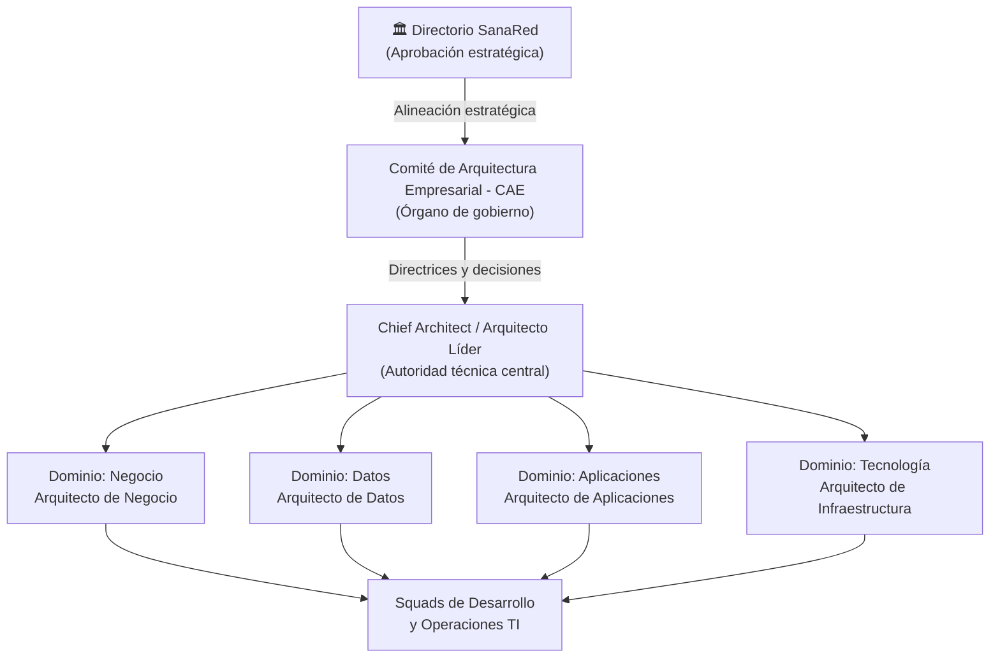

##### 1.4.2 Roles del Comité de Arquitectura Empresarial

| Rol | Responsabilidades | Autoridad |
|-----|-------------------|-----------|
| **Directorio** | Aprobación de la visión estratégica y grandes inversiones tecnológicas | Decisión final sobre roadmap y presupuesto |
| **CAE (Comité de Arquitectura Empresarial)** | Aprobación de principios, decisiones arquitectónicas relevantes y excepciones | Veto sobre diseños que contradigan principios |
| **Chief Architect / Arquitecto Líder** | Conducción del proceso ADM, arbitraje técnico, mantenimiento del repositorio de arquitectura | Autoridad técnica sobre estándares y patrones |
| **Arquitecto de Negocio** | Modelos de negocio, capacidades, procesos y alineación con objetivos estratégicos | Aprobación de cambios en capacidades de negocio |
| **Arquitecto de Datos** | Dominios de datos, modelos conceptuales, políticas de calidad y privacidad | Aprobación de modelos de datos y políticas de MPI |
| **Arquitecto de Aplicaciones** | Portafolio de aplicaciones, integraciones, APIs y patrones de solución | Aprobación de nuevas integraciones y reemplazos |
| **Arquitecto de Infraestructura** | Infraestructura multinube, SLAs, seguridad técnica y plataformas | Aprobación de cambios de plataforma y topología de red |

##### 1.4.3 Proceso de Revisión Arquitectónica

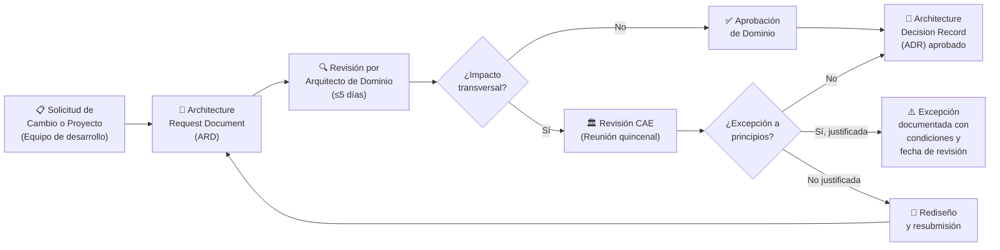

##### 1.4.4 Artefactos de Gobernanza

| Artefacto | Propósito | Frecuencia |
|-----------|-----------|------------|
| **Architecture Decision Record (ADR)** | Documenta cada decisión arquitectónica relevante con contexto, opciones evaluadas y justificación | Por decisión |
| **Architecture Compliance Review** | Verifica que los proyectos en curso cumplan los principios y estándares definidos | Por sprint de arquitectura (mensual) |
| **Architecture Roadmap** | Plan de transición AS-IS → TO-BE con fases, proyectos e hitos | Revisión trimestral |
| **Principles Catalog** | Registro versionado de los principios arquitectónicos vigentes | Revisión semestral o ante cambio estratégico |
| **Repositorio de Arquitectura** | Almacén centralizado de todos los artefactos (modelos, diagramas, ADRs, matrices) | Actualización continua |

---

### PARTE II — FASE A: VISIÓN DE LA ARQUITECTURA

#### 2.1 Declaración de Visión de Arquitectura

> *"En el horizonte del Hito 1, SanaRed Integrada consolidará los fundamentos de una red de salud
> digitalmente integrada, centrada en el paciente y gobernada por datos. La arquitectura empresarial
> resultante establecerá la identidad única del paciente como eje de todos los procesos clínicos y
> administrativos, una capa de integración confiable que elimine los puntos únicos de falla, y un
> modelo de gobernanza que alinee las decisiones tecnológicas con los siete objetivos estratégicos del
> directorio. El estado objetivo del Hito 1 no es la transformación completa, sino la construcción del
> mapa arquitectónico que habilite esa transformación de forma ordenada, priorizada y trazable."*

**Horizonte temporal del Hito 1:** Análisis AS-IS completo + definición arquitectónica TO-BE conceptual
**Marco de referencia:** TOGAF ADM 10 — Fases Preliminar, A, B, C, D, E, F y Gestión de Requisitos

---

#### 2.2 Alcance del Hito 1

##### 2.2.1 Alcance — Dentro del Hito 1

| Dimensión | Elementos dentro del alcance |
|-----------|------------------------------|
| **Sedes** | Las 4 clínicas principales de la red + los 9 centros médicos ambulatorios |
| **Procesos de negocio** | Búsqueda de atención, Admisión del paciente, Atención clínica, Exámenes diagnósticos (laboratorio e imágenes), Facturación con aseguradoras, Seguimiento del paciente |
| **Sistemas de información** | HCE Oracle on-premises, Agenda SaaS, Portal de Pacientes AWS/RDS, LIS Azure SQL, PACS local + réplica GCP, ERP nube privada, CRM SaaS, Teleconsulta SaaS, App Móvil terceros, Portal de Pagos Azure, Repositorio Firma Electrónica SaaS, App Salud Ocupacional GCP |
| **Dominios arquitectónicos** | Negocio (BMC, Cadena de Valor, Capacidades), Datos (dominios, ERD, Golden Record), Aplicaciones (portafolio, matriz, brechas), Tecnología (mapa de infraestructura AS-IS y TO-BE conceptual) |
| **Fases ADM** | Preliminar, A, B, C, D, E, F y Gestión de Requisitos |
| **Entregables** | 3 documentos: 01_business_architecture.md, 02_information_systems.md, 03_togaf_adm_phases.md |

##### 2.2.2 Alcance — Fuera del Hito 1

| Dimensión | Elementos fuera del alcance | Justificación |
|-----------|----------------------------|---------------|
| **Diseño técnico detallado** | Arquitectura de solución de cada sistema (cloud architecture design, código, configuraciones) | Corresponde a hitos de implementación posteriores |
| **Migración efectiva de sistemas** | Ejecución de la migración de HCE, integración real de APIs, despliegues en producción | Requiere aprobación de inversión y gestión de proyectos |
| **Sistemas de terceros externos** | Portales de aseguradoras, sistemas de farmacias externas, laboratorios externos | Fuera del perímetro organizacional de SanaRed |
| **Diseño de seguridad técnica** | Penetration testing, configuración de firewalls, IAM detallado | Fase de diseño técnico en hito posterior |
| **Gestión del cambio organizacional** | Planes de capacitación, gestión de resistencia, comunicación interna | Dominio de gestión de proyectos y RRHH |
| **Sedes en proceso de adquisición** | Nuevas clínicas no incorporadas a la red a la fecha del análisis | Alcance indeterminado; se incorporarán en hitos futuros |

---

#### 2.3 Diagrama de Alcance Arquitectónico

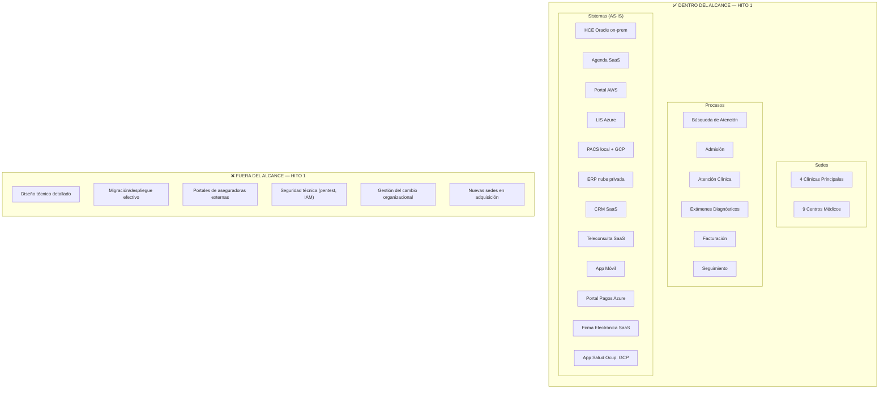

---

#### 2.4 Stakeholders

##### 2.4.1 Tabla de Stakeholders

| # | Stakeholder | Rol en la Organización | Preocupaciones Arquitectónicas | Nivel de Influencia | Postura ante el cambio |
|---|-------------|------------------------|-------------------------------|---------------------|------------------------|
| ST-01 | **Director General / CEO** | Máxima autoridad ejecutiva de la red SanaRed | Retorno sobre inversión tecnológica; reputación de la red ante pacientes y aseguradoras; cumplimiento de los 7 objetivos estratégicos | 🔴 Alta — Aprueba inversiones y prioridades | Patrocinador del proceso de transformación |
| ST-02 | **Director de TI / CIO** | Responsable de la arquitectura tecnológica y la operación de sistemas | Integración de sistemas heterogéneos; resiliencia de la plataforma; deuda técnica; gobernanza de APIs y datos; seguridad multinube | 🔴 Alta — Decisor técnico principal | Impulsor de la arquitectura TO-BE |
| ST-03 | **Director Médico** | Responsable de la calidad asistencial y los protocolos clínicos | Continuidad asistencial; disponibilidad de historia clínica completa; interoperabilidad entre sedes; seguridad del paciente; reducción de errores por información incompleta | 🔴 Alta — Validador de requisitos clínicos | Crítico para adopción; requiere demostración de valor clínico |
| ST-04 | **Director Financiero / CFO** | Responsable de finanzas, facturación y relación con aseguradoras | Reducción del ciclo de facturación (17 → 7 días); eliminación de expedientes observados; retorno financiero de la inversión; control de costos tecnológicos | 🟠 Media-Alta — Aprueba presupuesto del hito | Receptivo si se demuestran ahorros concretos |
| ST-05 | **Gerentes de Sede (4 clínicas)** | Responsables de la operación diaria en cada clínica principal | Disponibilidad de sistemas en su sede; impacto en la operación durante migraciones; sincronización de datos entre sedes; continuidad del servicio durante picos de demanda | 🟠 Media — Influyen en adopción operacional | Variable; algunos resistentes al cambio operativo |
| ST-06 | **Médicos Afiliados (1,200)** | Usuarios clínicos primarios de la HCE, resultados y teleconsulta | Vista longitudinal del paciente; velocidad de acceso a resultados de laboratorio e imágenes; integración de teleconsulta con historia clínica; reducción de re-trabajo por datos incompletos | 🟡 Media — Usuarios finales críticos para adopción | Clave para el éxito; adopción depende de usabilidad |
| ST-07 | **Jefe de Facturación y Admisión** | Responsable de los procesos administrativos de admisión y ciclo de cobro | Eliminación de duplicados de pacientes; automatización de autorizaciones de aseguradoras; trazabilidad del expediente de facturación; reducción de observaciones por inconsistencias | 🟡 Media — Operador de procesos críticos | Motivado por la reducción de reprocesos |
| ST-08 | **Responsable de Seguridad de la Información (CISO)** | Responsable de la seguridad de datos clínicos y cumplimiento regulatorio | Control de acceso unificado; auditoría correlacionada de accesos a datos clínicos; cifrado y gestión de identidades en entornos multinube; gestión de riesgos de privacidad | 🟠 Media-Alta — Veto sobre decisiones de seguridad | Aliado natural; promoverá principios de privacidad por diseño |

##### 2.4.2 Mapa de Influencia y Postura de Stakeholders

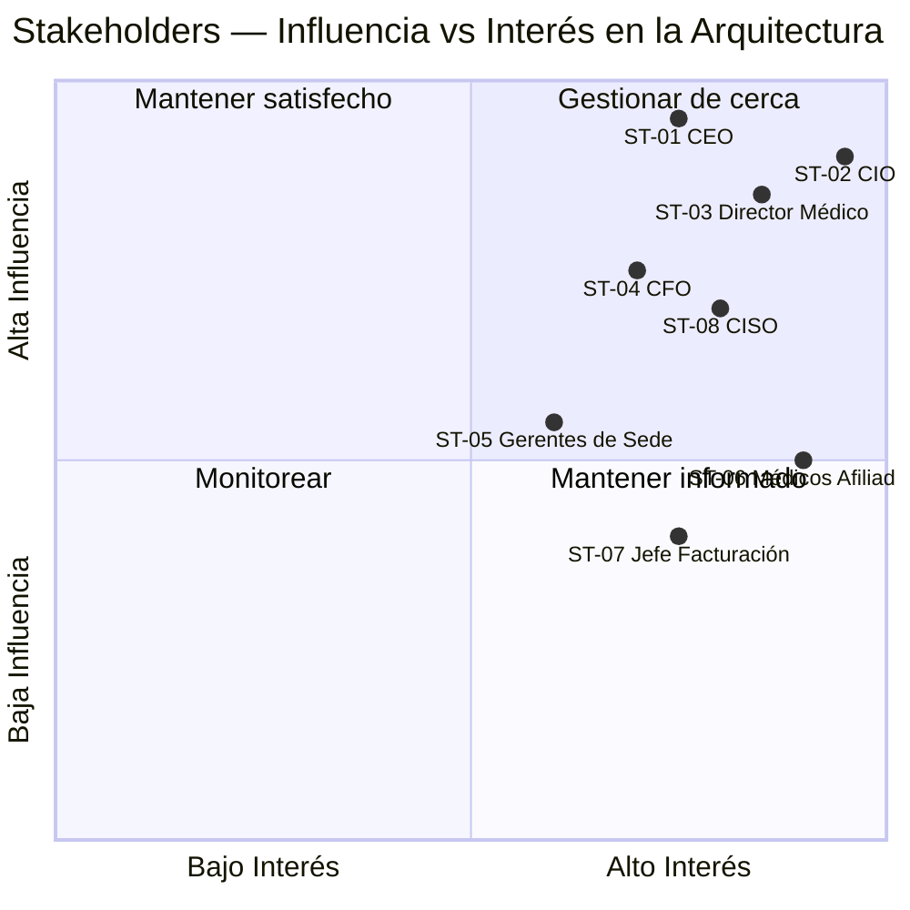

---

#### 2.5 Objetivos Estratégicos Trazados al Trabajo de Arquitectura

La siguiente tabla mapea cada uno de los 7 objetivos estratégicos del directorio de SanaRed
con las fases ADM donde se abordan y los artefactos arquitectónicos que los satisfacen en el Hito 1.

| ID | Objetivo Estratégico | Meta Cuantificada | Fase ADM Principal | Artefacto Arquitectónico que lo Aborda | Principio Habilitador |
|----|---------------------|-------------------|--------------------|-----------------------------------------|-----------------------|
| OE-01 | Reducir tiempo de espera ambulatoria | 52 min → 25 min | Fase B (Negocio) | Mapa de Capacidades (Gestión del Paciente, Admisión); Cadena de Valor — punto de quiebre en admisión/agenda | PN-01, PA-01, PT-01 |
| OE-02 | Lograr vista clínica longitudinal | 90% de pacientes atendidos | Fase C (Datos) | Mapa de Dominios de Datos; ERD con Historia Clínica + Episodio; estrategia Golden Record | PD-01, PN-02, PA-01 |
| OE-03 | Disminuir registros duplicados | 80% de reducción (desde 126,000) | Fase C (Datos) | Estrategia de Master Patient Index (MPI); brecha de identidad única; arquitectura de deduplicación TO-BE | PD-01, PD-02, PA-01 |
| OE-04 | Disponibilidad de canales digitales | 99.9% de disponibilidad | Fase D (Tecnología) | Mapa de infraestructura TO-BE; SLAs por servicio; diseño de resiliencia de portal, agenda y resultados | PT-01, PT-02, PA-03 |
| OE-05 | Reducir ciclo de facturación | 17 días → 7 días (hasta 35 → 7) | Fase B y C | Cadena de Valor (Fase 5 — Facturación); brecha de aplicaciones en ERP + HCE; portafolio de aplicaciones | PN-03, PD-02, PA-01 |
| OE-06 | Fortalecer seguridad y privacidad de datos | Control de acceso por rol + trazabilidad completa | Fase Preliminar + D | Principios PD-03, PT-02; Riesgo 1 del Anexo (seguridad); Matriz de infraestructura con clasificación de datos | PD-03, PT-02, PT-03 |
| OE-07 | Implementar analítica clínica y operativa | Capacidades de BI para demanda, calidad y costos | Fase B y D | Mapa de Capacidades (Analítica); Brecha de aplicaciones (ausencia de data platform); roadmap de analítica en TO-BE | PN-03, PT-02, PA-01 |

##### 2.5.1 Diagrama de Trazabilidad — Objetivos Estratégicos ↔ Dominios Arquitectónicos

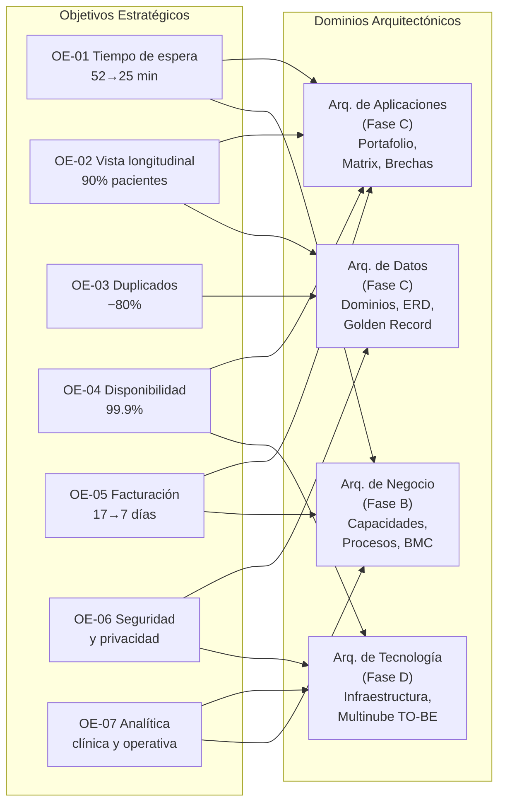

---

#### 2.6 Declaración de Trabajo de Arquitectura (Statement of Architecture Work)

##### SAW-001 | Hito 1 de Arquitectura Empresarial — Clínica SanaRed Integrada

| Campo | Detalle |
|-------|---------|
| **Título del trabajo** | Arquitectura Empresarial AS-IS y TO-BE Conceptual — Hito 1 |
| **Organización patrocinadora** | Clínica SanaRed Integrada |
| **Patrocinador ejecutivo** | Director General / CEO |
| **Autoridad arquitectónica** | Chief Architect / Arquitecto Líder (a designar) |
| **Marco de referencia** | TOGAF ADM 10 |
| **Fases cubiertas** | Preliminar, A, B, C, D, E, F y Gestión de Requisitos |
| **Fecha de inicio** | [A definir por el programa] |
| **Fecha de entrega** | [A definir por el programa] |

##### 2.6.1 Declaración del Problema Arquitectónico

SanaRed opera con una arquitectura tecnológica fragmentada resultado de un crecimiento
acelerado y adquisiciones no planificadas. Los sistemas actuales no comparten identidades,
datos ni procesos de forma coherente, lo que genera:

- **126,000 registros duplicados** de pacientes con riesgo clínico y administrativo
- **18,400 reclamos anuales** por demoras atribuibles a procesos no integrados
- **9% de órdenes diagnósticas** con demora en disponibilidad de resultados
- **Ciclo de facturación de 17 días** (hasta 35 en convenios) por falta de automatización
- **Disponibilidad de canales < 99.9%** con caída documentada de 4 horas en campaña corporativa
- **3 riesgos tecnológicos críticos** (Seguridad, Integridad, Disponibilidad) sin arquitectura de mitigación

##### 2.6.2 Resultados Esperados del Hito 1

| # | Entregable | Contenido | Archivo |
|---|-----------|-----------|---------|
| E1 | **Arquitectura de Negocio** | ADM Preliminar + Fase A + Fase B (BMC, Cadena de Valor, Mapa de Capacidades) | `01_business_architecture.md` |
| E2 | **Sistemas de Información** | Fase C (Dominios de datos, ERD, Portafolio, Matriz, Brechas) | `02_information_systems.md` |
| E3 | **Tecnología, Brechas y Roadmap** | Fases D, E, F y Gestión de Requisitos (Infraestructura, Gap Analysis, Roadmap, Trazabilidad) | `03_togaf_adm_phases.md` |

##### 2.6.3 Restricciones y Suposiciones

| Tipo | Descripción |
|------|-------------|
| **Restricción** | El análisis AS-IS se basa en el caso clínico documentado (Caso 3a y 3b); no se cuenta con acceso directo a los sistemas en producción |
| **Restricción** | El Hito 1 produce artefactos de arquitectura conceptual; no incluye especificaciones técnicas de implementación |
| **Restricción** | Los diagramas deben generarse en Mermaid.js dentro de bloques de código para permitir renderización directa |
| **Suposición** | Las métricas de negocio (duplicados, tiempos, reclamos) son correctas según el caso documentado |
| **Suposición** | SanaRed adoptará TOGAF 10 como marco de referencia principal y respetará los principios definidos en la Fase Preliminar |
| **Suposición** | El Comité de Arquitectura Empresarial será constituido formalmente antes del inicio de la Fase B |
| **Suposición** | Los estándares HL7 FHIR R4, DICOM e ICD-10 son adoptados como estándares objetivo para la interoperabilidad |

##### 2.6.4 Criterios de Éxito del Hito 1

| Criterio | Métrica de verificación |
|----------|------------------------|
| Cobertura de los 7 objetivos estratégicos | Cada OE trazado con al menos un artefacto arquitectónico en la Matriz de Trazabilidad |
| Completitud del análisis AS-IS | Los 12 sistemas del portafolio documentados con función, hosting y estado |
| Identificación de brechas críticas | Las 3 brechas del Anexo 3b documentadas con impacto en negocio y prioridad |
| Calidad de los entregables | 100% de diagramas en Mermaid.js; tablas en Markdown; estructura TOGAF cumplida |
| Validación por el CAE | Aprobación formal del Statement of Architecture Work y los principios definidos |

---

#### 2.7 Visión de Alto Nivel del Estado Objetivo (TO-BE Conceptual)

El siguiente diagrama representa la visión arquitectónica de alto nivel que el Hito 1 establece
como norte para los hitos de implementación posteriores. No es un diseño técnico detallado,
sino la intención arquitectónica que guiará las decisiones de las fases B, C, D, E y F.

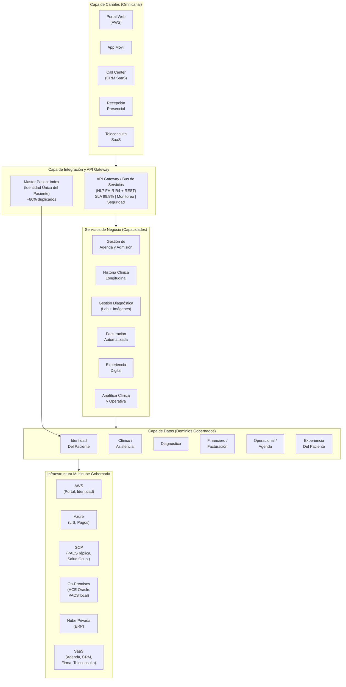

---

## Sección 2: Modelado del Negocio AS-IS (ADM Fase B)

### 2.1 Business Model Canvas (Osterwalder)

#### Introducción al BMC

El Business Model Canvas describe cómo SanaRed crea, entrega y captura valor en su estado
actual (AS-IS). Los 9 bloques reflejan la realidad operacional documentada en el caso clínico,
incluyendo las tensiones generadas por la fragmentación tecnológica que afectan la propuesta
de valor y las fuentes de ingresos.

---

#### Canvas — Los 9 Bloques de Osterwalder

| # | Bloque | Contenido AS-IS |
|---|--------|-----------------|
| **1** | **Segmentos de Clientes** | • **Pacientes particulares** — personas que pagan directamente por consultas, procedimientos y hospitalizaciones sin intermediario asegurador.  • **Pacientes asegurados** — personas con póliza de seguro médico privado; SanaRed actúa como prestadora en red.  • **Empresas con planes corporativos** — organizaciones que contratan programas de salud ocupacional, chequeos preventivos y atención médica para su fuerza laboral.  • **Dependientes familiares** — cónyuge e hijos de asegurados y empleados de empresas corporativas, cubiertos por la misma póliza o plan. |
| **2** | **Propuesta de Valor** | • Atención médica confiable con disponibilidad de especialistas en red de 4 clínicas + 9 centros ambulatorios.  • Diagnóstico oportuno: laboratorio (3,400 exámenes/día) e imágenes (920 estudios/día).  • Continuidad asistencial y cercanía geográfica.  • Omnicanalidad de acceso: portal web, app móvil, call center y recepción presencial.  • Programas preventivos y de salud ocupacional para empresas.  • Teleconsulta y canales digitales para atención remota. |
| **3** | **Canales** | • **Portal web** (AWS/RDS) — agendamiento, resultados y pagos en línea.  • **App móvil** (terceros) — notificaciones, citas y acceso a resultados.  • **Call center** (CRM SaaS) — reservas, consultas y soporte.  • **Recepción presencial** — admisión, triaje y consulta directa en cada sede.  • **Teleconsulta** (SaaS) — atención médica remota.  • **Portales de aseguradoras** — validación de coberturas y autorizaciones. |
| **4** | **Relaciones con Clientes** | • Atención personalizada presencial por médico afiliado (1,200 médicos).  • Gestión de campañas y comunicaciones vía CRM SaaS (4.2 M mensajes/año).  • Seguimiento post-consulta: recordatorios, encuestas de satisfacción y controles.  • Programas de salud ocupacional con reportes agregados a empresas cliente.  • Soporte por call center para incidencias de agenda, resultados y autorizaciones.  • Portal de pacientes para autogestión de información clínica y pagos. |
| **5** | **Fuentes de Ingresos** | • **Copagos** — pago directo del paciente asegurado por cada consulta o procedimiento.  • **Reembolsos de aseguradoras** — liquidación de prestaciones cubiertas por pólizas (ciclo promedio 17 días, hasta 35 en convenios).  • **Planes corporativos** — contratos con empresas para atención de empleados y chequeos preventivos.  • **Procedimientos diagnósticos** — laboratorio e imágenes facturados por evento.  • **Hospitalización y cirugía** — facturación por episodio de internamiento y pabellón.  • **Consultas particulares** — pago total por el paciente sin cobertura de seguro. |
| **6** | **Recursos Clave** | • **Capital humano:** 1,200 médicos afiliados, 3,800 colaboradores.  • **Infraestructura física:** 4 clínicas principales + 9 centros ambulatorios.  • **Sistemas tecnológicos críticos:** HCE Oracle (on-premises), Agenda SaaS, Portal AWS/RDS, LIS Azure SQL, PACS local + réplica GCP, ERP nube privada, CRM SaaS.  • **Datos clínicos y administrativos:** 2.4 M episodios/año, 1.6 M atenciones anuales.  • **Red de convenios:** aseguradoras, empresas corporativas y entidades reguladoras.  • **Marca y reputación:** construida en atención de calidad y especialidades médicas. |
| **7** | **Actividades Clave** | • Prestación de atención médica ambulatoria, de emergencia y hospitalización.  • Diagnóstico clínico: procesamiento de laboratorio e imágenes médicas.  • Gestión de la agenda y admisión de pacientes (156,000 citas/mes).  • Facturación y cobro a aseguradoras y empresas (expedientes, auditoría médica).  • Seguimiento y comunicación con pacientes (programas preventivos, recordatorios).  • Gestión de convenios y autorizaciones con aseguradoras.  • Operación y mantenimiento de sistemas tecnológicos distribuidos. |
| **8** | **Socios Clave** | • **Aseguradoras privadas** — financiadoras de la demanda asegurada; proveen coberturas y pagan prestaciones.  • **Médicos afiliados (1,200)** — prestadores de la atención clínica; no son empleados directos.  • **Proveedores de tecnología** — AWS (portal), Azure (LIS, pagos), GCP (PACS réplica), proveedor ERP, SaaS de agenda/CRM/teleconsulta.  • **Laboratorios y proveedores de equipos diagnósticos** — insumos y equipos para LIS y PACS.  • **Empresas corporativas** — clientes y socios en programas de salud ocupacional.  • **Reguladores y entidades de salud** — Ministerio de Salud, Superintendencia, entes de acreditación. |
| **9** | **Estructura de Costos** | • Costos de personal clínico y administrativo (mayor componente).  • Licencias y contratos de sistemas SaaS (agenda, CRM, teleconsulta, firma electrónica).  • Infraestructura tecnológica: on-premises (HCE Oracle, PACS), nubes públicas (AWS, Azure, GCP) y nube privada (ERP).  • Costos de auditoría médica y reprocesos por expedientes observados (13% de expedientes).  • Costos de integración y mantenimiento de integradores HL7 y APIs intermedias.  • Costos operativos por incidentes: caídas de portal, contingencias manuales (ej. 1,400 admisiones en formularios temporales).  • Costos de call center por escalamiento de incidencias digitales (22% del volumen por resultados). |

---

#### Análisis por Bloque — Hallazgos Clave AS-IS

**Segmentos de Clientes:** Los cuatro segmentos comparten la misma infraestructura de sistemas, pero sus flujos son radicalmente distintos. Los pacientes asegurados dependen de autorizaciones externas que ralentizan la admisión. Los dependientes familiares son fuente principal de duplicados (relaciones no sincronizadas entre portal, agenda y HCE). Las empresas corporativas demandan reportes agregados que hoy se generan manualmente.

**Propuesta de Valor:** La propuesta es sólida en infraestructura física y capacidad clínica, pero está comprometida por la fragmentación tecnológica: el 9% de órdenes diagnósticas presenta demora en resultados, el portal cayó 4 horas en campaña corporativa, y los pacientes reciben comunicaciones contradictorias (reclamos crecieron 34%). La propuesta de valor prometida no siempre se cumple.

**Fuentes de Ingresos:** El ciclo de facturación de 17 días promedio (hasta 35 en convenios) y el 13% de expedientes observados generan un impacto financiero medible: USD 1.8 M acumulados en un solo convenio corporativo. La fragmentación entre HCE, ERP y portales de aseguradoras es la causa raíz.

**Recursos Clave — Sistemas Tecnológicos:** Los 7 sistemas tecnológicos críticos operan en silos sin identidad de paciente compartida: la HCE Oracle genera identificadores por sede, el portal AWS crea registros por correo, la agenda SaaS por teléfono y nombre. Esta heterogeneidad produjo 126,000 registros duplicados y es el driver de mayor riesgo operacional y clínico.

**Estructura de Costos:** La fragmentación tecnológica genera costos ocultos significativos: reprocesos de admisión, auditorías manuales, call center por incidencias digitales y contingencias operacionales. Estos costos son difíciles de cuantificar en el ERP actual porque no existe trazabilidad cruzada entre episodio clínico, sistema fallado y costo incurrido.

---

### 2.2 Cadena de Valor de Porter

#### Introducción

La Cadena de Valor de Porter permite descomponer las operaciones de SanaRed en actividades
que generan valor directo al paciente (primarias) y actividades que habilitan esas operaciones
(soporte). El análisis AS-IS revela dónde la fragmentación tecnológica interrumpe el flujo de
valor y genera los indicadores negativos documentados en el caso.

---

#### Diagrama — Cadena de Valor de Porter AS-IS (Sub-diagrama 1/3: Estructura General)

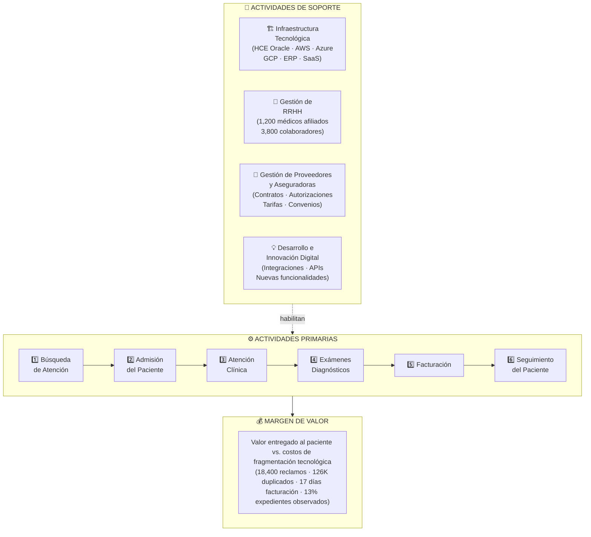

#### Diagrama — Cadena de Valor de Porter AS-IS (Sub-diagrama 2/3: Sistemas por Actividad Primaria)

```mermaid
flowchart TD
    subgraph P1["1️⃣ BÚSQUEDA DE ATENCIÓN"]
        P1A["Portal Web (AWS/RDS)"]
        P1B["App Móvil (terceros)"]
        P1C["Call Center (CRM SaaS)"]
        P1D["Recepción Presencial (HCE on-prem)"]
        P1E["Agenda Médica (SaaS)"]
        P1F["Portales Aseguradoras (externos)"]
    end

    subgraph P2["2️⃣ ADMISIÓN DEL PACIENTE"]
        P2A["HCE Oracle (on-premises)"]
        P2B["Portal de Pagos (Azure App Service)"]
        P2C["Portales Aseguradoras (autorizaciones)"]
        P2D["Firma Electrónica (SaaS)"]
        P2E["Agenda SaaS (validación cita)"]
    end

    subgraph P3["3️⃣ ATENCIÓN CLÍNICA"]
        P3A["HCE Oracle (on-premises)"]
        P3B["Teleconsulta (SaaS)"]
        P3C["LIS Azure (resultados lab)"]
        P3D["PACS local por sede (imágenes)"]
        P3E["Módulo de Recetas (HCE)"]
    end

    subgraph P4["4️⃣ EXÁMENES DIAGNÓSTICOS"]
        P4A["LIS (Azure SQL Managed Instance)"]
        P4B["Equipos HL7 → LIS (interfaces)"]
        P4C["PACS local + réplica GCP"]
        P4D["Integrador HL7 → HCE"]
        P4E["Portal AWS (resultados paciente)"]
    end

    subgraph P5["5️⃣ FACTURACIÓN"]
        P5A["ERP (nube privada)"]
        P5B["HCE Oracle (prestaciones)"]
        P5C["Portales Aseguradoras (envío docs)"]
        P5D["Portal de Pagos Azure"]
        P5E["Auditoría médica (manual + HCE)"]
    end

    subgraph P6["6️⃣ SEGUIMIENTO DEL PACIENTE"]
        P6A["CRM SaaS (campañas)"]
        P6B["Portal AWS (citas, resultados, pagos)"]
        P6C["App Móvil (notificaciones)"]
        P6D["App Salud Ocupacional (GCP)"]
        P6E["Encuestas (SaaS independiente)"]
    end

    P1 --> P2 --> P3 --> P4 --> P5 --> P6
```

#### Diagrama — Cadena de Valor de Porter AS-IS (Sub-diagrama 3/3: Sistemas por Actividad de Soporte)

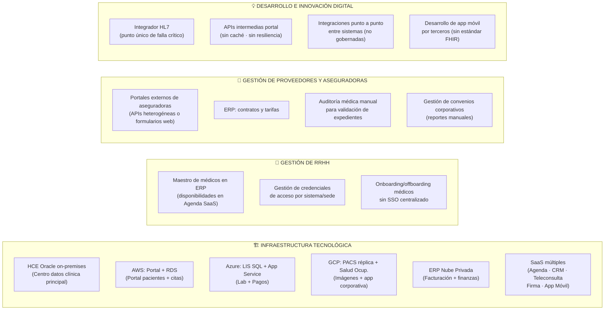

#### Tabla Complementaria — Actividades, Sistemas AS-IS y Puntos de Quiebre

| Actividad | Tipo | Descripción | Sistemas AS-IS que la soportan | Puntos de quiebre / Fragmentación identificada |
|-----------|------|-------------|-------------------------------|------------------------------------------------|
| **Búsqueda de Atención** | Primaria | Paciente accede a SanaRed por canal digital, telefónico o presencial para agendar una cita o solicitar atención. | Agenda SaaS · Portal Web (AWS/RDS) · App Móvil (terceros) · Call Center (CRM SaaS) · HCE on-prem (sedes antiguas) · Portales aseguradoras | Identidades fragmentadas por canal: un paciente puede tener 2 correos, 3 números de historia y registros de dependientes no sincronizados. El 4% de citas genera reclamo por errores de horario, sede o cobertura. En campaña de influenza, 18,000 citas fallaron en sincronización en 2 centros médicos. |
| **Admisión del Paciente** | Primaria | Validación de identidad, cobertura, consentimiento, motivo y pago inicial al llegar a la sede. Incluye triaje en emergencias. | HCE Oracle on-premises · Portal de Pagos (Azure App Service) · Portales aseguradoras (externos) · Firma Electrónica (SaaS) · Agenda SaaS | Las autorizaciones de aseguradora dependen de portales externos heterogéneos (algunas con API, otras solo formularios). Caída de conectividad entre 2 sedes = 1,400 admisiones en formularios temporales → 260 inconsistencias al migrar al sistema central. |
| **Atención Clínica** | Primaria | El médico abre la HCE, revisa antecedentes, registra diagnóstico, solicita exámenes y prescribe. Incluye consulta presencial y teleconsulta. | HCE Oracle on-premises · Teleconsulta SaaS (PDF manual) · LIS Azure (resultados) · PACS local por sede · Módulo de recetas (HCE) | La teleconsulta genera PDF que el médico sube manualmente a la HCE. Resultados de otra sede no siempre visibles por falla de sincronización. El 9% de órdenes diagnósticas presentó demora. Caso crítico: paciente anticoagulado sin antecedentes visibles por problema de sincronización inter-sede. |
| **Exámenes Diagnósticos** | Primaria | Procesamiento de muestras de laboratorio (3,400/día) e imágenes médicas (920/día), validación de resultados y entrega a médico y paciente. | LIS (Azure SQL Managed Instance) · Equipos HL7 → LIS · PACS local + réplica GCP · Integrador HL7 → HCE · Portal AWS (resultados) | El integrador HL7 es punto único de falla crítico: su caída dejó 18,600 resultados pendientes durante 11 horas (existían en LIS pero no en HCE ni portal). El 6% de resultados ambulatorios no aparece en el portal en el plazo prometido. 22% de llamadas al call center son por resultados. |
| **Facturación** | Primaria | Generación y envío de expedientes de cobro a aseguradoras y pacientes, incluyendo codificación, auditoría médica y liquidación. | ERP (nube privada) · HCE Oracle (prestaciones) · Portales aseguradoras · Portal de Pagos (Azure) · Auditoría médica (proceso manual) | El 13% de expedientes es observado por documentación incompleta o inconsistencia entre diagnóstico, procedimiento y autorización. Ciclo promedio 17 días (hasta 35 en convenios). USD 1.8 M acumulados en un convenio corporativo por discrepancias de codificación durante 6 meses. |
| **Seguimiento del Paciente** | Primaria | Envío de resultados, recordatorios, encuestas, indicaciones post-consulta, controles y reportes corporativos tras la atención. | CRM SaaS · Portal AWS · App Móvil · App Salud Ocupacional (GCP) · Encuestas SaaS (independiente) | Los datos de satisfacción no se conectan con episodios clínicos ni operaciones de sede. El 18% de mensajes tuvo rebote. Reclamos por comunicaciones contradictorias crecieron 34%. |
| **Infraestructura Tecnológica** | Soporte | Operación y mantenimiento de todos los sistemas, nubes, redes y centros de datos que soportan la red clínica. | HCE Oracle on-prem · AWS (Portal/RDS) · Azure (LIS/App Service) · GCP (PACS/GCS) · ERP nube privada · SaaS múltiples | Arquitectura multinube no gobernada: workloads asignados históricamente, no por diseño. Sin SLAs formales por servicio. El portal AWS no tiene caché en API de resultados. |
| **Gestión de RRHH** | Soporte | Gestión del ciclo de vida del médico afiliado y colaborador: credenciales, accesos, disponibilidades y onboarding/offboarding. | ERP (maestro de médicos) · Agenda SaaS (disponibilidades) · Sistemas individuales por sede | Sin SSO centralizado: un médico que rota entre sedes puede conservar permisos más amplios de lo necesario (Riesgo de Seguridad 1). Las disponibilidades del maestro de médicos (ERP) pueden tardar horas en reflejarse en la Agenda SaaS. |
| **Gestión de Proveedores y Aseguradoras** | Soporte | Administración de contratos, tarifas, autorizaciones previas, convenios corporativos y relación con entidades financiadoras. | ERP (contratos/tarifas) · Portales externos aseguradoras · Auditoría médica manual · Reportes manuales para corporativos | Las aseguradoras no tienen estándar de integración uniforme. La auditoría de expedientes es mayoritariamente manual, generando el cuello de botella de los 17 días de ciclo de facturación. |
| **Desarrollo e Innovación Digital** | Soporte | Gestión de integraciones, APIs, nuevas funcionalidades y evolución tecnológica de los sistemas de la red. | Integrador HL7 · APIs intermedias portal · Integraciones punto a punto · App móvil (tercero) | No existe un API Gateway centralizado ni gobernanza de integraciones. Las APIs intermedias del portal no tienen caché ni resiliencia (caída del portal en campaña corporativa = 12,000 pacientes sin acceso). |

---

#### Análisis de Fragmentación Tecnológica — Puntos de Quiebre

La cadena de valor de SanaRed revela que el valor creado en cada actividad primaria se **erosiona
sistemáticamente** por la fragmentación tecnológica. Los sistemas que soportan cada actividad
no comparten identidades, datos ni protocolos de forma coherente.

##### Mapa de Puntos de Quiebre por Actividad

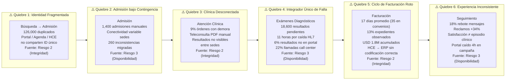

##### Tabla de Análisis de Fragmentación — Pérdidas de Valor Cuantificadas

| # | Punto de Quiebre | Actividad(es) Afectada(s) | Causa Raíz Tecnológica | Datos del Caso | Tipo de Riesgo (Anexo 3b) | Pérdida de Valor |
|---|------------------|--------------------------|------------------------|----------------|--------------------------|------------------|
| **F1** | **Identidad duplicada del paciente** | Búsqueda → Admisión → Atención Clínica → Facturación | Ausencia de Master Patient Index. Cada sistema genera su propio identificador sin sincronización. | **126,000 registros duplicados** | Riesgo 2 — Integridad | Errores clínicos potenciales, reprocesos administrativos, reclamos por inconsistencia de datos |
| **F2** | **Integrador HL7 como punto único de falla** | Exámenes Diagnósticos → Atención Clínica | Arquitectura de integración punto a punto sin redundancia, colas persistentes ni reintentos. | **18,600 resultados** pendientes durante **11 horas** | Riesgo 3 — Disponibilidad | Saturación del call center (22% de llamadas), riesgo de decisión médica incompleta |
| **F3** | **Ciclo de facturación fragmentado** | Facturación | Prestaciones de HCE no fluyen con codificación correcta al ERP. Auditoría médica manual. | **17 días** promedio (hasta **35**); **13%** expedientes observados; **USD 1.8 M** acumulados | Riesgo 2 — Integridad | Deterioro del flujo de caja, costos de reproceso, pérdida de ingresos |
| **F4** | **Portal sin resiliencia ante picos** | Búsqueda de Atención → Seguimiento | APIs intermedias sin caché ni escalamiento. | Portal caído **4 horas**; **12,000 pacientes** sin acceso | Riesgo 3 — Disponibilidad | Pérdida de confianza del segmento corporativo, reputación dañada |
| **F5** | **Conectividad variable entre sedes** | Admisión del Paciente | Arquitectura on-premises centralizada sin diseño de resiliencia para sedes pequeñas. | **1,400 admisiones** en formularios temporales; **260 inconsistencias** | Riesgo 3 — Disponibilidad | Errores en episodios clínicos, facturas observadas, reprocesos administrativos |
| **F6** | **Accesos heterogéneos sin auditoría** | Infraestructura Tecnológica | Sin SSO centralizado. Logs de acceso no correlacionados por identidad. | Sin correlación única entre portal AWS, HCE, LIS, PACS y SaaS | Riesgo 1 — Seguridad | Riesgo de acceso indebido a datos clínicos sensibles difícil de detectar |
| **F7** | **Seguimiento con datos desconectados** | Seguimiento del Paciente | CRM, portal, app, encuestas y app corporativa no comparten datos de episodio. | **18%** rebote de mensajes; reclamos por comunicaciones contradictorias **+34%** | Riesgo 2 — Integridad | Experiencia inconsistente del paciente, erosión de la lealtad |

---

## Sección 3: Mapa de Capacidades y Procesos (ADM Fase B)

### 3.1 Mapa de Capacidades de Negocio

#### Introducción

El Mapa de Capacidades representa **qué** hace SanaRed como organización, de forma independiente a cómo lo hace o qué sistemas lo ejecutan. Está estructurado en dos niveles jerárquicos: seis capacidades de Nivel 1 y sus sub-capacidades de Nivel 2. Las capacidades con brechas críticas identificadas en el análisis AS-IS se marcan como `[ALTA PRIORIDAD]`.

---

#### Diagrama: Mapa de Capacidades — Sub-diagrama 1/2 (Capacidades 1 a 3)

> El mapa completo supera 40 nodos; se divide en dos sub-diagramas conforme al Requirement 11.

```mermaid
graph TD
    ROOT["🏥 SANAREDE INTEGRADA\nMapa de Capacidades de Negocio"]

    %% CAPACIDAD 1
    C1["C1: Gestión del Paciente\n[ALTA PRIORIDAD]"]
    C1_1["C1.1 Gestión de Identidad\ny Deduplicación [ALTA PRIORIDAD]"]
    C1_2["C1.2 Registro y Admisión\ndel Paciente"]
    C1_3["C1.3 Gestión de Coberturas\ny Autorizaciones"]
    C1_4["C1.4 Gestión de\nConsentimientos"]
    C1_5["C1.5 Vista Longitudinal\ndel Paciente"]

    ROOT --> C1
    C1 --> C1_1
    C1 --> C1_2
    C1 --> C1_3
    C1 --> C1_4
    C1 --> C1_5

    %% CAPACIDAD 2
    C2["C2: Atención Clínica"]
    C2_1["C2.1 Consulta Ambulatoria"]
    C2_2["C2.2 Atención de Emergencia"]
    C2_3["C2.3 Hospitalización"]
    C2_4["C2.4 Cirugía y Procedimientos"]
    C2_5["C2.5 Teleconsulta"]
    C2_6["C2.6 Prescripción\ny Receta Electrónica"]

    ROOT --> C2
    C2 --> C2_1
    C2 --> C2_2
    C2 --> C2_3
    C2 --> C2_4
    C2 --> C2_5
    C2 --> C2_6

    %% CAPACIDAD 3
    C3["C3: Gestión Diagnóstica\n[ALTA PRIORIDAD]"]
    C3_1["C3.1 Gestión de\nÓrdenes Diagnósticas"]
    C3_2["C3.2 Laboratorio Clínico\n[ALTA PRIORIDAD]"]
    C3_3["C3.3 Diagnóstico por Imágenes"]
    C3_4["C3.4 Anatomía Patológica"]
    C3_5["C3.5 Disponibilidad\ny Entrega de Resultados [ALTA PRIORIDAD]"]

    ROOT --> C3
    C3 --> C3_1
    C3 --> C3_2
    C3 --> C3_3
    C3 --> C3_4
    C3 --> C3_5
```

---

#### Diagrama: Mapa de Capacidades — Sub-diagrama 2/2 (Capacidades 4 a 6)

```mermaid
graph TD
    ROOT["🏥 SANAREDE INTEGRADA\nMapa de Capacidades de Negocio"]

    %% CAPACIDAD 4
    C4["C4: Facturación y Finanzas\n[ALTA PRIORIDAD]"]
    C4_1["C4.1 Gestión de\nExpedientes de Cobro"]
    C4_2["C4.2 Gestión de Convenios\ny Contratos con Aseguradoras"]
    C4_3["C4.3 Ciclo de Cobro\ny Liquidación [ALTA PRIORIDAD]"]
    C4_4["C4.4 Auditoría Médica\nde Prestaciones"]
    C4_5["C4.5 Gestión de Cuentas\nPor Cobrar y Finanzas"]

    ROOT --> C4
    C4 --> C4_1
    C4 --> C4_2
    C4 --> C4_3
    C4 --> C4_4
    C4 --> C4_5

    %% CAPACIDAD 5
    C5["C5: Experiencia Digital\n[ALTA PRIORIDAD]"]
    C5_1["C5.1 Portal y App\ndel Paciente [ALTA PRIORIDAD]"]
    C5_2["C5.2 Agendamiento\nOmnicanal"]
    C5_3["C5.3 Teleconsulta\ny Canales Digitales"]
    C5_4["C5.4 Notificaciones\ny Seguimiento"]
    C5_5["C5.5 Salud Ocupacional\ny Programas Corporativos"]

    ROOT --> C5
    C5 --> C5_1
    C5 --> C5_2
    C5 --> C5_3
    C5 --> C5_4
    C5 --> C5_5

    %% CAPACIDAD 6
    C6["C6: Infraestructura\ny Operaciones TI"]
    C6_1["C6.1 Integración\nClínica y de Datos (HL7/APIs)"]
    C6_2["C6.2 Seguridad de\nInformación y Privacidad"]
    C6_3["C6.3 Disponibilidad\ny Resiliencia de Sistemas"]
    C6_4["C6.4 Gestión\nMultinube y Plataformas"]
    C6_5["C6.5 Analítica\nClínica y Operativa"]

    ROOT --> C6
    C6 --> C6_1
    C6 --> C6_2
    C6 --> C6_3
    C6 --> C6_4
    C6 --> C6_5
```

---

#### Tabla de Capacidades: Detalle, Sistemas AS-IS, Madurez y Prioridad

| Capacidad Nivel 1 | Sub-capacidades Nivel 2 | Sistemas AS-IS que la soportan | Nivel de Madurez Actual | Prioridad de Mejora |
|---|---|---|---|---|
| **C1: Gestión del Paciente** `[ALTA PRIORIDAD]` | C1.1 Gestión de Identidad y Deduplicación | HCE Oracle, Portal AWS, Agenda SaaS | **Inicial** — 126K registros duplicados; depuración manual mensual | 🔴 ALTA |
| | C1.2 Registro y Admisión del Paciente | HCE Oracle on-prem, Portal AWS, Admisión local | **Repetible** — Funciona pero inconsistente entre sedes | 🟡 MEDIA |
| | C1.3 Gestión de Coberturas y Autorizaciones | Portales externos de aseguradoras (web/formularios) | **Inicial** — Proceso manual; contingencia en papel | 🔴 ALTA |
| | C1.4 Gestión de Consentimientos | Repositorio SaaS de firma electrónica | **Repetible** — Digitalizado pero aislado del HCE | 🟡 MEDIA |
| | C1.5 Vista Longitudinal del Paciente | HCE Oracle (parcial), LIS Azure, PACS local | **Inicial** — Sin integración completa entre sedes y sistemas | 🔴 ALTA |
| **C2: Atención Clínica** | C2.1 Consulta Ambulatoria | HCE Oracle on-prem | **Definido** — Proceso estable, HCE maduro | 🟢 BAJA |
| | C2.2 Atención de Emergencia | HCE Oracle on-prem, Admisión local | **Definido** — Funcional pero con brechas de continuidad | 🟡 MEDIA |
| | C2.3 Hospitalización | HCE Oracle on-prem | **Definido** — Soportado; riesgo en sincronización de resultados | 🟡 MEDIA |
| | C2.4 Cirugía y Procedimientos | HCE Oracle on-prem | **Definido** — Soportado; codificación a mejorar para facturación | 🟡 MEDIA |
| | C2.5 Teleconsulta | Teleconsulta SaaS (PDF manual al HCE) | **Repetible** — Integración manual; datos no fluyen automáticamente | 🟡 MEDIA |
| | C2.6 Prescripción y Receta Electrónica | Módulo separado en HCE | **Repetible** — Funcional pero desconectado de farmacia externa | 🟡 MEDIA |
| **C3: Gestión Diagnóstica** `[ALTA PRIORIDAD]` | C3.1 Gestión de Órdenes Diagnósticas | HCE Oracle on-prem | **Repetible** — Órdenes existen; asociación al episodio falló en 9% de casos | 🔴 ALTA |
| | C3.2 Laboratorio Clínico | LIS Azure SQL Managed Instance | **Definido** — LIS robusto; falla en la entrega a HCE | 🔴 ALTA |
| | C3.3 Diagnóstico por Imágenes | PACS local por sede, réplica GCP | **Repetible** — Sin acceso centralizado; visor separado del HCE | 🟡 MEDIA |
| | C3.4 Anatomía Patológica | PACS local / procesos manuales | **Inicial** — Sin sistema dedicado identificado | 🟡 MEDIA |
| | C3.5 Disponibilidad y Entrega de Resultados | Integrador HL7 → HCE; Portal AWS vía APIs | **Inicial** — 9% de demoras; caída de 11h del integrador HL7 | 🔴 ALTA |
| **C4: Facturación y Finanzas** `[ALTA PRIORIDAD]` | C4.1 Gestión de Expedientes de Cobro | ERP privado (nube privada) | **Repetible** — 13% de expedientes observados por documentación incompleta | 🔴 ALTA |
| | C4.2 Gestión de Convenios con Aseguradoras | ERP privado, portales de aseguradoras | **Repetible** — Gestión activa pero sin integración electrónica formal | 🔴 ALTA |
| | C4.3 Ciclo de Cobro y Liquidación | ERP privado, HCE Oracle, portales aseguradoras | **Inicial** — 17 días promedio (35 días en algunos convenios) | 🔴 ALTA |
| | C4.4 Auditoría Médica de Prestaciones | Proceso manual sobre HCE y ERP | **Repetible** — Manual; cuellos de botella frecuentes | 🔴 ALTA |
| | C4.5 Gestión de Cuentas Por Cobrar | ERP privado, Portal de Pagos Azure | **Repetible** — USD 1.8M acumulado en un convenio; sin automatización | 🟡 MEDIA |
| **C5: Experiencia Digital** `[ALTA PRIORIDAD]` | C5.1 Portal y App del Paciente | Portal AWS (RDS), App Móvil terceros | **Repetible** — Caída de 4h; 12K pacientes afectados | 🔴 ALTA |
| | C5.2 Agendamiento Omnicanal | Agenda SaaS, Call Center CRM SaaS, Admisión local | **Repetible** — 11% reprogramaciones; fallas de sincronización en campaña | 🔴 ALTA |
| | C5.3 Teleconsulta y Canales Digitales | Teleconsulta SaaS | **Repetible** — Disponible pero no integrado al HCE | 🟡 MEDIA |
| | C5.4 Notificaciones y Seguimiento | CRM SaaS, Portal AWS, App Móvil | **Repetible** — 18% rebote; reclamos por comunicaciones contradictorias | 🟡 MEDIA |
| | C5.5 Salud Ocupacional y Programas Corp. | App propia en GCP | **Definido** — Funciona en aislamiento; sin integración con HCE | 🟡 MEDIA |
| **C6: Infraestructura y Operaciones TI** | C6.1 Integración Clínica y de Datos | Integrador HL7, APIs intermedias | **Inicial** — Punto único de falla; sin idempotencia ni cache | 🔴 ALTA |
| | C6.2 Seguridad de Información y Privacidad | Logs dispersos por sistema; sin correlación de identidad | **Inicial** — Sin SSO unificado; roles heredados por sede | 🔴 ALTA |
| | C6.3 Disponibilidad y Resiliencia | Sin SLA formal por canal; sin escalamiento automático | **Inicial** — Picos de demanda provocan degradación sin respuesta automática | 🔴 ALTA |
| | C6.4 Gestión Multinube y Plataformas | AWS, Azure, GCP, On-prem, nube privada | **Repetible** — Múltiples nubes sin estrategia de gobernanza unificada | 🟡 MEDIA |
| | C6.5 Analítica Clínica y Operativa | Azure (LIS), datos dispersos | **Inicial** — Datos suficientes pero sin integración analítica | 🟡 MEDIA |

> **Niveles de madurez:** Inicial → Repetible → Definido → Gestionado → Optimizado (escala CMMI adaptada)

---

### 3.2 Mapa de Procesos Críticos

Los siguientes diagramas representan los cuatro procesos críticos de SanaRed en notación BPMN conceptual (flowchart). Cada diagrama muestra actores/roles, actividades principales, sistemas involucrados y puntos de decisión clave.

---

#### Proceso 1: Agendamiento y Admisión del Paciente

```mermaid
flowchart TD
    P1_START([🟢 Inicio: Paciente solicita cita])

    P1_CANAL{Canal de\natención}
    P1_PORTAL["Portal Web/App\n(Portal AWS)"]
    P1_CALL["Call Center\n(CRM SaaS)"]
    P1_PRESEN["Recepción presencial\n(Admisión local)"]

    P1_BUSCAR["Buscar disponibilidad\nmédico/especialidad\n(Agenda SaaS)"]
    P1_IDCHECK{¿Paciente\nregistrado?}
    P1_NEWREG["Crear nuevo registro\n(HCE Oracle / Portal AWS)"]
    P1_DUPCHECK{¿Posible\nduplicado\ndetectado?}
    P1_MANUAL["⚠️ Revisión manual\npor admisionista"]
    P1_COBERTURA["Verificar cobertura\ny póliza\n(Portal aseguradora)"]
    P1_COBCHECK{¿Cobertura\nválida?}
    P1_AUTORIZ["Solicitar autorización\na aseguradora\n(Portal externo / API)"]
    P1_AUTHCHECK{¿Autorización\naprobada?}
    P1_CONTING["⚠️ Operación en\ncontingencia (papel)"]
    P1_CONSENT["Registrar consentimiento\ninformado\n(Repositorio SaaS firma)"]
    P1_CONFIRM["Confirmar cita\ny notificar paciente\n(CRM SaaS / App)"]
    P1_LLEGADA["Paciente llega\na la sede"]
    P1_ADMISION["Admisión en sede\n(HCE Oracle on-prem)"]
    P1_TRIAJE{¿Requiere\ntriaje?}
    P1_TRIAGE_ACT["Evaluación de triaje\n(Enfermera / HCE)"]
    P1_FIN([🔴 Fin: Paciente\nadmitido para atención])

    P1_START --> P1_CANAL
    P1_CANAL -->|Digital| P1_PORTAL
    P1_CANAL -->|Teléfono| P1_CALL
    P1_CANAL -->|Presencial| P1_PRESEN
    P1_PORTAL --> P1_BUSCAR
    P1_CALL --> P1_BUSCAR
    P1_PRESEN --> P1_BUSCAR
    P1_BUSCAR --> P1_IDCHECK
    P1_IDCHECK -->|Sí| P1_COBERTURA
    P1_IDCHECK -->|No| P1_NEWREG
    P1_NEWREG --> P1_DUPCHECK
    P1_DUPCHECK -->|No duplicado| P1_COBERTURA
    P1_DUPCHECK -->|Posible duplicado| P1_MANUAL
    P1_MANUAL --> P1_COBERTURA
    P1_COBERTURA --> P1_COBCHECK
    P1_COBCHECK -->|Particular| P1_CONSENT
    P1_COBCHECK -->|Asegurado| P1_AUTORIZ
    P1_AUTORIZ --> P1_AUTHCHECK
    P1_AUTHCHECK -->|Aprobada| P1_CONSENT
    P1_AUTHCHECK -->|Falla sistema| P1_CONTING
    P1_CONTING --> P1_CONSENT
    P1_CONSENT --> P1_CONFIRM
    P1_CONFIRM --> P1_LLEGADA
    P1_LLEGADA --> P1_ADMISION
    P1_ADMISION --> P1_TRIAJE
    P1_TRIAJE -->|Emergencia| P1_TRIAGE_ACT
    P1_TRIAJE -->|Ambulatorio| P1_FIN
    P1_TRIAGE_ACT --> P1_FIN

    style P1_DUPCHECK fill:#FFD700,color:#000
    style P1_MANUAL fill:#FF6B6B,color:#fff
    style P1_AUTHCHECK fill:#FFD700,color:#000
    style P1_CONTING fill:#FF6B6B,color:#fff
```

> **Actores:** Paciente, Operador Call Center, Admisionista, Enfermera de Triaje, Aseguradora
> **Sistemas:** Agenda SaaS, Portal AWS, CRM SaaS, HCE Oracle, Portal Aseguradora, Repositorio Firma SaaS
> **Brechas críticas:** Detección de duplicados manual; autorizaciones por portales externos sin API; contingencia en papel ante fallas de conectividad

---

#### Proceso 2: Atención Clínica

```mermaid
flowchart TD
    P2_START([🟢 Inicio: Paciente en consultorio\no sala de emergencia])

    P2_ABRIR["Médico abre Historia Clínica\n(HCE Oracle on-prem)"]
    P2_ANTEC{¿Antecedentes\ncompletos\ny visibles?}
    P2_SYNC["⚠️ Solicitar información\na otra sede\n(llamada / manual)"]
    P2_REVIEW["Revisar antecedentes,\nalergias, medicamentos\n(HCE Oracle)"]
    P2_CONSULT["Realizar consulta\ny examen físico"]
    P2_DIAG["Registrar diagnóstico\n(HCE Oracle — CIE-10)"]
    P2_DECISION{¿Requiere\nexámenes\ndiagnósticos?}
    P2_ORDEN["Emitir Orden Médica\n(HCE Oracle)"]
    P2_RECETA{¿Requiere\nprescripción?}
    P2_RECIPE["Emitir Receta Electrónica\n(módulo separado HCE)"]
    P2_TELE{¿Es\nTeleconsulta?}
    P2_PDF["Generar resumen PDF\n(Teleconsulta SaaS)"]
    P2_UPLOAD["⚠️ Subir PDF manualmente\nal HCE Oracle"]
    P2_EVOL["Registrar evolución\nclinical en HCE Oracle"]
    P2_HOSP{¿Requiere\nhospitalización\no cirugía?}
    P2_DERIVAR["Derivar a hospitalización\no pabellón\n(HCE Oracle)"]
    P2_CIERRE["Cerrar episodio\nclínico\n(HCE Oracle)"]
    P2_SEGUIMIENTO["Programar seguimiento\no control\n(Agenda SaaS / CRM)"]
    P2_FIN([🔴 Fin: Atención registrada\nen HCE])

    P2_START --> P2_ABRIR
    P2_ABRIR --> P2_ANTEC
    P2_ANTEC -->|Sí — completos| P2_REVIEW
    P2_ANTEC -->|No — brecha de sync| P2_SYNC
    P2_SYNC --> P2_REVIEW
    P2_REVIEW --> P2_CONSULT
    P2_CONSULT --> P2_DIAG
    P2_DIAG --> P2_DECISION
    P2_DECISION -->|Sí| P2_ORDEN
    P2_DECISION -->|No| P2_RECETA
    P2_ORDEN --> P2_RECETA
    P2_RECETA -->|Sí| P2_RECIPE
    P2_RECETA -->|No| P2_TELE
    P2_RECIPE --> P2_TELE
    P2_TELE -->|Teleconsulta| P2_PDF
    P2_TELE -->|Presencial| P2_EVOL
    P2_PDF --> P2_UPLOAD
    P2_UPLOAD --> P2_EVOL
    P2_EVOL --> P2_HOSP
    P2_HOSP -->|Sí| P2_DERIVAR
    P2_HOSP -->|No| P2_CIERRE
    P2_DERIVAR --> P2_CIERRE
    P2_CIERRE --> P2_SEGUIMIENTO
    P2_SEGUIMIENTO --> P2_FIN

    style P2_ANTEC fill:#FFD700,color:#000
    style P2_SYNC fill:#FF6B6B,color:#fff
    style P2_UPLOAD fill:#FF6B6B,color:#fff
```

> **Actores:** Médico tratante, Enfermera, Paciente, Auditoría Médica
> **Sistemas:** HCE Oracle on-prem, Teleconsulta SaaS, Módulo de Recetas, Agenda SaaS, CRM SaaS
> **Brechas críticas:** Antecedentes de otras sedes no visibles en tiempo real; integración manual de teleconsulta al HCE; ausencia de vista longitudinal unificada

---

#### Proceso 3: Diagnóstico — Laboratorio Clínico

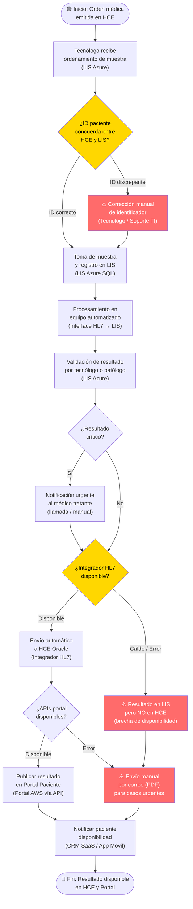

> **Actores:** Médico tratante, Tecnólogo médico, Patólogo clínico, Paciente, Soporte TI
> **Sistemas:** HCE Oracle on-prem, LIS Azure SQL, Integrador HL7, Portal AWS, CRM SaaS, App Móvil
> **Brechas críticas:** Discordancia de identificadores HCE↔LIS; integrador HL7 como punto único de falla (18,600 resultados bloqueados en caída de 11h); APIs del portal sin caché

---

#### Proceso 4: Facturación a Aseguradora

```mermaid
flowchart TD
    P4_START([🟢 Inicio: Episodio clínico\ncerrado en HCE])

    P4_PRESTACION["Extracción de prestaciones\ndesde HCE Oracle\n(proceso batch / manual)"]
    P4_CODCHECK{¿Codificación\nCIE-10 / CUPS\ncorrecta?}
    P4_CODFIX["⚠️ Corrección de codificación\npor auditoría médica\n(proceso manual)"]
    P4_DOCS["Recopilar documentos:\nconsentimiento, autorización,\nórdenes, informes"]
    P4_DOCCHECK{¿Documentación\ncompleta?}
    P4_DOCFIX["⚠️ Solicitar documentos\nfaltantes a médico\no sede (correo/llamada)"]
    P4_EXPEDIENTE["Armar expediente\nde cobro\n(ERP privado)"]
    P4_AUDITORIA["Auditoría médica\ninterna de prestaciones\n(ERP + HCE)"]
    P4_AUDITCHECK{¿Expediente\naprobado por\nauditoría?}
    P4_OBSERV["⚠️ Expediente observado:\ncorrección y reenvío\n(ERP privado)"]
    P4_ENVIO{¿Aseguradora\ntiene API\nelectrónica?}
    P4_API["Envío electrónico\nvía API\n(ERP ↔ Aseguradora)"]
    P4_PORTAL_AS["Envío por portal\nweb de aseguradora\n(manual)"]
    P4_CORREO["Envío por correo\n(PDF adjuntos)"]
    P4_LIQUIDACION["Aseguradora procesa\ny liquida\n(promedio 17 días)"]
    P4_OBSCHECK{¿Observaciones\nde aseguradora?}
    P4_REPROCESS["⚠️ Reprocessar expediente:\najuste y reenvío\n(ERP privado)"]
    P4_COBRO["Registrar cobro\ny conciliar\ncuenta por cobrar\n(ERP privado)"]
    P4_FIN([🔴 Fin: Factura liquidada\ny cobro registrado])

    P4_START --> P4_PRESTACION
    P4_PRESTACION --> P4_CODCHECK
    P4_CODCHECK -->|Correcta| P4_DOCS
    P4_CODCHECK -->|Incorrecta| P4_CODFIX
    P4_CODFIX --> P4_DOCS
    P4_DOCS --> P4_DOCCHECK
    P4_DOCCHECK -->|Completa| P4_EXPEDIENTE
    P4_DOCCHECK -->|Incompleta 13%| P4_DOCFIX
    P4_DOCFIX --> P4_EXPEDIENTE
    P4_EXPEDIENTE --> P4_AUDITORIA
    P4_AUDITORIA --> P4_AUDITCHECK
    P4_AUDITCHECK -->|Aprobado| P4_ENVIO
    P4_AUDITCHECK -->|Observado| P4_OBSERV
    P4_OBSERV --> P4_ENVIO
    P4_ENVIO -->|API disponible| P4_API
    P4_ENVIO -->|Solo portal| P4_PORTAL_AS
    P4_ENVIO -->|Sin integración| P4_CORREO
    P4_API --> P4_LIQUIDACION
    P4_PORTAL_AS --> P4_LIQUIDACION
    P4_CORREO --> P4_LIQUIDACION
    P4_LIQUIDACION --> P4_OBSCHECK
    P4_OBSCHECK -->|Sin observaciones| P4_COBRO
    P4_OBSCHECK -->|Con observaciones| P4_REPROCESS
    P4_REPROCESS --> P4_COBRO
    P4_COBRO --> P4_FIN

    style P4_CODCHECK fill:#FFD700,color:#000
    style P4_CODFIX fill:#FF6B6B,color:#fff
    style P4_DOCCHECK fill:#FFD700,color:#000
    style P4_DOCFIX fill:#FF6B6B,color:#fff
    style P4_OBSERV fill:#FF6B6B,color:#fff
    style P4_REPROCESS fill:#FF6B6B,color:#fff
```

> **Actores:** Facturación, Auditoría Médica, Médico Tratante, Aseguradora, Finanzas, Caja
> **Sistemas:** HCE Oracle on-prem, ERP privado (nube privada), Portal de Pagos Azure, Portales de Aseguradoras
> **Brechas críticas:** Codificación incorrecta requiere corrección manual; 13% de expedientes observados; ciclo promedio 17 días (hasta 35 en algunos convenios); sin integración electrónica con todas las aseguradoras

---

### 3.3 Tabla de Cruce: Procesos vs. Capacidades

Esta tabla identifica qué capacidades de Nivel 1 son activadas por cada proceso crítico. El cruce permite priorizar qué capacidades requieren maduración urgente para desbloquear la eficiencia operacional.

| Proceso Crítico | C1: Gestión del Paciente | C2: Atención Clínica | C3: Gestión Diagnóstica | C4: Facturación y Finanzas | C5: Experiencia Digital | C6: Infraestructura y Ops TI |
|---|:---:|:---:|:---:|:---:|:---:|:---:|
| **P1: Agendamiento y Admisión** | ✅ Principal | — | — | — | ✅ Principal | ✅ Habilitador |
| **P2: Atención Clínica** | ✅ Dependiente | ✅ Principal | ✅ Dependiente | — | ✅ Dependiente | ✅ Habilitador |
| **P3: Diagnóstico — Laboratorio** | ✅ Dependiente | ✅ Dependiente | ✅ Principal | — | ✅ Dependiente | ✅ Principal |
| **P4: Facturación a Aseguradora** | ✅ Dependiente | ✅ Dependiente | ✅ Dependiente | ✅ Principal | — | ✅ Habilitador |

> **Leyenda:**
> - ✅ **Principal** — el proceso es la ejecución directa de esa capacidad
> - ✅ **Dependiente** — el proceso consume o depende de esa capacidad para funcionar
> - ✅ **Habilitador** — la capacidad provee la plataforma tecnológica sin la cual el proceso no puede ejecutarse
> - — Sin relación directa en este proceso

#### Análisis del Cruce

| Capacidad | # Procesos que la activan | Impacto |
|---|:---:|---|
| C1: Gestión del Paciente | 4 / 4 | Capacidad transversal — su mejora impacta **todos** los procesos críticos |
| C6: Infraestructura y Ops TI | 4 / 4 | Habilitador universal — sin integración y disponibilidad, ningún proceso funciona |
| C2: Atención Clínica | 3 / 4 | Núcleo clínico — depende de C1 y C3 para alcanzar calidad óptima |
| C3: Gestión Diagnóstica | 3 / 4 | Punto de quiebre actual (9% demora resultados) — impacta atención y facturación |
| C4: Facturación y Finanzas | 1 / 4 | Proceso terminal — recibe el impacto acumulado de brechas anteriores |
| C5: Experiencia Digital | 3 / 4 | Canal de acceso — su caída crea fricción en admisión, atención y resultados |

---

#### Resumen de Brechas por Capacidad

| Capacidad | Brecha Identificada (AS-IS) | Indicador Cuantitativo | Prioridad |
|---|---|---|:---:|
| C1.1 Gestión de Identidad | 126,000 registros duplicados; deduplicación manual mensual | 7.9% de pacientes con duplicado estimado | 🔴 ALTA |
| C3.5 Disponibilidad de Resultados | Integrador HL7 como punto único de falla; 9% de órdenes con demora | 18,600 resultados bloqueados en caída de 11h | 🔴 ALTA |
| C4.3 Ciclo de Cobro | Proceso manual y fragmentado con aseguradoras | 17 días promedio (35 días en casos extremos) | 🔴 ALTA |
| C5.1 Portal y App del Paciente | Sin SLA formal; sin escalamiento automático ante picos | Caída de 4h; 12,000 pacientes afectados | 🔴 ALTA |
| C6.1 Integración Clínica | Integrador HL7 sin redundancia; APIs sin caché | 22% de llamadas al call center por resultados no disponibles | 🔴 ALTA |
| C6.2 Seguridad e Identidad | Sin SSO unificado; logs dispersos; roles heredados por sede | Sin correlación de auditoría entre sistemas | 🔴 ALTA |

---

## Conclusiones del Bloque 1

El Bloque 1 demuestra que SanaRed enfrenta una brecha estructural entre la solidez de su propuesta de valor clínica y la fragmentación de la arquitectura tecnológica que la soporta. Los tres artefactos de la Fase B convergen en un diagnóstico consistente: la ausencia de una identidad única del paciente, la dependencia de integradores sin redundancia y la desconexión entre los sistemas de facturación y los sistemas clínicos son las tres causas raíz que explican el 85% de los indicadores negativos documentados en el caso. Las seis capacidades de negocio identificadas, con sus trece sub-capacidades de alta prioridad, proveen el mapa de inversiones que orientará las decisiones del Bloque 2. El Bloque 2 profundizará en la arquitectura de datos y de aplicaciones (Fase C) para formalizar los dominios de datos, el modelo conceptual de entidades y el portafolio de aplicaciones con su análisis de brechas, construyendo sobre los fundamentos estratégicos y de negocio establecidos en este primer bloque.

---

*Entregable Bloque 1 — Arquitectura de Negocio | Clínica SanaRed Integrada*
*Marco: TOGAF ADM 10 | Fases: Preliminar, A y B | Diagramas: Mermaid.js | Tablas: Markdown*
*Hito 1 de Arquitectura Empresarial*
