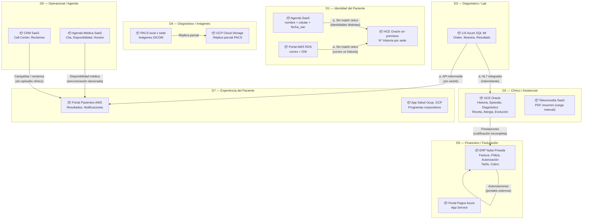
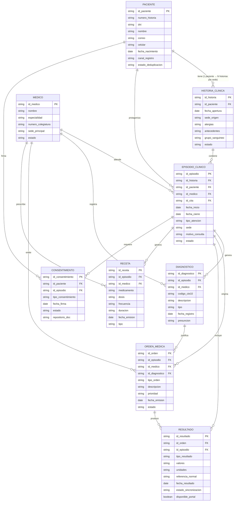
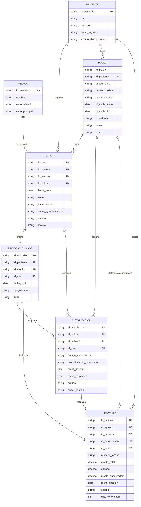
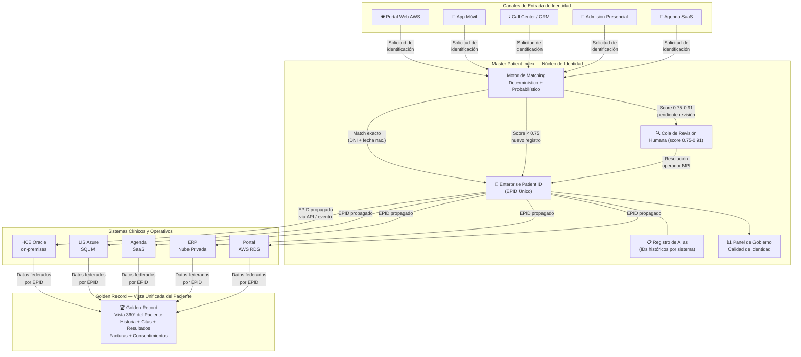
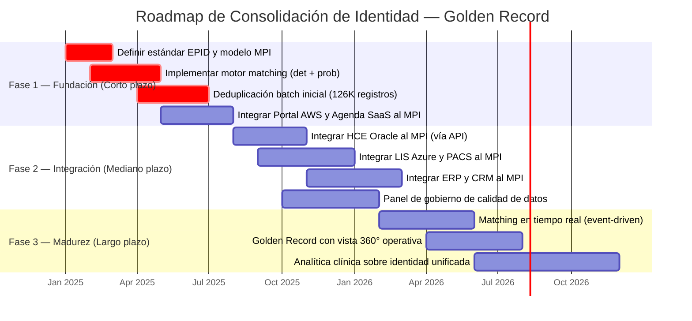
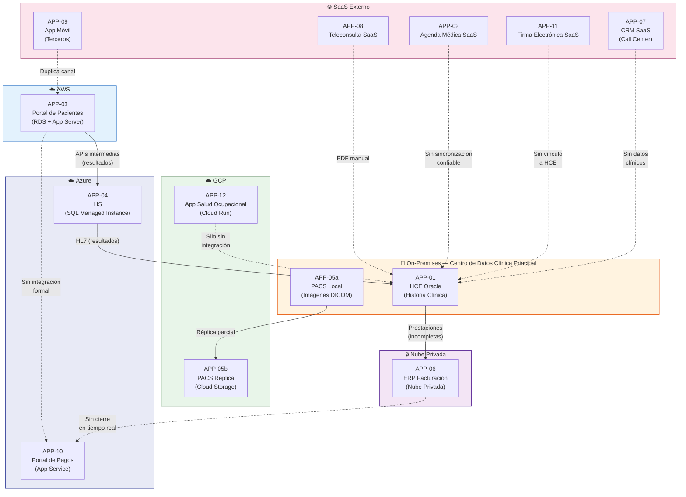
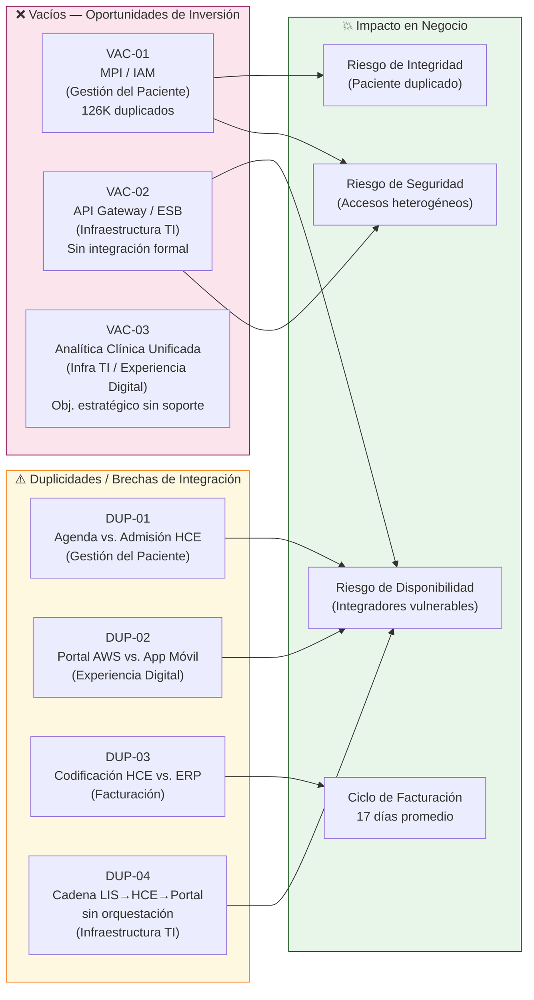
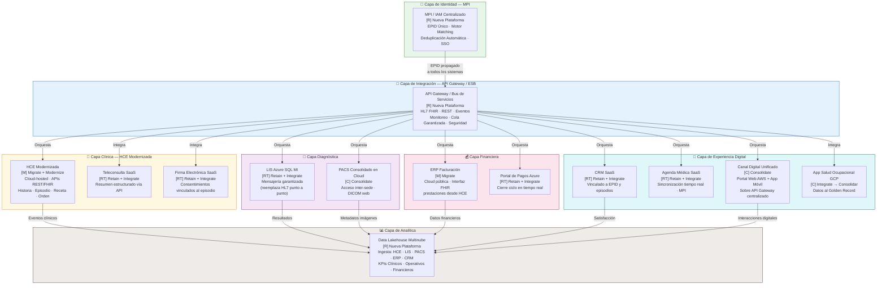
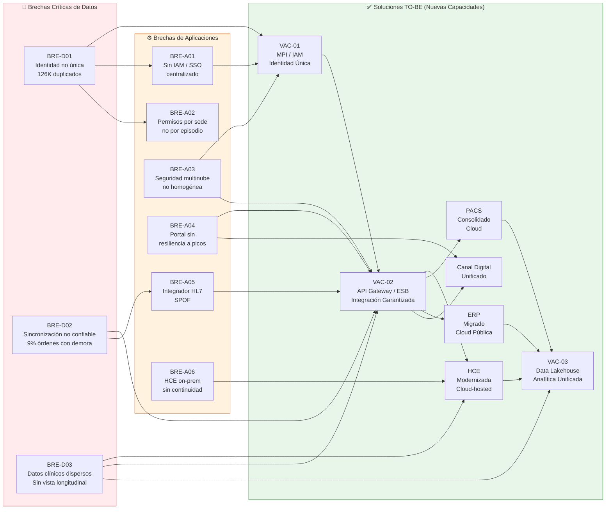

# Hito 1: Arquitectura Empresarial — Bloque 2: Sistemas de Información
## Clínica SanaRed Integrada | TOGAF ADM Fase C

---

### Resumen Ejecutivo del Bloque 2

El Bloque 2 de Sistemas de Información consolida los tres capítulos que conforman la Fase C del TOGAF ADM para Clínica SanaRed Integrada: Arquitectura de Datos, Portafolio de Aplicaciones y Análisis de Brechas. Juntos, estos capítulos revelan un ecosistema tecnológico fragmentado cuya principal vulnerabilidad es la ausencia de una identidad única del paciente: 126,000 registros potencialmente duplicados atraviesan transversalmente los siete dominios de datos y los doce sistemas del portafolio, comprometiendo la seguridad clínica, la continuidad asistencial y la eficiencia financiera de la red.

El Capítulo 1 (Arquitectura de Datos) mapea los siete dominios de datos con sus sistemas custodios AS-IS, modela las trece entidades críticas del negocio mediante diagramas ERD y define la estrategia Golden Record / Master Patient Index como palanca fundacional hacia el estado TO-BE. El Capítulo 2 (Portafolio de Aplicaciones) cataloga los doce sistemas distribuidos en cinco ambientes de hosting, los cruza contra las seis capacidades de Nivel 1 e identifica cuatro duplicidades críticas y tres vacíos estructurales que representan las oportunidades de inversión prioritarias. El Capítulo 3 (Análisis de Brechas) sintetiza nueve brechas concretas —tres de datos y seis de aplicaciones— alineadas a los riesgos de Seguridad, Integridad y Disponibilidad del Anexo 3b, y propone la arquitectura conceptual TO-BE organizada en siete capas en la nube, con disposición explícita para cada sistema del portafolio.

En conjunto, los hallazgos de este bloque fundamentan el roadmap de migración y son insumo directo para el Bloque 3 (Tecnología, Brechas y Roadmap).

---

## Capítulo 1: Arquitectura de Datos AS-IS vs TO-BE (Task 5)
### Clínica SanaRed Integrada | Hito 1 — TOGAF ADM Fase C: Arquitectura de Datos

---

### Resumen Ejecutivo del Capítulo 1

Este capítulo desarrolla la Arquitectura de Datos de SanaRed en sus dimensiones AS-IS y TO-BE,
siguiendo la Fase C del TOGAF ADM (Sistemas de Información — Datos). Se identifican siete
dominios de datos diferenciados con sus sistemas custodios actuales, se modela conceptualmente
el universo de trece entidades críticas mediante dos sub-diagramas de Entidad-Relación (ERD), y
se define la estrategia de consolidación de identidad del paciente (Golden Record / Master Patient
Index) para reducir los 126,000 registros duplicados en al menos un 80%.

La fragmentación de datos es el problema transversal más crítico de SanaRed: el mismo paciente
existe con identidades distintas en el portal AWS, la agenda SaaS y la HCE Oracle on-premises,
lo que compromete la seguridad clínica, la continuidad asistencial y la eficiencia financiera. El paso
de AS-IS a TO-BE en datos representa la palanca de mayor impacto para los siete objetivos
estratégicos del directorio.

---

### 5.1 Mapa de Dominios de Datos

#### 5.1.1 Tabla de Dominios de Datos — Sistema Custodio AS-IS

La siguiente tabla identifica los siete dominios de datos diferenciados de SanaRed, su sistema
custodio principal en el estado actual, los sistemas secundarios que acceden o generan datos en
ese dominio, y los problemas de integridad o fragmentación detectados.

| # | Dominio de Datos | Sistema Custodio AS-IS | Sistemas Secundarios (acceso/generación) | Problema AS-IS Detectado |
|---|---|---|---|---|
| D1 | **Identidad del Paciente** | HCE Oracle on-premises (N° de historia por sede) | Portal AWS (correo + DNI), Agenda SaaS (nombre + celular + fecha nac.), Admisión local, CRM SaaS | 126,000 registros duplicados; un paciente puede tener hasta 3 identidades distintas por canal |
| D2 | **Clínico / Asistencial** | HCE Oracle on-premises (historia, episodios, diagnósticos, recetas, alergias) | Teleconsulta SaaS (PDF manual), App Móvil (terceros), Admisión local | Sin vista longitudinal; resultados de otras sedes no siempre disponibles en el momento de la atención |
| D3 | **Diagnóstico — Laboratorio** | LIS Azure SQL Managed Instance (órdenes, muestras, resultados de lab) | HCE Oracle (integración HL7 intermitente), Portal AWS (API intermedia), Historia clínica | 9% de órdenes con demora; 18,600 resultados bloqueados durante caída del integrador HL7 en 11 horas |
| D4 | **Diagnóstico — Imágenes** | PACS local por sede (imágenes DICOM) | GCP Cloud Storage (réplica parcial), Visor web multi-sede | Sin vista unificada entre sedes; réplica parcial en GCP; radiólogos no acceden a imágenes de otras clínicas |
| D5 | **Financiero / Facturación** | ERP Nube Privada (facturas, autorizaciones, pólizas, tarifas, cobros) | HCE Oracle (prestaciones), Portal de Pagos Azure App Service, Portales externos aseguradoras | Ciclo de cobro promedio 17 días (hasta 35); 13% de expedientes observados por inconsistencias |
| D6 | **Operacional / Agenda** | Agenda Médica SaaS (citas, disponibilidad médica, horarios, sedes) | Portal AWS, App Móvil, Call Center / CRM SaaS, Admisión local | Cambios de disponibilidad tardan horas en propagarse; sincronización falló en campaña de influenza |
| D7 | **Experiencia del Paciente** | Portal Pacientes AWS (RDS) + CRM SaaS (campañas, reclamos, satisfacción) | App Móvil, App Salud Ocupacional GCP, Encuestas SaaS | Datos de satisfacción desconectados de episodios clínicos; 18% de mensajes con rebote o baja interacción |

#### 5.1.2 Diagrama de Paisaje de Datos AS-IS

El diagrama muestra los siete dominios y sus sistemas custodios, con las dependencias y flujos de
datos inter-dominio que revelan la fragmentación actual. Los flujos marcados con `⚠️` representan
puntos de quiebre donde la integridad de datos no está garantizada.

---

### 5.2 Modelo Conceptual de Datos — ERD

El modelo conceptual incluye las 13 entidades críticas del negocio de SanaRed. Dado que el
conjunto de relaciones supera 40, el ERD se divide en dos sub-diagramas complementarios que
comparten las entidades de enlace (Paciente, Episodio Clínico, Médico) para mantener consistencia.

> **Entidades compartidas entre sub-diagramas:** `PACIENTE`, `EPISODIO_CLINICO`, `MEDICO`

---

#### 5.2.1 ERD Parte 1 — Núcleo Clínico y Asistencial

Cubre el flujo de atención: desde la identidad del paciente hasta el registro clínico, incluyendo
historia clínica, episodio, diagnóstico, orden médica, resultado, receta y consentimiento.

#### 5.2.2 ERD Parte 2 — Administrativo, Financiero y Agenda

Cubre el flujo administrativo y financiero: desde la programación de la cita hasta la generación de
la factura, incluyendo la autorización de aseguradora y la póliza de cobertura.

---

### 5.3 Estrategia TO-BE — Golden Record y Consolidación de Identidad del Paciente

#### 5.3.1 Contexto del Problema AS-IS

| Indicador | Valor AS-IS | Impacto |
|---|---|---|
| Registros duplicados de pacientes | 126,000 | Riesgo clínico, facturas duplicadas, reclamos |
| Campos de match por canal | Portal: correo+DNI / Agenda: nombre+celular+fecha_nac / HCE: N° historia sede | Sin llave única común |
| Proceso de deduplicación actual | Manual, reportes mensuales | Reactivo, sin tiempo real |
| Casos con historia fragmentada en atención | Identificados (ej. paciente anticoagulado en emergencia) | Riesgo de seguridad del paciente |
| Resultados no asociados al episodio correcto | 9% de órdenes diagnósticas con demora | Reprocesos, costos, frustración |

#### 5.3.2 Diseño de la Estrategia Golden Record (MPI — Master Patient Index)

La estrategia TO-BE se basa en tres pilares: **Identidad Única**, **Sincronización Confiable** y
**Gobierno de Datos Continuo**.

##### Pilar 1 — Master Patient Index (MPI) como Sistema de Registro de Identidad

- Se implementa un **MPI centralizado** que actúa como fuente de verdad para la identidad del paciente. Cada paciente recibe un **Enterprise Patient ID (EPID)** único en toda la red SanaRed.
- El EPID reemplaza progresivamente los identificadores locales (N° historia por sede, correo portal, ID agenda SaaS) como referencia cross-sistema.
- El MPI almacena todos los identificadores históricos como alias para garantizar trazabilidad y compatibilidad hacia atrás.

##### Pilar 2 — Motor de Matching Probabilístico + Determinístico

El proceso de deduplicación utiliza un motor de dos capas:

| Capa | Método | Campos clave | Acción |
|---|---|---|---|
| Determinística | Coincidencia exacta | DNI + fecha de nacimiento | Match automático → fusión de registros |
| Probabilística | Score Jaro-Winkler / Soundex | Nombre, celular, correo, dirección | Score ≥ 0.92 → fusión automática; 0.75–0.91 → revisión humana |
| Reglas de negocio | Dependientes familiares | Póliza + titular + relación | Registro vinculado, no fusionado |
| Exclusión | Falsos positivos | Nombres idénticos, fechas similares | Cola de revisión con evidencia |

##### Pilar 3 — Gobierno de Datos y Calidad Continua

- **Validación en el punto de entrada**: todos los canales (portal, agenda, admisión, call center) consultan el MPI antes de crear un nuevo registro. Si existe match, se reutiliza el EPID.
- **Panel de calidad de identidad**: dashboard operativo con tasa de duplicados, matches pendientes, registros sin DNI y evolución mensual.
- **SLA de resolución**: duplicados de alta prioridad (pacientes en emergencia, anticoagulados, crónicos) resueltos en < 2 horas; cola general en < 48 horas.

#### 5.3.3 Diagrama de Flujo TO-BE — Golden Record

#### 5.3.4 Metas y KPIs de la Estrategia Golden Record

| KPI | Línea Base AS-IS | Meta TO-BE (Año 1) | Meta TO-BE (Año 2) |
|---|---|---|---|
| Registros duplicados activos | 126,000 | ≤ 25,200 (−80%) | ≤ 5,000 (−96%) |
| % pacientes con EPID único | 0% | 75% | 99% |
| Tiempo de deduplicación (lote) | Mensual (manual) | Diario (automático) | Tiempo real (evento) |
| Tasa de match automático | 0% | ≥ 85% | ≥ 95% |
| Resultados asociados al episodio correcto | 91% (9% con demora) | 97% | 99.5% |
| Ciclo de facturación promedio | 17 días | 10 días | 7 días |
| Reclamos por inconsistencia de identidad | 7,900 / año | ≤ 2,000 / año | ≤ 500 / año |

#### 5.3.5 Fases de Implementación del Golden Record

---

### Referencias al Marco TOGAF — Capítulo 1

| Componente TOGAF | Artefacto en este capítulo |
|---|---|
| Fase C — Arquitectura de Sistemas de Información (Datos) | Mapa de Dominios, ERD Partes 1 y 2 |
| Architecture Vision (Fase A) | Problema de 126K duplicados como driver central |
| Requirements Management | Req. 5: Dominios, ERD 13 entidades, Golden Record |
| Data Principles | Unicidad de identidad, Calidad en la fuente, Trazabilidad |
| Transition Architecture | Roadmap Golden Record Fases 1–3 |
| Gap Analysis (Fase E) | KPI tabla AS-IS vs TO-BE por dominio de datos |

---

## Capítulo 2: Portafolio de Aplicaciones (Task 6)
### Clínica SanaRed Integrada | TOGAF ADM Fase C: Arquitectura de Aplicaciones

> **Fase ADM:** C — Sistemas de Información (Arquitectura de Aplicaciones)
> **Artefactos:** Catálogo AS-IS de Aplicaciones · Diagrama de Portafolio · Matriz Aplicaciones vs. Capacidades · Análisis de Duplicidades y Vacíos
> **Fecha de referencia:** Hito 1 — Estado AS-IS

---

### Resumen Ejecutivo del Capítulo 2

El portafolio de aplicaciones de SanaRed Integrada está compuesto por 12 sistemas distribuidos en cinco ambientes de hosting (on-premises, AWS, Azure, GCP y SaaS externos). El análisis revela un ecosistema fragmentado: las aplicaciones crecieron por adquisición y contratación independiente, sin una capa de integración formal que orqueste el intercambio de datos. El cruce contra las 6 capacidades de Nivel 1 confirma **3 duplicidades críticas** (agenda/admisión, portal/app móvil para resultados, HCE/ERP en codificación de prestaciones) y **3 vacíos estructurales** (identidad del paciente/MPI, bus de integración/API Gateway y analítica clínica unificada) que representan las oportunidades de inversión prioritarias para el roadmap de transformación.

---

### 6.1 Catálogo del Portafolio de Aplicaciones AS-IS

| ID | Nombre del Sistema | Hosting / Nube | Función Principal | Capacidades que Soporta | Estado | Observaciones |
|---|---|---|---|---|---|---|
| APP-01 | HCE Oracle (Historia Clínica Electrónica) | On-premises — Centro de datos clínica principal | Registro y consulta de historia clínica, episodios clínicos, diagnósticos, alergias, recetas, órdenes médicas y evoluciones | Atención Clínica · Gestión del Paciente · Gestión Diagnóstica (parcial) · Facturación y Finanzas (codificación prestaciones) | **Activo / Core** | Sistema central y más crítico. Diseñado para atención presencial; sin soporte nativo para teleconsulta ni omnicanalidad. Integración HL7 hacia LIS, pero sin API REST estandarizada. |
| APP-02 | Agenda Médica SaaS | SaaS externo (proveedor cloud) | Gestión de citas, disponibilidad médica, programación por canal digital y presencial | Gestión del Paciente · Experiencia Digital | **Activo** | Duplica función de admisión con módulos locales de HCE en sedes antiguas. La sincronización de disponibilidad puede tardar horas. Maestro de médicos vive en ERP, no en la agenda. |
| APP-03 | Portal de Pacientes AWS | AWS (RDS + App Server) | Autogestión del paciente: consulta de citas, resultados de laboratorio, pagos online e historial | Gestión del Paciente · Gestión Diagnóstica (resultados) · Experiencia Digital · Facturación y Finanzas (pagos) | **Activo** | Duplica canales de consulta de citas y resultados con App Móvil (APP-09). Depende de APIs intermedias sin caché robusta para resultados. Caída de 4 horas en campaña corporativa impactó a 12,000 pacientes. |
| APP-04 | LIS — Azure SQL Managed Instance | Azure (SQL Managed Instance) | Gestión del ciclo completo de laboratorio: órdenes, toma de muestras, procesamiento, validación y entrega de resultados | Gestión Diagnóstica · Atención Clínica (resultados para médicos) | **Activo** | Integrado a HCE por HL7. Caída del integrador HL7 dejó 18,600 resultados sin publicar durante 11 horas. Sin failover documentado. |
| APP-05 | PACS Local por sede + réplica GCP | On-premises (PACS visor local) + GCP Cloud Storage (réplica parcial) | Almacenamiento, gestión y visualización de imágenes diagnósticas DICOM (radiografías, ecografías, tomografías, resonancias) | Gestión Diagnóstica | **Activo / Parcialmente Modernizado** | Infraestructura descentralizada por sede. La réplica en GCP es parcial y no garantiza disponibilidad completa inter-sede. Visor web disponible, pero sin integración profunda con HCE. |
| APP-06 | ERP Facturación — Nube Privada | Nube privada (proveedor local administrado) | Facturación, autorización de prestaciones, gestión de pólizas, tarifas, liquidaciones a aseguradoras y cuentas por cobrar | Facturación y Finanzas · Gestión del Paciente (pólizas/coberturas) | **Activo / Legacy funcional** | Ciclo de cobro promedio de 17 días (hasta 35 en algunos convenios). Recibe prestaciones de HCE con codificación incompleta. Duplica función de codificación de prestaciones con HCE. Maestro de médicos y tarifas residen aquí. |
| APP-07 | CRM SaaS — Call Center y Campañas | SaaS externo | Gestión de interacciones de call center, campañas de marketing y salud, registro de reclamos y seguimiento de pacientes | Experiencia Digital · Gestión del Paciente (contacto) | **Activo** | Desconectado de episodios clínicos y operaciones de sede. Operadores ven datos del CRM pero no historial clínico en tiempo real. Los datos de satisfacción no se correlacionan con episodios. |
| APP-08 | Teleconsulta SaaS | SaaS externo | Atención médica virtual, videoconferencia clínica, generación de resumen de consulta en PDF | Atención Clínica · Experiencia Digital | **Activo** | El resumen PDF se carga manualmente a HCE por el médico. Sin integración automática. No genera recetas electrónicas estructuradas en HCE. |
| APP-09 | App Móvil (desarrollada por terceros) | Mobile / SaaS (terceros) | Acceso del paciente a citas, resultados, notificaciones y autogestión desde dispositivo móvil | Experiencia Digital · Gestión del Paciente · Gestión Diagnóstica (resultados) | **Activo** | Duplica funcionalidad de Portal de Pacientes AWS (APP-03). Desarrollada por terceros; ciclos de actualización no alineados con roadmap interno. |
| APP-10 | Portal de Pagos — Azure App Service | Azure (App Service) | Gestión de cobros, comprobantes electrónicos, procesamiento de pagos online | Facturación y Finanzas · Experiencia Digital | **Activo** | Integrado parcialmente con Portal de Pacientes AWS. Sin integración directa con ERP para cierre de ciclo de facturación en tiempo real. |
| APP-11 | Repositorio de Firma Electrónica SaaS | SaaS externo | Almacenamiento y validación de consentimientos digitales firmados por pacientes | Atención Clínica (consentimientos) · Infraestructura y Operaciones TI (cumplimiento legal) | **Activo** | Sin integración directa con HCE. Permisos de acceso a documentos se gestionan por sede/área, no por identidad consolidada del paciente. Riesgo de auditoría por correlación difícil. |
| APP-12 | App Salud Ocupacional — GCP | GCP (App Engine / Cloud Run) | Gestión de programas corporativos de salud, chequeos preventivos, cohortes empresariales y reportes a empresas cliente | Experiencia Digital · Atención Clínica (preventiva) · Gestión del Paciente (corporativo) | **Activo** | Silo corporativo sin integración con HCE ni con portal principal. Datos de salud ocupacional no alimentan la vista longitudinal del paciente. |

---

### 6.2 Diagrama del Portafolio de Aplicaciones

El diagrama agrupa los 12 sistemas por dominio de hosting, mostrando las integraciones existentes (líneas sólidas) y las ausencias de integración formal (líneas punteadas donde debería existir).

**Leyenda:** Líneas sólidas = integración formal existente · Líneas punteadas = integración ausente o manual

---

### 6.3 Matriz de Aplicaciones vs. Capacidades de Negocio

**Convenciones de la matriz:**

| Símbolo | Significado |
|---|---|
| ✅ | Soporte directo — la aplicación cubre esta capacidad de forma nativa |
| ⚠️ | Duplicidad o brecha de integración — la capacidad es soportada por más de un sistema sin integración formal, o existe soporte parcial con riesgo operativo |
| ❌ | Vacío — ninguna aplicación cubre esta capacidad; se documenta como oportunidad de inversión |

| ID | Sistema | Gestión del Paciente | Atención Clínica | Gestión Diagnóstica | Facturación y Finanzas | Experiencia Digital | Infraestructura y Operaciones TI |
|---|---|:---:|:---:|:---:|:---:|:---:|:---:|
| APP-01 | HCE Oracle On-Premises | ⚠️ | ✅ | ⚠️ | ⚠️ | | |
| APP-02 | Agenda Médica SaaS | ⚠️ | | | | ✅ | |
| APP-03 | Portal de Pacientes AWS | ⚠️ | | ⚠️ | ✅ | ⚠️ | |
| APP-04 | LIS Azure SQL MI | | ✅ | ✅ | | | |
| APP-05 | PACS Local + GCP réplica | | | ✅ | | | |
| APP-06 | ERP Facturación — Nube Privada | ⚠️ | | | ✅ | | |
| APP-07 | CRM SaaS | ⚠️ | | | | ✅ | |
| APP-08 | Teleconsulta SaaS | | ⚠️ | | | ✅ | |
| APP-09 | App Móvil (terceros) | ⚠️ | | ⚠️ | | ⚠️ | |
| APP-10 | Portal de Pagos Azure | | | | ✅ | ⚠️ | |
| APP-11 | Firma Electrónica SaaS | | ⚠️ | | | | ⚠️ |
| APP-12 | App Salud Ocupacional GCP | ⚠️ | ⚠️ | | | ✅ | |
| *(vacío)* | **IAM / MPI — Gestión de Identidad** | ❌ | | | | | |
| *(vacío)* | **API Gateway / ESB — Bus de Integración** | | | | | | ❌ |
| *(vacío)* | **Plataforma de Analítica Clínica Unificada** | | | | | ❌ | ❌ |

---

### 6.4 Análisis de Duplicidades y Vacíos

#### 6.4.1 Duplicidades y Brechas de Integración Identificadas

---

##### DUP-01 · Gestión de Agenda y Admisión — APP-01 (HCE) vs. APP-02 (Agenda SaaS)

**Capacidad afectada:** Gestión del Paciente

**Descripción:** Las sedes antiguas de SanaRed operan módulos locales de admisión integrados directamente con la HCE Oracle para gestionar citas y registro de llegada del paciente. En paralelo, la Agenda SaaS es el canal principal de programación digital. Ambos sistemas mantienen registros de disponibilidad médica y citas sin sincronización confiable ni tiempo real. El maestro de médicos reside en el ERP (APP-06), lo que agrega un tercer punto de verdad sobre disponibilidad.

**Impacto operativo:**
- Sincronización de disponibilidad puede demorar horas, causando dobles turnos o slots fantasma.
- En la campaña de influenza, 18,000 citas cargadas por lote fallaron en dos centros médicos: pacientes llegaron a horarios inexistentes.
- El 4% de citas genera reclamo por errores de horario, sede o cobertura (aprox. 6,240 reclamos/mes sobre 156,000 citas).

**Acción recomendada TO-BE:** Consolidar la función de agenda/admisión en una plataforma única con API de disponibilidad en tiempo real, federar el maestro de médicos desde el ERP como sistema de registro (SoR) único.

---

##### DUP-02 · Consulta de Resultados y Citas — APP-03 (Portal AWS) vs. APP-09 (App Móvil)

**Capacidad afectada:** Experiencia Digital · Gestión Diagnóstica

**Descripción:** El Portal de Pacientes en AWS y la App Móvil desarrollada por terceros exponen las mismas funcionalidades al paciente: consulta de citas, visualización de resultados de laboratorio e imágenes, y pagos. Son canales redundantes sin una capa de API unificada que los gobierne. Cada canal consume datos de forma independiente, con diferentes SLA de actualización y distintas experiencias de usuario.

**Impacto operativo:**
- Los ciclos de actualización de la App Móvil no están alineados con el roadmap interno, generando desfases en funcionalidades disponibles.
- Cualquier cambio en los datos de backend (resultados, citas) debe mantenerse consistente en dos clientes, duplicando el esfuerzo de pruebas y despliegues.
- El 18% de mensajes enviados tuvo rebote o baja interacción, en parte porque los pacientes no tienen un canal preferido claro.

**Acción recomendada TO-BE:** Centralizar la capa de API (API Gateway) que ambos canales consuman; decidir si la App Móvil pasa a ser el canal principal digital o se mantiene como complemento del portal, con paridad de funcionalidades gobernada centralmente.

---

##### DUP-03 · Codificación de Prestaciones — APP-01 (HCE) vs. APP-06 (ERP)

**Capacidad afectada:** Facturación y Finanzas · Atención Clínica

**Descripción:** La codificación de prestaciones (diagnósticos CIE-10, procedimientos, tarifas) ocurre parcialmente en la HCE al momento del registro clínico y se retrabaja o completa en el ERP durante el proceso de facturación. No existe un flujo automatizado y completo que garantice que la codificación clínica de HCE se traspase íntegramente al ERP con los códigos correctos de tarifario.

**Impacto operativo:**
- El 13% de expedientes se observa por documentación incompleta o inconsistencia entre diagnóstico, procedimiento y autorización.
- El ciclo promedio de cobro es de 17 días (hasta 35 en algunos convenios); se acumularon USD 1.8M pendientes en un convenio corporativo por discrepancias de codificación.
- Auditoría médica consume tiempo revisando y corrigiendo manualmente lo que debería llegar estructurado desde la atención clínica.

**Acción recomendada TO-BE:** Establecer una interfaz de prestaciones estandarizada (FHIR/HL7) entre HCE y ERP. Definir HCE como SoR de la codificación clínica y ERP como SoR del proceso financiero, eliminando la recodificación manual.

---

##### DUP-04 · Integración sin Orquestación — APP-04 (LIS) ↔ APP-01 (HCE) ↔ APP-03 (Portal)

**Capacidad afectada:** Infraestructura y Operaciones TI · Gestión Diagnóstica

**Descripción:** Los resultados de laboratorio recorren un camino punto a punto: LIS (Azure) → integrador HL7 → HCE (on-premises) → APIs intermedias → Portal (AWS). Cada enlace es un punto único de falla sin orquestación central, monitoreo unificado ni manejo de reintentos estandarizado. Se trata de una brecha de integración estructural más que una duplicidad de función.

**Impacto operativo:**
- Una caída del integrador HL7 dejó 18,600 resultados pendientes durante 11 horas.
- El 9% de órdenes diagnósticas presentó demora en disponibilidad de resultados en la historia clínica.
- El 22% del volumen mensual del call center corresponde a consultas por resultados no disponibles.
- No existe monitoreo centralizado de la cadena LIS → HCE → Portal.

**Acción recomendada TO-BE:** Implementar un API Gateway / ESB (vacío identificado abajo) con cola de mensajería tolerante a fallos, idempotencia y dashboard de monitoreo de interfaces clínicas.

#### 6.4.2 Vacíos — Oportunidades de Inversión

---

##### VAC-01 · Gestión de Identidad del Paciente (MPI / IAM)

**Capacidad afectada:** Gestión del Paciente

**Descripción:** No existe ninguna aplicación en el portafolio que cumpla la función de Master Patient Index (MPI) o Identity and Access Management (IAM) centralizado para pacientes. Cada sistema (Portal AWS, Agenda SaaS, HCE on-premises, CRM) crea y mantiene su propio registro de paciente con identificadores distintos: correo electrónico, número de historia clínica por sede, DNI, número de celular o combinaciones de estos.

**Evidencia del impacto:**
- 126,000 registros potencialmente duplicados de pacientes identificados en auditoría.
- La deduplicación se ejecuta de forma manual por reportes mensuales, sin proceso automatizado.
- Un paciente anticoagulado ingresó por emergencia; el antecedente en otra sede no apareció oportunamente por diferencia de identificador. El incidente encendió alertas sobre continuidad asistencial y seguridad del paciente.
- La correlación de accesos a datos clínicos para auditoría requiere consultar logs separados de al menos 5 sistemas distintos.

**Oportunidad de inversión:** Plataforma MPI / Golden Record que unifique identidad del paciente con un identificador único, soporte deduplicación automática y sirva como fuente de verdad para todos los sistemas del portafolio.

---

##### VAC-02 · Bus de Integración / API Gateway (ESB / iPaaS)

**Capacidad afectada:** Infraestructura y Operaciones TI

**Descripción:** No existe una capa de integración formal (API Gateway, ESB o iPaaS) que orqueste el intercambio de datos entre las aplicaciones del portafolio. Las integraciones actuales son punto a punto, heterogéneas (HL7, APIs intermedias ad hoc, batch, manual vía PDF) y sin gobernanza centralizada. Esto convierte cada nueva integración en un proyecto independiente con su propia lógica de transformación, autenticación y manejo de errores.

**Evidencia del impacto:**
- Caídas del integrador HL7 afectan simultáneamente la disponibilidad de resultados en HCE, Portal y App Móvil sin notificación proactiva.
- Los resúmenes de Teleconsulta SaaS se cargan manualmente a HCE (PDF), sin trazabilidad estructurada.
- Los datos de Firma Electrónica no se correlacionan con episodios clínicos en HCE.
- La App Salud Ocupacional opera como silo sin alimentar la vista longitudinal del paciente.
- No hay visibilidad operativa del estado de las interfaces clínicas en tiempo real.

**Oportunidad de inversión:** Implementación de API Gateway / Bus de Servicios (ej. Azure API Management, AWS API Gateway + EventBridge, o solución iPaaS) como capa transversal de integración con soporte para HL7 FHIR, REST, eventos y monitoreo centralizado.

---

##### VAC-03 · Plataforma de Analítica Clínica y Operativa Unificada

**Capacidad afectada:** Infraestructura y Operaciones TI · Experiencia Digital

**Descripción:** No existe ninguna plataforma de analítica clínica o Business Intelligence unificada en el portafolio. Los datos clínicos, operativos y de experiencia del paciente están distribuidos en múltiples sistemas (HCE on-premises, LIS Azure, PACS GCP, CRM SaaS, ERP nube privada) sin un data warehouse o data lakehouse que los consolide para análisis.

**Evidencia del impacto:**
- Los datos de satisfacción del CRM no se conectan con episodios clínicos ni con operaciones de sede.
- SanaRed tiene datos suficientes para anticipar demanda, personalizar seguimiento y mejorar calidad clínica, pero sus sistemas no permiten una visión coherente.
- El objetivo estratégico #7 (analítica clínica y operativa para gestionar demanda, ocupación, tiempos, calidad asistencial y costos por episodio) no tiene ningún sistema que lo soporte actualmente.
- Los reclamos por comunicaciones contradictorias crecieron 34% en el último año, síntoma de decisiones tomadas sin datos consolidados.

**Oportunidad de inversión:** Plataforma de analítica clínica unificada (Data Lakehouse multinube con capa semántica) que integre fuentes de HCE, LIS, PACS, ERP, CRM y canales digitales para soporte de decisiones clínicas, operativas y estratégicas.

---

#### 6.4.3 Resumen Ejecutivo de Hallazgos

| Hallazgo | Tipo | Capacidad Afectada | Riesgo Asociado (Anexo 3b) | Prioridad |
|---|---|---|---|---|
| DUP-01 Agenda vs. Admisión HCE | Duplicidad | Gestión del Paciente | Integridad · Disponibilidad | **Alta** |
| DUP-02 Portal AWS vs. App Móvil | Brecha de integración | Experiencia Digital | Disponibilidad | Media |
| DUP-03 Codificación HCE vs. ERP | Duplicidad | Facturación y Finanzas | Integridad | **Alta** |
| DUP-04 Cadena LIS→HCE→Portal sin orquestación | Brecha de integración | Infraestructura y Operaciones TI | Disponibilidad · Integridad | **Alta** |
| VAC-01 MPI / IAM — Gestión de Identidad | Vacío | Gestión del Paciente | Seguridad · Integridad | **Alta** |
| VAC-02 API Gateway / ESB | Vacío | Infraestructura y Operaciones TI | Disponibilidad · Seguridad | **Alta** |
| VAC-03 Analítica Clínica Unificada | Vacío | Infraestructura TI · Experiencia Digital | Estratégico | Media |

---

## Capítulo 3: Brechas de Datos y Aplicaciones (Task 7)
### Clínica SanaRed Integrada | TOGAF ADM Fase C: Gap Analysis

> **Fase ADM:** C — Sistemas de Información (Arquitectura de Datos y Aplicaciones — Gap Analysis)
> **Artefactos:** Análisis de Brechas de Datos · Brechas por Riesgo Tecnológico · Visión TO-BE Conceptual · Tabla AS-IS vs TO-BE por Dominio
> **Fecha de referencia:** Hito 1 — Transición AS-IS → TO-BE
> **Referencias:** Capítulo 1 (7 dominios de datos, ERD, Golden Record) · Capítulo 2 (12 aplicaciones, DUP-01..04, VAC-01..03) · Anexo 3b (3 riesgos tecnológicos)

---

### Resumen Ejecutivo del Capítulo 3

El análisis de brechas de la Fase C revela que SanaRed Integrada opera con tres carencias
estructurales que atraviesan todos los dominios de datos y la totalidad del portafolio de
aplicaciones: **ausencia de identidad única del paciente** (126,000 registros duplicados),
**falta de sincronización confiable de resultados diagnósticos** (9% de órdenes con demora,
18,600 resultados bloqueados en un solo incidente) y **dispersión de datos clínicos sin vista
longitudinal** (historia fragmentada por sede y canal). Estas brechas se manifiestan en los tres
riesgos tecnológicos prioritarios del Anexo 3b: Seguridad, Integridad y Disponibilidad.

La transición TO-BE se organiza en torno a siete capas conceptuales en la nube: Identidad (MPI),
Integración (API Gateway), Clínica (HCE modernizada), Diagnóstica, Financiera, Experiencia
Digital y Analítica. Cada sistema del portafolio actual recibe una disposición: **Migrate**,
**Consolidate**, **Replace** o **Retain**, priorizando las iniciativas de mayor impacto en
seguridad del paciente, continuidad asistencial y eficiencia financiera.

---

### 7.1 Brechas Críticas de Datos

Las tres brechas de datos identificadas son transversales a los siete dominios documentados en
el Capítulo 1. Cada una compromete directamente los objetivos estratégicos del directorio de SanaRed.

| ID Brecha | Descripción AS-IS | Impacto en Negocio | Sistema(s) Afectado(s) | Prioridad |
|---|---|---|---|---|
| **BRE-D01** | **Ausencia de identidad única del paciente.** Cada canal crea su propio registro: Portal AWS usa correo + DNI; Agenda SaaS usa nombre + celular + fecha de nacimiento; HCE Oracle usa N° de historia por sede. No existe un identificador empresarial único (EPID) ni un Master Patient Index (MPI). La deduplicación se ejecuta manualmente en reportes mensuales. | 126,000 registros potencialmente duplicados. Un paciente anticoagulado en emergencia no obtuvo sus antecedentes oportunamente por diferencia de identificador. 7,900 reclamos anuales por problemas de identidad/agenda. Riesgo de seguridad del paciente y auditoría de accesos imposible sin identidad correlacionada. | HCE Oracle (on-prem) · Portal AWS · Agenda SaaS · Admisión local · CRM SaaS | **CRÍTICA** |
| **BRE-D02** | **Falta de sincronización confiable de resultados diagnósticos.** Los resultados del LIS (Azure SQL MI) llegan a la HCE vía integrador HL7 punto a punto, sin cola tolerante a fallos ni monitoreo centralizado. El Portal AWS consume resultados por APIs intermedias sin caché robusta. Cuando el integrador falla, los resultados existen en laboratorio pero no están disponibles para médicos ni pacientes. | 9% de órdenes diagnósticas con demora en disponibilidad. Caída del integrador HL7 bloqueó 18,600 resultados durante 11 horas. 22% del volumen del call center son consultas por resultados no disponibles. Médicos repiten exámenes por no ver resultados previos, incrementando costos y exposición del paciente. | LIS Azure SQL MI · HCE Oracle · Integrador HL7 · Portal Pacientes AWS · APIs intermedias | **CRÍTICA** |
| **BRE-D03** | **Datos clínicos dispersos sin vista longitudinal.** Historia clínica, resultados de laboratorio, imágenes DICOM, resúmenes de teleconsulta (PDF manual) y datos de salud ocupacional viven en sistemas distintos sin un modelo federado de datos del paciente. No existe una vista 360° que consolide episodios de todas las sedes y canales. | 14% de episodios tuvo alguna orden diagnóstica; de esos, 9% con demora. Teleconsulta genera PDFs que se cargan manualmente a HCE (sin trazabilidad estructurada). App Salud Ocupacional es un silo sin integración con HCE ni portal. El 13% de expedientes se observa en facturación por documentación incompleta derivada de la dispersión clínica. Imposible alcanzar el Objetivo Estratégico 2 (vista longitudinal para el 90% de pacientes). | HCE Oracle · LIS Azure · PACS Local · Teleconsulta SaaS · App Salud Ocupacional GCP · Firma Electrónica SaaS | **CRÍTICA** |

---

### 7.2 Brechas de Aplicaciones Alineadas a los 3 Riesgos del Anexo 3b

#### 7.2.1 Riesgo 1 — Seguridad: Privacidad Clínica en Ecosistema Distribuido

*Categoría:* Seguridad · *Prioridad Anexo 3b:* 1

| Descripción del Riesgo AS-IS | Sistemas Involucrados | Impacto Cuantificado | Brecha Identificada |
|---|---|---|---|
| Un mismo paciente puede tener registros activos en Portal AWS, Agenda SaaS y HCE Oracle con identidades distintas. Los operadores de call center acceden al CRM SaaS, admisión a la HCE, laboratorio al LIS en Azure y radiología al PACS local. Cada plataforma gestiona sus propios roles y perfiles sin identidad federada. | HCE Oracle (on-prem) · Portal AWS · Agenda SaaS · CRM SaaS · Azure App Service · LIS Azure SQL · PACS locales · Repositorio Firma Electrónica SaaS | Auditoría requiere consultar logs separados de al menos 5 sistemas para reconstruir quién accedió a un resultado sensible. Un médico afiliado que rota entre sedes puede conservar permisos más amplios de lo necesario. Acceso indebido difícil de detectar de forma temprana. Reclamos por comunicaciones contradictorias crecieron 34% en el último año. | **BRE-A01 · Ausencia de IAM / SSO centralizado:** No existe Single Sign-On ni Identity and Access Management (IAM) unificado para colaboradores. Los roles y perfiles se gestionan de forma independiente en cada sistema, impidiendo el principio de mínimo privilegio y la correlación de auditoría entre plataformas. El vacío VAC-01 (MPI) y la ausencia de IAM corporativo son la raíz de este riesgo. |
| Los adjuntos PDF de teleconsulta, resultados y consentimientos quedan almacenados en repositorios donde los permisos se heredan por sede o área, no por identidad consolidada del paciente ni por episodio clínico. | Teleconsulta SaaS · Repositorio Firma Electrónica SaaS · PACS GCP réplica · HCE Oracle | Imposibilidad de correlación de accesos para auditoría regulatoria. Sin trazabilidad de quién consultó qué dato clínico a través de qué sistema. Riesgo de fuga de datos sensibles sin detección temprana. | **BRE-A02 · Permisos por sede/área en lugar de por identidad y episodio:** Los repositorios de documentos clínicos (firma electrónica, PACS, teleconsulta) no vinculan el acceso al episodio clínico ni al EPID del paciente. Se requiere una capa de autorización basada en contexto clínico (episodio + rol + paciente). |
| Los datos clínicos sensibles están distribuidos en múltiples nubes (AWS, Azure, GCP, on-premises) y proveedores SaaS externos, sin una política de seguridad homogénea ni un centro de operaciones de seguridad (SOC) unificado. | HCE Oracle (on-prem) · Portal AWS · LIS Azure · PACS GCP · CRM SaaS · Teleconsulta SaaS · ERP Nube Privada | Sin visibilidad unificada del estado de seguridad de datos clínicos. Cada proveedor SaaS aplica su propia política de cifrado, retención y acceso. Cumplimiento regulatorio fragmentado. | **BRE-A03 · Política de seguridad multinube no homogénea:** Ausencia de una capa de gobernanza de seguridad que unifique el control de datos clínicos a través de todas las nubes y proveedores SaaS. Necesidad de un framework de seguridad cero-confianza (Zero Trust) como base del TO-BE. |

---

#### 7.2.2 Riesgo 2 — Integridad: Paciente Duplicado y Continuidad Asistencial Incompleta

*Categoría:* Integridad · *Prioridad Anexo 3b:* 2

| Descripción del Riesgo AS-IS | Sistemas Involucrados | Impacto Cuantificado | Brecha Identificada |
|---|---|---|---|
| No existe un MPI ni un identificador único del paciente. El portal, la agenda, la HCE y el call center crean registros con campos de matching distintos (DNI, correo, celular, nombre, N° historia por sede). La deduplicación es manual y mensual. | HCE Oracle · Agenda SaaS · Portal Pacientes AWS · Admisión local · CRM SaaS | 126,000 registros potencialmente duplicados. En emergencia, un paciente anticoagulado tuvo dos historias activas: una con antecedentes y medicación, otra con la admisión actual. El médico no vio oportunamente el resultado cargado en otra sede. | **BRE-D01 (cross-referencia) · VAC-01 MPI:** Ausencia total de Master Patient Index. El vacío VAC-01 identificado en el Capítulo 2 es la brecha primaria de integridad del portafolio. Sin MPI, ninguna iniciativa de continuidad asistencial puede garantizarse. |
| El LIS en Azure envía resultados a HCE vía integrador HL7 punto a punto. Cuando el integrador falla o hay diferencia de identificador, los resultados no se asocian al episodio correcto ni al paciente correcto. No existe idempotencia ni reintentos automáticos. | LIS Azure SQL MI · HCE Oracle on-prem · Integrador HL7 · Portal Pacientes AWS | 9% de órdenes diagnósticas con demora. 18,600 resultados bloqueados durante 11 horas en un solo incidente. El área clínica operó con llamadas y capturas manuales. Riesgo de atención basada en información incompleta. | **BRE-D02 (cross-referencia) · DUP-04 sin orquestación:** La cadena LIS → HCE → Portal carece de un bus de mensajería con garantías de entrega, idempotencia y reintento. El vacío VAC-02 (API Gateway/ESB) es la solución estructural para esta brecha. |
| Los resúmenes de teleconsulta se cargan manualmente como PDF a la HCE. Los datos de salud ocupacional (App GCP) no alimentan la HCE ni el portal. Los consentimientos digitales (Firma Electrónica SaaS) no están vinculados al episodio clínico en HCE. | Teleconsulta SaaS · App Salud Ocupacional GCP · Repositorio Firma Electrónica SaaS · HCE Oracle | Vista clínica longitudinal inexistente para el 100% de pacientes con atenciones en múltiples canales. El 14% de episodios con orden diagnóstica tuvo problemas de disponibilidad de resultados. Los silos impiden alcanzar el Objetivo Estratégico 2. | **BRE-D03 (cross-referencia) · Silos sin integración estructural:** Teleconsulta, Salud Ocupacional y Firma Electrónica son islas de datos clínicos sin conexión con el núcleo HCE. Se requiere una arquitectura de integración (VAC-02) y un modelo FHIR de datos clínicos para unificar la vista del paciente. |

---

#### 7.2.3 Riesgo 3 — Disponibilidad: Canales e Integradores Clínicos Vulnerables a Picos

*Categoría:* Disponibilidad · *Prioridad Anexo 3b:* 3

| Descripción del Riesgo AS-IS | Sistemas Involucrados | Impacto Cuantificado | Brecha Identificada |
|---|---|---|---|
| El Portal de Pacientes en AWS consume APIs intermedias sin caché robusta para mostrar resultados. La base RDS escala en lectura, pero el servicio que consulta estados de resultado depende de una API sin caché y de un enlace hacia sistemas intermitentes. Durante campañas, el portal recibe picos de descarga que saturan la cadena. | Portal Pacientes AWS · APIs intermedias · LIS Azure · Integrador HL7 · HCE Oracle on-prem | Caída de 4 horas durante campaña corporativa: 12,000 pacientes no pudieron descargar documentos. Portal respondió con errores; call center escaló tickets; laboratorio envió PDFs por correo para casos urgentes. Indisponibilidad visible en redes sociales. | **BRE-A04 · Portal sin resiliencia a picos:** Arquitectura de portal sin caché de resultados, sin CDN para documentos y sin degradación elegante ante fallos de backend. El API Gateway (VAC-02) con caché y rate limiting es la solución estructural. |
| El integrador HL7 entre LIS (Azure) y HCE (on-premises) es un punto único de falla sin monitoreo centralizado, sin cola de mensajería tolerante a fallos ni procedimiento de contingencia documentado para personal clínico. | LIS Azure SQL MI · Integrador HL7 · HCE Oracle on-prem · Portal Pacientes AWS · App Móvil | Caída del integrador HL7 bloqueó 18,600 resultados durante 11 horas. Call center solo podía ver el estado del portal, no la cola técnica del integrador. 22% del volumen mensual del call center son consultas por resultados no disponibles. | **BRE-A05 · Integrador HL7 como punto único de falla (SPOF):** Sin tolerancia a fallos, sin reintento automático, sin dead-letter queue y sin dashboard operativo de interfaces clínicas. El bus de integración (VAC-02) debe reemplazar este patrón punto a punto con mensajería garantizada. |
| La conectividad entre sedes y el centro de datos es variable. Las sedes pequeñas dependen de un enlace único hacia HCE on-premises. En febrero, una caída de conectividad entre dos sedes obligó a registrar 1,400 admisiones en formularios temporales, generando 260 inconsistencias al migrar. | HCE Oracle on-prem · Admisión local · Conectividad de sedes · Portal Pagos Azure | 1,400 admisiones en contingencia; 260 inconsistencias entre paciente, cobertura y episodio; facturas observadas semanas después. La disponibilidad del sistema de admisión depende de un único datacenter on-premises sin RTO/RPO documentado. | **BRE-A06 · Dependencia de conectividad on-premises sin plan de continuidad:** HCE on-premises carece de modo offline o réplica de lectura local para sedes remotas. La migración / modernización de HCE con hosting en nube y capacidad de operación degradada es condición del TO-BE. |

---

### 7.3 Visión Conceptual TO-BE — Arquitectura Futura en la Nube

#### 7.3.1 Narrativa de Transición

La arquitectura futura de SanaRed se organiza en torno a un principio rector: **el paciente como
eje único de todos los sistemas**. La transición del AS-IS fragmentado al TO-BE integrado requiere
actuar sobre cuatro frentes simultáneos:

**1. Unificar la identidad** — Antes de modernizar cualquier aplicación, SanaRed debe establecer
el MPI (Master Patient Index) como capa fundacional. Sin identidad única, ninguna integración
puede garantizar integridad. El MPI emite el EPID (Enterprise Patient ID) que todos los sistemas
downstream consumen como llave maestra.

**2. Reemplazar la integración punto a punto** — El integrador HL7 y las APIs intermedias
ad hoc se sustituyen por una capa de API Gateway / Bus de Servicios empresarial (ESB/iPaaS)
con soporte para HL7 FHIR, REST, mensajería garantizada y monitoreo centralizado de interfaces
clínicas. Esta capa desacopla productores de consumidores y elimina los puntos únicos de falla.

**3. Modernizar y consolidar aplicaciones clínicas** — La HCE Oracle on-premises se migra a
una plataforma HCE modernizada en la nube (cloud-native o cloud-hosted), conservando los datos
históricos y habilitando APIs REST/FHIR nativas. El portal web y la app móvil se consolidan sobre
una capa de API unificada. Las duplicidades DUP-01 a DUP-04 se resuelven eliminando los silos.

**4. Añadir las capacidades faltantes** — Los vacíos VAC-01 (MPI), VAC-02 (API Gateway) y
VAC-03 (Analítica Clínica) se incorporan como nuevas plataformas nativas del portafolio TO-BE.

##### Disposición de Sistemas por Acción de Transición

| Sistema | Acción TO-BE | Justificación |
|---|---|---|
| HCE Oracle on-premises (APP-01) | **Migrate → Modernize** | Migrar a plataforma HCE cloud-hosted; exponer APIs REST/FHIR; eliminar dependencia de datacenter físico |
| Agenda Médica SaaS (APP-02) | **Retain → Integrate** | Mantener SaaS de agenda, pero integrar vía API Gateway al MPI y HCE; sincronización en tiempo real |
| Portal de Pacientes AWS (APP-03) | **Consolidate** | Consolidar portal web y app móvil (APP-09) en canal digital unificado sobre API Gateway |
| LIS Azure SQL MI (APP-04) | **Retain → Integrate** | Retener LIS en Azure; migrar integración de HL7 punto a punto a mensajería garantizada vía bus |
| PACS Local + GCP réplica (APP-05) | **Migrate → Consolidate** | Consolidar PACS en cloud (GCP / Azure), eliminar réplica parcial, garantizar acceso inter-sede |
| ERP Facturación Nube Privada (APP-06) | **Migrate** | Migrar de nube privada a cloud pública; establecer interfaz FHIR/HL7 con HCE para prestaciones |
| CRM SaaS (APP-07) | **Retain → Integrate** | Retener CRM SaaS; integrarlo al EPID del MPI y al bus de eventos para correlacionar con episodios |
| Teleconsulta SaaS (APP-08) | **Retain → Integrate** | Retener plataforma SaaS; reemplazar carga manual PDF por integración estructurada vía API Gateway |
| App Móvil (APP-09) | **Consolidate** | Consolidar con Portal AWS como canal digital unificado (ver APP-03) |
| Portal de Pagos Azure (APP-10) | **Retain → Integrate** | Retener portal de pagos; integrar con ERP modernizado para cierre de ciclo de facturación en tiempo real |
| Firma Electrónica SaaS (APP-11) | **Retain → Integrate** | Retener SaaS; vincular consentimientos al episodio clínico vía EPID en el bus de integración |
| App Salud Ocupacional GCP (APP-12) | **Integrate → Consolidate** | Integrar datos al Golden Record del paciente; evaluar consolidación con HCE modernizada a largo plazo |
| *(nuevo)* MPI / IAM (VAC-01) | **New — Build** | Nueva plataforma MPI + IAM centralizado; capa fundacional de identidad de paciente y colaborador |
| *(nuevo)* API Gateway / ESB (VAC-02) | **New — Build** | Nueva capa de integración empresarial; reemplaza todos los integradores punto a punto |
| *(nuevo)* Plataforma Analítica (VAC-03) | **New — Build** | Data Lakehouse multinube con capa semántica; ingesta desde todos los dominios de datos |

#### 7.3.2 Diagrama TO-BE Conceptual — Arquitectura Futura en la Nube

El diagrama muestra las siete capas de la arquitectura TO-BE. Los sistemas se clasifican por
acción de transición: **[M]** Migrate, **[C]** Consolidate, **[R]** Replace/New, **[RT]** Retain+Integrate.

**Leyenda de acciones:** `[M]` Migrate · `[C]` Consolidate · `[R]` Replace / New · `[RT]` Retain + Integrate

---

### 7.4 Tabla Resumen AS-IS vs TO-BE por Dominio de Datos

La tabla referencia los 7 dominios documentados en el Capítulo 1 (Sección 5.1) y describe la
transformación requerida para cada uno, incluyendo la acción de transición y la prioridad de
inversión en el roadmap.

| # | Dominio de Datos | Estado AS-IS | Estado TO-BE | Acción | Prioridad |
|---|---|---|---|---|---|
| **D1** | **Identidad del Paciente** | 126,000 registros duplicados. Cada canal (Portal AWS, Agenda SaaS, HCE Oracle, CRM) mantiene su propio identificador (correo, celular, N° historia, DNI). Deduplicación manual mensual. Sin MPI ni EPID. | MPI centralizado con EPID único por paciente. Motor de matching determinístico + probabilístico. Deduplicación automática en tiempo real. Golden Record como vista unificada 360° del paciente. EPID propagado a todos los sistemas. | **Replace / New** (VAC-01 MPI) | **CRÍTICA — Fase 1** |
| **D2** | **Clínico / Asistencial** | Historia clínica on-premises (Oracle), sin soporte nativo para omnicanalidad. Resúmenes de teleconsulta como PDF manual. Sin vista longitudinal entre sedes. Datos de salud ocupacional en silo GCP. | HCE modernizada cloud-hosted con APIs REST/FHIR. Teleconsulta integrada estructuralmente al episodio. App Salud Ocupacional conectada al Golden Record. Vista longitudinal del paciente disponible en todos los puntos de atención. | **Migrate + Integrate** | **CRÍTICA — Fase 1-2** |
| **D3** | **Diagnóstico — Laboratorio** | LIS Azure SQL MI integrado a HCE vía integrador HL7 punto a punto. Sin tolerancia a fallos ni monitoreo. 9% de órdenes con demora. Portal consume APIs sin caché. | LIS retiene Azure SQL MI como plataforma. Integración migrada a mensajería garantizada vía API Gateway/ESB. Resultados disponibles en HCE, portal y app móvil con SLA de <5 minutos. Monitoreo centralizado de interfaces diagnósticas. | **Retain + Integrate** (VAC-02 API Gateway) | **CRÍTICA — Fase 1** |
| **D4** | **Diagnóstico — Imágenes** | PACS locales por sede con réplica parcial en GCP Cloud Storage. Sin vista unificada entre sedes. Radiólogos no acceden a imágenes de otras clínicas. Integración con HCE limitada. | PACS consolidado en cloud (GCP/Azure) con acceso inter-sede garantizado. Visor DICOM web integrado en HCE modernizada. Metadatos de imágenes indexados en el Golden Record del paciente. Réplica completa para disponibilidad multi-sede. | **Consolidate** | **Alta — Fase 2** |
| **D5** | **Financiero / Facturación** | ERP en nube privada. Codificación de prestaciones incompleta desde HCE (DUP-03). Ciclo de cobro promedio 17 días (hasta 35). 13% de expedientes observados por inconsistencias. USD 1.8M pendientes en un convenio por discrepancias de codificación. | ERP migrado a cloud pública con interfaz FHIR/HL7 hacia HCE modernizada. HCE como SoR de codificación clínica; ERP como SoR del proceso financiero. Autorizaciones electrónicas con aseguradoras. Ciclo de cobro objetivo: 7 días. Portal de Pagos integrado para cierre en tiempo real. | **Migrate + Integrate** | **Alta — Fase 2** |
| **D6** | **Operacional / Agenda** | Agenda Médica SaaS desincronizada de HCE. Maestro de médicos en ERP. Cambios de disponibilidad tardan horas. 4% de citas genera reclamo. 18,000 citas fallaron en campaña de influenza por sincronización. | Agenda SaaS retenida e integrada vía API Gateway al MPI y HCE. Maestro de médicos federado desde ERP como SoR único. Sincronización de disponibilidad en tiempo real (< 5 min). Eliminación de DUP-01. Orquestación de citas con EPID del paciente. | **Retain + Integrate** | **Alta — Fase 1-2** |
| **D7** | **Experiencia del Paciente** | Portal AWS y App Móvil (terceros) como canales duplicados sin API unificada (DUP-02). CRM SaaS desconectado de episodios clínicos. 18% de mensajes con rebote. Reclamos por comunicaciones contradictorias +34%. Sin analítica unificada. | Canal digital unificado (portal + app) sobre API Gateway centralizado. CRM integrado al EPID y eventos clínicos del bus. Plataforma de Analítica Clínica (VAC-03) como Data Lakehouse multinube que consolida datos de todos los dominios. Comunicaciones personalizadas basadas en episodio real del paciente. | **Consolidate + New** (VAC-03 Analítica) | **Media — Fase 2-3** |

---

### 7.5 Mapa de Brechas y Vacíos — Resumen Visual

El diagrama sintetiza las brechas de datos (BRE-D), brechas de aplicaciones (BRE-A) y su
alineación con los vacíos de portafolio (VAC) y las acciones TO-BE.

---

### Referencias al Marco TOGAF — Capítulo 3

| Componente TOGAF | Artefacto en este capítulo |
|---|---|
| Fase C — Arquitectura de Sistemas de Información (Datos y Aplicaciones) | Secciones 7.1 y 7.2: Brechas de Datos y Brechas de Aplicaciones |
| Gap Analysis — Transition Architecture | Sección 7.3: Disposición de sistemas (Migrate/Consolidate/Replace/Retain) |
| Architecture Vision (Fase A) | Sección 7.3.1: Narrativa de transición TO-BE |
| Requirements Management — Req. 7 | BRE-D01..03 cubren los 3 criterios de aceptación de brechas de datos |
| Anexo 3b — Riesgos Tecnológicos | Sección 7.2: BRE-A01..06 alineados a Seguridad, Integridad y Disponibilidad |
| Architecture Principles | Paciente como eje único · Integración desacoplada · Mínimo privilegio · Calidad en la fuente |
| Capítulo 1 (Dominios D1–D7, Golden Record) | Sección 7.4: AS-IS vs TO-BE por dominio |
| Capítulo 2 (DUP-01..04, VAC-01..03, 12 apps) | Secciones 7.2 y 7.3: Cross-referencias a duplicidades y vacíos |

---

## Conclusiones del Bloque 2

El Bloque 2 de Sistemas de Información establece con claridad que la transformación digital de SanaRed Integrada no es un problema de tecnología aislada, sino de coherencia arquitectónica. Los tres capítulos convergen en un diagnóstico común: la fragmentación de identidad del paciente, la ausencia de una capa de integración formal y la dispersión de datos clínicos en silos desconectados son las raíces estructurales que impiden alcanzar los siete objetivos estratégicos del directorio. Las 126,000 identidades duplicadas, los 18,600 resultados bloqueados en un solo incidente y el ciclo de facturación de 17 días no son síntomas independientes; son manifestaciones del mismo problema arquitectónico visto desde ángulos distintos.

Las soluciones identificadas —MPI/Golden Record (VAC-01), API Gateway/ESB (VAC-02) y Data Lakehouse Analítico (VAC-03)— no son proyectos tecnológicos opcionales sino habilitadores fundacionales sin los cuales ninguna modernización de aplicaciones puede garantizar resultados sostenibles. La disposición explícita de los doce sistemas del portafolio (Migrate, Consolidate, Replace, Retain) ofrece al directorio una hoja de ruta accionable con prioridades claras: la identidad del paciente y la integración garantizada son Fase 1; la consolidación diagnóstica y financiera, Fase 2; la analítica y la experiencia digital unificada, Fase 3.

El Bloque 3 (Tecnología, Brechas y Roadmap) tomará estos hallazgos como insumo para modelar la arquitectura tecnológica AS-IS y TO-BE, detallar el gap analysis multinivel (Negocio, Sistemas, Tecnología) y consolidar el roadmap de migración con iniciativas, fases y criterios de priorización alineados al plan estratégico de SanaRed.

---

*Documento consolidado como parte del Hito 1 de Arquitectura Empresarial — Clínica SanaRed Integrada.*
*Siguiendo el marco TOGAF ADM Fase C — Sistemas de Información: Datos y Aplicaciones.*
*Capítulos fuente: Task 5 (Arquitectura de Datos), Task 6 (Portafolio de Aplicaciones), Task 7 (Gap Analysis).*
