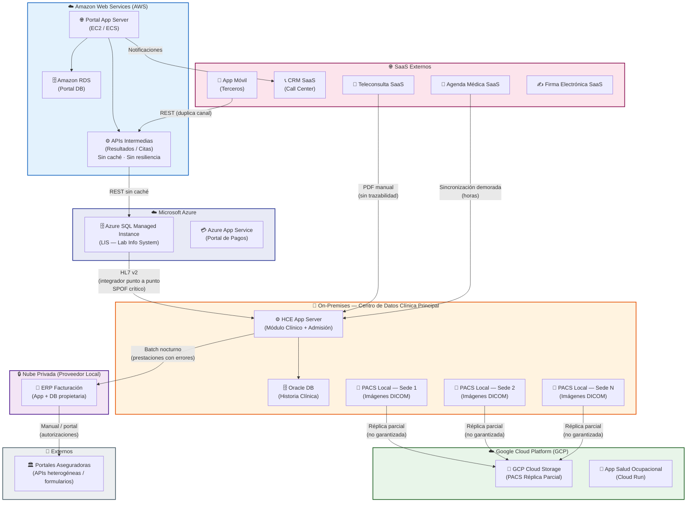
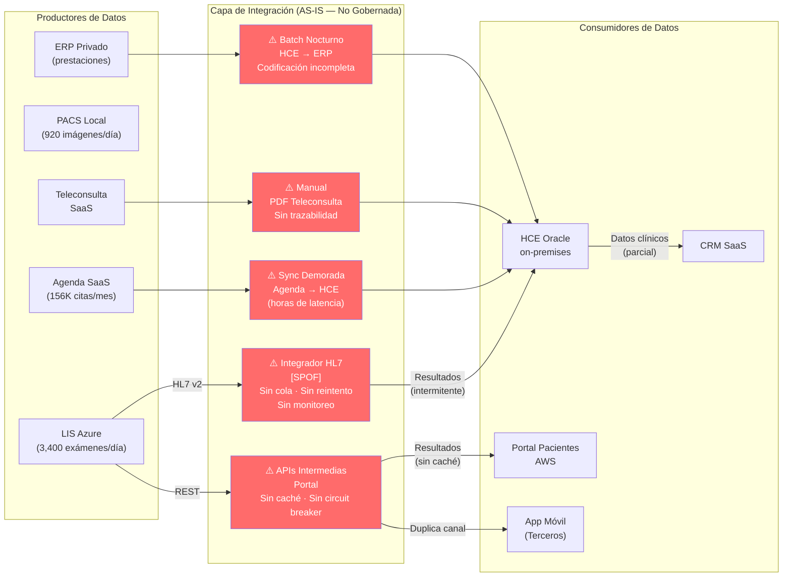
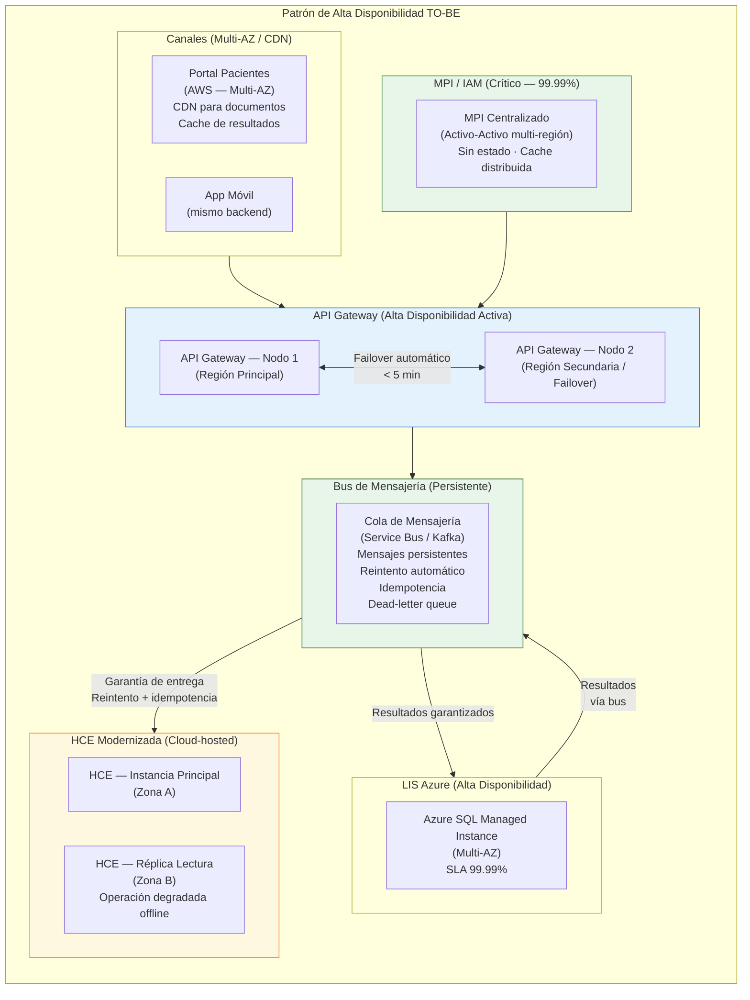
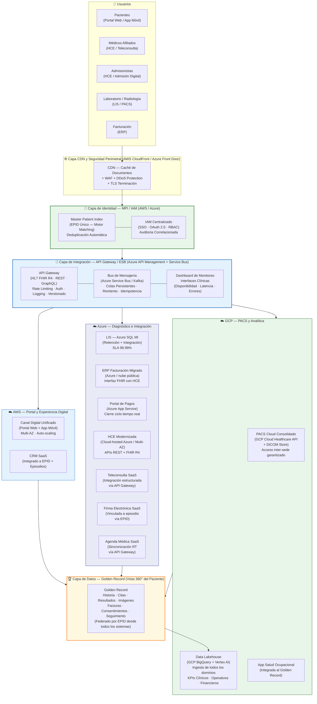
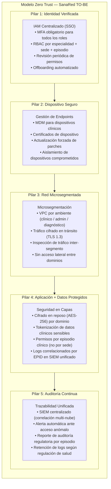
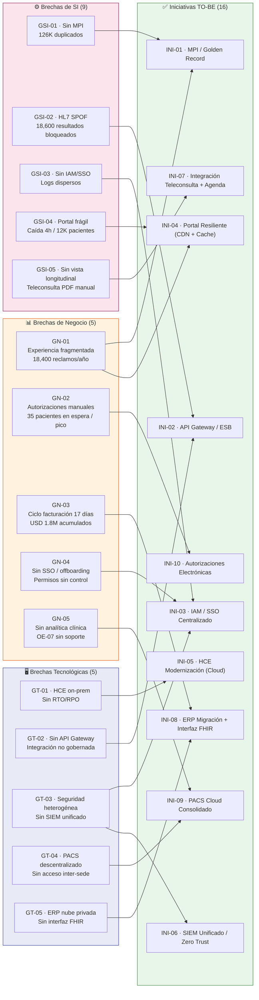
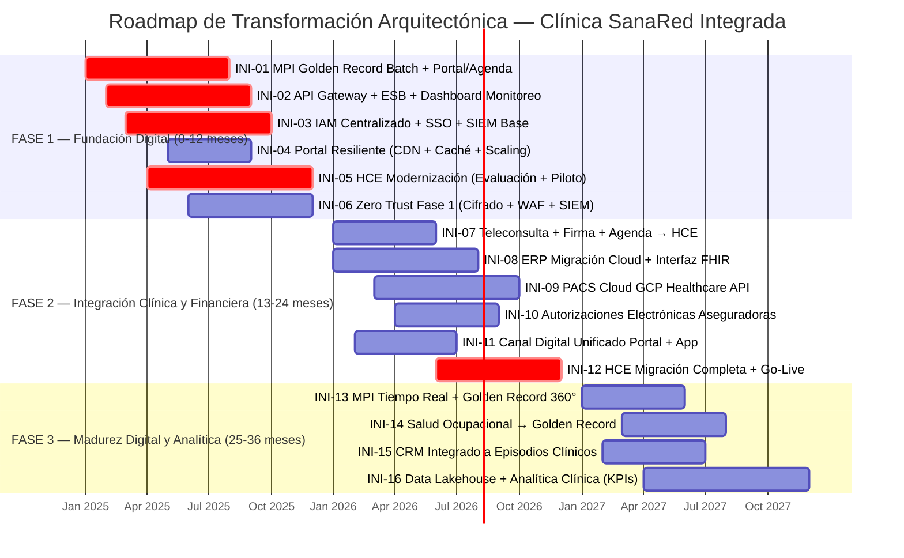
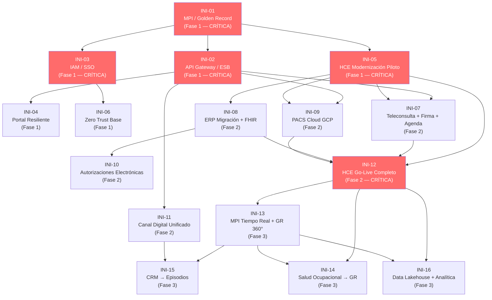
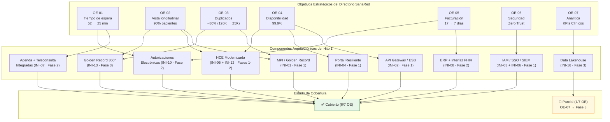

# Hito 1: Arquitectura Empresarial — Bloque 3: Tecnología, Brechas y Roadmap
## Clínica SanaRed Integrada | TOGAF ADM Fases D, E, F y Gestión de Requisitos

---

### Resumen Ejecutivo del Bloque 3

El Bloque 3 cierra el ciclo del Hito 1 de Arquitectura Empresarial de Clínica SanaRed Integrada cubriendo las Fases D, E, F y la Gestión de Requisitos del TOGAF ADM. Construye sobre los fundamentos establecidos en los Bloques 1 y 2 para responder la pregunta final: ¿cómo se materializa la transformación arquitectónica en tecnología, proyectos y un plan de migración ejecutable?

El Capítulo 1 (Fase D — Arquitectura Tecnológica) modela el estado actual de la infraestructura multinube de SanaRed con sus cinco ambientes de hosting, mapea cada una de las doce aplicaciones del portafolio contra su plataforma tecnológica y protocolo de integración, y propone la arquitectura TO-BE en siete capas. El Capítulo 2 (Fases E y F — Oportunidades, Soluciones y Migración) consolida el Gap Analysis a tres niveles arquitectónicos —Negocio, Sistemas de Información y Tecnología—, define dieciséis iniciativas de transformación agrupadas en tres horizontes temporales y presenta el Roadmap de Migración en formato Gantt. El Capítulo 3 (Gestión de Requisitos) materializa la trazabilidad completa entre los siete objetivos estratégicos del directorio y los componentes arquitectónicos que los satisfacen, garantizando que ningún objetivo quede sin respaldo en el diseño.

Los tres hallazgos transversales del bloque son consistentes con los diagnósticos previos: el MPI/Golden Record y el API Gateway/ESB son las iniciativas fundacionales sin las cuales ninguna modernización de aplicaciones puede garantizar resultados sostenibles; la modernización de la HCE Oracle on-premises es la transformación más compleja y de mayor impacto clínico del roadmap; y la plataforma de analítica clínica y operativa es el habilitador estratégico de largo plazo que convierte los datos distribuidos de SanaRed en ventaja competitiva.

---

## Capítulo 1: Arquitectura Tecnológica AS-IS y TO-BE (TOGAF ADM Fase D)
### Clínica SanaRed Integrada | Hito 1

> **Fase ADM:** D — Arquitectura Tecnológica
> **Artefactos:** Mapa de Infraestructura AS-IS · Esquema Multinube TO-BE · Matriz de Aplicaciones vs. Tecnología · SLAs y Requisitos de Resiliencia

---

### Resumen Ejecutivo del Capítulo 1

La arquitectura tecnológica de SanaRed es el resultado acumulado de doce años de crecimiento por adquisiciones y contrataciones independientes. Cinco ambientes de hosting conviven sin una estrategia de nube gobernada: un centro de datos on-premises con la HCE Oracle y el PACS local como sistemas críticos, tres nubes públicas (AWS, Azure y GCP) con cargas de trabajo asignadas históricamente, una nube privada administrada por un proveedor local que aloja el ERP, y seis sistemas SaaS de terceros. Esta dispersión genera los tres riesgos tecnológicos del Anexo 3b: accesos heterogéneos sin auditoría centralizada (Seguridad), integraciones punto a punto sin tolerancia a fallos (Integridad), y ausencia de SLAs formales y escalamiento automático (Disponibilidad).

La arquitectura TO-BE propone una reorganización en siete capas lógicas —Identidad, Integración, Clínica, Diagnóstica, Financiera, Experiencia Digital y Analítica— con una capa de integración (API Gateway/ESB) y un servicio de identidad del paciente (MPI) como fundamentos transversales. La transición se diseña como una migración progresiva que minimiza el riesgo operacional en una red que atiende 5,200 citas ambulatorias y 780 emergencias diarias.

---

### 9.1 Mapa de Infraestructura Tecnológica AS-IS

#### 9.1.1 Inventario de Ambientes Tecnológicos AS-IS

| # | Ambiente | Proveedor / Plataforma | Sistemas Alojados | Criticidad Operacional | Problema Tecnológico Identificado |
|---|---|---|---|---|---|
| AMB-01 | **On-Premises** | Centro de datos propietario — Clínica Principal | HCE Oracle (DB + App Server), PACS local por sede, Sistema de Admisión integrado a HCE | **CRÍTICA** — Core clínico y administrativo | Sin redundancia geográfica; conectividad variable con sedes remotas; sin RTO/RPO documentado; dependencia de enlace único para sedes pequeñas |
| AMB-02 | **Amazon Web Services (AWS)** | AWS — Región no especificada | Portal de Pacientes (App Server + Amazon RDS), APIs intermedias de resultados y citas | **ALTA** — Canal digital principal del paciente | RDS escala en lectura pero API de resultados sin caché; sin CDN para documentos; sin degradación elegante ante picos; caída de 4h documentada |
| AMB-03 | **Microsoft Azure** | Azure — Región no especificada | LIS (Azure SQL Managed Instance), Portal de Pagos (Azure App Service) | **ALTA** — Diagnóstico y cobros | LIS robusto; integración a HCE vía HL7 punto a punto sin tolerancia a fallos; sin monitoreo centralizado de interfaces |
| AMB-04 | **Google Cloud Platform (GCP)** | GCP — Región no especificada | PACS réplica (Cloud Storage), App Salud Ocupacional (Cloud Run / App Engine) | **MEDIA** — Réplica diagnóstica y corporativo | Réplica PACS parcial, no garantiza disponibilidad completa inter-sede; App Salud Ocupacional como silo sin integración |
| AMB-05 | **Nube Privada** | Proveedor local administrado | ERP Facturación (gestión prestaciones, pólizas, facturas, cobros) | **ALTA** — Ciclo de cobro y finanzas | Sin integración formal con HCE para codificación de prestaciones; sin SLA público; ciclo de cobro 17 días por desconexión con sistemas clínicos |
| AMB-06 | **SaaS Externos** | Múltiples proveedores terceros | Agenda Médica SaaS, CRM SaaS, Teleconsulta SaaS, App Móvil (terceros), Repositorio Firma Electrónica SaaS | **ALTA** — Canales y gestión operacional | Sin gobernanza de integración; cada SaaS tiene su propio modelo de identidad; sin correlación de auditoría entre plataformas |


#### 9.1.2 Diagrama de Infraestructura AS-IS — Vista General



#### 9.1.3 Diagrama de Infraestructura AS-IS — Flujos de Integración y Puntos de Falla



> **Leyenda de riesgo:** Los nodos en rojo representan puntos de quiebre documentados en el Anexo 3b y en el análisis del Bloque 2.

---

### 9.2 Matriz de Aplicaciones vs. Tecnología

Esta matriz mapea cada aplicación del portafolio contra su plataforma tecnológica de hosting, su protocolo de integración principal, el SLA actual (cuando está documentado) y la acción de transición TO-BE definida en el Bloque 2.

| ID App | Sistema | Hosting AS-IS | Plataforma / Stack Tecnológico | Protocolo de Integración | SLA Documentado AS-IS | Acción TO-BE |
|---|---|---|---|---|---|---|
| APP-01 | HCE Oracle (Historia Clínica) | On-Premises | Oracle Database 19c + App Server propietario | HL7 v2 (salida a LIS), batch (salida a ERP), manual (recibe PDF teleconsulta) | No documentado formalmente | **Migrate → Modernize** (Cloud-hosted + APIs FHIR) |
| APP-02 | Agenda Médica SaaS | SaaS externo | Stack propietario del proveedor SaaS | API REST (parcial), sincronización batch con HCE | SLA del proveedor SaaS (no integrado) | **Retain → Integrate** (vía API Gateway + MPI) |
| APP-03 | Portal de Pacientes | AWS (EC2/ECS + RDS) | Node.js / Python + Amazon RDS (PostgreSQL) | REST → APIs intermedias → LIS Azure | No documentado; caída de 4h registrada | **Consolidate** (unificar con App Móvil sobre API Gateway) |
| APP-04 | LIS (Laboratorio) | Azure SQL Managed Instance | Azure SQL MI + interfaces HL7 con equipos | HL7 v2 (entrada desde equipos), HL7 (salida a HCE), REST API (salida a Portal) | Azure SLA ≥ 99.99% (SQL MI) — integración sin SLA | **Retain → Integrate** (mensajería garantizada vía ESB) |
| APP-05 | PACS Local + GCP Réplica | On-Premises (PACS) + GCP Cloud Storage | DICOM SW por sede + GCP Cloud Storage | DICOM (interno por sede), réplica parcial a GCP | No documentado; réplica parcial no garantizada | **Consolidate** (PACS Cloud centralizado, DICOM web) |
| APP-06 | ERP Facturación | Nube Privada (proveedor local) | Stack ERP propietario (proveedor local) | Batch nocturno (entrada desde HCE), portales web/API aseguradoras (salida) | SLA de proveedor local (no publicado) | **Migrate** (cloud pública + interfaz FHIR con HCE) |
| APP-07 | CRM SaaS (Call Center) | SaaS externo | Stack propietario CRM SaaS | REST API (parcial con Portal), sin integración formal con HCE | SLA del proveedor SaaS | **Retain → Integrate** (vincular a EPID/MPI y bus de eventos) |
| APP-08 | Teleconsulta SaaS | SaaS externo | Stack propietario teleconsulta | PDF manual → HCE (sin integración estructurada) | SLA del proveedor SaaS | **Retain → Integrate** (resumen estructurado vía API Gateway) |
| APP-09 | App Móvil (Terceros) | Mobile (iOS / Android) — terceros | Stack de terceros (iOS/Android nativo) | REST → APIs intermedias Portal AWS (duplica canal) | Dependiente del ciclo de release de terceros | **Consolidate** (con Portal sobre API Gateway unificado) |
| APP-10 | Portal de Pagos | Azure App Service | Azure App Service (.NET / Java) | REST API (parcial con Portal), sin cierre en tiempo real con ERP | Azure App Service SLA 99.95% | **Retain → Integrate** (cierre ciclo en tiempo real con ERP migrado) |
| APP-11 | Firma Electrónica SaaS | SaaS externo | Stack propietario firma digital | Sin integración formal con HCE; permisos por sede/área | SLA del proveedor SaaS | **Retain → Integrate** (vincular consentimientos al episodio vía API Gateway + EPID) |
| APP-12 | App Salud Ocupacional | GCP (Cloud Run) | GCP Cloud Run (contenedores) | Sin integración formal con HCE ni Portal | GCP Cloud Run SLA 99.95% | **Integrate → Consolidate** (datos al Golden Record, evaluación a largo plazo) |
| *(nuevo)* | MPI / IAM Centralizado | A definir (preferente AWS o Azure) | Plataforma MPI + IAM (ej. Microsoft Entra ID Healthcare / AWS IAM + motor MPI OSS o comercial) | API REST / OAuth 2.0 / FHIR Patient API | SLA objetivo: 99.99% | **New — Build** (VAC-01) |
| *(nuevo)* | API Gateway / ESB (Bus de Servicios) | A definir (multinube) | Azure API Management + Azure Service Bus / AWS API Gateway + EventBridge + MSK, o solución iPaaS | HL7 FHIR R4, REST, eventos (Kafka/Service Bus), adaptadores HL7 v2 | SLA objetivo: 99.9% | **New — Build** (VAC-02) |
| *(nuevo)* | Plataforma de Analítica Clínica | A definir (preferente Azure Synapse o GCP BigQuery) | Data Lakehouse (Delta Lake / Apache Iceberg) + capa semántica + BI (Power BI / Looker) | Conectores nativos a todas las fuentes, ingesta event-driven y batch | SLA objetivo: 99.9% | **New — Build** (VAC-03) |

---

### 9.3 SLAs, RTO/RPO y Requisitos de Resiliencia por Sistema Crítico

#### 9.3.1 Tabla de SLAs AS-IS vs. Objetivos TO-BE

| Sistema | SLA AS-IS (real / documentado) | RTO AS-IS | RPO AS-IS | SLA TO-BE Objetivo | RTO TO-BE | RPO TO-BE | Justificación Clínica |
|---|---|---|---|---|---|---|---|
| HCE Oracle (APP-01) | No documentado formalmente | No definido | No definido | **99.9%** (< 8.7 h/año) | < 30 min | < 15 min | Core clínico: 5,200 citas/día + 780 emergencias dependen de HCE |
| Portal de Pacientes (APP-03) | < 99.9% (caída de 4h documentada) | No definido | No definido | **99.9%** (< 8.7 h/año) | < 15 min | < 5 min | 12,000 pacientes afectados en un solo incidente |
| LIS — Azure SQL MI (APP-04) | Azure SQL MI: 99.99% (instancia); integración HL7: sin SLA | < 1 h (infraestructura) | < 1 h | **99.9%** (integración) | < 15 min (HL7 → HCE) | < 5 min | 18,600 resultados bloqueados durante 11h en un incidente |
| Integrador HL7 (INT-01) | Sin SLA — SPOF identificado | No definido (caída de 11h documentada) | No definido | **99.9%** (sustituido por ESB) | < 5 min (failover automático) | 0 (mensajería persistente) | Continuidad asistencial: resultados para médicos y pacientes |
| APIs Intermedias Portal (INT-02) | Sin SLA — sin caché | No definido | No definido | **99.9%** | < 5 min | < 2 min | Acceso a resultados del paciente digital |
| Agenda SaaS (APP-02) | SLA de proveedor (no integrado) | Depende del proveedor | Depende del proveedor | **99.9%** (por SLA contractual) | < 30 min | < 15 min | 156,000 citas/mes; 4% genera reclamo por errores |
| ERP Facturación (APP-06) | Sin SLA publicado (nube privada) | No definido | No definido | **99.5%** | < 1 h | < 30 min | Ciclo de facturación; USD 1.8M acumulados por desconexión |
| MPI / IAM *(nuevo)* | N/A | N/A | N/A | **99.99%** | < 5 min | 0 (servicio sin estado) | Fundacional: todos los sistemas dependen del EPID |
| API Gateway / ESB *(nuevo)* | N/A | N/A | N/A | **99.9%** | < 5 min (failover activo-activo) | 0 (mensajes persistentes) | Capa transversal de integración clínica |

#### 9.3.2 Diagrama de Resiliencia TO-BE — Patrón de Alta Disponibilidad



---

### 9.4 Arquitectura Tecnológica TO-BE — Esquema Multinube Conceptual

#### 9.4.1 Principios de Asignación de Workloads a la Nube

La estrategia TO-BE mantiene el enfoque multinube de SanaRed pero lo hace **deliberado y gobernado**, aplicando criterios claros de asignación de cargas de trabajo según el principio PT-02 (Estrategia Multinube Gobernada) definido en la Fase Preliminar.

| Proveedor de Nube | Rol TO-BE | Workloads Asignados | Justificación |
|---|---|---|---|
| **AWS** | Portal del paciente y experiencia digital | Canal digital unificado (Portal + App), MPI (si se adopta AWS Cognito Healthcare), CDN (CloudFront) para documentos | Madurez de servicios de identidad y experiencia digital; infraestructura de portal ya existente |
| **Azure** | Diagnóstico clínico e integración | LIS (Azure SQL MI existente), API Gateway (Azure API Management), Bus de Servicios (Azure Service Bus), ERP migrado | Azure SQL MI tiene SLA 99.99%; Azure API Management es líder en gestión de APIs HL7/FHIR; integración natural con LIS existente |
| **GCP** | PACS consolidado y analítica | PACS Cloud (Cloud Storage + DICOM Store), Data Lakehouse (BigQuery + Vertex AI), App Salud Ocupacional modernizada | GCP Cloud Healthcare API es nativa para DICOM y FHIR; BigQuery para analítica a escala clínica |
| **On-Premises / Edge** | Continuidad operacional en sedes | Caché local de HCE para modo offline en sedes (réplica de lectura), PACS local residual durante migración | Garantizar operación degradada ante pérdida de conectividad; migración progresiva del PACS |
| **SaaS** | Capacidades especializadas retenidas | Agenda SaaS, CRM SaaS, Teleconsulta SaaS, Firma Electrónica SaaS (todos integrados vía API Gateway) | Madurez funcional; integración gobernada por API Gateway elimina el riesgo de integración directa |

#### 9.4.2 Diagrama de Arquitectura Tecnológica TO-BE — Vista General



#### 9.4.3 Diagrama de Gobernanza de Seguridad TO-BE — Modelo Zero Trust




---

## Capítulo 2: Oportunidades, Soluciones y Plan de Migración (TOGAF ADM Fases E y F)
### Clínica SanaRed Integrada | Hito 1

> **Fases ADM:** E — Oportunidades y Soluciones · F — Planificación de la Migración
> **Artefactos:** Gap Analysis Multinivel · Catálogo de Iniciativas · Roadmap de Migración (Gantt) · Criterios de Priorización

---

### Resumen Ejecutivo del Capítulo 2

El Gap Analysis a tres niveles confirma dieciséis brechas distribuidas entre los dominios de Negocio (cinco brechas), Sistemas de Información (seis brechas, cross-referenciadas desde el Bloque 2) y Tecnología (cinco brechas nuevas). La síntesis identifica seis iniciativas de Fase 1 (Corto Plazo — 0 a 12 meses), seis de Fase 2 (Mediano Plazo — 13 a 24 meses) y cuatro de Fase 3 (Largo Plazo — 25 a 36 meses). El criterio de priorización aplica el principio PN-01 (el paciente como centro) y los objetivos estratégicos OE-02, OE-03 y OE-04 como drivers de la Fase 1, dado que las iniciativas de identidad del paciente y disponibilidad de canales son condición previa para todas las demás.

---

### 10.1 Gap Analysis — Nivel de Negocio

| ID | Brecha de Negocio | Estado AS-IS | Estado TO-BE | Impacto en Negocio | Sistemas Afectados | Prioridad |
|---|---|---|---|---|---|---|
| **GN-01** | **Experiencia del paciente fragmentada** | El paciente interactúa con sistemas que no se reconocen entre sí: registra en el portal, confirma por call center y llega a la sede con datos inconsistentes. 18,400 reclamos anuales por demoras; 4% de citas con error de horario, sede o cobertura. | Experiencia omnicanal coherente: el mismo EPID identifica al paciente en todos los canales. Agenda, admisión y portal muestran datos consistentes en tiempo real. Reclamos por inconsistencia reducidos en 75%. | Pérdida de preferencia frente a clínicas digitales; 18,400 reclamos anuales consumen recursos operacionales significativos; riesgo reputacional documentado (incidente campaña de influenza registrado en redes sociales). | Portal AWS, Agenda SaaS, HCE Oracle, CRM SaaS, Admisión local | **ALTA** |
| **GN-02** | **Proceso de autorizaciones manual e ineficiente** | Las autorizaciones de aseguradora se gestionan en portales externos heterogéneos: algunas ofrecen API, otras solo formularios web. En horas pico, 35 pacientes esperan simultáneamente autorización. Contingencia en papel ante fallas de conectividad. | Autorizaciones electrónicas estandarizadas con las principales aseguradoras vía API. Tiempo de autorización reducido de horas a minutos. Integración de autorización en el flujo de admisión digital. | 780 emergencias diarias con riesgo de retraso en autorización; caída del portal de aseguradora = contingencia en papel → 260 inconsistencias documentadas; deteriora experiencia del paciente y médico. | ERP, Portales Aseguradoras, HCE Oracle, Admisión local | **ALTA** |
| **GN-03** | **Ciclo de facturación ineficiente** | Ciclo promedio de 17 días (hasta 35 en algunos convenios). 13% de expedientes observados. USD 1.8M acumulados en un convenio corporativo. Auditoría médica manual consume tiempo en correcciones de codificación que deberían llegar estructuradas desde la atención clínica. | Ciclo de facturación reducido a 7 días. Codificación de prestaciones fluye estructuralmente desde HCE (SoR clínico) al ERP (SoR financiero). Autorizaciones electrónicas prevalidadas. Expedientes observados reducidos al 3%. | Impacto financiero directo: USD 1.8M en un convenio; ciclo de 35 días deteriora flujo de caja y relación con aseguradoras; 13% de reprocesos consume recursos de auditoría médica. | HCE Oracle, ERP, LIS Azure, Portales Aseguradoras | **ALTA** |
| **GN-04** | **Gestión de médicos afiliados sin SSO ni offboarding automatizado** | Sin Single Sign-On centralizado. Un médico que rota entre sedes puede conservar permisos más amplios de los necesarios. Las altas/bajas de médicos afiliados no se sincronizan automáticamente entre sistemas. Maestro de médicos en ERP; disponibilidades en Agenda SaaS; accesos en sistemas individuales por sede. | IAM centralizado con SSO. Alta/baja de médico afiliado activa provisión/deprovisión automática de permisos en todos los sistemas. Maestro de médicos federado desde ERP como SoR único. Disponibilidades en tiempo real. | Riesgo de seguridad: acceso indebido de médico desvinculado difícil de detectar sin correlación de auditoría. Cambios de disponibilidad tardan horas en reflejarse → errores de agenda (4% de citas con reclamo). | ERP, Agenda SaaS, HCE Oracle, CRM SaaS, LIS Azure | **ALTA** |
| **GN-05** | **Ausencia de capacidades de analítica clínica y operativa** | Los datos clínicos, operativos y financieros están distribuidos en 12 sistemas sin una plataforma unificada de analítica. Los datos de satisfacción del CRM no se correlacionan con episodios clínicos. No existe capacidad de anticipar demanda, personalizar seguimiento ni medir calidad asistencial por episodio. | Data Lakehouse multinube que integra HCE, LIS, PACS, ERP y CRM. KPIs clínicos (tasa de readmisión, resultado por episodio), operativos (ocupación, tiempos de espera) y financieros (costo por episodio) disponibles para el directorio. | SanaRed tiene datos suficientes para anticipar demanda pero sus sistemas no lo permiten. Competidores digitales ofrecen experiencias personalizadas. Reclamos por comunicaciones contradictorias crecieron 34%. OE-07 sin soporte actual. | Todos los sistemas del portafolio | **MEDIA** |


### 10.2 Gap Analysis — Nivel de Sistemas de Información

Las brechas de Sistemas de Información fueron documentadas en detalle en el Bloque 2 (Capítulo 3, Secciones 7.1 y 7.2). La siguiente tabla las sintetiza para el Gap Analysis multinivel y las alinea con las iniciativas del roadmap.

| ID | Brecha de SI | AS-IS (Resumen) | TO-BE (Resumen) | Riesgo Anexo 3b | Prioridad | Iniciativa Roadmap |
|---|---|---|---|---|---|---|
| **GSI-01** | Ausencia de MPI / identidad única del paciente (BRE-D01 + VAC-01) | 126,000 registros duplicados; deduplicación manual mensual; sin EPID | MPI centralizado con motor matching; EPID propagado a todos los sistemas; deduplicación automática en tiempo real | Integridad · Seguridad | **CRÍTICA** | INI-01 |
| **GSI-02** | Integrador HL7 como SPOF sin tolerancia a fallos (BRE-D02 + DUP-04 + VAC-02) | 18,600 resultados bloqueados 11h; sin cola persistente, sin reintento, sin monitoreo | API Gateway + ESB con mensajería garantizada, idempotencia, dead-letter queue y dashboard | Disponibilidad · Integridad | **CRÍTICA** | INI-02 |
| **GSI-03** | Sin IAM / SSO centralizado (BRE-A01) | Roles por sistema/sede sin correlación; sin SSO; logs dispersos en 5+ sistemas | IAM federado; SSO; correlación de auditoría por EPID; logs unificados en SIEM | Seguridad | **CRÍTICA** | INI-03 |
| **GSI-04** | Portal sin resiliencia a picos (BRE-A04) | Caída de 4h; sin caché de resultados; sin escalamiento automático; sin CDN | Portal Multi-AZ con CDN, caché de resultados, auto-scaling, degradación elegante | Disponibilidad | **ALTA** | INI-04 |
| **GSI-05** | Datos clínicos dispersos sin vista longitudinal (BRE-D03) | Teleconsulta PDF manual; App Salud Ocupacional silo; sin vista 360° del paciente | HCE modernizada + integraciones estructuradas; Golden Record con vista longitudinal | Integridad | **ALTA** | INI-05, INI-07 |
| **GSI-06** | Codificación de prestaciones fragmentada HCE → ERP (DUP-03 + GN-03) | 13% expedientes observados; USD 1.8M acumulados; codificación manual | Interfaz FHIR/HL7 HCE→ERP; HCE SoR clínico; ERP SoR financiero; auditoría automatizada | Integridad | **ALTA** | INI-08 |
| **GSI-07** | Agenda/Admisión duplicada sin sincronización real (DUP-01) | Agenda SaaS + módulos locales HCE sin sincronización en tiempo real | Agenda SaaS integrada vía API Gateway al MPI; sincronización <5 min | Disponibilidad · Integridad | **ALTA** | INI-02, INI-05 |
| **GSI-08** | PACS descentralizado sin acceso inter-sede (D4 AS-IS) | PACS local por sede; réplica GCP parcial; sin visor unificado | PACS Cloud centralizado con acceso inter-sede garantizado y visor DICOM web | Disponibilidad | **MEDIA** | INI-09 |
| **GSI-09** | Ausencia de plataforma analítica unificada (VAC-03) | Datos en silos; sin Data Lakehouse; OE-07 sin soporte | Data Lakehouse multinube con ingesta de todos los dominios | Estratégico | **MEDIA** | INI-16 |


### 10.3 Gap Analysis — Nivel Tecnológico

| ID | Brecha Tecnológica | Estado AS-IS | Estado TO-BE | Impacto Operacional | Prioridad | Iniciativa Roadmap |
|---|---|---|---|---|---|---|
| **GT-01** | **HCE Oracle on-premises sin resiliencia ni modernización** | HCE Oracle en centro de datos único on-premises; sin RTO/RPO definido; sedes pequeñas con enlace único de conectividad; sin modo offline; API propietaria no estándar | HCE modernizada cloud-hosted (Azure / Multi-AZ); APIs REST/FHIR R4 nativas; réplica de lectura local en sedes para modo offline; RTO < 30 min; RPO < 15 min | Falla de conectividad = 1,400 admisiones en formularios temporales; 260 inconsistencias documentadas; riesgo clínico en emergencias | **CRÍTICA** | INI-05 |
| **GT-02** | **Arquitectura de integración punto a punto sin gobernanza** | 6 integraciones heterogéneas (HL7, REST ad hoc, batch, PDF manual, sync demorada, réplica parcial) sin API Gateway ni ESB; sin versionado de APIs; sin monitoreo centralizado | API Gateway / ESB como capa única de integración; todas las interfaces pasan por el gateway; monitoreo centralizado; SLA de integración de 99.9% | Sin visibilidad operativa del estado de interfaces; cada falla impacta múltiples sistemas sin detección proactiva | **CRÍTICA** | INI-02 |
| **GT-03** | **Política de seguridad multinube no homogénea (BRE-A03)** | Cada nube (AWS, Azure, GCP), nube privada y SaaS aplica su propia política de cifrado, retención, acceso y auditoría; sin SOC unificado; sin SIEM correlacionado | Framework de seguridad Zero Trust transversal; SIEM unificado (correlación multi-nube); cifrado AES-256 en reposo en todos los ambientes; TLS 1.3 en tránsito; política homogénea por tipo de dato clínico | Sin visibilidad unificada del estado de seguridad; cumplimiento regulatorio fragmentado; acceso indebido difícil de detectar | **ALTA** | INI-03, INI-06 |
| **GT-04** | **PACS descentralizado con réplica parcial no garantizada** | PACS local en cada sede; réplica parcial en GCP Cloud Storage; sin acceso inter-sede garantizado; radiólogos no acceden a imágenes de otras clínicas | PACS Cloud consolidado en GCP (Cloud Healthcare API + DICOM Store); acceso inter-sede garantizado; visor DICOM web integrado en HCE modernizada; metadatos en Golden Record | Radiólogos no acceden a imágenes de otras sedes; réplica parcial genera riesgo ante falla del PACS local; 920 estudios/día sin continuidad diagnóstica inter-sede | **ALTA** | INI-09 |
| **GT-05** | **ERP en nube privada sin interfaz estandarizada con sistemas clínicos** | ERP en nube privada sin SLA publicado; integración con HCE por batch nocturno con codificación incompleta; sin integración electrónica con todas las aseguradoras; ciclo de cobro 17 días | ERP migrado a cloud pública (Azure); interfaz FHIR/HL7 bidireccional con HCE modernizada; integración electrónica con aseguradoras principales (EDI / FHIR); ciclo de cobro objetivo 7 días | USD 1.8M acumulados en un convenio; 13% expedientes observados; ciclo hasta 35 días en algunos convenios | **ALTA** | INI-08 |


### 10.4 Síntesis del Gap Analysis — Resumen Visual Multinivel



---

### 10.5 Catálogo de Iniciativas de Transformación

Las dieciséis iniciativas se agrupan en tres horizontes temporales según su dependencia arquitectónica, complejidad de implementación e impacto en los objetivos estratégicos.

#### 10.5.1 Fase 1 — Fundación Digital (0–12 meses / Corto Plazo)

*Objetivo de la fase:* Eliminar los puntos únicos de falla críticos, establecer la identidad única del paciente y garantizar la disponibilidad mínima de 99.9% en los canales digitales. Estas seis iniciativas son condición previa para todo lo que sigue.

| ID | Iniciativa | Descripción | Sistemas Impactados | OE Habilitados | Complejidad | Dependencias |
|---|---|---|---|---|---|---|
| **INI-01** | **Master Patient Index (MPI) y Golden Record — Fase 1** | Implementar el MPI centralizado con motor de matching determinístico + probabilístico. Ejecutar la deduplicación batch de los 126,000 registros. Integrar Portal AWS y Agenda SaaS al MPI. Asignar EPID a ≥75% de pacientes activos. | HCE Oracle, Portal AWS, Agenda SaaS, CRM SaaS | OE-02, OE-03 | **Alta** (diseño del modelo de identidad, gobernanza) | Ninguna — iniciativa fundacional |
| **INI-02** | **API Gateway y Bus de Mensajería — Implementación Base** | Implementar Azure API Management como API Gateway centralizado y Azure Service Bus como bus de mensajería. Migrar la integración HL7 entre LIS y HCE del modelo punto a punto al modelo de cola garantizada con reintento e idempotencia. Implementar dashboard de monitoreo de interfaces clínicas. | LIS Azure, HCE Oracle, Portal AWS, Integrador HL7 | OE-04, OE-02 | **Alta** (integración HL7 FHIR, configuración del bus) | INI-01 (EPID debe estar disponible para correlación de mensajes) |
| **INI-03** | **IAM Centralizado y SSO** | Implementar Single Sign-On (SSO) con OAuth 2.0 y RBAC por especialidad + sede + episodio. Automatizar provisión/deprovisión de médicos afiliados. Correlacionar logs de acceso a datos clínicos por EPID en un SIEM unificado. MFA obligatorio para todos los roles con acceso a datos clínicos sensibles. | Todos los sistemas del portafolio | OE-06 | **Alta** (federación de identidad con 12 sistemas) | INI-01 (EPID como llave de identidad del colaborador/paciente) |
| **INI-04** | **Resiliencia del Portal de Pacientes** | Implementar CDN (CloudFront) para documentos y resultados. Añadir caché de resultados de laboratorio (TTL ajustable). Configurar auto-scaling del App Server. Implementar degradación elegante (modo lectura ante falla de backend). Definir SLA formal de 99.9%. | Portal AWS (App Server + RDS), APIs Intermedias, LIS Azure | OE-04 | **Media** (configuración CDN, caché, auto-scaling) | INI-02 (APIs intermedias sustituidas por API Gateway antes de cachear) |
| **INI-05** | **Modernización de HCE — Fase 1: Evaluación y Arquitectura** | Seleccionar plataforma HCE modernizada (cloud-hosted / cloud-native). Diseñar arquitectura de migración de datos Oracle → nueva plataforma. Implementar réplica de lectura local en sedes remotas para modo offline. Exponer primeras APIs REST/FHIR R4. No migración completa en Fase 1 — arquitectura y piloto. | HCE Oracle on-premises, Sedes remotas | OE-02, OE-04 | **Muy Alta** (migración de sistema core clínico) | INI-01, INI-02 (el nuevo HCE se integra desde el inicio vía API Gateway + MPI) |
| **INI-06** | **Framework de Seguridad Zero Trust — Fase 1** | Implementar política de cifrado homogénea (AES-256 en reposo, TLS 1.3 en tránsito) para los ambientes AWS, Azure y GCP. Configurar SIEM unificado (Microsoft Sentinel o similar) con correlación de eventos multi-nube. Implementar WAF en el portal. Auditoría de permisos existentes con deprovisión de accesos excedentes. | Portal AWS, LIS Azure, HCE Oracle, PACS GCP, ERP Nube Privada | OE-06 | **Alta** (configuración multi-nube, SIEM) | INI-03 (IAM/SSO es la base del Zero Trust) |

#### 10.5.2 Fase 2 — Integración Clínica y Financiera (13–24 meses / Mediano Plazo)

*Objetivo de la fase:* Completar la modernización de HCE, eliminar los silos de datos clínicos y financieros, consolidar los canales digitales y comenzar la transición del PACS.

| ID | Iniciativa | Descripción | Sistemas Impactados | OE Habilitados | Complejidad | Dependencias |
|---|---|---|---|---|---|---|
| **INI-07** | **Integración de Teleconsulta, Firma Electrónica y Agenda al HCE** | Reemplazar la carga manual de PDFs de teleconsulta por integración estructurada (FHIR ClinicalImpression) vía API Gateway. Vincular consentimientos del repositorio de firma electrónica al episodio clínico mediante EPID. Sincronización de agenda en tiempo real (<5 min) vía API Gateway. | Teleconsulta SaaS, Firma Electrónica SaaS, Agenda SaaS, HCE (modernizada Fase 1) | OE-02, OE-01 | **Media** | INI-01, INI-02, INI-05 (Fase 1) |
| **INI-08** | **ERP: Migración a Cloud Pública e Interfaz FHIR con HCE** | Migrar ERP de nube privada a cloud pública (Azure). Implementar interfaz bidireccional FHIR/HL7 entre HCE modernizada (SoR clínico) y ERP migrado (SoR financiero). Integrar Portal de Pagos para cierre de ciclo en tiempo real. Iniciar integración electrónica con las 3 aseguradoras principales. | ERP Nube Privada, HCE Oracle/Modernizada, Portal de Pagos Azure, Portales Aseguradoras | OE-05, OE-03 | **Alta** (migración ERP + interfaz FHIR) | INI-05 (Fase 1 HCE), INI-02 (API Gateway) |
| **INI-09** | **PACS Cloud Consolidado (GCP Healthcare API)** | Migrar PACS locales por sede al GCP Cloud Healthcare API (DICOM Store). Garantizar acceso inter-sede a imágenes médicas. Implementar visor DICOM web integrado en HCE modernizada. Completar réplica y eliminar réplica parcial GCP Cloud Storage actual. | PACS Local (todas las sedes), GCP Cloud Storage (réplica actual), HCE Modernizada | OE-02, OE-04 | **Alta** (migración de volúmenes DICOM históricos) | INI-05 (HCE modernizada como visor integrado), INI-02 (metadatos vía API Gateway) |
| **INI-10** | **Autorizaciones Electrónicas con Aseguradoras** | Implementar integración electrónica con las principales aseguradoras mediante APIs estandarizadas (FHIR CoverageEligibilityRequest / Prior Authorization). Automatizar el flujo de autorización previa dentro del proceso de admisión. Reducir el tiempo de autorización de horas a minutos. | ERP Migrado, HCE Modernizada, Portales Aseguradoras, Sistema de Admisión | OE-01, OE-05 | **Media-Alta** (depende de APIs de aseguradoras) | INI-08 (ERP migrado), INI-07 (flujo de admisión integrado) |
| **INI-11** | **Canal Digital Unificado (Portal + App Móvil)** | Consolidar Portal de Pacientes AWS y App Móvil de terceros en un canal digital unificado con capa de API Gateway centralizada. Eliminar la duplicidad funcional (DUP-02). Paridad de funcionalidades entre web y móvil. Rediseño de App Móvil propia o adquisición de solución moderna. | Portal AWS, App Móvil (Terceros), API Gateway (INI-02) | OE-04, OE-07 | **Media** | INI-02, INI-04 |
| **INI-12** | **HCE — Migración Completa y Go-Live** | Completar la migración de datos históricos de Oracle hacia la plataforma HCE modernizada. Descomisionar la HCE Oracle on-premises progresivamente por sede. Go-live de HCE modernizada en todas las clínicas principales. Mantener HCE Oracle como sistema de lectura legacy durante 6 meses post-migración. | HCE Oracle on-premises, HCE Modernizada (INI-05), Todas las sedes | OE-02, OE-04, OE-06 | **Muy Alta** (migración más compleja del roadmap) | INI-05 (arquitectura y piloto), INI-07, INI-08, INI-09 (integraciones deben estar listas antes del go-live) |

#### 10.5.3 Fase 3 — Madurez Digital y Analítica (25–36 meses / Largo Plazo)

*Objetivo de la fase:* Completar la consolidación de identidad, desplegar la analítica clínica y operativa, y madurar la experiencia digital y la salud ocupacional como propuesta de valor diferenciada.

| ID | Iniciativa | Descripción | Sistemas Impactados | OE Habilitados | Complejidad | Dependencias |
|---|---|---|---|---|---|---|
| **INI-13** | **MPI / Golden Record — Fase 2: Deduplicación en Tiempo Real** | Evolucionar el MPI de matching por lote (Fase 1) a matching event-driven en tiempo real. Alcanzar ≥95% de tasa de match automático. Activar el Golden Record 360° operativo con vista longitudinal completa: historia, citas, resultados, imágenes, facturas y consentimientos federados por EPID. | MPI (INI-01), Todos los sistemas del portafolio | OE-02, OE-03 | **Media** | INI-01, INI-12 (todos los sistemas integrados al MPI) |
| **INI-14** | **Integración de Salud Ocupacional al Golden Record** | Conectar la App Salud Ocupacional (GCP) al Golden Record del paciente vía API Gateway. Los datos de programas preventivos corporativos y chequeos empresariales pasan a alimentar la vista longitudinal del paciente. Evaluar consolidación a largo plazo con HCE modernizada. | App Salud Ocupacional GCP, MPI/Golden Record, HCE Modernizada | OE-02 | **Media** | INI-12, INI-13 |
| **INI-15** | **CRM Integrado a Episodios Clínicos** | Vincular el CRM SaaS al EPID del paciente y al bus de eventos clínicos. Las campañas y comunicaciones se basan en el episodio real del paciente (diagnóstico, resultado, próximo control), no en registros desconectados. Eliminar las comunicaciones contradictorias que generaron 34% más de reclamos. | CRM SaaS, MPI/Golden Record, Bus de Mensajería (INI-02), HCE Modernizada | OE-07 | **Baja-Media** | INI-13, INI-11 (canal unificado) |
| **INI-16** | **Plataforma de Analítica Clínica y Operativa (Data Lakehouse)** | Implementar Data Lakehouse en GCP BigQuery con ingesta de todos los dominios: HCE modernizada, LIS, PACS, ERP migrado, CRM, portal. Desarrollar KPIs clínicos (tasa de readmisión, adherencia, resultado por patología), operativos (tiempo de espera, ocupación por sede, throughput) y financieros (costo por episodio, margen por aseguradora). Integrar con herramienta BI (Looker / Power BI). | Todos los sistemas del portafolio, GCP BigQuery, Herramienta BI | OE-07 | **Alta** (arquitectura de datos a escala) | INI-12, INI-13 (datos consolidados son condición del lakehouse) |

---

### 10.6 Roadmap de Migración

#### 10.6.1 Diagrama Gantt — Roadmap de Transformación SanaRed (36 meses)



#### 10.6.2 Diagrama de Dependencias entre Iniciativas



#### 10.6.3 Tabla de Criterios de Priorización

| Criterio | Peso | Descripción | Iniciativas Fase 1 Favorecidas |
|---|---|---|---|
| **Impacto en seguridad del paciente** | 30% | Reduce riesgo de decisión médica con información incompleta o errónea | INI-01 (identidad única), INI-02 (resultados garantizados), INI-05 (HCE resiliente) |
| **Cumplimiento de objetivos estratégicos críticos** | 25% | Habilita directamente OE-02 (vista longitudinal), OE-03 (duplicados) u OE-04 (disponibilidad 99.9%) | INI-01, INI-02, INI-04 |
| **Reducción de riesgo tecnológico del Anexo 3b** | 20% | Mitiga Seguridad, Integridad o Disponibilidad | INI-01 (Integridad), INI-02 (Disponibilidad), INI-03 (Seguridad), INI-06 (Seguridad) |
| **Es condición previa de otras iniciativas** | 15% | Sin esta iniciativa, N otras no pueden ejecutarse | INI-01 (6 dependientes), INI-02 (5 dependientes), INI-05 (6 dependientes) |
| **Relación impacto / complejidad** | 10% | Máximo impacto con menor complejidad relativa | INI-04 (media complejidad, alto impacto en OE-04) |


---

## Capítulo 3: Gestión de Requisitos — Matriz de Trazabilidad (TOGAF ADM Requirements Management)
### Clínica SanaRed Integrada | Hito 1

> **Componente ADM:** Requirements Management (transversal a todas las fases)
> **Artefactos:** Matriz de Trazabilidad de Requisitos · Diagrama de Cobertura de Objetivos Estratégicos · Validación de Criterios de Éxito

---

### Resumen Ejecutivo del Capítulo 3

La Gestión de Requisitos verifica que los siete objetivos estratégicos del directorio de SanaRed tienen respaldo explícito en al menos un componente arquitectónico del Hito 1. La Matriz de Trazabilidad mapea cada objetivo a la fase ADM donde se aborda, al artefacto que lo satisface y al estado de cobertura, confirmando que los tres bloques del hito constituyen una respuesta arquitectónica coherente y completa a las necesidades estratégicas de la red. Seis de los siete objetivos quedan cubiertos en el Hito 1; el objetivo OE-07 (analítica clínica y operativa) recibe cobertura parcial en el hito —con la definición arquitectónica del Data Lakehouse y el VAC-03— y cobertura completa en la Fase 3 del roadmap (INI-16).

---

### 11.1 Matriz de Trazabilidad de Requisitos

La matriz cumple con el Requirement 10 del documento de requisitos: mapea cada uno de los 7 objetivos estratégicos a la fase ADM, el artefacto arquitectónico que lo satisface, la iniciativa del roadmap que lo implementa y el estado de cobertura en el Hito 1.

| ID OE | Objetivo Estratégico | Meta Cuantificada | Fase ADM Principal | Artefacto Arquitectónico (Hito 1) | Principio Habilitador | Iniciativa Roadmap | Estado Cobertura |
|---|---|---|---|---|---|---|---|
| **OE-01** | Reducir tiempo promedio de espera ambulatoria | 52 min → 25 min | **Fase B** (Negocio) + **Fase F** (Roadmap) | Mapa de Capacidades (C1.2 Admisión, C1.3 Autorizaciones, C5.2 Agendamiento Omnicanal) · Cadena de Valor (Quiebre 1 y 2) · INI-07 (Agenda integrada en tiempo real) · INI-10 (Autorizaciones electrónicas) | PN-01, PA-01, PT-01 | INI-07 (Fase 2), INI-10 (Fase 2) | ✅ **Cubierto** — Arquitectura definida en Fase B; implementación en Fases 2 del roadmap |
| **OE-02** | Lograr vista clínica longitudinal del paciente | 90% de pacientes atendidos | **Fase C** (Datos) + **Fase D** (Tecnología) | Estrategia Golden Record / MPI (Sección 5.3) · ERD entidad HISTORIA_CLINICA + EPISODIO_CLINICO + RESULTADO · BRE-D03 (dispersión clínica) · Diagrama TO-BE Capas 1-3 (MPI + API Gateway + HCE Modernizada) | PD-01, PN-02, PA-01 | INI-01 (Fase 1), INI-05 (Fase 1), INI-07 (Fase 2), INI-12 (Fase 2), INI-13 (Fase 3) | ✅ **Cubierto** — Estrategia completa definida; implementación progresiva Fases 1–3 |
| **OE-03** | Disminuir registros duplicados de pacientes | 80% de reducción (desde 126,000) | **Fase C** (Datos) | Estrategia MPI (Sección 5.3) · BRE-D01 (identidad no única) · VAC-01 (MPI como vacío de portafolio) · KPIs Golden Record (Tabla 5.3.4) · ERD entidad PACIENTE con estado_deduplicacion | PD-01, PD-02, PA-01 | INI-01 (Fase 1), INI-13 (Fase 3) | ✅ **Cubierto** — MPI diseñado con metas por KPI; INI-01 en Fase 1 (deduplicación batch: ≤25,200 duplicados); INI-13 en Fase 3 (≤5,000) |
| **OE-04** | Disponibilidad de canales digitales críticos | 99.9% (portal, agenda, resultados, pagos, teleconsulta) | **Fase D** (Tecnología) + **Fase E** (Oportunidades) | SLAs TO-BE (Sección 9.3) · Diagrama Resiliencia TO-BE (Sección 9.3.2) · BRE-A04 (Portal sin resiliencia) · BRE-A05 (HL7 SPOF) · GT-01, GT-02 (brechas tecnológicas) · Iniciativas INI-02, INI-04 | PT-01, PT-02, PA-03 | INI-02 (Fase 1), INI-04 (Fase 1), INI-11 (Fase 2), INI-12 (Fase 2) | ✅ **Cubierto** — SLAs definidos por sistema; INI-02 (ESB elimina HL7 SPOF) e INI-04 (portal resiliente) en Fase 1 |
| **OE-05** | Reducir ciclo de facturación con aseguradoras | 17 días → 7 días | **Fase B** (Negocio) + **Fase C** (Sistemas) | Proceso Crítico P4 (Facturación a Aseguradora) · DUP-03 (codificación HCE vs ERP) · GN-03 (ciclo ineficiente) · GSI-06 (brecha SI) · GT-05 (ERP nube privada) · KPI tabla AS-IS→TO-BE dominio D5 (Financiero) | PN-03, PD-02, PA-01 | INI-08 (Fase 2), INI-10 (Fase 2) | ✅ **Cubierto** — Causa raíz identificada (DUP-03); solución en INI-08 (ERP + interfaz FHIR) e INI-10 (autorizaciones electrónicas) en Fase 2 |
| **OE-06** | Fortalecer seguridad y privacidad de datos clínicos | Control de acceso por rol · Trazabilidad completa · Cifrado · Monitoreo · Respuesta a incidentes | **Fase Preliminar** (Principios) + **Fase D** (Tecnología) | Principios PD-03 (Privacidad por diseño) · BRE-A01 (Sin IAM/SSO) · BRE-A02 (Permisos por sede) · BRE-A03 (Seguridad multinube heterogénea) · Diagrama Zero Trust (Sección 9.4.3) · GT-03 (brecha tecnológica) · Riesgo 1 Anexo 3b | PD-03, PT-02 | INI-03 (Fase 1), INI-06 (Fase 1) | ✅ **Cubierto** — Framework Zero Trust definido en Fase D; INI-03 (IAM/SSO) e INI-06 (cifrado + SIEM) en Fase 1 |
| **OE-07** | Implementar capacidades de analítica clínica y operativa | Gestión de demanda · Ocupación · Tiempos · Calidad asistencial · Costos por episodio | **Fase B** (Capacidades) + **Fase C** (Vacío) + **Fase D** (TO-BE) | Mapa de Capacidades (C6.5 Analítica Clínica y Operativa — Madurez Inicial) · VAC-03 (Plataforma Analítica Unificada) · GN-05 (brecha de negocio) · GSI-09 (brecha SI) · Capa Analítica TO-BE (Sección 9.4.2 — Data Lakehouse GCP) · INI-16 | PN-03, PT-02, PA-01 | INI-16 (Fase 3) | 🔶 **Parcial** — Arquitectura del Data Lakehouse definida conceptualmente (Fases C y D); implementación completa en INI-16 (Fase 3). En Hito 1 se establece el diseño y las fuentes de datos; la plataforma operativa es Fase 3. |

---

### 11.2 Diagrama de Cobertura de Objetivos Estratégicos



---

### 11.3 Trazabilidad de Principios Arquitectónicos a Componentes

La siguiente tabla verifica que los once principios arquitectónicos definidos en la Fase Preliminar tienen al menos un componente arquitectónico del hito que los implementa, confirmando coherencia entre los principios de gobernanza y las decisiones de diseño.

| ID Principio | Principio | Componente(s) Arquitectónico(s) que lo implementan | Fase ADM |
|---|---|---|---|
| PN-01 | El paciente es el centro de la arquitectura | MPI / Golden Record (identidad única centrada en el paciente) · HCE modernizada (datos clínicos accesibles en cualquier sede) · Canal Digital Unificado | Fases B, C, D |
| PN-02 | Continuidad asistencial garantizada | HCE modernizada con réplica de lectura local · API Gateway/ESB con mensajería garantizada para resultados · Golden Record 360° | Fases C, D |
| PN-03 | Decisiones basadas en datos | Data Lakehouse GCP (INI-16) · KPIs clínicos y operativos · Panel de gobierno de calidad de datos (MPI) | Fases B, D, F |
| PD-01 | Identidad única del paciente (Golden Record) | MPI centralizado con EPID · Motor de matching probabilístico + determinístico · Roadmap INI-01, INI-13 | Fase C |
| PD-02 | Calidad de datos como responsabilidad compartida | Validación en el punto de entrada (todos los canales consultan el MPI antes de crear un registro) · SLA de resolución de duplicados | Fase C |
| PD-03 | Privacidad por diseño | Framework Zero Trust (Sección 9.4.3) · RBAC por especialidad + sede + episodio (no por área) · Cifrado AES-256 + TLS 1.3 · SIEM unificado | Fases Preliminar, D |
| PA-01 | Integración mediante APIs estándar (REST/FHIR/HL7) | API Gateway (Azure API Management) · Bus de Servicios · Interfaz FHIR entre HCE y ERP · Elimina integraciones punto a punto | Fase C, D |
| PA-02 | Sin redundancia funcional no justificada | Canal Digital Unificado (DUP-02 eliminado: Portal + App Móvil) · Agenda consolidada (DUP-01) · Codificación en HCE como SoR único (DUP-03 eliminado) | Fase C |
| PA-03 | Independencia de canal | API Gateway como capa de backend; canales (portal, app, call center, admisión) son clientes del mismo conjunto de APIs | Fase C, D |
| PT-01 | Resiliencia por diseño | SLAs definidos por sistema (Sección 9.3.1) · Patrón Multi-AZ + CDN + Auto-scaling · Bus de mensajería persistente · RTO/RPO objetivos definidos | Fase D |
| PT-02 | Estrategia multinube gobernada | Tabla de asignación de workloads por proveedor (Sección 9.4.1) · AWS (portal), Azure (LIS + API Gateway + HCE), GCP (PACS + Analítica) | Fase D |
| PT-03 | Estándares de interoperabilidad en salud | HL7 FHIR R4 en API Gateway · DICOM en PACS Cloud · ICD-10/SNOMED CT en HCE modernizada · Interfaz FHIR HCE→ERP | Fases C, D |

---

### 11.4 Validación de Criterios de Éxito del Hito 1

La siguiente tabla verifica el cumplimiento de los criterios de éxito definidos en el Statement of Architecture Work (Sección 2.6.4 del Bloque 1).

| Criterio de Éxito | Métrica de Verificación | Estado en Hito 1 |
|---|---|---|
| **Cobertura de los 7 objetivos estratégicos** | Cada OE trazado con al menos un artefacto arquitectónico en la Matriz de Trazabilidad | ✅ **Cumplido** — 6/7 OE cubiertos completamente; OE-07 cubierto parcialmente con arquitectura definida e INI-16 en Fase 3 del roadmap |
| **Completitud del análisis AS-IS** | Los 12 sistemas del portafolio documentados con función, hosting y estado | ✅ **Cumplido** — 12 sistemas documentados en Catálogo de Aplicaciones (Sección 6.1) y en Matriz Aplicaciones vs. Tecnología (Sección 9.2); 3 sistemas nuevos adicionales identificados (MPI, ESB, Analítica) |
| **Identificación de brechas críticas** | Las 3 brechas del Anexo 3b documentadas con impacto en negocio y prioridad | ✅ **Cumplido** — Seguridad (BRE-A01, BRE-A02, BRE-A03, GT-03), Integridad (BRE-D01, BRE-D02, BRE-D03, GSI-01…06), Disponibilidad (BRE-A04, BRE-A05, BRE-A06, GT-01, GT-02) documentadas con impacto cuantificado y mapeadas a iniciativas |
| **Calidad de los entregables** | 100% de diagramas en Mermaid.js; tablas en Markdown; estructura TOGAF cumplida | ✅ **Cumplido** — Todos los diagramas en bloques ```mermaid; todos los modelos en tablas Markdown; estructura TOGAF Preliminar → A → B → C → D → E → F → Requirements Management respetada en los 3 bloques |
| **Validación por el CAE** | Aprobación formal del Statement of Architecture Work y los principios definidos | 🔶 **Pendiente** — Requiere sesión formal del Comité de Arquitectura Empresarial (CAE) para aprobación de los entregables del Hito 1 antes de iniciar las iniciativas de Fase 1 |

---

### 11.5 Arquitectura de Requisitos — Diagrama de Trazabilidad Completa

El siguiente diagrama sintetiza la trazabilidad completa del Hito 1: desde los drivers del negocio hasta los principios, objetivos estratégicos, artefactos arquitectónicos e iniciativas del roadmap.

```mermaid
flowchart TB
    subgraph DRIVERS["Drivers del Negocio (Fase Preliminar)"]
        D1["D1 · Fragmentación de identidad\n126K duplicados"]
        D2["D2 · Presión competitiva digital\n18,400 reclamos/año"]
        D3["D3 · Riesgo regulatorio y privacidad"]
        D4["D4 · Ciclo facturación 17 días\nUSD 1.8M acumulados"]
        D5["D5 · Disponibilidad insuficiente\nHL7 SPOF · Portal 4h caída"]
        D6["D6 · Continuidad asistencial\n9% órdenes con demora"]
        D7["D7 · Crecimiento y adquisiciones\nArquitectura heterogénea"]
    end

    subgraph PRINCIPIOS["Principios Arquitectónicos (Fase Preliminar)"]
        P1["PN-01 · Paciente como centro"]
        P2["PD-01 · Identidad única (Golden Record)"]
        P3["PD-03 · Privacidad por diseño"]
        P4["PA-01 · Integración por APIs estándar"]
        P5["PT-01 · Resiliencia por diseño"]
        P6["PT-02 · Multinube gobernada"]
    end

    subgraph OE_ALL["Objetivos Estratégicos (Fase A)"]
        OE1B["OE-01 · Espera 25 min"]
        OE2B["OE-02 · Vista longitudinal 90%"]
        OE3B["OE-03 · Duplicados −80%"]
        OE4B["OE-04 · Disponibilidad 99.9%"]
        OE5B["OE-05 · Facturación 7 días"]
        OE6B["OE-06 · Seguridad · Zero Trust"]
        OE7B["OE-07 · Analítica Clínica"]
    end

    subgraph BLOQUES["Artefactos de Arquitectura (Bloques 1, 2 y 3)"]
        ART1["BMC · Cadena de Valor\nMapa de Capacidades\n(Bloque 1 — Fase B)"]
        ART2["Dominios de Datos · ERD\nMPI / Golden Record\n(Bloque 2 — Fase C)"]
        ART3["Portafolio · Matriz App/Cap\nGap Analysis SI\n(Bloque 2 — Fase C)"]
        ART4["Infraestructura AS-IS/TO-BE\nMatrix App/Tecnología · SLAs\n(Bloque 3 — Fase D)"]
        ART5["Gap Analysis Multinivel\nCatálogo de Iniciativas\n(Bloque 3 — Fase E)"]
        ART6["Roadmap 36 meses\nDependencias\n(Bloque 3 — Fase F)"]
        ART7["Matriz de Trazabilidad\n(Bloque 3 — Req. Mgmt.)"]
    end

    subgraph INI_ALL["Iniciativas del Roadmap (16)"]
        F1_INI["FASE 1 (0-12 m)\nINI-01 MPI · INI-02 ESB\nINI-03 IAM · INI-04 Portal\nINI-05 HCE · INI-06 ZeroTrust"]
        F2_INI["FASE 2 (13-24 m)\nINI-07 Teleconsulta · INI-08 ERP\nINI-09 PACS · INI-10 Autorizaciones\nINI-11 Canal Unif. · INI-12 HCE Go-Live"]
        F3_INI["FASE 3 (25-36 m)\nINI-13 MPI RT · INI-14 SaludOcup\nINI-15 CRM · INI-16 Lakehouse"]
    end

    D1 & D6 --> P2
    D3 --> P3
    D5 --> P5
    D7 --> P6
    D2 & D4 --> P1
    D1 & D2 --> P4

    P1 & P2 --> OE2B & OE3B
    P3 --> OE6B
    P4 --> OE1B & OE4B & OE5B
    P5 --> OE4B
    P6 --> OE7B

    OE1B & OE2B --> ART1
    OE2B & OE3B --> ART2
    OE4B & OE5B --> ART3
    OE4B & OE6B --> ART4
    OE1B & OE5B & OE6B --> ART5
    OE1B & OE2B & OE3B & OE4B & OE5B & OE6B & OE7B --> ART6
    ART1 & ART2 & ART3 & ART4 & ART5 & ART6 --> ART7

    ART2 & ART5 --> F1_INI
    ART3 & ART5 --> F2_INI
    ART4 & ART5 --> F3_INI

    style DRIVERS fill:#fff3e0,stroke:#e65100
    style PRINCIPIOS fill:#e8eaf6,stroke:#283593
    style OE_ALL fill:#e3f2fd,stroke:#1565c0
    style BLOQUES fill:#f3e5f5,stroke:#6a1b9a
    style INI_ALL fill:#e8f5e9,stroke:#2e7d32
```




---

## Conclusiones del Bloque 3

El Bloque 3 cierra el ciclo arquitectónico del Hito 1 con tres contribuciones centrales a la transformación de SanaRed Integrada.

**Primera:** La Fase D clarifica que la arquitectura tecnológica actual no es solo técnicamente compleja —cinco ambientes de hosting, doce aplicaciones, seis protocolos de integración— sino estratégicamente frágil: los sistemas críticos (HCE Oracle, integrador HL7, portal AWS) carecen de SLAs formales, RTO/RPO documentados y diseños de resiliencia, lo que convierte cada pico de demanda o falla de conectividad en un incidente clínico y operacional. La arquitectura TO-BE en siete capas no propone reemplazar todo, sino gobernar deliberadamente lo existente —reteniendo lo que funciona bien (LIS Azure, Agenda SaaS, Teleconsulta SaaS)— mientras construye las dos capas fundacionales ausentes: la identidad (MPI) y la integración (API Gateway/ESB).

**Segunda:** Las Fases E y F organizan dieciséis iniciativas en un roadmap de 36 meses donde el orden de ejecución no es arbitrario sino arquitectónicamente determinado. Las cinco iniciativas críticas de Fase 1 (MPI, API Gateway, IAM/SSO, Portal Resiliente y HCE Modernización Piloto) son condición de existencia de todo lo que viene después. La modernización de la HCE Oracle on-premises es la transformación más compleja y de mayor impacto clínico del roadmap —requiere migración de datos de más de 2.4 millones de episodios anuales— y por eso se aborda en dos fases: arquitectura y piloto en Fase 1, y migración completa con go-live en Fase 2.

**Tercera:** La Gestión de Requisitos confirma que los tres bloques del Hito 1 son arquitectónicamente coherentes: los once principios de la Fase Preliminar se materializan en decisiones de Fase C y D; los siete objetivos estratégicos del directorio tienen respaldo explícito en al menos un artefacto del hito; y las dieciséis iniciativas del roadmap cubren la totalidad de las dieciséis brechas identificadas en el Gap Analysis multinivel. El Hito 1 entrega lo que prometió en el Statement of Architecture Work: no la transformación completa, sino el mapa arquitectónico que habilita esa transformación de forma ordenada, priorizada y trazable.

El paso siguiente es la aprobación formal por el Comité de Arquitectura Empresarial (CAE) del Statement of Architecture Work y los tres entregables del hito, seguida por la constitución de los squads de Fase 1 para iniciar las iniciativas INI-01 (MPI) e INI-02 (API Gateway / ESB) que, por su carácter fundacional, deben arrancar en paralelo con prioridad máxima.

---

*Entregable Bloque 3 — Tecnología, Brechas y Roadmap | Clínica SanaRed Integrada*
*Marco: TOGAF ADM 10 | Fases: D, E, F y Gestión de Requisitos | Diagramas: Mermaid.js | Tablas: Markdown*
*Hito 1 de Arquitectura Empresarial — Entregable Final*

---

### Referencias Cruzadas a Bloques Anteriores

| Bloque | Archivo | Artefactos Referenciados en este Bloque 3 |
|---|---|---|
| **Bloque 1** | `01_business_architecture.md` | Drivers del negocio (Sección 1.2) · 11 Principios arquitectónicos (Sección 1.3) · Stakeholders (Sección 2.4) · BMC y Cadena de Valor (Sección 2.5) · Mapa de Capacidades (Sección 3.1) · Procesos críticos P1–P4 (Sección 3.2) |
| **Bloque 2** | `02_information_systems.md` | 7 Dominios de datos (Sección 5.1) · ERD 13 entidades (Sección 5.2) · Golden Record KPIs (Sección 5.3.4) · 12 aplicaciones del portafolio (Sección 6.1) · Matriz App/Cap (Sección 6.3) · DUP-01..04 y VAC-01..03 (Sección 6.4) · BRE-D01..03 y BRE-A01..06 (Sección 7.1–7.2) · Tabla AS-IS vs TO-BE por dominio (Sección 7.4) |
| **Caso Clínico** | `Caso_3a` y `Caso_3b` | Métricas cuantitativas: 126,000 duplicados · 18,600 resultados bloqueados · 4h caída portal · 17 días ciclo facturación · USD 1.8M acumulados · 3 riesgos tecnológicos Anexo 3b (Seguridad, Integridad, Disponibilidad) |

