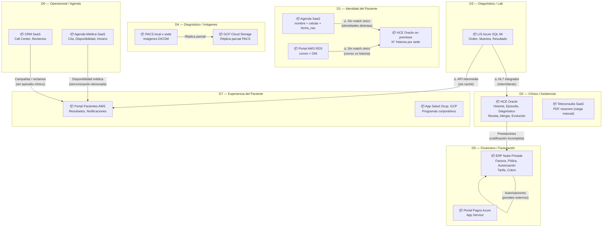
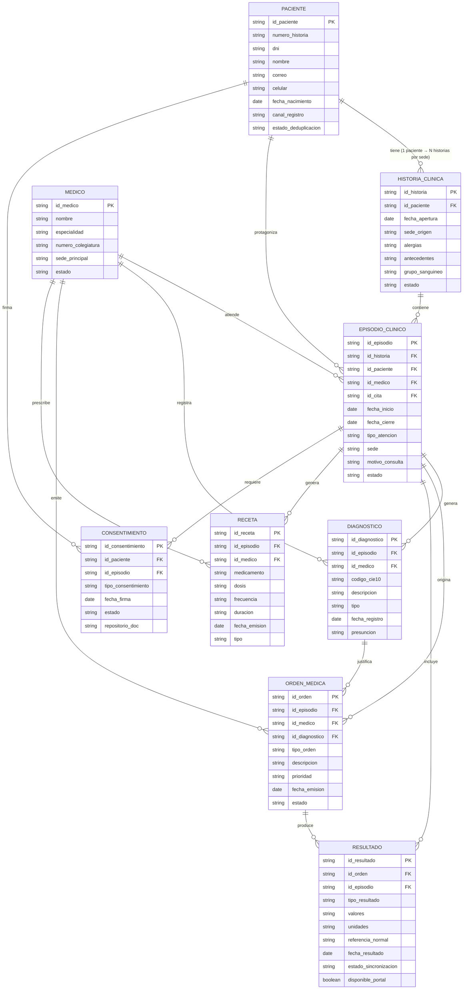
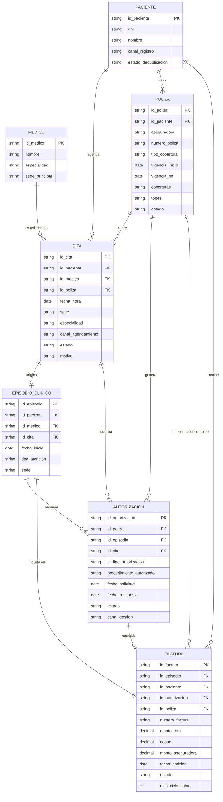
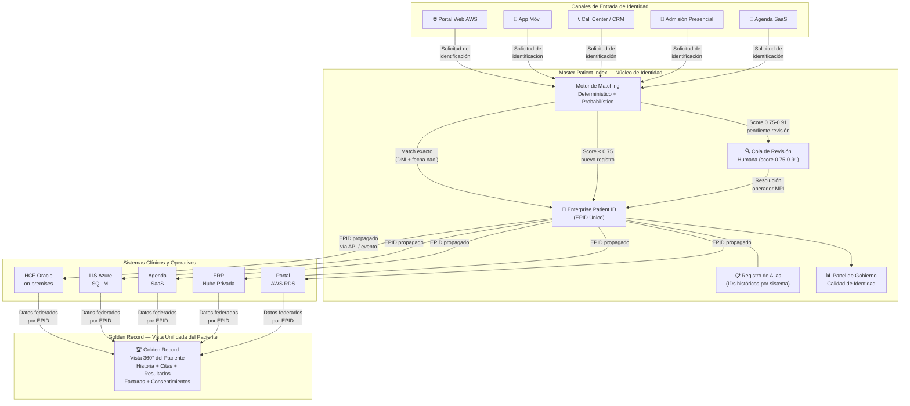
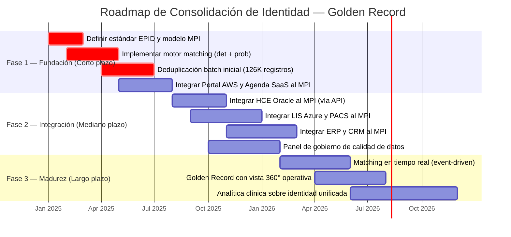

# Task 5: Arquitectura de Datos AS-IS vs TO-BE (ADM Fase C)
## Clínica SanaRed Integrada | Hito 1 — TOGAF ADM Fase C: Arquitectura de Datos

---

## Resumen Ejecutivo

Este entregable desarrolla la Arquitectura de Datos de SanaRed en sus dimensiones AS-IS y TO-BE,
siguiendo la Fase C del TOGAF ADM (Sistemas de Información — Datos). Se identifican siete
dominios de datos diferenciados con sus sistemas custodios actuales, se modela conceptualmente
el universo de trece entidades críticas mediante dos sub-diagramas de Entidad-Relación (ERD), y
se define la estrategia de consolidación de identidad del paciente (Golden Record / Master Patient
Index) para reducir los 126,000 registros duplicados en al menos un 80%.

La fragmentación de datos es el problema transversal más crítico de SanaRed: el mismo paciente
existe con identidades distintas en el portal AWS, la agenda SaaS y la HCE Oracle on-premises,
lo que compromete la seguridad clínica, la continuidad asistencial y la eficiencia financiera. El paso
de AS-IS a TO-BE en datos representa la palanca de mayor impacto para los siete objetivos
estratégicos del directorio.

---

## Sección 5.1: Mapa de Dominios de Datos

### 5.1.1 Tabla de Dominios de Datos — Sistema Custodio AS-IS

La siguiente tabla identifica los siete dominios de datos diferenciados de SanaRed, su sistema
custodio principal en el estado actual, los sistemas secundarios que acceden o generan datos en
ese dominio, y los problemas de integridad o fragmentación detectados.

| # | Dominio de Datos | Sistema Custodio AS-IS | Sistemas Secundarios (acceso/generación) | Problema AS-IS Detectado |
|---|---|---|---|---|
| D1 | **Identidad del Paciente** | HCE Oracle on-premises (N° de historia por sede) | Portal AWS (correo + DNI), Agenda SaaS (nombre + celular + fecha nac.), Admisión local, CRM SaaS | 126,000 registros duplicados; un paciente puede tener hasta 3 identidades distintas por canal |
| D2 | **Clínico / Asistencial** | HCE Oracle on-premises (historia, episodios, diagnósticos, recetas, alergias) | Teleconsulta SaaS (PDF manual), App Móvil (terceros), Admisión local | Sin vista longitudinal; resultados de otras sedes no siempre disponibles en el momento de la atención |
| D3 | **Diagnóstico — Laboratorio** | LIS Azure SQL Managed Instance (órdenes, muestras, resultados de lab) | HCE Oracle (integración HL7 intermitente), Portal AWS (API intermedia), Historia clínica | 9% de órdenes con demora; 18,600 resultados bloqueados durante caída del integrador HL7 en 11 horas |
| D4 | **Diagnóstico — Imágenes** | PACS local por sede (imágenes DICOM) | GCP Cloud Storage (réplica parcial), Visor web multi-sede | Sin vista unificada entre sedes; réplica parcial en GCP; radiólogos no acceden a imágenes de otras clínicas |
| D5 | **Financiero / Facturación** | ERP Nube Privada (facturas, autorizaciones, pólizas, tarifas, cobros) | HCE Oracle (prestaciones), Portal de Pagos Azure App Service, Portales externos aseguradoras | Ciclo de cobro promedio 17 días (hasta 35); 13% de expedientes observados por inconsistencias |
| D6 | **Operacional / Agenda** | Agenda Médica SaaS (citas, disponibilidad médica, horarios, sedes) | Portal AWS, App Móvil, Call Center / CRM SaaS, Admisión local | Cambios de disponibilidad tardan horas en propagarse; sincronización falló en campaña de influenza |
| D7 | **Experiencia del Paciente** | Portal Pacientes AWS (RDS) + CRM SaaS (campañas, reclamos, satisfacción) | App Móvil, App Salud Ocupacional GCP, Encuestas SaaS | Datos de satisfacción desconectados de episodios clínicos; 18% de mensajes con rebote o baja interacción |

### 5.1.2 Diagrama de Paisaje de Datos AS-IS

El diagrama muestra los siete dominios y sus sistemas custodios, con las dependencias y flujos de
datos inter-dominio que revelan la fragmentación actual. Los flujos marcados con `⚠️` representan
puntos de quiebre donde la integridad de datos no está garantizada.

---

## Sección 5.2: Modelo Conceptual de Datos — ERD

El modelo conceptual incluye las 13 entidades críticas del negocio de SanaRed. Dado que el
conjunto de relaciones supera 40, el ERD se divide en dos sub-diagramas complementarios que
comparten las entidades de enlace (Paciente, Episodio Clínico, Médico) para mantener consistencia.

> **Entidades compartidas entre sub-diagramas:** `PACIENTE`, `EPISODIO_CLINICO`, `MEDICO`

---

### 5.2.1 ERD Parte 1 — Núcleo Clínico y Asistencial

Cubre el flujo de atención: desde la identidad del paciente hasta el registro clínico, incluyendo
historia clínica, episodio, diagnóstico, orden médica, resultado, receta y consentimiento.

---

### 5.2.2 ERD Parte 2 — Administrativo, Financiero y Agenda

Cubre el flujo administrativo y financiero: desde la programación de la cita hasta la generación de
la factura, incluyendo la autorización de aseguradora y la póliza de cobertura.

---

## Sección 5.3: Estrategia TO-BE — Golden Record y Consolidación de Identidad del Paciente

### 5.3.1 Contexto del Problema AS-IS

| Indicador | Valor AS-IS | Impacto |
|---|---|---|
| Registros duplicados de pacientes | 126,000 | Riesgo clínico, facturas duplicadas, reclamos |
| Campos de match por canal | Portal: correo+DNI / Agenda: nombre+celular+fecha_nac / HCE: N° historia sede | Sin llave única común |
| Proceso de deduplicación actual | Manual, reportes mensuales | Reactivo, sin tiempo real |
| Casos con historia fragmentada en atención | Identificados (ej. paciente anticoagulado en emergencia) | Riesgo de seguridad del paciente |
| Resultados no asociados al episodio correcto | 9% de órdenes diagnósticas con demora | Reprocesos, costos, frustración |

### 5.3.2 Diseño de la Estrategia Golden Record (MPI — Master Patient Index)

La estrategia TO-BE se basa en tres pilares: **Identidad Única**, **Sincronización Confiable** y
**Gobierno de Datos Continuo**.

#### Pilar 1 — Master Patient Index (MPI) como Sistema de Registro de Identidad

- Se implementa un **MPI centralizado** que actúa como fuente de verdad para la identidad del paciente. Cada paciente recibe un **Enterprise Patient ID (EPID)** único en toda la red SanaRed.
- El EPID reemplaza progresivamente los identificadores locales (N° historia por sede, correo portal, ID agenda SaaS) como referencia cross-sistema.
- El MPI almacena todos los identificadores históricos como alias para garantizar trazabilidad y compatibilidad hacia atrás.

#### Pilar 2 — Motor de Matching Probabilístico + Determinístico

El proceso de deduplicación utiliza un motor de dos capas:

| Capa | Método | Campos clave | Acción |
|---|---|---|---|
| Determinística | Coincidencia exacta | DNI + fecha de nacimiento | Match automático → fusión de registros |
| Probabilística | Score Jaro-Winkler / Soundex | Nombre, celular, correo, dirección | Score ≥ 0.92 → fusión automática; 0.75–0.91 → revisión humana |
| Reglas de negocio | Dependientes familiares | Póliza + titular + relación | Registro vinculado, no fusionado |
| Exclusión | Falsos positivos | Nombres idénticos, fechas similares | Cola de revisión con evidencia |

#### Pilar 3 — Gobierno de Datos y Calidad Continua

- **Validación en el punto de entrada**: todos los canales (portal, agenda, admisión, call center) consultan el MPI antes de crear un nuevo registro. Si existe match, se reutiliza el EPID.
- **Panel de calidad de identidad**: dashboard operativo con tasa de duplicados, matches pendientes, registros sin DNI y evolución mensual.
- **SLA de resolución**: duplicados de alta prioridad (pacientes en emergencia, anticoagulados, crónicos) resueltos en < 2 horas; cola general en < 48 horas.

### 5.3.3 Diagrama de Flujo TO-BE — Golden Record

### 5.3.4 Metas y KPIs de la Estrategia Golden Record

| KPI | Línea Base AS-IS | Meta TO-BE (Año 1) | Meta TO-BE (Año 2) |
|---|---|---|---|
| Registros duplicados activos | 126,000 | ≤ 25,200 (−80%) | ≤ 5,000 (−96%) |
| % pacientes con EPID único | 0% | 75% | 99% |
| Tiempo de deduplicación (lote) | Mensual (manual) | Diario (automático) | Tiempo real (evento) |
| Tasa de match automático | 0% | ≥ 85% | ≥ 95% |
| Resultados asociados al episodio correcto | 91% (9% con demora) | 97% | 99.5% |
| Ciclo de facturación promedio | 17 días | 10 días | 7 días |
| Reclamos por inconsistencia de identidad | 7,900 / año | ≤ 2,000 / año | ≤ 500 / año |

### 5.3.5 Fases de Implementación del Golden Record

---

## Referencias al Marco TOGAF

| Componente TOGAF | Artefacto en este entregable |
|---|---|
| Fase C — Arquitectura de Sistemas de Información (Datos) | Mapa de Dominios, ERD Partes 1 y 2 |
| Architecture Vision (Fase A) | Problema de 126K duplicados como driver central |
| Requirements Management | Req. 5: Dominios, ERD 13 entidades, Golden Record |
| Data Principles | Unicidad de identidad, Calidad en la fuente, Trazabilidad |
| Transition Architecture | Roadmap Golden Record Fases 1–3 |
| Gap Analysis (Fase E) | KPI tabla AS-IS vs TO-BE por dominio de datos |
