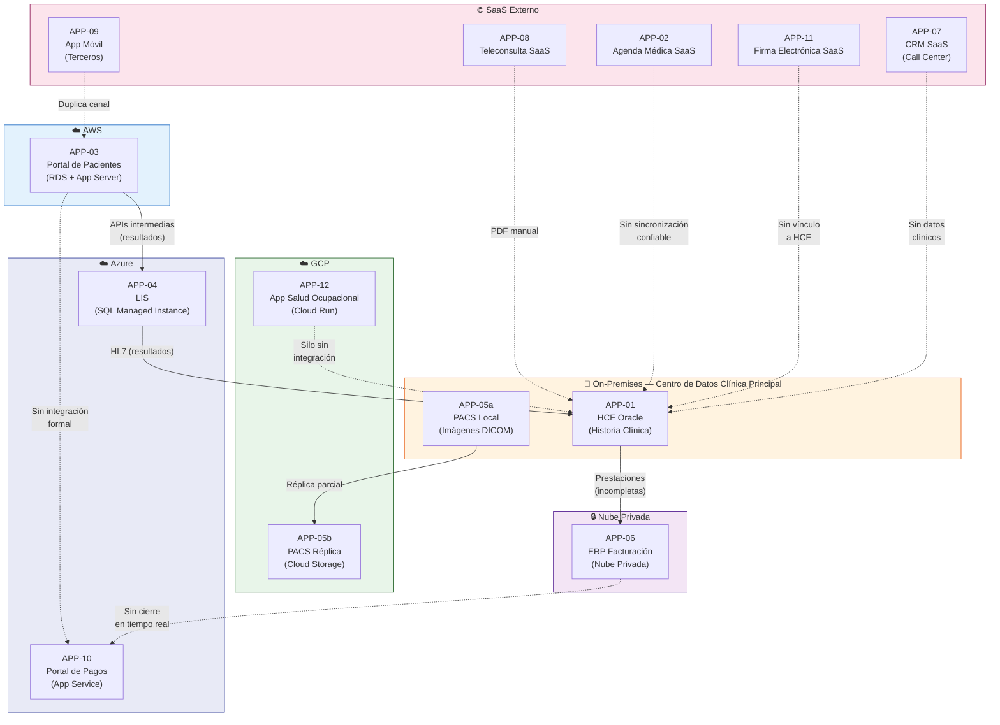
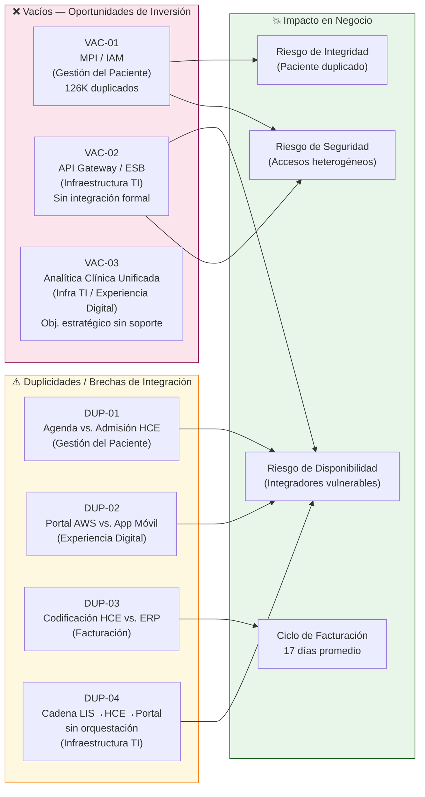

# Task 6: Portafolio de Aplicaciones (ADM Fase C)

> **Fase ADM:** C — Sistemas de Información (Arquitectura de Aplicaciones)
> **Artefactos:** Catálogo AS-IS de Aplicaciones · Diagrama de Portafolio · Matriz Aplicaciones vs. Capacidades · Análisis de Duplicidades y Vacíos
> **Fecha de referencia:** Hito 1 — Estado AS-IS

---

## Resumen Ejecutivo

El portafolio de aplicaciones de SanaRed Integrada está compuesto por 12 sistemas distribuidos en cinco ambientes de hosting (on-premises, AWS, Azure, GCP y SaaS externos). El análisis revela un ecosistema fragmentado: las aplicaciones crecieron por adquisición y contratación independiente, sin una capa de integración formal que orqueste el intercambio de datos. El cruce contra las 6 capacidades de Nivel 1 confirma **3 duplicidades críticas** (agenda/admisión, portal/app móvil para resultados, HCE/ERP en codificación de prestaciones) y **3 vacíos estructurales** (identidad del paciente/MPI, bus de integración/API Gateway y analítica clínica unificada) que representan las oportunidades de inversión prioritarias para el roadmap de transformación.

---

## 6.1 Catálogo del Portafolio de Aplicaciones AS-IS

| ID | Nombre del Sistema | Hosting / Nube | Función Principal | Capacidades que Soporta | Estado | Observaciones |
|---|---|---|---|---|---|---|
| APP-01 | HCE Oracle (Historia Clínica Electrónica) | On-premises — Centro de datos clínica principal | Registro y consulta de historia clínica, episodios clínicos, diagnósticos, alergias, recetas, órdenes médicas y evoluciones | Atención Clínica · Gestión del Paciente · Gestión Diagnóstica (parcial) · Facturación y Finanzas (codificación prestaciones) | **Activo / Core** | Sistema central y más crítico. Diseñado para atención presencial; sin soporte nativo para teleconsulta ni omnicanalidad. Integración HL7 hacia LIS, pero sin API REST estandarizada. |
| APP-02 | Agenda Médica SaaS | SaaS externo (proveedor cloud) | Gestión de citas, disponibilidad médica, programación por canal digital y presencial | Gestión del Paciente · Experiencia Digital | **Activo** | Duplica función de admisión con módulos locales de HCE en sedes antiguas. La sincronización de disponibilidad puede tardar horas. Maestro de médicos vive en ERP, no en la agenda. |
| APP-03 | Portal de Pacientes AWS | AWS (RDS + App Server) | Autogestión del paciente: consulta de citas, resultados de laboratorio, pagos online e historial | Gestión del Paciente · Gestión Diagnóstica (resultados) · Experiencia Digital · Facturación y Finanzas (pagos) | **Activo** | Duplica canales de consulta de citas y resultados con App Móvil (APP-09). Depende de APIs intermedias sin caché robusta para resultados. Caída de 4 horas en campaña corporativa impactó a 12,000 pacientes. |
| APP-04 | LIS — Azure SQL Managed Instance | Azure (SQL Managed Instance) | Gestión del ciclo completo de laboratorio: órdenes, toma de muestras, procesamiento, validación y entrega de resultados | Gestión Diagnóstica · Atención Clínica (resultados para médicos) | **Activo** | Integrado a HCE por HL7. Caída del integrador HL7 dejó 18,600 resultados sin publicar durante 11 horas. Sin failover documentado. |
| APP-05 | PACS Local por sede + réplica GCP | On-premises (PACS visor local) + GCP Cloud Storage (réplica parcial) | Almacenamiento, gestión y visualización de imágenes diagnósticas DICOM (radiografías, ecografías, tomografías, resonancias) | Gestión Diagnóstica | **Activo / Parcialmente Modernizado** | Infraestructura descentralizada por sede. La réplica en GCP es parcial y no garantiza disponibilidad completa inter-sede. Visor web disponible, pero sin integración profunda con HCE. |
| APP-06 | ERP Facturación — Nube Privada | Nube privada (proveedor local administrado) | Facturación, autorización de prestaciones, gestión de pólizas, tarifas, liquidaciones a aseguradoras y cuentas por cobrar | Facturación y Finanzas · Gestión del Paciente (pólizas/coberturas) | **Activo / Legacy funcional** | Ciclo de cobro promedio de 17 días (hasta 35 en algunos convenios). Recibe prestaciones de HCE con codificación incompleta. Duplica función de codificación de prestaciones con HCE. Maestro de médicos y tarifas residen aquí. |
| APP-07 | CRM SaaS — Call Center y Campañas | SaaS externo | Gestión de interacciones de call center, campañas de marketing y salud, registro de reclamos y seguimiento de pacientes | Experiencia Digital · Gestión del Paciente (contacto) | **Activo** | Desconectado de episodios clínicos y operaciones de sede. Operadores ven datos del CRM pero no historial clínico en tiempo real. Los datos de satisfacción no se correlacionan con episodios. |
| APP-08 | Teleconsulta SaaS | SaaS externo | Atención médica virtual, videoconferencia clínica, generación de resumen de consulta en PDF | Atención Clínica · Experiencia Digital | **Activo** | El resumen PDF se carga manualmente a HCE por el médico. Sin integración automática. No genera recetas electrónicas estructuradas en HCE. |
| APP-09 | App Móvil (desarrollada por terceros) | Mobile / SaaS (terceros) | Acceso del paciente a citas, resultados, notificaciones y autogestión desde dispositivo móvil | Experiencia Digital · Gestión del Paciente · Gestión Diagnóstica (resultados) | **Activo** | Duplica funcionalidad de Portal de Pacientes AWS (APP-03). Desarrollada por terceros; ciclos de actualización no alineados con roadmap interno. |
| APP-10 | Portal de Pagos — Azure App Service | Azure (App Service) | Gestión de cobros, comprobantes electrónicos, procesamiento de pagos online | Facturación y Finanzas · Experiencia Digital | **Activo** | Integrado parcialmente con Portal de Pacientes AWS. Sin integración directa con ERP para cierre de ciclo de facturación en tiempo real. |
| APP-11 | Repositorio de Firma Electrónica SaaS | SaaS externo | Almacenamiento y validación de consentimientos digitales firmados por pacientes | Atención Clínica (consentimientos) · Infraestructura y Operaciones TI (cumplimiento legal) | **Activo** | Sin integración directa con HCE. Permisos de acceso a documentos se gestionan por sede/área, no por identidad consolidada del paciente. Riesgo de auditoría por correlación difícil. |
| APP-12 | App Salud Ocupacional — GCP | GCP (App Engine / Cloud Run) | Gestión de programas corporativos de salud, chequeos preventivos, cohortes empresariales y reportes a empresas cliente | Experiencia Digital · Atención Clínica (preventiva) · Gestión del Paciente (corporativo) | **Activo** | Silo corporativo sin integración con HCE ni con portal principal. Datos de salud ocupacional no alimentan la vista longitudinal del paciente. |

---

## 6.2 Diagrama del Portafolio de Aplicaciones

El diagrama agrupa los 12 sistemas por dominio de hosting, mostrando las integraciones existentes (líneas sólidas) y las ausencias de integración formal (líneas punteadas donde debería existir).

**Leyenda:** Líneas sólidas = integración formal existente · Líneas punteadas = integración ausente o manual

---

## 6.3 Matriz de Aplicaciones vs. Capacidades de Negocio

**Convenciones de la matriz:**

| Símbolo | Significado |
|---|---|
| ✅ | Soporte directo — la aplicación cubre esta capacidad de forma nativa |
| ⚠️ | Duplicidad o brecha de integración — la capacidad es soportada por más de un sistema sin integración formal, o existe soporte parcial con riesgo operativo |
| ❌ | Vacío — ninguna aplicación cubre esta capacidad; se documenta como oportunidad de inversión |

| ID | Sistema | Gestión del Paciente | Atención Clínica | Gestión Diagnóstica | Facturación y Finanzas | Experiencia Digital | Infraestructura y Operaciones TI |
|---|---|:---:|:---:|:---:|:---:|:---:|:---:|
| APP-01 | HCE Oracle On-Premises | ⚠️ | ✅ | ⚠️ | ⚠️ | | |
| APP-02 | Agenda Médica SaaS | ⚠️ | | | | ✅ | |
| APP-03 | Portal de Pacientes AWS | ⚠️ | | ⚠️ | ✅ | ⚠️ | |
| APP-04 | LIS Azure SQL MI | | ✅ | ✅ | | | |
| APP-05 | PACS Local + GCP réplica | | | ✅ | | | |
| APP-06 | ERP Facturación — Nube Privada | ⚠️ | | | ✅ | | |
| APP-07 | CRM SaaS | ⚠️ | | | | ✅ | |
| APP-08 | Teleconsulta SaaS | | ⚠️ | | | ✅ | |
| APP-09 | App Móvil (terceros) | ⚠️ | | ⚠️ | | ⚠️ | |
| APP-10 | Portal de Pagos Azure | | | | ✅ | ⚠️ | |
| APP-11 | Firma Electrónica SaaS | | ⚠️ | | | | ⚠️ |
| APP-12 | App Salud Ocupacional GCP | ⚠️ | ⚠️ | | | ✅ | |
| *(vacío)* | **IAM / MPI — Gestión de Identidad** | ❌ | | | | | |
| *(vacío)* | **API Gateway / ESB — Bus de Integración** | | | | | | ❌ |
| *(vacío)* | **Plataforma de Analítica Clínica Unificada** | | | | | ❌ | ❌ |

---

## 6.4 Análisis de Duplicidades y Vacíos

### 6.4.1 Duplicidades y Brechas de Integración Identificadas

---

#### DUP-01 · Gestión de Agenda y Admisión — APP-01 (HCE) vs. APP-02 (Agenda SaaS)

**Capacidad afectada:** Gestión del Paciente

**Descripción:** Las sedes antiguas de SanaRed operan módulos locales de admisión integrados directamente con la HCE Oracle para gestionar citas y registro de llegada del paciente. En paralelo, la Agenda SaaS es el canal principal de programación digital. Ambos sistemas mantienen registros de disponibilidad médica y citas sin sincronización confiable ni tiempo real. El maestro de médicos reside en el ERP (APP-06), lo que agrega un tercer punto de verdad sobre disponibilidad.

**Impacto operativo:**
- Sincronización de disponibilidad puede demorar horas, causando dobles turnos o slots fantasma.
- En la campaña de influenza, 18,000 citas cargadas por lote fallaron en dos centros médicos: pacientes llegaron a horarios inexistentes.
- El 4% de citas genera reclamo por errores de horario, sede o cobertura (aprox. 6,240 reclamos/mes sobre 156,000 citas).

**Acción recomendada TO-BE:** Consolidar la función de agenda/admisión en una plataforma única con API de disponibilidad en tiempo real, federar el maestro de médicos desde el ERP como sistema de registro (SoR) único.

---

#### DUP-02 · Consulta de Resultados y Citas — APP-03 (Portal AWS) vs. APP-09 (App Móvil)

**Capacidad afectada:** Experiencia Digital · Gestión Diagnóstica

**Descripción:** El Portal de Pacientes en AWS y la App Móvil desarrollada por terceros exponen las mismas funcionalidades al paciente: consulta de citas, visualización de resultados de laboratorio e imágenes, y pagos. Son canales redundantes sin una capa de API unificada que los gobierne. Cada canal consume datos de forma independiente, con diferentes SLA de actualización y distintas experiencias de usuario.

**Impacto operativo:**
- Los ciclos de actualización de la App Móvil no están alineados con el roadmap interno, generando desfases en funcionalidades disponibles.
- Cualquier cambio en los datos de backend (resultados, citas) debe mantenerse consistente en dos clientes, duplicando el esfuerzo de pruebas y despliegues.
- El 18% de mensajes enviados tuvo rebote o baja interacción, en parte porque los pacientes no tienen un canal preferido claro.

**Acción recomendada TO-BE:** Centralizar la capa de API (API Gateway) que ambos canales consuman; decidir si la App Móvil pasa a ser el canal principal digital o se mantiene como complemento del portal, con paridad de funcionalidades gobernada centralmente.

---

#### DUP-03 · Codificación de Prestaciones — APP-01 (HCE) vs. APP-06 (ERP)

**Capacidad afectada:** Facturación y Finanzas · Atención Clínica

**Descripción:** La codificación de prestaciones (diagnósticos CIE-10, procedimientos, tarifas) ocurre parcialmente en la HCE al momento del registro clínico y se retrabaja o completa en el ERP durante el proceso de facturación. No existe un flujo automatizado y completo que garantice que la codificación clínica de HCE se traspase íntegramente al ERP con los códigos correctos de tarifario.

**Impacto operativo:**
- El 13% de expedientes se observa por documentación incompleta o inconsistencia entre diagnóstico, procedimiento y autorización.
- El ciclo promedio de cobro es de 17 días (hasta 35 en algunos convenios); se acumularon USD 1.8M pendientes en un convenio corporativo por discrepancias de codificación.
- Auditoría médica consume tiempo revisando y corrigiendo manualmente lo que debería llegar estructurado desde la atención clínica.

**Acción recomendada TO-BE:** Establecer una interfaz de prestaciones estandarizada (FHIR/HL7) entre HCE y ERP. Definir HCE como SoR de la codificación clínica y ERP como SoR del proceso financiero, eliminando la recodificación manual.

---

#### DUP-04 · Integración sin Orquestación — APP-04 (LIS) ↔ APP-01 (HCE) ↔ APP-03 (Portal)

**Capacidad afectada:** Infraestructura y Operaciones TI · Gestión Diagnóstica

**Descripción:** Los resultados de laboratorio recorren un camino punto a punto: LIS (Azure) → integrador HL7 → HCE (on-premises) → APIs intermedias → Portal (AWS). Cada enlace es un punto único de falla sin orquestación central, monitoreo unificado ni manejo de reintentos estandarizado. Se trata de una brecha de integración estructural más que una duplicidad de función.

**Impacto operativo:**
- Una caída del integrador HL7 dejó 18,600 resultados pendientes durante 11 horas.
- El 9% de órdenes diagnósticas presentó demora en disponibilidad de resultados en la historia clínica.
- El 22% del volumen mensual del call center corresponde a consultas por resultados no disponibles.
- No existe monitoreo centralizado de la cadena LIS → HCE → Portal.

**Acción recomendada TO-BE:** Implementar un API Gateway / ESB (vacío identificado abajo) con cola de mensajería tolerante a fallos, idempotencia y dashboard de monitoreo de interfaces clínicas.

---

### 6.4.2 Vacíos — Oportunidades de Inversión

---

#### VAC-01 · Gestión de Identidad del Paciente (MPI / IAM)

**Capacidad afectada:** Gestión del Paciente

**Descripción:** No existe ninguna aplicación en el portafolio que cumpla la función de Master Patient Index (MPI) o Identity and Access Management (IAM) centralizado para pacientes. Cada sistema (Portal AWS, Agenda SaaS, HCE on-premises, CRM) crea y mantiene su propio registro de paciente con identificadores distintos: correo electrónico, número de historia clínica por sede, DNI, número de celular o combinaciones de estos.

**Evidencia del impacto:**
- 126,000 registros potencialmente duplicados de pacientes identificados en auditoría.
- La deduplicación se ejecuta de forma manual por reportes mensuales, sin proceso automatizado.
- Un paciente anticoagulado ingresó por emergencia; el antecedente en otra sede no apareció oportunamente por diferencia de identificador. El incidente encendió alertas sobre continuidad asistencial y seguridad del paciente.
- La correlación de accesos a datos clínicos para auditoría requiere consultar logs separados de al menos 5 sistemas distintos.

**Oportunidad de inversión:** Plataforma MPI / Golden Record que unifique identidad del paciente con un identificador único, soporte deduplicación automática y sirva como fuente de verdad para todos los sistemas del portafolio.

---

#### VAC-02 · Bus de Integración / API Gateway (ESB / iPaaS)

**Capacidad afectada:** Infraestructura y Operaciones TI

**Descripción:** No existe una capa de integración formal (API Gateway, ESB o iPaaS) que orqueste el intercambio de datos entre las aplicaciones del portafolio. Las integraciones actuales son punto a punto, heterogéneas (HL7, APIs intermedias ad hoc, batch, manual vía PDF) y sin gobernanza centralizada. Esto convierte cada nueva integración en un proyecto independiente con su propia lógica de transformación, autenticación y manejo de errores.

**Evidencia del impacto:**
- Caídas del integrador HL7 afectan simultáneamente la disponibilidad de resultados en HCE, Portal y App Móvil sin notificación proactiva.
- Los resúmenes de Teleconsulta SaaS se cargan manualmente a HCE (PDF), sin trazabilidad estructurada.
- Los datos de Firma Electrónica no se correlacionan con episodios clínicos en HCE.
- La App Salud Ocupacional opera como silo sin alimentar la vista longitudinal del paciente.
- No hay visibilidad operativa del estado de las interfaces clínicas en tiempo real.

**Oportunidad de inversión:** Implementación de API Gateway / Bus de Servicios (ej. Azure API Management, AWS API Gateway + EventBridge, o solución iPaaS) como capa transversal de integración con soporte para HL7 FHIR, REST, eventos y monitoreo centralizado.

---

#### VAC-03 · Plataforma de Analítica Clínica y Operativa Unificada

**Capacidad afectada:** Infraestructura y Operaciones TI · Experiencia Digital

**Descripción:** No existe ninguna plataforma de analítica clínica o Business Intelligence unificada en el portafolio. Los datos clínicos, operativos y de experiencia del paciente están distribuidos en múltiples sistemas (HCE on-premises, LIS Azure, PACS GCP, CRM SaaS, ERP nube privada) sin un data warehouse o data lakehouse que los consolide para análisis.

**Evidencia del impacto:**
- Los datos de satisfacción del CRM no se conectan con episodios clínicos ni con operaciones de sede.
- SanaRed tiene datos suficientes para anticipar demanda, personalizar seguimiento y mejorar calidad clínica, pero sus sistemas no permiten una visión coherente.
- El objetivo estratégico #7 (analítica clínica y operativa para gestionar demanda, ocupación, tiempos, calidad asistencial y costos por episodio) no tiene ningún sistema que lo soporte actualmente.
- Los reclamos por comunicaciones contradictorias crecieron 34% en el último año, síntoma de decisiones tomadas sin datos consolidados.

**Oportunidad de inversión:** Plataforma de analítica clínica unificada (Data Lakehouse multinube con capa semántica) que integre fuentes de HCE, LIS, PACS, ERP, CRM y canales digitales para soporte de decisiones clínicas, operativas y estratégicas.

---

### 6.4.3 Resumen Ejecutivo de Hallazgos

| Hallazgo | Tipo | Capacidad Afectada | Riesgo Asociado (Anexo 3b) | Prioridad |
|---|---|---|---|---|
| DUP-01 Agenda vs. Admisión HCE | Duplicidad | Gestión del Paciente | Integridad · Disponibilidad | **Alta** |
| DUP-02 Portal AWS vs. App Móvil | Brecha de integración | Experiencia Digital | Disponibilidad | Media |
| DUP-03 Codificación HCE vs. ERP | Duplicidad | Facturación y Finanzas | Integridad | **Alta** |
| DUP-04 Cadena LIS→HCE→Portal sin orquestación | Brecha de integración | Infraestructura y Operaciones TI | Disponibilidad · Integridad | **Alta** |
| VAC-01 MPI / IAM — Gestión de Identidad | Vacío | Gestión del Paciente | Seguridad · Integridad | **Alta** |
| VAC-02 API Gateway / ESB | Vacío | Infraestructura y Operaciones TI | Disponibilidad · Seguridad | **Alta** |
| VAC-03 Analítica Clínica Unificada | Vacío | Infraestructura TI · Experiencia Digital | Estratégico | Media |

---

*Documento generado como parte del Hito 1 de Arquitectura Empresarial — Clínica SanaRed Integrada. Siguiendo el marco TOGAF ADM Fase C — Arquitectura de Aplicaciones.*
