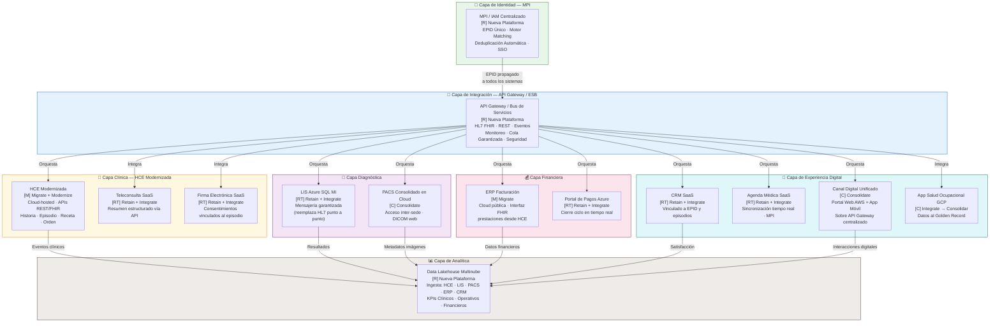
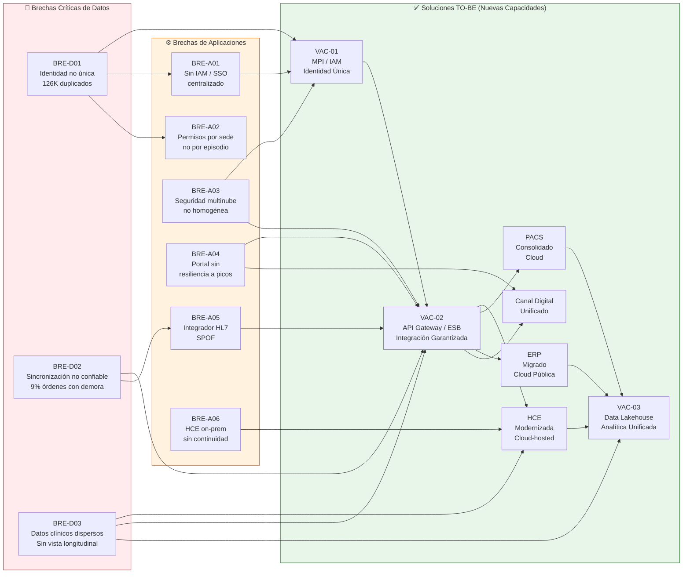

# Task 7: Brechas de Datos y Aplicaciones (ADM Fase C)

> **Fase ADM:** C — Sistemas de Información (Arquitectura de Datos y Aplicaciones — Gap Analysis)
> **Artefactos:** Análisis de Brechas de Datos · Brechas por Riesgo Tecnológico · Visión TO-BE Conceptual · Tabla AS-IS vs TO-BE por Dominio
> **Fecha de referencia:** Hito 1 — Transición AS-IS → TO-BE
> **Referencias:** Task 5 (7 dominios de datos, ERD, Golden Record) · Task 6 (12 aplicaciones, DUP-01..04, VAC-01..03) · Anexo 3b (3 riesgos tecnológicos)

---

## Resumen Ejecutivo

El análisis de brechas de la Fase C revela que SanaRed Integrada opera con tres carencias
estructurales que atraviesan todos los dominios de datos y la totalidad del portafolio de
aplicaciones: **ausencia de identidad única del paciente** (126,000 registros duplicados),
**falta de sincronización confiable de resultados diagnósticos** (9% de órdenes con demora,
18,600 resultados bloqueados en un solo incidente) y **dispersión de datos clínicos sin vista
longitudinal** (historia fragmentada por sede y canal). Estas brechas se manifiestan en los tres
riesgos tecnológicos prioritarios del Anexo 3b: Seguridad, Integridad y Disponibilidad.

La transición TO-BE se organiza en torno a siete capas conceptuales en la nube: Identidad (MPI),
Integración (API Gateway), Clínica (HCE modernizada), Diagnóstica, Financiera, Experiencia
Digital y Analítica. Cada sistema del portafolio actual recibe una disposición: **Migrate**,
**Consolidate**, **Replace** o **Retain**, priorizando las iniciativas de mayor impacto en
seguridad del paciente, continuidad asistencial y eficiencia financiera.

---

## 7.1 Brechas Críticas de Datos

Las tres brechas de datos identificadas son transversales a los siete dominios documentados en
Task 5. Cada una compromete directamente los objetivos estratégicos del directorio de SanaRed.

| ID Brecha | Descripción AS-IS | Impacto en Negocio | Sistema(s) Afectado(s) | Prioridad |
|---|---|---|---|---|
| **BRE-D01** | **Ausencia de identidad única del paciente.** Cada canal crea su propio registro: Portal AWS usa correo + DNI; Agenda SaaS usa nombre + celular + fecha de nacimiento; HCE Oracle usa N° de historia por sede. No existe un identificador empresarial único (EPID) ni un Master Patient Index (MPI). La deduplicación se ejecuta manualmente en reportes mensuales. | 126,000 registros potencialmente duplicados. Un paciente anticoagulado en emergencia no obtuvo sus antecedentes oportunamente por diferencia de identificador. 7,900 reclamos anuales por problemas de identidad/agenda. Riesgo de seguridad del paciente y auditoría de accesos imposible sin identidad correlacionada. | HCE Oracle (on-prem) · Portal AWS · Agenda SaaS · Admisión local · CRM SaaS | **CRÍTICA** |
| **BRE-D02** | **Falta de sincronización confiable de resultados diagnósticos.** Los resultados del LIS (Azure SQL MI) llegan a la HCE vía integrador HL7 punto a punto, sin cola tolerante a fallos ni monitoreo centralizado. El Portal AWS consume resultados por APIs intermedias sin caché robusta. Cuando el integrador falla, los resultados existen en laboratorio pero no están disponibles para médicos ni pacientes. | 9% de órdenes diagnósticas con demora en disponibilidad. Caída del integrador HL7 bloqueó 18,600 resultados durante 11 horas. 22% del volumen del call center son consultas por resultados no disponibles. Médicos repiten exámenes por no ver resultados previos, incrementando costos y exposición del paciente. | LIS Azure SQL MI · HCE Oracle · Integrador HL7 · Portal Pacientes AWS · APIs intermedias | **CRÍTICA** |
| **BRE-D03** | **Datos clínicos dispersos sin vista longitudinal.** Historia clínica, resultados de laboratorio, imágenes DICOM, resúmenes de teleconsulta (PDF manual) y datos de salud ocupacional viven en sistemas distintos sin un modelo federado de datos del paciente. No existe una vista 360° que consolide episodios de todas las sedes y canales. | 14% de episodios tuvo alguna orden diagnóstica; de esos, 9% con demora. Teleconsulta genera PDFs que se cargan manualmente a HCE (sin trazabilidad estructurada). App Salud Ocupacional es un silo sin integración con HCE ni portal. El 13% de expedientes se observa en facturación por documentación incompleta derivada de la dispersión clínica. Imposible alcanzar el Objetivo Estratégico 2 (vista longitudinal para el 90% de pacientes). | HCE Oracle · LIS Azure · PACS Local · Teleconsulta SaaS · App Salud Ocupacional GCP · Firma Electrónica SaaS | **CRÍTICA** |

---

## 7.2 Brechas de Aplicaciones Alineadas a los 3 Riesgos del Anexo 3b

### 7.2.1 Riesgo 1 — Seguridad: Privacidad Clínica en Ecosistema Distribuido

*Categoría:* Seguridad · *Prioridad Anexo 3b:* 1

| Descripción del Riesgo AS-IS | Sistemas Involucrados | Impacto Cuantificado | Brecha Identificada |
|---|---|---|---|
| Un mismo paciente puede tener registros activos en Portal AWS, Agenda SaaS y HCE Oracle con identidades distintas. Los operadores de call center acceden al CRM SaaS, admisión a la HCE, laboratorio al LIS en Azure y radiología al PACS local. Cada plataforma gestiona sus propios roles y perfiles sin identidad federada. | HCE Oracle (on-prem) · Portal AWS · Agenda SaaS · CRM SaaS · Azure App Service · LIS Azure SQL · PACS locales · Repositorio Firma Electrónica SaaS | Auditoría requiere consultar logs separados de al menos 5 sistemas para reconstruir quién accedió a un resultado sensible. Un médico afiliado que rota entre sedes puede conservar permisos más amplios de lo necesario. Acceso indebido difícil de detectar de forma temprana. Reclamos por comunicaciones contradictorias crecieron 34% en el último año. | **BRE-A01 · Ausencia de IAM / SSO centralizado:** No existe Single Sign-On ni Identity and Access Management (IAM) unificado para colaboradores. Los roles y perfiles se gestionan de forma independiente en cada sistema, impidiendo el principio de mínimo privilegio y la correlación de auditoría entre plataformas. El vacío VAC-01 (MPI) y la ausencia de IAM corporativo son la raíz de este riesgo. |
| Los adjuntos PDF de teleconsulta, resultados y consentimientos quedan almacenados en repositorios donde los permisos se heredan por sede o área, no por identidad consolidada del paciente ni por episodio clínico. | Teleconsulta SaaS · Repositorio Firma Electrónica SaaS · PACS GCP réplica · HCE Oracle | Imposibilidad de correlación de accesos para auditoría regulatoria. Sin trazabilidad de quién consultó qué dato clínico a través de qué sistema. Riesgo de fuga de datos sensibles sin detección temprana. | **BRE-A02 · Permisos por sede/área en lugar de por identidad y episodio:** Los repositorios de documentos clínicos (firma electrónica, PACS, teleconsulta) no vinculan el acceso al episodio clínico ni al EPID del paciente. Se requiere una capa de autorización basada en contexto clínico (episodio + rol + paciente). |
| Los datos clínicos sensibles están distribuidos en múltiples nubes (AWS, Azure, GCP, on-premises) y proveedores SaaS externos, sin una política de seguridad homogénea ni un centro de operaciones de seguridad (SOC) unificado. | HCE Oracle (on-prem) · Portal AWS · LIS Azure · PACS GCP · CRM SaaS · Teleconsulta SaaS · ERP Nube Privada | Sin visibilidad unificada del estado de seguridad de datos clínicos. Cada proveedor SaaS aplica su propia política de cifrado, retención y acceso. Cumplimiento regulatorio fragmentado. | **BRE-A03 · Política de seguridad multinube no homogénea:** Ausencia de una capa de gobernanza de seguridad que unifique el control de datos clínicos a través de todas las nubes y proveedores SaaS. Necesidad de un framework de seguridad cero-confianza (Zero Trust) como base del TO-BE. |

---

### 7.2.2 Riesgo 2 — Integridad: Paciente Duplicado y Continuidad Asistencial Incompleta

*Categoría:* Integridad · *Prioridad Anexo 3b:* 2

| Descripción del Riesgo AS-IS | Sistemas Involucrados | Impacto Cuantificado | Brecha Identificada |
|---|---|---|---|
| No existe un MPI ni un identificador único del paciente. El portal, la agenda, la HCE y el call center crean registros con campos de matching distintos (DNI, correo, celular, nombre, N° historia por sede). La deduplicación es manual y mensual. | HCE Oracle · Agenda SaaS · Portal Pacientes AWS · Admisión local · CRM SaaS | 126,000 registros potencialmente duplicados. En emergencia, un paciente anticoagulado tuvo dos historias activas: una con antecedentes y medicación, otra con la admisión actual. El médico no vio oportunamente el resultado cargado en otra sede. | **BRE-D01 (cross-referencia) · VAC-01 MPI:** Ausencia total de Master Patient Index. El vacío VAC-01 identificado en Task 6 es la brecha primaria de integridad del portafolio. Sin MPI, ninguna iniciativa de continuidad asistencial puede garantizarse. |
| El LIS en Azure envía resultados a HCE vía integrador HL7 punto a punto. Cuando el integrador falla o hay diferencia de identificador, los resultados no se asocian al episodio correcto ni al paciente correcto. No existe idempotencia ni reintentos automáticos. | LIS Azure SQL MI · HCE Oracle on-prem · Integrador HL7 · Portal Pacientes AWS | 9% de órdenes diagnósticas con demora. 18,600 resultados bloqueados durante 11 horas en un solo incidente. El área clínica operó con llamadas y capturas manuales. Riesgo de atención basada en información incompleta. | **BRE-D02 (cross-referencia) · DUP-04 sin orquestación:** La cadena LIS → HCE → Portal carece de un bus de mensajería con garantías de entrega, idempotencia y reintento. El vacío VAC-02 (API Gateway/ESB) es la solución estructural para esta brecha. |
| Los resúmenes de teleconsulta se cargan manualmente como PDF a la HCE. Los datos de salud ocupacional (App GCP) no alimentan la HCE ni el portal. Los consentimientos digitales (Firma Electrónica SaaS) no están vinculados al episodio clínico en HCE. | Teleconsulta SaaS · App Salud Ocupacional GCP · Repositorio Firma Electrónica SaaS · HCE Oracle | Vista clínica longitudinal inexistente para el 100% de pacientes con atenciones en múltiples canales. El 14% de episodios con orden diagnóstica tuvo problemas de disponibilidad de resultados. Los silos impiden alcanzar el Objetivo Estratégico 2. | **BRE-D03 (cross-referencia) · Silos sin integración estructural:** Teleconsulta, Salud Ocupacional y Firma Electrónica son islas de datos clínicos sin conexión con el núcleo HCE. Se requiere una arquitectura de integración (VAC-02) y un modelo FHIR de datos clínicos para unificar la vista del paciente. |

---

### 7.2.3 Riesgo 3 — Disponibilidad: Canales e Integradores Clínicos Vulnerables a Picos

*Categoría:* Disponibilidad · *Prioridad Anexo 3b:* 3

| Descripción del Riesgo AS-IS | Sistemas Involucrados | Impacto Cuantificado | Brecha Identificada |
|---|---|---|---|
| El Portal de Pacientes en AWS consume APIs intermedias sin caché robusta para mostrar resultados. La base RDS escala en lectura, pero el servicio que consulta estados de resultado depende de una API sin caché y de un enlace hacia sistemas intermitentes. Durante campañas, el portal recibe picos de descarga que saturan la cadena. | Portal Pacientes AWS · APIs intermedias · LIS Azure · Integrador HL7 · HCE Oracle on-prem | Caída de 4 horas durante campaña corporativa: 12,000 pacientes no pudieron descargar documentos. Portal respondió con errores; call center escaló tickets; laboratorio envió PDFs por correo para casos urgentes. Indisponibilidad visible en redes sociales. | **BRE-A04 · Portal sin resiliencia a picos:** Arquitectura de portal sin caché de resultados, sin CDN para documentos y sin degradación elegante ante fallos de backend. El API Gateway (VAC-02) con caché y rate limiting es la solución estructural. |
| El integrador HL7 entre LIS (Azure) y HCE (on-premises) es un punto único de falla sin monitoreo centralizado, sin cola de mensajería tolerante a fallos ni procedimiento de contingencia documentado para personal clínico. | LIS Azure SQL MI · Integrador HL7 · HCE Oracle on-prem · Portal Pacientes AWS · App Móvil | Caída del integrador HL7 bloqueó 18,600 resultados durante 11 horas. Call center solo podía ver el estado del portal, no la cola técnica del integrador. 22% del volumen mensual del call center son consultas por resultados no disponibles. | **BRE-A05 · Integrador HL7 como punto único de falla (SPOF):** Sin tolerancia a fallos, sin reintento automático, sin dead-letter queue y sin dashboard operativo de interfaces clínicas. El bus de integración (VAC-02) debe reemplazar este patrón punto a punto con mensajería garantizada. |
| La conectividad entre sedes y el centro de datos es variable. Las sedes pequeñas dependen de un enlace único hacia HCE on-premises. En febrero, una caída de conectividad entre dos sedes obligó a registrar 1,400 admisiones en formularios temporales, generando 260 inconsistencias al migrar. | HCE Oracle on-prem · Admisión local · Conectividad de sedes · Portal Pagos Azure | 1,400 admisiones en contingencia; 260 inconsistencias entre paciente, cobertura y episodio; facturas observadas semanas después. La disponibilidad del sistema de admisión depende de un único datacenter on-premises sin RTO/RPO documentado. | **BRE-A06 · Dependencia de conectividad on-premises sin plan de continuidad:** HCE on-premises carece de modo offline o réplica de lectura local para sedes remotas. La migración / modernización de HCE con hosting en nube y capacidad de operación degradada es condición del TO-BE. |

---

## 7.3 Visión Conceptual TO-BE — Arquitectura Futura en la Nube

### 7.3.1 Narrativa de Transición

La arquitectura futura de SanaRed se organiza en torno a un principio rector: **el paciente como
eje único de todos los sistemas**. La transición del AS-IS fragmentado al TO-BE integrado requiere
actuar sobre cuatro frentes simultáneos:

**1. Unificar la identidad** — Antes de modernizar cualquier aplicación, SanaRed debe establecer
el MPI (Master Patient Index) como capa fundacional. Sin identidad única, ninguna integración
puede garantizar integridad. El MPI emite el EPID (Enterprise Patient ID) que todos los sistemas
downstream consumen como llave maestra.

**2. Reemplazar la integración punto a punto** — El integrador HL7 y las APIs intermedias
ad hoc se sustituyen por una capa de API Gateway / Bus de Servicios empresarial (ESB/iPaaS)
con soporte para HL7 FHIR, REST, mensajería garantizada y monitoreo centralizado de interfaces
clínicas. Esta capa desacopla productores de consumidores y elimina los puntos únicos de falla.

**3. Modernizar y consolidar aplicaciones clínicas** — La HCE Oracle on-premises se migra a
una plataforma HCE modernizada en la nube (cloud-native o cloud-hosted), conservando los datos
históricos y habilitando APIs REST/FHIR nativas. El portal web y la app móvil se consolidan sobre
una capa de API unificada. Las duplicidades DUP-01 a DUP-04 se resuelven eliminando los silos.

**4. Añadir las capacidades faltantes** — Los vacíos VAC-01 (MPI), VAC-02 (API Gateway) y
VAC-03 (Analítica Clínica) se incorporan como nuevas plataformas nativas del portafolio TO-BE.

#### Disposición de Sistemas por Acción de Transición

| Sistema | Acción TO-BE | Justificación |
|---|---|---|
| HCE Oracle on-premises (APP-01) | **Migrate → Modernize** | Migrar a plataforma HCE cloud-hosted; exponer APIs REST/FHIR; eliminar dependencia de datacenter físico |
| Agenda Médica SaaS (APP-02) | **Retain → Integrate** | Mantener SaaS de agenda, pero integrar vía API Gateway al MPI y HCE; sincronización en tiempo real |
| Portal de Pacientes AWS (APP-03) | **Consolidate** | Consolidar portal web y app móvil (APP-09) en canal digital unificado sobre API Gateway |
| LIS Azure SQL MI (APP-04) | **Retain → Integrate** | Retener LIS en Azure; migrar integración de HL7 punto a punto a mensajería garantizada vía bus |
| PACS Local + GCP réplica (APP-05) | **Migrate → Consolidate** | Consolidar PACS en cloud (GCP / Azure), eliminar réplica parcial, garantizar acceso inter-sede |
| ERP Facturación Nube Privada (APP-06) | **Migrate** | Migrar de nube privada a cloud pública; establecer interfaz FHIR/HL7 con HCE para prestaciones |
| CRM SaaS (APP-07) | **Retain → Integrate** | Retener CRM SaaS; integrarlo al EPID del MPI y al bus de eventos para correlacionar con episodios |
| Teleconsulta SaaS (APP-08) | **Retain → Integrate** | Retener plataforma SaaS; reemplazar carga manual PDF por integración estructurada vía API Gateway |
| App Móvil (APP-09) | **Consolidate** | Consolidar con Portal AWS como canal digital unificado (ver APP-03) |
| Portal de Pagos Azure (APP-10) | **Retain → Integrate** | Retener portal de pagos; integrar con ERP modernizado para cierre de ciclo de facturación en tiempo real |
| Firma Electrónica SaaS (APP-11) | **Retain → Integrate** | Retener SaaS; vincular consentimientos al episodio clínico vía EPID en el bus de integración |
| App Salud Ocupacional GCP (APP-12) | **Integrate → Consolidate** | Integrar datos al Golden Record del paciente; evaluar consolidación con HCE modernizada a largo plazo |
| *(nuevo)* MPI / IAM (VAC-01) | **New — Build** | Nueva plataforma MPI + IAM centralizado; capa fundacional de identidad de paciente y colaborador |
| *(nuevo)* API Gateway / ESB (VAC-02) | **New — Build** | Nueva capa de integración empresarial; reemplaza todos los integradores punto a punto |
| *(nuevo)* Plataforma Analítica (VAC-03) | **New — Build** | Data Lakehouse multinube con capa semántica; ingesta desde todos los dominios de datos |

---

### 7.3.2 Diagrama TO-BE Conceptual — Arquitectura Futura en la Nube

El diagrama muestra las siete capas de la arquitectura TO-BE. Los sistemas se clasifican por
acción de transición: **[M]** Migrate, **[C]** Consolidate, **[R]** Replace/New, **[RT]** Retain+Integrate.

**Leyenda de acciones:** `[M]` Migrate · `[C]` Consolidate · `[R]` Replace / New · `[RT]` Retain + Integrate

---

## 7.4 Tabla Resumen AS-IS vs TO-BE por Dominio de Datos

La tabla referencia los 7 dominios documentados en Task 5 (Sección 5.1) y describe la
transformación requerida para cada uno, incluyendo la acción de transición y la prioridad de
inversión en el roadmap.

| # | Dominio de Datos | Estado AS-IS | Estado TO-BE | Acción | Prioridad |
|---|---|---|---|---|---|
| **D1** | **Identidad del Paciente** | 126,000 registros duplicados. Cada canal (Portal AWS, Agenda SaaS, HCE Oracle, CRM) mantiene su propio identificador (correo, celular, N° historia, DNI). Deduplicación manual mensual. Sin MPI ni EPID. | MPI centralizado con EPID único por paciente. Motor de matching determinístico + probabilístico. Deduplicación automática en tiempo real. Golden Record como vista unificada 360° del paciente. EPID propagado a todos los sistemas. | **Replace / New** (VAC-01 MPI) | **CRÍTICA — Fase 1** |
| **D2** | **Clínico / Asistencial** | Historia clínica on-premises (Oracle), sin soporte nativo para omnicanalidad. Resúmenes de teleconsulta como PDF manual. Sin vista longitudinal entre sedes. Datos de salud ocupacional en silo GCP. | HCE modernizada cloud-hosted con APIs REST/FHIR. Teleconsulta integrada estructuralmente al episodio. App Salud Ocupacional conectada al Golden Record. Vista longitudinal del paciente disponible en todos los puntos de atención. | **Migrate + Integrate** | **CRÍTICA — Fase 1-2** |
| **D3** | **Diagnóstico — Laboratorio** | LIS Azure SQL MI integrado a HCE vía integrador HL7 punto a punto. Sin tolerancia a fallos ni monitoreo. 9% de órdenes con demora. Portal consume APIs sin caché. | LIS retiene Azure SQL MI como plataforma. Integración migrada a mensajería garantizada vía API Gateway/ESB. Resultados disponibles en HCE, portal y app móvil con SLA de <5 minutos. Monitoreo centralizado de interfaces diagnósticas. | **Retain + Integrate** (VAC-02 API Gateway) | **CRÍTICA — Fase 1** |
| **D4** | **Diagnóstico — Imágenes** | PACS locales por sede con réplica parcial en GCP Cloud Storage. Sin vista unificada entre sedes. Radiólogos no acceden a imágenes de otras clínicas. Integración con HCE limitada. | PACS consolidado en cloud (GCP/Azure) con acceso inter-sede garantizado. Visor DICOM web integrado en HCE modernizada. Metadatos de imágenes indexados en el Golden Record del paciente. Réplica completa para disponibilidad multi-sede. | **Consolidate** | **Alta — Fase 2** |
| **D5** | **Financiero / Facturación** | ERP en nube privada. Codificación de prestaciones incompleta desde HCE (DUP-03). Ciclo de cobro promedio 17 días (hasta 35). 13% de expedientes observados por inconsistencias. USD 1.8M pendientes en un convenio por discrepancias de codificación. | ERP migrado a cloud pública con interfaz FHIR/HL7 hacia HCE modernizada. HCE como SoR de codificación clínica; ERP como SoR del proceso financiero. Autorizaciones electrónicas con aseguradoras. Ciclo de cobro objetivo: 7 días. Portal de Pagos integrado para cierre en tiempo real. | **Migrate + Integrate** | **Alta — Fase 2** |
| **D6** | **Operacional / Agenda** | Agenda Médica SaaS desincronizada de HCE. Maestro de médicos en ERP. Cambios de disponibilidad tardan horas. 4% de citas genera reclamo. 18,000 citas fallaron en campaña de influenza por sincronización. | Agenda SaaS retenida e integrada vía API Gateway al MPI y HCE. Maestro de médicos federado desde ERP como SoR único. Sincronización de disponibilidad en tiempo real (< 5 min). Eliminación de DUP-01. Orquestación de citas con EPID del paciente. | **Retain + Integrate** | **Alta — Fase 1-2** |
| **D7** | **Experiencia del Paciente** | Portal AWS y App Móvil (terceros) como canales duplicados sin API unificada (DUP-02). CRM SaaS desconectado de episodios clínicos. 18% de mensajes con rebote. Reclamos por comunicaciones contradictorias +34%. Sin analítica unificada. | Canal digital unificado (portal + app) sobre API Gateway centralizado. CRM integrado al EPID y eventos clínicos del bus. Plataforma de Analítica Clínica (VAC-03) como Data Lakehouse multinube que consolida datos de todos los dominios. Comunicaciones personalizadas basadas en episodio real del paciente. | **Consolidate + New** (VAC-03 Analítica) | **Media — Fase 2-3** |

---

## 7.5 Mapa de Brechas y Vacíos — Resumen Visual

El diagrama sintetiza las brechas de datos (BRE-D), brechas de aplicaciones (BRE-A) y su
alineación con los vacíos de portafolio (VAC) y las acciones TO-BE.

---

## Referencias al Marco TOGAF

| Componente TOGAF | Artefacto en este entregable |
|---|---|
| Fase C — Arquitectura de Sistemas de Información (Datos y Aplicaciones) | Secciones 7.1 y 7.2: Brechas de Datos y Brechas de Aplicaciones |
| Gap Analysis — Transition Architecture | Sección 7.3: Disposición de sistemas (Migrate/Consolidate/Replace/Retain) |
| Architecture Vision (Fase A) | Sección 7.3.1: Narrativa de transición TO-BE |
| Requirements Management — Req. 7 | BRE-D01..03 cubren los 3 criterios de aceptación de brechas de datos |
| Annexo 3b — Riesgos Tecnológicos | Sección 7.2: BRE-A01..06 alineados a Seguridad, Integridad y Disponibilidad |
| Architecture Principles | Paciente como eje único · Integración desacoplada · Mínimo privilegio · Calidad en la fuente |
| Task 5 (Dominios D1–D7, Golden Record) | Sección 7.4: AS-IS vs TO-BE por dominio |
| Task 6 (DUP-01..04, VAC-01..03, 12 apps) | Secciones 7.2 y 7.3: Cross-referencias a duplicidades y vacíos |

---

*Documento generado como parte del Hito 1 de Arquitectura Empresarial — Clínica SanaRed Integrada.*
*Siguiendo el marco TOGAF ADM Fase C — Análisis de Brechas de Datos y Aplicaciones.*
