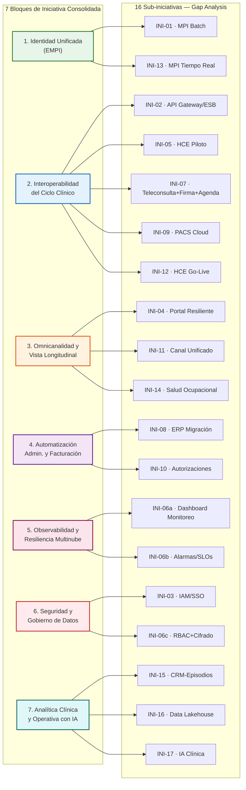

```mermaid
flowchart LR
    subgraph CONS["7 Bloques de Iniciativa Consolidada"]
        direction TB
        B1["1. Identidad Unificada\n(EMPI)"]
        B2["2. Interoperabilidad\ndel Ciclo Clínico"]
        B3["3. Omnicanalidad y\nVista Longitudinal"]
        B4["4. Automatización\nAdmin. y Facturación"]
        B5["5. Observabilidad y\nResiliencia Multinube"]
        B6["6. Seguridad y\nGobierno de Datos"]
        B7["7. Analítica Clínica\ny Operativa con IA"]
    end

    subgraph ORIG["16 Sub-iniciativas — Gap Analysis"]
        direction TB
        S01["INI-01 · MPI Batch"]
        S13["INI-13 · MPI Tiempo Real"]
        S02["INI-02 · API Gateway/ESB"]
        S05["INI-05 · HCE Piloto"]
        S07["INI-07 · Teleconsulta+Firma+Agenda"]
        S09["INI-09 · PACS Cloud"]
        S12["INI-12 · HCE Go-Live"]
        S04["INI-04 · Portal Resiliente"]
        S11["INI-11 · Canal Unificado"]
        S14["INI-14 · Salud Ocupacional"]
        S08["INI-08 · ERP Migración"]
        S10["INI-10 · Autorizaciones"]
        S06a["INI-06a · Dashboard Monitoreo"]
        S06b["INI-06b · Alarmas/SLOs"]
        S03["INI-03 · IAM/SSO"]
        S06c["INI-06c · RBAC+Cifrado"]
        S15["INI-15 · CRM-Episodios"]
        S16["INI-16 · Data Lakehouse"]
        S17["INI-17 · IA Clínica"]
    end

    B1 --> S01
    B1 --> S13
    B2 --> S02
    B2 --> S05
    B2 --> S07
    B2 --> S09
    B2 --> S12
    B3 --> S04
    B3 --> S11
    B3 --> S14
    B4 --> S08
    B4 --> S10
    B5 --> S06a
    B5 --> S06b
    B6 --> S03
    B6 --> S06c
    B7 --> S15
    B7 --> S16
    B7 --> S17

    style B1 fill:#e8f5e9,stroke:#2e7d32,stroke-width:2px
    style B2 fill:#e3f2fd,stroke:#1565c0,stroke-width:2px
    style B3 fill:#fff3e0,stroke:#e65100,stroke-width:2px
    style B4 fill:#f3e5f5,stroke:#6a1b9a,stroke-width:2px
    style B5 fill:#fce4ec,stroke:#880e4f,stroke-width:2px
    style B6 fill:#ffebee,stroke:#c62828,stroke-width:2px
    style B7 fill:#e0f7fa,stroke:#00695c,stroke-width:2px
```