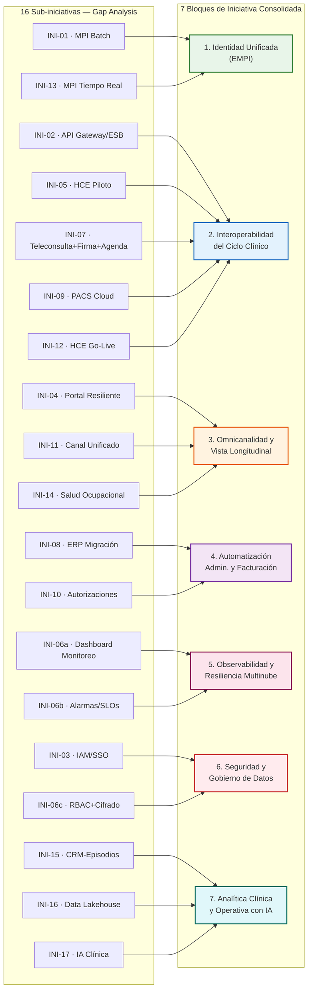
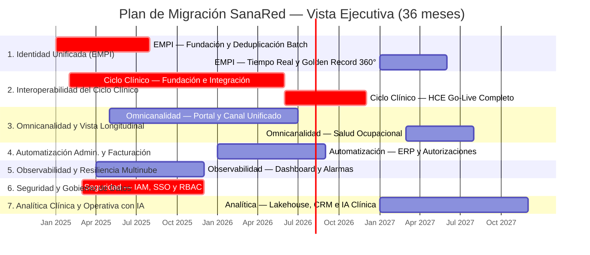
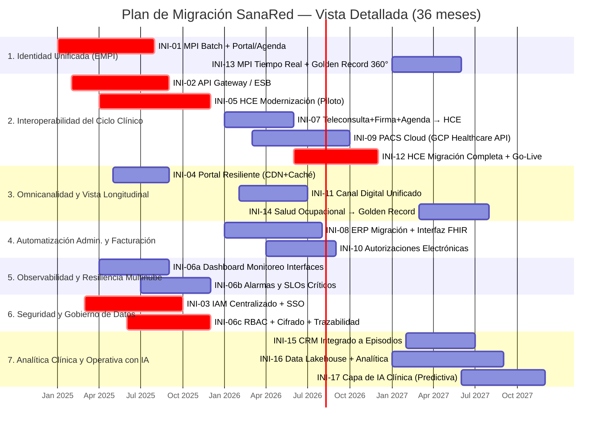
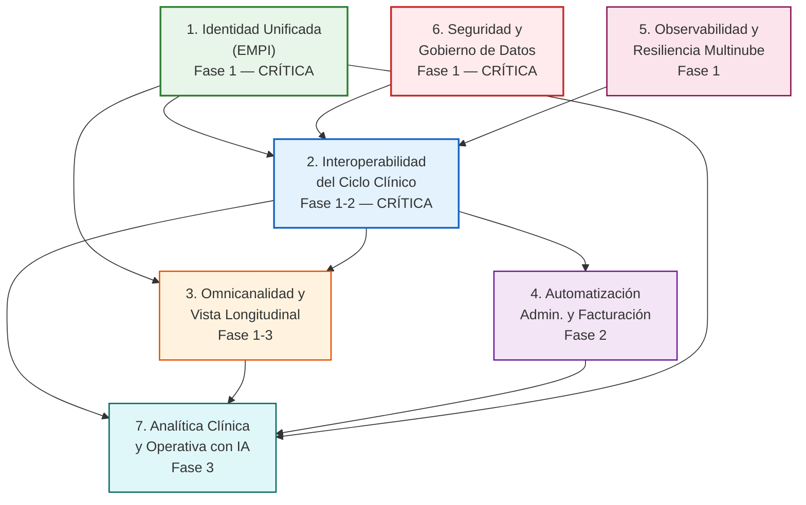

# Plan de Migración — Clínica SanaRed Integrada
## TOGAF ADM Fase F | Migration Planning

> **Base:** Fase E (Oportunidades y Soluciones) — 6 iniciativas consolidadas + bloque adicional de Analítica/IA
> **Insumo:** 16 sub-iniciativas técnicas detalladas en el Gap Analysis del Hito 1

---

## 1. Mapeo Final — De 16 Sub-Iniciativas a 7 Bloques de Iniciativa

El bloque de Seguridad y Observabilidad se dividió en dos iniciativas independientes (Observabilidad y Resiliencia Multinube / Seguridad y Gobierno de Datos), tal como ya estaban definidas por el equipo, separando explícitamente las sub-iniciativas técnicas que antes vivían combinadas en INI-06. Se agrega un séptimo bloque de Analítica Clínica con IA para alojar el Data Lakehouse y las iniciativas que no calzaban en las 6 originales.

| # | Iniciativa Consolidada (Fase E) | Sub-iniciativas Técnicas (Gap Analysis) | Horizonte |
|---|---|---|---|
| **1** | **Identidad Unificada de Pacientes (EMPI)** | INI-01 · EMPI — Matching + Deduplicación Batch (126K registros) + Integración Portal/Agenda INI-13 · EMPI — Deduplicación en Tiempo Real + Golden Record 360° | Fase 1 → Fase 3 |
| **2** | **Interoperabilidad del Ciclo Clínico** | INI-02 · API Gateway / ESB (mensajería garantizada, sustituye HL7 punto a punto) INI-05 · HCE Modernización — Arquitectura y Piloto INI-07 · Integración Teleconsulta + Firma Electrónica + Agenda al HCE INI-09 · PACS Cloud Consolidado (GCP Healthcare API) INI-12 · HCE Migración Completa y Go-Live | Fase 1 → Fase 2 |
| **3** | **Omnicanalidad y Vista Longitudinal** | INI-04 · Resiliencia del Portal de Pacientes (CDN + Caché + Auto-scaling) INI-11 · Canal Digital Unificado (Portal + App Móvil) INI-14 · Integración de Salud Ocupacional al Golden Record | Fase 1 → Fase 3 |
| **4** | **Automatización Administrativa y Facturación** | INI-08 · ERP — Migración a Cloud Pública + Interfaz FHIR con HCE INI-10 · Autorizaciones Electrónicas con Aseguradoras | Fase 2 |
| **5** | **Observabilidad y Resiliencia Multinube** | INI-06a · Dashboard de Monitoreo de Interfaces Clínicas (HL7/ESB) + Métricas, Logs y Trazas INI-06b · Alarmas y SLOs por Servicio Crítico | Fase 1 |
| **6** | **Seguridad y Gobierno de Datos** | INI-03 · IAM Centralizado y SSO Multinube INI-06c · RBAC + Cifrado + Trazabilidad de Consulta a Datos Sensibles (Zero Trust) | Fase 1 |
| **7** | **Analítica Clínica y Operativa con IA** *(bloque nuevo)* | INI-15 · CRM Integrado a Episodios Clínicos INI-16 · Data Lakehouse + Analítica Clínica/Operativa INI-17 · Capa de IA sobre el Lakehouse (modelos predictivos: demanda, readmisión, riesgo clínico) | Fase 3 |

> **Nota sobre INI-17:** se añade como extensión natural de INI-16 para capitalizar el Data Lakehouse con casos de uso de IA (predicción de demanda ambulatoria, riesgo de readmisión, priorización de resultados críticos), dado que la infraestructura de datos consolidados es condición previa para cualquier modelo de IA clínica responsable.

---

## 2. Diagrama de Mapeo 16 → 7

---

## 3. Vista Ejecutiva — Gantt por Iniciativa Consolidada (7 Bloques)

---

## 4. Vista Detallada — Gantt por las 16+1 Sub-Iniciativas

---

## 5. Diagrama de Dependencias entre los 7 Bloques

---

## 6. Resumen Ejecutivo del Plan de Migración

El plan de migración de Clínica SanaRed Integrada organiza la transformación arquitectónica en **siete bloques de iniciativa** distribuidos en tres horizontes temporales a lo largo de 36 meses, consolidando las 16 sub-iniciativas técnicas del Gap Analysis (Fase E) bajo el esquema de oportunidades que el equipo definió a nivel de negocio.

**Bloque 1 — Identidad Unificada de Pacientes (EMPI).** Es la iniciativa fundacional del plan: sin un identificador único de paciente, ninguna otra iniciativa puede garantizar integridad de datos. Arranca en el mes 1 con la implementación del motor de matching y la deduplicación batch de los 126,000 registros duplicados, integrando HCE Oracle, Portal AWS y Agenda SaaS al nuevo maestro centralizado. Su segunda etapa, en Fase 3, evoluciona el matching a tiempo real y activa el Golden Record 360° como vista unificada del paciente.

**Bloque 2 — Interoperabilidad del Ciclo Clínico.** Es el bloque de mayor complejidad y duración del plan, extendiéndose de la Fase 1 a la Fase 2. Comienza con el despliegue del API Gateway/ESB que sustituye el integrador HL7 punto a punto —eliminando el punto único de falla que bloqueó 18,600 resultados en un incidente de 11 horas— y con la arquitectura piloto de la nueva HCE. Continúa con la integración estructurada de Teleconsulta, Firma Electrónica y Agenda, la consolidación del PACS en la nube, y culmina con la migración completa y el go-live de la HCE modernizada, hito que marca el cierre de la dependencia on-premises del núcleo clínico.

**Bloque 3 — Omnicanalidad y Vista Longitudinal.** Convierte el portal de pacientes en un canal resiliente (con CDN, caché y auto-scaling) y consolida el portal web y la app móvil en una experiencia digital unificada, eliminando la duplicidad de canales. En la fase final, conecta los datos de Salud Ocupacional al Golden Record, cerrando uno de los últimos silos de información del paciente corporativo.

**Bloque 4 — Automatización Administrativa y Facturación.** Concentrado en la Fase 2, migra el ERP de la nube privada a una nube pública con interfaz FHIR hacia la HCE modernizada, y automatiza las autorizaciones con aseguradoras mediante API. Esta iniciativa depende directamente de que la HCE modernizada (Bloque 2) ya exponga datos clínicos estructurados, condición necesaria para eliminar la codificación manual que hoy genera el 13% de expedientes observados y el ciclo de facturación de 17 días.

**Bloque 5 — Observabilidad y Resiliencia Multinube.** Se ejecuta íntegramente en la Fase 1, en paralelo a la implementación del API Gateway, instrumentando el dashboard de monitoreo de interfaces clínicas y las alarmas sobre los servicios críticos (HL7/ESB, Portal, LIS). Es la iniciativa que permite detectar de forma proactiva las fallas que hoy se descubren solo cuando el paciente o el call center reportan el problema.

**Bloque 6 — Seguridad y Gobierno de Datos.** También de Fase 1 y de carácter crítico, implementa el IAM centralizado con SSO multinube y el modelo RBAC con cifrado y trazabilidad de consulta a datos sensibles. Es condición previa de la interoperabilidad del ciclo clínico, ya que ningún sistema puede integrarse de forma segura al ecosistema sin una identidad de colaborador federada y auditable.

**Bloque 7 — Analítica Clínica y Operativa con IA (nuevo).** Bloque incorporado para capitalizar la infraestructura de datos consolidada de los bloques anteriores. En la Fase 3, una vez que el CRM está integrado a los episodios clínicos reales y el Data Lakehouse multinube consolida HCE, LIS, PACS, ERP y CRM, se habilita una capa de inteligencia artificial sobre el lakehouse para modelos predictivos de demanda ambulatoria, riesgo de readmisión y priorización de resultados críticos — transformando los datos dispersos de SanaRed en una ventaja competitiva activa, no solo en un repositorio histórico.

La secuencia de dependencias confirma que los Bloques 1, 5 y 6 son los cimientos del plan: todos los demás bloques —incluida la analítica con IA— dependen, directa o indirectamente, de tener una identidad de paciente confiable, una capa de observabilidad activa y un modelo de seguridad multinube gobernado.
