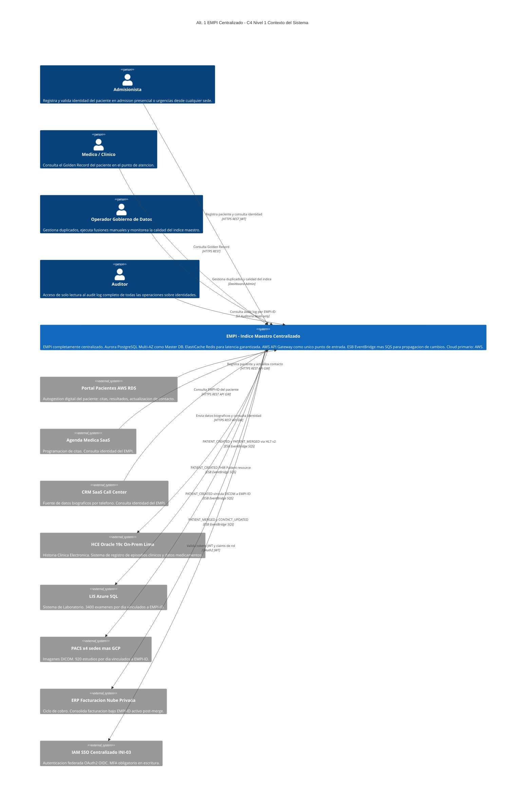
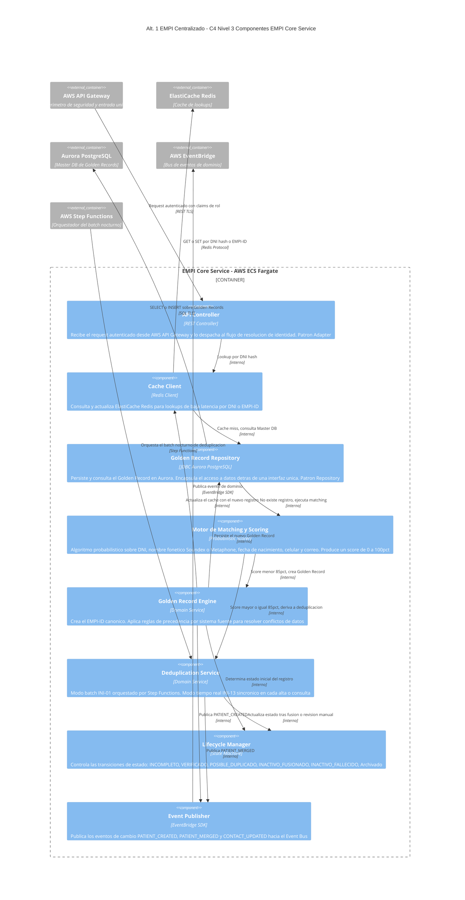

# Alternativa 1 — Diagramas C4 (Niveles 1–3) y ADRs
## EMPI Centralizado con API Gateway y Bus de Integración (ESB)
## Iniciativa: Identidad Unificada de Pacientes (EMPI) | INI-01 / INI-13
## Clínica SanaRed Integrada — Hito 2

---

# ÍNDICE

- [Lineamientos de Arquitectura Aplicados](#lineamientos)
- [Patrones de Arquitectura Aplicados](#patrones)
- [C4 Nivel 1 — Contexto del Sistema](#c4-nivel-1)
- [C4 Nivel 2 — Contenedores](#c4-nivel-2)
- [C4 Nivel 3 — Componentes del EMPI Core](#c4-nivel-3)
- [Architectural Decision Records (ADR)](#adrs)

---

## Lineamientos de Arquitectura Aplicados

| # | Lineamiento | Aplicación en Alt. 1 |
|---|---|---|
| **L-01** | **Seguridad por capas (Defense in Depth)** | AWS API Gateway como único punto de entrada, validación de token JWT emitido por el IAM Centralizado. RBAC por claims de rol. Cifrado TLS 1.3 en tránsito y cifrado en reposo en Aurora PostgreSQL. |
| **L-02** | **Integración por eventos (Event-Driven)** | El EMPI Core publica eventos de cambio (`PATIENT_CREATED`, `PATIENT_MERGED`, `CONTACT_UPDATED`) al Event Bus (EventBridge). Amazon SQS desacopla el productor de los consumidores clínicos. |
| **L-03** | **Observabilidad centralizada** | Dashboard de Calidad EMPI (INI-06a) conectado a CloudWatch. Alertas automáticas si la tasa de duplicados supera el 2%. |
| **L-04** | **Resiliencia y degradación elegante** | Dead Letter Queue en SQS con retry backoff exponencial. Aurora Multi-AZ con failover automático en menos de 30 segundos. Modo cache offline en sedes (RNF-02.3). |
| **L-05** | **Interoperabilidad por estándares** | FHIR R4 como recurso `Patient` nativo del EMPI. Transformador HL7v2 ↔ FHIR R4 para coexistencia con el HCE Oracle durante la transición. |
| **L-06** | **Trazabilidad e inmutabilidad de auditoría** | Audit Log Store en CloudWatch (12 meses activos) y S3 Glacier (histórico hasta 10 años). Cada operación queda registrada con origen, timestamp y resultado. |
| **L-07** | **Configurabilidad sin redespliegue** | Las reglas de precedencia entre sistemas fuente y los umbrales de scoring del matching se gestionan como parámetros del Golden Record Engine, no como constantes en código. |
| **L-08** | **Cumplimiento normativo incorporado** | Ley 29733 (Perú): cifrado en Aurora y S3, retención de 10 años en Glacier, PIA pre go-live, datos sintéticos en ambientes no productivos. |

---

## Patrones de Arquitectura Aplicados

| Patrón | Aplicación específica en Alt. 1 |
|---|---|
| **API Gateway** | AWS API Gateway como único punto de entrada al EMPI. Autenticación JWT/OAuth2, rate limiting, logging centralizado. |
| **Master Data Management (MDM)** | El EMPI Core es el System of Record (SOR) de identidad. Aurora PostgreSQL Multi-AZ almacena el Golden Record canónico único por paciente. |
| **Cache-Aside** | ElastiCache Redis absuelve los lookups más frecuentes por DNI o EMPI-ID antes de tocar Aurora. TTL de 5 minutos. |
| **Event-Driven Architecture (EDA) / Publish-Subscribe** | EventBridge publica eventos de dominio técnico; Amazon SQS distribuye a los sistemas clínicos suscritos (HCE, LIS, PACS, ERP). |
| **Adapter** | El transformador HL7v2 ↔ FHIR R4 traduce el recurso `Patient` nativo del EMPI al formato que consume el HCE Oracle, sin modificar el sistema heredado. |
| **Retry con Backoff / Dead Letter Queue** | Amazon SQS reintenta la entrega a los consumidores con backoff exponencial; tras 3 intentos fallidos, el mensaje pasa a la DLQ para análisis. |
| **Orchestration (Saga centralizada)** | AWS Step Functions orquesta el batch nocturno de deduplicación: matching → clasificación → merge automático → cola de revisión manual. |
| **Strangler Fig** | Los sistemas fuente (Portal, Agenda, Admisión, Call Center) migran gradualmente de crear identidad propia a consumir el EMPI-ID canónico. |
| **Repository** | El Golden Record Engine encapsula el acceso a Aurora PostgreSQL detrás de una interfaz de persistencia única. |

---

## C4 Nivel 1 — Diagrama de Contexto

> Muestra quién usa el sistema EMPI y con qué sistemas externos se relaciona. Nivel ejecutivo: sin tecnología, solo actores y relaciones de negocio.

---

## C4 Nivel 2 — Diagrama de Contenedores

> Muestra los procesos y aplicaciones desplegables, las tecnologías principales y cómo se comunican. Todo el stack corre sobre AWS.

```mermaid
C4Container
    title Alt. 1 EMPI Centralizado - C4 Nivel 2 Contenedores

    Person(admisionista, "Admisionista / Medico", "Accede desde el modulo de admision o el punto de atencion")
    Person(gobDatos, "Operador Gobierno de Datos", "Gestiona duplicados y calidad")

    System_Boundary(aws_boundary, "AWS - EMPI Centralizado") {
        Container(apigw, "AWS API Gateway", "API Gateway JWT OAuth2", "Unico punto de entrada al EMPI. Autenticacion, rate limiting, logging centralizado. L-01")
        Container(empi_core, "EMPI Core Service", "AWS ECS Fargate", "Motor de Matching y Scoring, Golden Record Engine, Deduplication Service y Lifecycle Manager como modulos internos de un unico servicio desplegable. Patron MDM")
        Container(master_db, "Master DB", "Aurora PostgreSQL Multi-AZ", "Golden Records, EMPI-IDs y relaciones entre registros. Failover automatico menor a 30s. RNF-02.1", "Database")
        Container(cache, "Cache Layer", "ElastiCache Redis", "Lookup por DNI o EMPI-ID en tiempo real. TTL 5 min. Absorbe hasta 80pct del trafico de lectura. RNF-01.1", "Database")
        Container(audit_store, "Audit Log Store", "CloudWatch mas S3 Glacier", "CloudWatch retiene 12 meses activos. S3 Glacier retiene el historico hasta 10 anios. RNF-03.4 RNF-07.2", "Database")
        Container(event_bus, "Event Bus", "AWS EventBridge", "Publica eventos de cambio del Golden Record. Suscripcion por sistema destino. L-02")
        Container(sqs_queue, "Cola de Mensajeria", "Amazon SQS", "Desacopla el EMPI de los sistemas receptores. Retry con backoff y Dead Letter Queue. RNF-02.4")
        Container(hl7_transformer, "Transformador HL7v2 a FHIR R4", "AWS Lambda", "Convierte el recurso FHIR Patient al formato HL7 v2 que consume el HCE Oracle. RNF-04.3 Patron Adapter")
        Container(dashboard, "Dashboard Calidad EMPI", "INI-06a", "Indicadores de RF-07: tasa de duplicados, pct DNI validado, fusiones del periodo, cola de revision manual")
        Container(batch_scheduler, "Scheduler Batch", "AWS Step Functions", "Orquesta el proceso nocturno de deduplicacion 00:00 a 05:00. INI-01")
        Container(alerting, "Alertas Automaticas", "CloudWatch Alarms", "Dispara alerta si la tasa de duplicados supera el 2pct. RF-07 Scenario 1")
    }

    System_Ext(portal_ext, "Portal Pacientes", "AWS RDS PostgreSQL")
    System_Ext(agenda_ext, "Agenda Medica SaaS", "SaaS externo")
    System_Ext(crm_ext, "CRM SaaS Call Center", "SaaS externo")
    System_Ext(hce_ext, "HCE Oracle 19c", "On-Prem Lima")
    System_Ext(lis_ext, "LIS Azure SQL", "Azure")
    System_Ext(pacs_ext, "PACS x4 sedes", "On-Prem mas GCP")
    System_Ext(erp_ext, "ERP Facturacion", "Nube Privada")
    System_Ext(iam_ext, "IAM SSO INI-03", "OAuth2 y JWT federado")

    Rel(admisionista, apigw, "HTTPS REST", "TLS 1.3")
    Rel(portal_ext, apigw, "Registra paciente y actualiza contacto", "HTTPS REST")
    Rel(agenda_ext, apigw, "Consulta EMPI-ID", "HTTPS REST")
    Rel(crm_ext, apigw, "Envia datos biograficos", "HTTPS REST")
    Rel(apigw, iam_ext, "Valida token JWT y claims", "OAuth2 JWT")
    Rel(apigw, empi_core, "Request autenticado con claims de rol", "REST TLS interno")
    Rel(empi_core, master_db, "Lee y escribe Golden Record", "SQL TLS")
    Rel(empi_core, cache, "Lookup y warm cache", "Redis Protocol")
    Rel(master_db, audit_store, "Escribe log de auditoria", "CloudWatch API")
    Rel(empi_core, event_bus, "Publica evento de cambio", "EventBridge SDK")
    Rel(event_bus, sqs_queue, "Encola evento por sistema destino", "EventBridge SQS")
    Rel(sqs_queue, hl7_transformer, "Trigger de transformacion", "SQS Lambda trigger")
    Rel(hl7_transformer, hce_ext, "HL7 v2 ADT", "MLLP TCP")
    Rel(sqs_queue, lis_ext, "FHIR Patient resource", "SQS REST")
    Rel(sqs_queue, pacs_ext, "FHIR Patient resource", "SQS")
    Rel(sqs_queue, erp_ext, "PATIENT_MERGED event", "SQS")
    Rel(batch_scheduler, empi_core, "Orquesta batch nocturno de deduplicacion", "Step Functions")
    Rel(dashboard, empi_core, "Consulta metricas de calidad", "REST Query")
    Rel(dashboard, audit_store, "Lee audit logs", "CloudWatch Query API")
    Rel(dashboard, alerting, "Dispara alerta si duplicados mayor 2pct", "interno")
    Rel(gobDatos, dashboard, "Monitorea calidad e indice", "HTTPS")
```

---

## C4 Nivel 3 — Diagrama de Componentes (EMPI Core Service)

> Desglosa los componentes internos del contenedor central: el EMPI Core Service, con sus cuatro módulos de dominio y los adaptadores de infraestructura.

---

# ARCHITECTURAL DECISION RECORDS (ADR)

> Formato: MADR — Markdown Architectural Decision Records
> Estados posibles: PROPUESTO, ACEPTADO, RECHAZADO, OBSOLETO, REEMPLAZADO

---

## ADR-A1-001 — AWS como Cloud Primario del EMPI Centralizado

| Campo | Detalle |
|---|---|
| **ID** | ADR-A1-001 |
| **Título** | Selección de AWS como plataforma única para el EMPI centralizado |
| **Estado** | ACEPTADO |
| **Fecha** | 2025-01 |
| **RFs/RNFs relacionados** | RNF-02.1, RNF-05.1, RNF-05.2 |

### Contexto
SanaRed opera en un entorno multinube, pero el Portal de Pacientes ya usa AWS RDS PostgreSQL y la App Móvil corre sobre AWS. Un EMPI centralizado en una sola nube reduce la complejidad operativa frente a distribuir el núcleo de identidad entre proveedores.

### Opciones evaluadas
| Opción | Resultado |
|---|---|
| **A) Multi-cloud desde el día 1** | Mayor flexibilidad, pero introduce complejidad operativa y de red innecesaria para un EMPI que aún no tiene requisitos de multi-región. |
| **B) AWS como cloud único** | Aurora, ElastiCache, EventBridge, SQS, Step Functions y CloudWatch cubren todas las necesidades del EMPI como servicios gestionados maduros. El Portal ya opera en AWS. **Aceptado.** |
| **C) Azure como cloud único** | Viable técnicamente, pero requeriría migrar el Portal de Pacientes fuera de AWS RDS sin beneficio claro. |

### Decisión
AWS como cloud único para el EMPI Core, el Master DB, el cache, el ESB y la orquestación batch. El HCE Oracle on-premises y el LIS en Azure se integran vía el ESB sin requerir presencia de cómputo en sus respectivas plataformas.

### Consecuencias
- El equipo debe certificarse en Aurora Multi-AZ, EventBridge y Step Functions antes del go-live.
- Los costos de AWS se consolidan con el Portal de Pacientes existente.
- La integración con el HCE Oracle (on-premises) y el LIS (Azure) depende de la latencia de red hacia AWS, mitigada con el ESB asíncrono.

---

## ADR-A1-002 — Aurora PostgreSQL Multi-AZ como Master DB

| Campo | Detalle |
|---|---|
| **ID** | ADR-A1-002 |
| **Título** | Aurora PostgreSQL Multi-AZ como base de datos maestra del Golden Record |
| **Estado** | ACEPTADO |
| **Fecha** | 2025-01 |
| **RFs/RNFs relacionados** | RF-01, RF-06, RNF-02.1 |

### Contexto
El EMPI requiere un único punto de verdad transaccional para el Golden Record, con alta disponibilidad (RNF-02.1: 99.9%) y soporte relacional para las tablas de relaciones entre registros (fusiones, dependientes familiares).

### Opciones evaluadas
| Opción | Resultado |
|---|---|
| **A) DynamoDB** | Escalamiento horizontal nativo, pero modelo de consultas relacionales (joins entre Golden Record y relaciones familiares) es menos natural. |
| **B) Aurora PostgreSQL Multi-AZ** | Failover automático en menos de 30 segundos. Modelo relacional maduro para el equipo. Escalamiento de lectura con réplicas. **Aceptado.** |
| **C) RDS PostgreSQL Single-AZ** | Menor costo, pero no cumple el RNF-02.1 de disponibilidad 99.9% ante fallo de instancia. |

### Decisión
Aurora PostgreSQL Multi-AZ con failover automático. Tabla de Golden Records (EMPI-ID, estado, atributos biográficos cifrados, referencias a sistemas fuente) y tabla de relaciones entre registros (fusiones, dependientes).

### Consecuencias
- El equipo debe operar backups automáticos y point-in-time recovery de Aurora.
- La escritura sigue siendo un único punto lógico de contención; el cache Redis absorbe la mayoría de las lecturas para mitigar esto.
- Las migraciones de esquema requieren ventana de mantenimiento coordinada.

---

## ADR-A1-003 — AWS API Gateway como Único Punto de Entrada

| Campo | Detalle |
|---|---|
| **ID** | ADR-A1-003 |
| **Título** | AWS API Gateway con autenticación JWT/OAuth2 como perímetro único del EMPI |
| **Estado** | ACEPTADO |
| **Fecha** | 2025-01 |
| **RFs/RNFs relacionados** | RNF-03.1, RNF-03.2, RNF-04.2 |

### Contexto
Todos los canales (Portal, Agenda, Call Center, Admisión, App Móvil) deben pasar por un único perímetro de seguridad antes de llegar al EMPI Core, con autenticación, autorización por rol y rate limiting frente a picos de campañas corporativas.

### Opciones evaluadas
| Opción | Resultado |
|---|---|
| **A) Autenticación propia por canal** | Cada canal implementa su propia validación, generando inconsistencias de seguridad y duplicación de esfuerzo. **Rechazado.** |
| **B) AWS API Gateway centralizado** | Un único punto de entrada valida JWT del IAM Centralizado, aplica rate limiting y registra logging centralizado. **Aceptado.** |
| **C) Service Mesh interno** | Añade complejidad operativa no justificada para un EMPI con un solo servicio de dominio desplegado. |

### Decisión
AWS API Gateway como único punto de entrada. Valida el token JWT emitido por el IAM Centralizado (INI-03), verifica los claims de rol, aplica rate limiting por canal y registra cada solicitud con origen, timestamp y resultado.

### Consecuencias
- Los canales dejan de implementar autenticación propia; todos dependen del IAM Centralizado.
- El rate limiting protege al EMPI de picos como el de 18,000 citas por lote que saturó los sistemas en el incidente documentado.
- Si el API Gateway tiene incidentes, todo el tráfico hacia el EMPI se ve afectado — mitigado con el diseño Multi-AZ nativo del servicio gestionado.

---

## ADR-A1-004 — ElastiCache Redis como Cache de Lookup en Tiempo Real

| Campo | Detalle |
|---|---|
| **ID** | ADR-A1-004 |
| **Título** | ElastiCache Redis para garantizar latencia P95 menor a 500 ms en consultas de identidad |
| **Estado** | ACEPTADO |
| **Fecha** | 2025-01 |
| **RFs/RNFs relacionados** | RNF-01.1, CA-03.1 |

### Contexto
El 80% de las admisiones corresponden a pacientes ya registrados. Consultar Aurora directamente en cada admisión introduce latencia y contención en horas pico (5,200 citas + 780 urgencias diarias).

### Decisión
ElastiCache Redis almacena los lookups más frecuentes por hash de DNI y por EMPI-ID, con TTL de 5 minutos. El EMPI Core consulta primero el cache; solo ante un miss consulta Aurora. El resultado de Aurora recalienta el cache (cache-aside).

### Consecuencias
- Redis absorbe hasta el 80% del tráfico de lectura, dejando a Aurora libre para las escrituras transaccionales.
- Requiere invalidación explícita del cache en operaciones de actualización de contacto y fusión de registros.
- Modo offline en sedes (RNF-02.3): el TTL se extiende ante pérdida de conectividad para continuar sirviendo lecturas recientes.

---

## ADR-A1-005 — EventBridge + SQS como Bus de Integración (ESB)

| Campo | Detalle |
|---|---|
| **ID** | ADR-A1-005 |
| **Título** | AWS EventBridge y Amazon SQS como mecanismo de propagación de cambios de identidad |
| **Estado** | ACEPTADO |
| **Fecha** | 2025-01 |
| **RFs/RNFs relacionados** | RF-04, RNF-02.4, CA-04.1 |

### Contexto
En el AS IS, la sincronización entre sistemas es punto a punto y síncrona (integrador HL7 v2 sin cola), lo que causó 11 horas de caída con 18,600 resultados bloqueados. Se necesita un mecanismo desacoplado con garantía de entrega.

### Opciones evaluadas
| Opción | Resultado |
|---|---|
| **A) Llamadas REST síncronas punto a punto** | Replica el problema del AS IS: si un sistema clínico falla, el EMPI debe esperar o reintentar manualmente. **Rechazado.** |
| **B) EventBridge + SQS** | EventBridge publica el evento técnico; SQS lo encola por sistema destino con retry y Dead Letter Queue. Nativo en AWS. **Aceptado.** |
| **C) Apache Kafka autogestionado** | Mayor control y throughput, pero el equipo no tiene experiencia operando Kafka y el volumen de eventos no lo justifica en esta fase. |

### Decisión
El EMPI Core publica eventos de dominio técnico (`PATIENT_CREATED`, `PATIENT_MERGED`, `CONTACT_UPDATED`) a EventBridge. Amazon SQS encola el evento por sistema destino (HCE, LIS, PACS, ERP) con retry backoff exponencial (30s, 60s, 120s) y Dead Letter Queue tras 3 intentos fallidos.

### Consecuencias
- Si el HCE Oracle está temporalmente no disponible, los eventos quedan encolados y se procesan al reconectar, sin pérdida.
- El equipo debe monitorear la profundidad de las colas y la DLQ para detectar consumidores degradados.
- Agenda SaaS y CRM Call Center no están suscritos al ESB en esta alternativa: solo consultan el EMPI de forma síncrona, no reciben notificaciones push.

---

## ADR-A1-006 — AWS Step Functions para el Batch Nocturno de Deduplicación

| Campo | Detalle |
|---|---|
| **ID** | ADR-A1-006 |
| **Título** | AWS Step Functions como orquestador del batch nocturno de deduplicación (INI-01) |
| **Estado** | ACEPTADO |
| **Fecha** | 2025-01 |
| **RFs/RNFs relacionados** | RF-02, RNF-01.3, CA-02.1 |

### Contexto
El batch debe procesar 126,000 registros duplicados históricos a una tasa mínima de 50,000 registros/hora, dentro de la ventana nocturna 00:00–05:00, con capacidad de retomar sin reiniciar desde cero ante un fallo a mitad de proceso.

### Decisión
AWS Step Functions orquesta el flujo: matching → clasificación por score → merge automático (≥95%) o cola de revisión manual (85%-94%) → notificación. El estado de ejecución de Step Functions permite retomar desde el último paso completado ante un fallo.

### Consecuencias
- El equipo debe definir el paralelismo de las ejecuciones de Step Functions según el volumen de candidatos por partición.
- El checkpointing nativo de Step Functions evita reprocesar el corpus completo tras un fallo.
- Sin un motor de cómputo distribuido dedicado (tipo Spark), la tasa de procesamiento depende del paralelismo configurado en las Lambdas invocadas por el flujo.

---

## ADR-A1-007 — RBAC con JWT Claims y SSO Federado

| Campo | Detalle |
|---|---|
| **ID** | ADR-A1-007 |
| **Título** | RBAC basado en claims JWT emitidos por el IAM Centralizado (INI-03) |
| **Estado** | ACEPTADO |
| **Fecha** | 2025-01 |
| **RFs/RNFs relacionados** | RNF-03.1, RNF-03.2 |

### Contexto
El Anexo de Riesgos señala cuentas compartidas y permisos heredados por sede como riesgo de seguridad crítico. El EMPI necesita saber el rol y la sede del solicitante antes de autorizar cada operación.

### Decisión
El IAM Centralizado (INI-03) emite tokens JWT federados válidos en Portal AWS, HCE Oracle y Agenda SaaS. El API Gateway valida la firma; el EMPI Core valida los claims de rol y sede antes de ejecutar cualquier operación sobre el Golden Record.

### Consecuencias
- Se eliminan las cuentas compartidas: cada usuario autentica con su propia identidad federada.
- Si el IAM Centralizado no está maduro en Fase 1, se implementa autenticación JWT básica como fallback temporal.
- Los médicos afiliados reciben el claim de sede actualizado en cada autenticación, sin permisos heredados de sedes anteriores.

---

## ADR-A1-008 — CloudWatch + S3 Glacier como Audit Log Store

| Campo | Detalle |
|---|---|
| **ID** | ADR-A1-008 |
| **Título** | CloudWatch para auditoría reciente y S3 Glacier para retención de largo plazo |
| **Estado** | ACEPTADO |
| **Fecha** | 2025-01 |
| **RFs/RNFs relacionados** | RNF-03.4, RNF-07.2 |

### Contexto
El EMPI necesita un log de auditoría consultable en menos de 10 segundos por rango de fechas (RNF-03.4) y una retención de hasta 10 años (RNF-07.2), a costo razonable.

### Decisión
CloudWatch Logs retiene los últimos 12 meses de operaciones para consulta rápida. Cada operación sobre el Golden Record genera una entrada de log con actor, timestamp, origen y resultado, escrita desde el Master DB tras cada transacción. Al superar los 12 meses, los logs se archivan en S3 Glacier hasta cumplir los 10 años requeridos.

### Consecuencias
- A diferencia de un modelo de Event Sourcing, el log de auditoría es una escritura secundaria posterior a la transacción sobre Aurora — existe una ventana teórica en la que una operación modifica el estado antes de que el log se escriba. Se mitiga escribiendo el log dentro de la misma transacción de Aurora cuando es posible.
- El costo de almacenamiento en S3 Glacier es significativamente menor que mantener 10 años de historial en CloudWatch.
- La recuperación de logs desde Glacier tiene una latencia de horas, aceptable para auditorías no urgentes.

---

## ADR-A1-009 — Transformador HL7v2 ↔ FHIR R4 para Coexistencia con HCE Oracle

| Campo | Detalle |
|---|---|
| **ID** | ADR-A1-009 |
| **Título** | Lambda transformadora como adapter entre el EMPI (FHIR R4) y el HCE Oracle (HL7 v2) |
| **Estado** | ACEPTADO |
| **Fecha** | 2025-01 |
| **RFs/RNFs relacionados** | RNF-04.3, CA-04.1 |

### Contexto
El HCE Oracle 19c on-premises consume mensajes HL7 v2 (ADT). El EMPI produce el recurso nativo FHIR R4 `Patient`. Modificar el HCE para consumir FHIR R4 directamente en Fase 1 extendería el tiempo de entrega de valor varios meses adicionales.

### Decisión
Una función Lambda, suscrita a la cola SQS del HCE, convierte el recurso FHIR R4 `Patient` al mensaje HL7 v2 ADT correspondiente y lo entrega al HCE Oracle. La Lambda es un Adapter puro sin lógica de negocio. En una fase posterior, si el HCE migra a FHIR R4, la Lambda se retira sin afectar al EMPI Core.

### Consecuencias
- El HCE Oracle no requiere ninguna modificación para operar con el EMPI desde el primer día.
- La función Lambda puede convertirse en un punto de falla si no se monitorea: se mitiga con alertas de CloudWatch ante error rate mayor a 0%.
- El formato HL7 v2 exacto (versión 2.3 vs 2.5) debe parametrizarse según la configuración del HCE Oracle instalado.

---

## ADR-A1-010 — Retención de Datos y Cumplimiento Ley 29733 (Perú)

| Campo | Detalle |
|---|---|
| **ID** | ADR-A1-010 |
| **Título** | Política de retención y cumplimiento de la Ley de Protección de Datos Personales |
| **Estado** | ACEPTADO |
| **Fecha** | 2025-01 |
| **RFs/RNFs relacionados** | RNF-07.1, RNF-07.2, CA-05.4, L-08 |

### Contexto
Los datos del Golden Record contienen información personal sensible (DNI, nombre, fecha de nacimiento, datos de contacto) sujeta a la Ley 29733 del Perú. Los registros inactivos por fusión o fallecimiento deben conservarse por al menos 10 años.

### Decisión
Los datos en Aurora se cifran en reposo y en tránsito. Los registros inactivos permanecen en Aurora durante los primeros 12 meses y luego se archivan a S3 Glacier, donde se retienen hasta cumplir los 10 años exigidos. Los ambientes de desarrollo y QA usan datos sintéticos generados sin información real de pacientes (CA-05.4). La Evaluación de Impacto en Privacidad (PIA) se completa antes del go-live.

### Consecuencias
- El equipo de Gobierno de Datos mantiene una lista de EMPI-IDs exentos de eliminación (por ejemplo, casos judiciales activos).
- La eliminación segura al cumplirse los 10 años requiere un proceso documentado sobre S3 Glacier.
- La PIA debe documentar explícitamente la región de AWS utilizada y las cláusulas contractuales que cubren los requisitos de la Ley 29733.

---

*Documento generado para Hito 2 — Iniciativa EMPI | Clínica SanaRed Integrada*
*Alternativa 1: EMPI Centralizado con API Gateway y ESB — C4 Niveles 1 a 3 y 10 ADRs en formato MADR*
