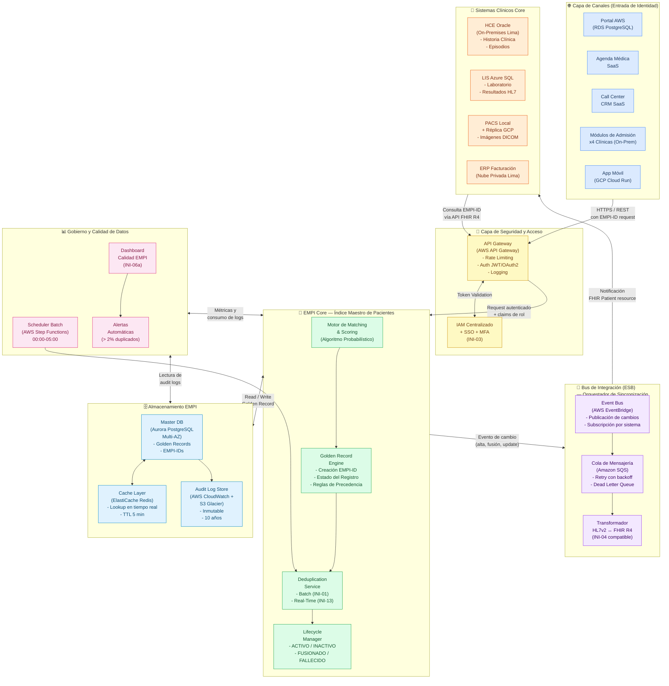
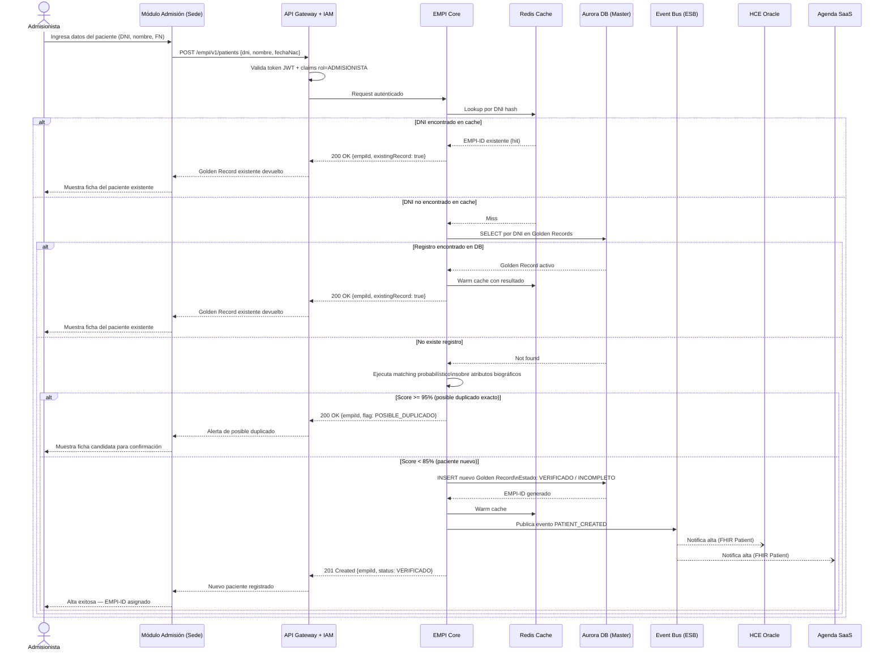
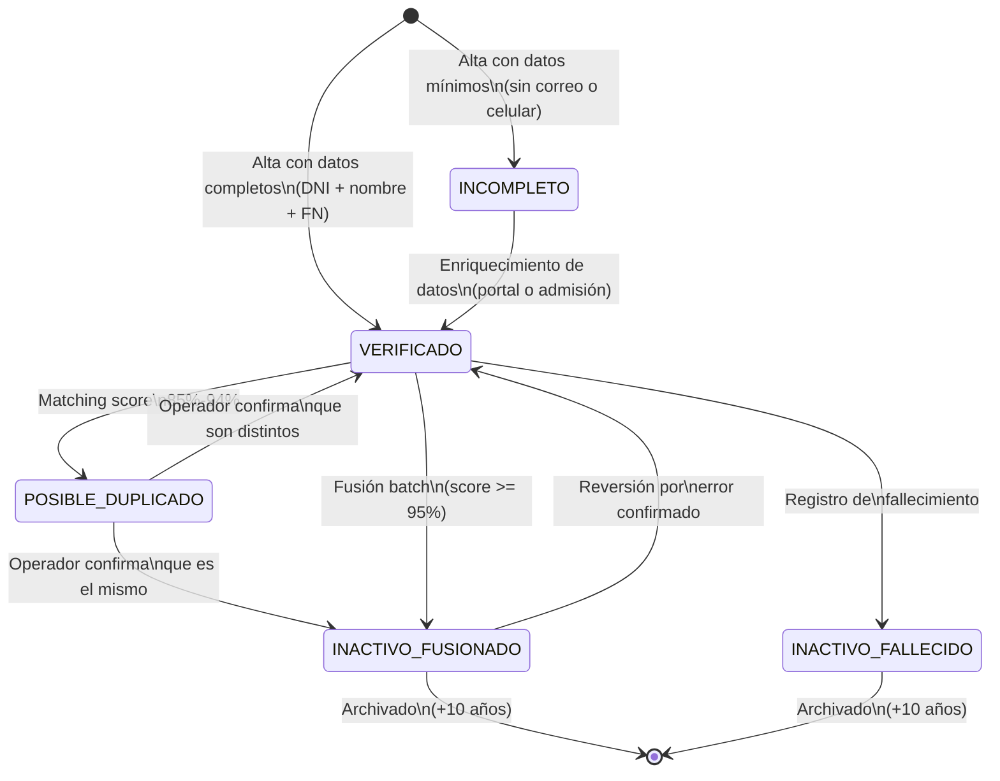

# Alternativa TO BE 1: EMPI Centralizado con API Gateway y Bus de Integración (ESB)

## Diagrama de Arquitectura — Mermaid

---

## Diagrama de Flujo — Escenario: Alta de Paciente Nuevo en Tiempo Real

---

## Diagrama de Estados — Golden Record

