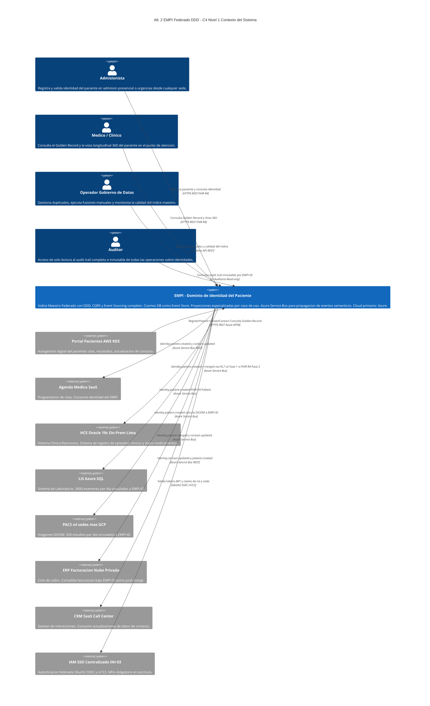

# Alternativa 2 — Diagramas C4 (Niveles 1–3) y ADRs
## EMPI Federado con DDD, CQRS y Event Sourcing
## Iniciativa: Identidad Unificada de Pacientes (EMPI) | INI-01 / INI-13
## Clínica SanaRed Integrada — Hito 2

---

# ÍNDICE

- [Lineamientos de Arquitectura Aplicados](#lineamientos)
- [Patrones de Arquitectura Aplicados](#patrones)
- [C4 Nivel 1 — Contexto del Sistema](#c4-nivel-1)
- [C4 Nivel 2 — Contenedores](#c4-nivel-2)
- [C4 Nivel 3 — Componentes del EMPI Domain Service](#c4-nivel-3)
- [Architectural Decision Records (ADR)](#adrs)

---

## Lineamientos de Arquitectura Aplicados

| # | Lineamiento | Aplicación en Alt. 2 |
|---|---|---|
| **L-01** | **Seguridad por capas (Defense in Depth)** | Azure APIM con mTLS para sistemas internos y OAuth2/OIDC para canales externos. RBAC a nivel de Command en el PatientAggregate. Cifrado TLS 1.3 en tránsito y AES-256 en reposo en Cosmos DB. |
| **L-02** | **Integración por eventos (Event-Driven)** | Todo cambio de identidad se publica como evento de dominio semántico al Azure Service Bus. Consumidores suscriben por topic según su dominio de negocio. Zero acoplamiento punto a punto. |
| **L-03** | **Observabilidad centralizada** | Azure Monitor Logs como proyección de auditoría. Grafana unificado conectado al stream de eventos de Cosmos DB Change Feed. Alertas por tasa de duplicados y latencia. |
| **L-04** | **Resiliencia y degradación elegante** | Dead Letter Queue en Service Bus con retry backoff exponencial. Si Elasticsearch falla, el matching degrada a búsqueda exacta en Cosmos DB sin perder historial. |
| **L-05** | **Interoperabilidad por estándares** | FHIR R4 como formato nativo del payload de cada evento. Azure APIM expone la API del EMPI compatible con IHE PIXm/PDQm. HL7 v2 soportado durante la transición. |
| **L-06** | **Trazabilidad e inmutabilidad de auditoría** | El Event Store en Cosmos DB ES el audit log. Cada evento tiene actor, source_system, timestamp e event_id inmutable. La auditoría no puede desincronizarse porque no es secundaria. |
| **L-07** | **Configurabilidad sin redespliegue** | Los scoring thresholds y reglas de precedencia son Domain Rules del PatientAggregate, no constantes en código. Se actualizan como configuración de negocio sin redeployment. |
| **L-08** | **Cumplimiento normativo incorporado** | Ley 29733 (Perú): eventos cifrados en Cosmos DB, retención automática a Azure Blob Cool Tier a los 12 meses, PIA pre go-live, archivado a 10 años via Governance Engine. |

---

## Patrones de Arquitectura Aplicados

| Patrón | Aplicación específica en Alt. 2 |
|---|---|
| **Domain-Driven Design (DDD) — Bounded Context** | El Dominio de Identidad del Paciente es un contexto acotado con lenguaje propio: PatientAggregate, EMPI-ID, Golden Record, Commands y Domain Events. Los dominios clínico, financiero y canal consumen el EMPI solo a través de eventos publicados — nunca acceden directamente al Event Store. |
| **CQRS (Command Query Responsibility Segregation)** | Write Side: PatientAggregate procesa Commands y persiste eventos en Cosmos DB. Read Side: cuatro proyecciones independientes optimizadas por caso de uso (Golden Record View, Vista 360°, Duplicate Index, Audit Trail). Nunca se mezclan en la misma base de datos. |
| **Event Sourcing** | El estado del Golden Record se deriva exclusivamente de la secuencia de eventos en Cosmos DB. No existe tabla de estado mutable. La reversión de una fusión es un evento compensatorio (MergeReverted), nunca un UPDATE o DELETE. |
| **Materialized View** | Cada proyección (Cosmos DB, Synapse, Elasticsearch, Azure Monitor) es una vista materializada que se actualiza asíncronamente desde el Change Feed. Elimina joins en tiempo de consulta. |
| **API Gateway** | Azure APIM como único punto de entrada al EMPI. Autenticación (mTLS y OAuth2), autorización (claims de rol), rate limiting por canal y throttling diferenciado por tipo de tráfico. |
| **Event-Driven Architecture (EDA)** | Azure Service Bus + Event Grid distribuyen eventos de dominio semánticos por topic. Desacoplamiento total entre el productor (EMPI Domain Service) y los consumidores (HCE, LIS, ERP, Agenda, CRM). |
| **Strangler Fig** | Los sistemas fuente (Portal, Agenda, Admisión) migran gradualmente de ser propietarios de identidad a ser consumidores del Golden Record. No se reemplazan de golpe — se introduce el EMPI como intermediario por fases. |
| **Saga (Coreografía)** | El proceso de deduplicación batch es una saga de larga duración: matching en Databricks → clasificación por score → merge automático o cola manual → notificación a consumidores. Cada paso genera un evento que desencadena el siguiente. |
| **Aggregate Root (DDD)** | PatientAggregate es la entidad raíz que encapsula todas las invariantes de identidad. Ningún componente externo puede modificar el estado de un Golden Record sin pasar por el PatientAggregate. |
| **Master Data Management (MDM)** | El EMPI es el System of Record (SOR) de identidad. Un único EMPI-ID canónico por paciente. Los sistemas fuente almacenan el EMPI-ID como referencia foránea, no como dato propio. |

---

## C4 Nivel 1 — Diagrama de Contexto

> Muestra quién usa el sistema EMPI y con qué sistemas externos se relaciona. Nivel ejecutivo: sin tecnología, solo actores y relaciones de negocio.

---

## C4 Nivel 2 — Diagrama de Contenedores

> Muestra los procesos y aplicaciones desplegables, las tecnologías principales y cómo se comunican. Tecnología Azure indicada con etiqueta [Azure], AWS con [AWS].

```mermaid
C4Container
    title Alt. 2 EMPI Federado DDD - C4 Nivel 2 Contenedores

    Person(admisionista, "Admisionista / Medico", "Accede desde modulo de admision, HCE o portal web")
    Person(gobDatos, "Operador Gobierno de Datos", "Gestiona duplicados y calidad del indice")

    System_Boundary(azure_boundary, "Azure - Plataforma principal del EMPI") {
        Container(apim, "Azure APIM [Azure]", "API Management mTLS OAuth2", "Unico punto de entrada al EMPI. mTLS para sistemas internos HCE LIS ERP. OAuth2 OIDC para canales externos Portal App CRM. Rate limiting por canal. L-01 Seguridad")
        Container(empi_svc, "EMPI Domain Service [Azure]", "Azure Container Apps Java Kotlin", "PatientAggregate con 4 Commands: RegisterPatient MergeRecords UpdateContact DeactivateRecord. Domain Rules Engine. Scoring thresholds configurables. Patron DDD CQRS Write Side")
        Container(cosmos_es, "Event Store [Azure]", "Azure Cosmos DB append-only", "Secuencia inmutable de todos los eventos de identidad. Change Feed nativo sin polling. PatientRegistered RecordsMerged ContactUpdated RecordDeactivated. L-06 Patron Event Sourcing")
        Container(projector, "Event Projector Service [Azure]", "Azure Container Apps async", "Consume Cosmos DB Change Feed. Actualiza las cuatro proyecciones especializadas en paralelo. Latencia menor a 2s por proyeccion. Patron Materialized View")
        Container(proj_cosmos, "Golden Record View [Azure]", "Cosmos DB projection collection", "Lookup rapido por EMPI-ID o DNI. Estado actual del Golden Record. Actualizacion menor a 2s. Sirve consultas de admision y portal. RF-05")
        Container(proj_elastic, "Duplicates Index [Azure]", "Elasticsearch Azure Elastic Cloud", "Indice fuzzy de nombre fonetico fecha nacimiento y celular. Matching tiempo real menor 200ms. Alimenta batch Databricks. RNF-01.1")
        Container(proj_synapse, "Vista 360 Longitudinal [Azure]", "Azure Synapse Analytics", "Vista medica materializada con HCE LIS PACS Agenda y Recetas. Sin joins en tiempo real. Respuesta menor 2s. RF-05 CA-03.5")
        Container(proj_monitor, "Audit Trail [Azure]", "Azure Monitor Logs", "Proyeccion de todos los eventos con actor source_sys y timestamp. Consultable menor 10s. 100pct auditado. RNF-03.4 CA-05.2")
        Container(service_bus, "Azure Service Bus [Azure]", "Service Bus Topics con DLQ", "Topics semanticos: identity.patient.created merged contact.updated record.deactivated. DLQ y retry backoff 30s 60s 120s. L-02 Patron EDA")
        Container(databricks, "Batch Deduplication [Azure]", "Azure Databricks Spark", "Procesamiento paralelo del corpus de 126000 duplicados. Scoring distribuido sobre particiones. Mayor a 50000 registros por hora. INI-01 RNF-01.3")
        Container(review_queue, "Manual Review Queue [Azure]", "Service Bus FIFO por score desc", "Pares con score 85 a 94pct encolados por prioridad. Alimenta la UI de revision manual. RF-02 Scenario 2")
        Container(review_ui, "UI Revision Manual [Azure]", "Azure Container Apps React", "Interfaz side-by-side con historial completo de eventos desde Event Store. Captura justificacion del operador. RF-02 CA-02.3")
        Container(gov_engine, "Governance Engine [Azure]", "Azure Container Apps scheduled", "Reporte semanal de calidad RF-07. Alertas tasa duplicados mayor 2pct. Retencion Ley 29733. Archivado a Blob Cool Tier y Glacier. L-08")
        Container(grafana, "Dashboard Observabilidad [Azure]", "Grafana conectado a Azure Monitor", "KPIs en tiempo real desde Change Feed. Tasa duplicados latencia throughput cola revision. L-03 Observabilidad")
    }

    System_Ext(hce_ext, "HCE Oracle 19c On-Prem", "Consume HL7 v2 Fase 1 luego FHIR R4 Fase 2")
    System_Ext(lis_ext, "LIS Azure SQL", "Consume FHIR R4 Patient resource")
    System_Ext(pacs_ext, "PACS x4 sedes mas GCP", "Consume patient.created para vincular DICOM")
    System_Ext(erp_ext, "ERP Facturacion", "Consume patient.merged y contact.updated")
    System_Ext(agenda_ext, "Agenda SaaS", "Consume patient.created y contact.updated")
    System_Ext(crm_ext, "CRM SaaS", "Consume contact.updated y patient.created")
    System_Ext(iam_ext, "IAM SSO INI-03", "Emite tokens OAuth2 OIDC con claims de rol y sede")

    Rel(admisionista, apim, "HTTPS REST FHIR R4", "TLS 1.3")
    Rel(gobDatos, review_ui, "Revision manual de duplicados", "HTTPS")
    Rel(gobDatos, grafana, "Monitoreo KPIs y alertas", "HTTPS")
    Rel(apim, iam_ext, "Valida token JWT y claims", "OAuth2 OIDC")
    Rel(apim, empi_svc, "Command autenticado con claims de rol", "REST TLS interno")
    Rel(empi_svc, cosmos_es, "Append evento de dominio append-only", "Cosmos SDK TLS")
    Rel(cosmos_es, projector, "Change Feed nativo menor 500ms", "Cosmos Change Feed")
    Rel(projector, proj_cosmos, "Actualiza Golden Record View", "Cosmos SDK")
    Rel(projector, proj_elastic, "Actualiza Duplicate Index", "Elasticsearch API")
    Rel(projector, proj_synapse, "Actualiza Vista 360 Longitudinal", "Synapse pipeline")
    Rel(projector, proj_monitor, "Escribe Audit Trail", "Azure Monitor Ingestion API")
    Rel(cosmos_es, service_bus, "Change Feed publica evento semantico", "Service Bus SDK")
    Rel(service_bus, hce_ext, "identity.patient.created merged HL7 v2 o FHIR R4", "Service Bus MLLP TCP")
    Rel(service_bus, lis_ext, "identity.patient.created FHIR R4", "Service Bus REST")
    Rel(service_bus, pacs_ext, "identity.patient.created", "Service Bus")
    Rel(service_bus, erp_ext, "identity.patient.merged y contact.updated", "Service Bus")
    Rel(service_bus, agenda_ext, "identity.patient.created y contact.updated", "Service Bus REST")
    Rel(service_bus, crm_ext, "identity.contact.updated y patient.created", "Service Bus REST")
    Rel(proj_elastic, databricks, "Lee particiones de candidatos a duplicado", "Elasticsearch API")
    Rel(databricks, empi_svc, "MergeRecords y ConfirmDistinct commands", "REST TLS")
    Rel(databricks, review_queue, "Encola pares score 85 a 94pct", "Service Bus SDK")
    Rel(review_queue, review_ui, "Pares ordenados por score desc", "Service Bus poll")
    Rel(review_ui, empi_svc, "MergeRecords y ConfirmDistinct manual con justificacion", "REST JWT")
    Rel(review_ui, cosmos_es, "Lee historial de eventos del registro", "Cosmos SDK Read-only")
    Rel(gov_engine, proj_monitor, "Consulta metricas de calidad", "Azure Monitor Query API")
    Rel(grafana, proj_monitor, "Metricas y logs del EMPI", "Azure Monitor API")
    Rel(proj_cosmos, apim, "Sirve Golden Record ante consulta", "Cosmos SDK")
    Rel(proj_synapse, apim, "Sirve Vista 360 ante consulta medico", "Synapse SQL")
```

---

## C4 Nivel 3 — Diagrama de Componentes (EMPI Domain Service)

> Desglosa los componentes internos del contenedor central: el EMPI Domain Service, que contiene el PatientAggregate y todos sus colaboradores directos.

```mermaid
C4Component
    title Alt. 2 EMPI Federado DDD - C4 Nivel 3 Componentes EMPI Domain Service

    Container_Boundary(empi_domain, "EMPI Domain Service - Azure Container Apps") {
        Component(fhir_adapter, "FHIR R4 Inbound Adapter", "REST Controller FHIR Parser", "Recibe requests FHIR R4 Patient resource o JSON canonico desde APIM. Traduce al modelo de dominio interno. Desacopla protocolo de transporte del dominio. Patron Adapter L-05")
        Component(cmd_dispatcher, "Command Dispatcher", "In-process Command Bus Mediator", "Recibe el Command del Adapter y lo enruta al Handler correspondiente. Aplica los middlewares de autenticacion y correlacion antes de ejecutar. Patron Command Bus")
        Component(auth_guard, "Auth and RBAC Guard", "JWT Verifier Domain Role Enforcer", "Verifica firma JWT RS256 emitida por IAM INI-03. Extrae claims: rol sede source_system. Valida que el rol tiene permiso para el Command especifico. Solo OPERADOR_DATOS puede MergeRecords. L-01 RNF-03.1")
        Component(correlation_mw, "Correlation Middleware", "Request ID Propagator", "Genera o propaga correlation_id unico por request. Lo inyecta en cada evento generado y en headers downstream. Habilita trazabilidad end-to-end desde el canal hasta el consumidor. L-06")
        Component(patient_aggregate, "PatientAggregate", "DDD Aggregate Root Domain Model", "Entidad raiz del dominio. Encapsula el estado del Golden Record y todas las invariantes de negocio. Genera eventos de dominio como resultado de cada Command aceptado. Sin dependencias de infraestructura: puro modelo de negocio. Patron Aggregate Root DDD")
        Component(domain_rules, "Domain Rules Engine", "Business Rules configurable", "Validacion de formato DNI peruano 8 digitos. Reglas de precedencia configurable por source_system: Portal mayor prioridad para datos contacto, HCE para datos clinicos. Scoring thresholds 85pct y 95pct. RNF-06.2 L-07")
        Component(reg_handler, "RegisterPatient Handler", "Command Handler", "Valida formato DNI. Invoca Matching Engine para scoring pre-registro. Si no hay duplicado crea Golden Record. Llama PatientAggregate.register(). Persiste via EventStoreRepository. RF-01 CA-01.1")
        Component(merge_handler, "MergeRecords Handler", "Command Handler", "Valida score minimo segun Domain Rules. Llama PatientAggregate.merge(). Inactiva registro secundario. Genera RecordsMerged event con reason AUTO o MANUAL. RF-02 RF-03 CA-02.2")
        Component(update_handler, "UpdateContact Handler", "Command Handler", "Aplica regla de precedencia del Domain Rules Engine antes de actualizar. Llama PatientAggregate.updateContact(). Genera ContactUpdated event. RF-04")
        Component(deact_handler, "DeactivateRecord Handler", "Command Handler", "Gestiona transicion a INACTIVO_FUSIONADO o INACTIVO_FALLECIDO segun reason. Bloquea nuevas citas si reason es DECEASED. Genera RecordDeactivated event. RF-06")
        Component(matching_engine, "Matching Engine", "Probabilistic Scorer Elasticsearch client", "Paso 1: busqueda exacta por DNI en proyeccion Cosmos DB menos de 10ms. Paso 2: busqueda fuzzy en Elasticsearch por nombre fonetico y fecha nacimiento menos de 200ms. Paso 3: scoring final multi-atributo DNI 0.50 nombre 0.20 FN 0.15 celular 0.10 correo 0.05. P95 total menor 500ms. RNF-01.1 CA-03.3")
        Component(es_repo, "EventStoreRepository", "Cosmos DB SDK append-only", "Persiste eventos de dominio en Cosmos DB con semantica append-only. Optimistic locking por campo version del agregado para evitar escrituras concurrentes. Devuelve stream de eventos para reconstruir estado si es necesario. Patron Repository Event Sourcing L-06")
        Component(query_svc, "Query Service", "CQRS Read Side Service", "Sirve consultas de Golden Record desde proyeccion Cosmos DB. Sirve Vista 360 desde Azure Synapse. Cache-aside: consulta primero Cosmos projection y si no hay respuesta redirige. Devuelve correlation_id en respuesta para trazabilidad. RNF-01.2 RF-05 CA-03.5")
    }

    Container_Ext(apim_ext, "Azure APIM", "Perimetro de seguridad y entrada unica")
    Container_Ext(cosmos_ext, "Event Store Cosmos DB", "Secuencia inmutable de eventos append-only")
    Container_Ext(elastic_ext, "Elasticsearch", "Indice fuzzy de candidatos a duplicado")
    Container_Ext(synapse_ext, "Azure Synapse", "Vista 360 longitudinal materializada")
    Container_Ext(cosmos_proj_ext, "Golden Record View Cosmos DB", "Proyeccion lookup rapido por EMPI-ID o DNI")
    Container_Ext(iam_ext, "IAM SSO INI-03", "Emisor de tokens JWT con claims de rol y sede")

    Rel(apim_ext, fhir_adapter, "Request FHIR R4 con JWT claims", "HTTPS TLS 1.3")
    Rel(fhir_adapter, correlation_mw, "Genera o propaga correlation_id", "interno")
    Rel(fhir_adapter, cmd_dispatcher, "Despacha Command interno con contexto", "interno")
    Rel(cmd_dispatcher, auth_guard, "Verifica permisos antes de ejecutar", "interno")
    Rel(cmd_dispatcher, reg_handler, "RegisterPatient Command", "interno")
    Rel(cmd_dispatcher, merge_handler, "MergeRecords Command", "interno")
    Rel(cmd_dispatcher, update_handler, "UpdateContact Command", "interno")
    Rel(cmd_dispatcher, deact_handler, "DeactivateRecord Command", "interno")
    Rel(cmd_dispatcher, query_svc, "Query Golden Record y Vista 360", "interno")
    Rel(auth_guard, iam_ext, "Valida firma del token JWT RS256", "JWKS endpoint HTTPS")
    Rel(reg_handler, matching_engine, "Score pre-registro para detectar duplicados", "interno")
    Rel(merge_handler, matching_engine, "Valida score minimo antes de fusionar", "interno")
    Rel(reg_handler, domain_rules, "Consulta umbrales y reglas de validacion", "interno")
    Rel(merge_handler, domain_rules, "Consulta threshold 95pct para auto-merge", "interno")
    Rel(update_handler, domain_rules, "Consulta reglas de precedencia por source_system", "interno")
    Rel(reg_handler, patient_aggregate, "PatientAggregate.register()", "interno")
    Rel(merge_handler, patient_aggregate, "PatientAggregate.merge()", "interno")
    Rel(update_handler, patient_aggregate, "PatientAggregate.updateContact()", "interno")
    Rel(deact_handler, patient_aggregate, "PatientAggregate.deactivate()", "interno")
    Rel(patient_aggregate, es_repo, "Persiste eventos de dominio generados", "interno")
    Rel(es_repo, cosmos_ext, "Append evento con optimistic lock por version", "Cosmos SDK TLS")
    Rel(matching_engine, elastic_ext, "Fuzzy query nombre fonetico y fecha nacimiento", "Elasticsearch API TLS")
    Rel(matching_engine, cosmos_proj_ext, "Lookup exacto por DNI paso 1", "Cosmos SDK TLS")
    Rel(query_svc, cosmos_proj_ext, "GET Golden Record View por EMPI-ID o DNI", "Cosmos SDK TLS")
    Rel(query_svc, synapse_ext, "GET Vista 360 longitudinal", "Synapse SQL TLS")
```

---

# ARCHITECTURAL DECISION RECORDS (ADR)

> Formato: MADR — Markdown Architectural Decision Records
> Estados posibles: PROPUESTO, ACEPTADO, RECHAZADO, OBSOLETO, REEMPLAZADO

---

## ADR-A2-001 — Azure como Cloud Primario del EMPI

| Campo | Detalle |
|---|---|
| **ID** | ADR-A2-001 |
| **Título** | Selección de Azure como plataforma principal para el motor de dominio del EMPI |
| **Estado** | ACEPTADO |
| **Fecha** | 2025-01 |
| **RFs/RNFs relacionados** | RNF-02.1, RNF-05.1, RNF-05.2 |

### Contexto
SanaRed opera en un entorno multinube. El LIS ya usa Azure SQL Managed Instance y el portal de pagos usa Azure App Service. El EMPI requiere Cosmos DB (Event Store con Change Feed), Elasticsearch (índice de matching), Synapse Analytics (Vista 360°) y Databricks (batch paralelo). Estas cuatro tecnologías tienen mayor madurez y menor fricción operativa en el ecosistema Azure.

### Opciones evaluadas
| Opción | Resultado |
|---|---|
| **A) AWS como cloud primario** | Equivalente funcional existe (DynamoDB Streams, OpenSearch, Redshift, EMR), pero el equipo no tiene experiencia operativa con estos servicios para este caso de uso. Mayor costo de adopción. |
| **B) Azure como cloud primario** | Cosmos DB, Elasticsearch y Databricks están disponibles como servicios gestionados. El LIS y el portal de pagos ya operan en Azure — el equipo tiene experiencia. Change Feed de Cosmos DB es nativo y no requiere infraestructura adicional. **Aceptado.** |
| **C) GCP como cloud primario** | BigQuery y Dataflow podrían cubrir Synapse y Databricks, pero Cosmos DB no tiene equivalente directo. Mayor complejidad de integración con HCE on-premises. |

### Decisión
Azure como cloud primario del motor de dominio y las proyecciones. Azure APIM, Cosmos DB, Elasticsearch (Azure Elastic Cloud), Databricks y Synapse Analytics. El portal de pacientes (AWS) y la App Móvil (GCP) acceden al EMPI a través de Azure APIM.

### Consecuencias
- El equipo debe certificarse en Azure Container Apps y Cosmos DB Change Feed antes del go-live.
- Los costos de Azure se consolidan con el LIS y el portal de pagos existentes, lo que puede negociar descuentos de volumen.
- La latencia del Portal AWS al APIM de Azure añade ~20 ms frente a una solución 100% AWS. Aceptable dado que el SLA es P95 ≤ 500 ms.

---

## ADR-A2-002 — Azure Cosmos DB como Event Store

| Campo | Detalle |
|---|---|
| **ID** | ADR-A2-002 |
| **Título** | Uso de Azure Cosmos DB como motor de persistencia del Event Store |
| **Estado** | ACEPTADO |
| **Fecha** | 2025-01 |
| **RFs/RNFs relacionados** | RF-01, RF-06, RNF-03.4, RNF-07.2 |

### Contexto
El EMPI requiere un Event Store con semántica append-only, capacidad de consulta por EMPI-ID, propagación en tiempo real a proyecciones sin polling, y retención de eventos por 10 años.

### Opciones evaluadas
| Opción | Ventajas | Desventajas |
|---|---|---|
| **A) Aurora PostgreSQL tabla append-only** | Conocido. Bajo costo. ACID nativo. | Sin Change Feed nativo. Requiere polling o triggers para propagar eventos. Sin soporte multi-región nativo. |
| **B) Azure Cosmos DB** | Change Feed nativo sin polling. Documento JSON natural para eventos FHIR. Multi-región activable en Fase 3. Serverless para controlar costos en Fase 1. | Nueva tecnología. Mayor costo por RU que Aurora por operación. |
| **C) EventStoreDB** | Diseñado específicamente para Event Sourcing. Projections nativas. | Sin presencia en SanaRed. Menor soporte cloud managed en Azure. Tercer motor a operar. |

### Decisión
Azure Cosmos DB con colección de eventos con política append-only enforced a nivel de aplicación (el EventStoreRepository solo emite INSERT, nunca UPDATE ni DELETE). El Change Feed de Cosmos DB alimenta al Azure Service Bus y al Event Projector Service sin polling. Se usa Cosmos DB Serverless en Fase 1 para controlar costos; se migra a throughput provisionado en Fase 2 cuando el volumen sea predecible.

### Consecuencias
- El equipo debe entender el modelo de particionamiento de Cosmos DB: la partition key es `empiId` para garantizar que todos los eventos de un Golden Record queden en la misma partición (consulta eficiente del stream de eventos).
- La consistencia eventual del Change Feed (latencia < 500 ms) es aceptable para las proyecciones. El canal recibe el EMPI-ID confirmado en la respuesta inmediata del Write Side.
- Los eventos se archivan de Cosmos DB a Azure Blob Storage (Cool Tier) a los 12 meses y se retienen hasta 10 años (RNF-07.2).

---

## ADR-A2-003 — Azure APIM con mTLS como Único Punto de Entrada

| Campo | Detalle |
|---|---|
| **ID** | ADR-A2-003 |
| **Título** | Azure API Management con mTLS y OAuth2 como gateway único del EMPI |
| **Estado** | ACEPTADO |
| **Fecha** | 2025-01 |
| **RFs/RNFs relacionados** | RNF-03.1, RNF-03.2, RNF-04.2 |

### Contexto
El EMPI recibe tráfico de dos tipos: canales externos (Portal AWS, App Móvil, Call Center) que usan Internet, y sistemas internos (HCE Oracle on-premises, LIS Azure, ERP en nube privada) que operan en redes privadas. Los sistemas internos requieren autenticación bidireccional para garantizar que solo sistemas autorizados (no solo usuarios) puedan enviar Commands.

### Opciones evaluadas
| Opción | Resultado |
|---|---|
| **A) AWS API Gateway** | No tiene mTLS nativo para conexiones entre sistemas. El HCE Oracle on-prem tendría que traversar Internet. Sin integración nativa con el ecosistema Azure del motor de dominio. **Rechazado.** |
| **B) Azure APIM con OAuth2 únicamente** | No autentica la identidad de la máquina cliente, solo del usuario. Un sistema comprometido en la red interna podría invocar el EMPI con un token robado. **Insuficiente para sistemas internos.** |
| **C) Azure APIM con mTLS para internos y OAuth2 para externos** | mTLS para HCE Oracle, LIS y ERP (autenticación de máquina por certificado). OAuth2/OIDC para Portal, App Móvil y Call Center. Un solo gateway para ambos tipos de tráfico. **Aceptado.** |

### Decisión
Azure APIM con políticas diferenciadas por tipo de consumidor: mTLS (certificado de cliente) para sistemas internos que operan en redes privadas o on-premises; OAuth2/OIDC (token JWT del IAM INI-03) para canales externos. APIM verifica ambos mecanismos antes de reenviar el request al EMPI Domain Service. Rate limiting diferenciado: el Portal AWS tiene límite de 100 req/s; el batch nocturno tiene su propio throttle para no competir con el tráfico de admisión diurno.

### Consecuencias
- El equipo de infraestructura debe gestionar los certificados de cliente para HCE Oracle, LIS y ERP. Se recomienda usar Azure Key Vault para la rotación automática de certificados.
- El HCE Oracle on-premises necesita conectividad al APIM de Azure con baja latencia. Se recomienda Azure ExpressRoute o una VPN dedicada desde el datacenter de Lima hacia Azure.

---

## ADR-A2-004 — CQRS con Cuatro Proyecciones Especializadas

| Campo | Detalle |
|---|---|
| **ID** | ADR-A2-004 |
| **Título** | Separación CQRS con proyecciones independientes optimizadas por caso de uso |
| **Estado** | ACEPTADO |
| **Fecha** | 2025-01 |
| **RFs/RNFs relacionados** | RF-05, RNF-01.1, RNF-01.2, CA-03.1, CA-03.5 |

### Contexto
El EMPI tiene cuatro patrones de acceso radicalmente distintos que no pueden optimizarse con un único modelo de datos: (1) admisión necesita lookup por DNI en < 500 ms bajo alta concurrencia; (2) el médico necesita la vista longitudinal completa de 6 sistemas en < 2 s; (3) el batch de deduplicación necesita scoring fuzzy sobre millones de atributos biográficos; (4) auditoría necesita consultar todas las operaciones de un EMPI-ID en < 10 s.

### Decisión

| Proyección | Tecnología | Caso de uso | Latencia objetivo | Patrón |
|---|---|---|---|---|
| Golden Record View | Cosmos DB (projection collection) | Lookup admisión y portal por EMPI-ID o DNI | Menor a 2 s | Materialized View |
| Duplicate Index | Elasticsearch (Azure Elastic Cloud) | Matching fuzzy en tiempo real y batch | Menor a 200 ms | Materialized View + Full-text Search |
| Vista 360 Longitudinal | Azure Synapse Analytics | Vista médica completa multi-fuente | Menor a 2 s | Materialized View |
| Audit Trail | Azure Monitor Logs | Trazabilidad completa por EMPI-ID | Menor a 10 s | Append-only Projection |

Todas las proyecciones se actualizan asíncronamente por el Event Projector Service que consume el Cosmos DB Change Feed. El Write Side (PatientAggregate + Cosmos DB Event Store) nunca es consultado directamente por las operaciones de lectura.

### Consecuencias
- Consistencia eventual: las proyecciones tienen un delay de < 2 s respecto al Event Store. El canal recibe el EMPI-ID en la respuesta inmediata del Write Side — no necesita esperar que la proyección se actualice.
- El equipo debe operar cuatro tecnologías de almacenamiento de lectura. Justificado por los requisitos de latencia distintos. Sin CQRS, ninguna tecnología única puede cumplir los cuatro SLAs simultáneamente.
- Si Elasticsearch falla, el matching en tiempo real degrada a búsqueda exacta por DNI en la proyección Cosmos DB (paso 1 del algoritmo). Sin pérdida de historial, solo degradación de precisión en casos sin DNI.

---

## ADR-A2-005 — Azure Databricks para Batch de Deduplicación

| Campo | Detalle |
|---|---|
| **ID** | ADR-A2-005 |
| **Título** | Azure Databricks como motor de procesamiento paralelo para el batch nocturno de deduplicación |
| **Estado** | ACEPTADO |
| **Fecha** | 2025-01 |
| **RFs/RNFs relacionados** | RF-02, RNF-01.3, RNF-05.3, CA-02.1 |

### Contexto
El batch debe procesar 126,000 registros duplicados históricos. El umbral mínimo es 50,000 registros/hora (RNF-01.3) y debe completarse dentro de la ventana nocturna de 5 horas (00:00–05:00). Un fallo a las 3 AM no debe obligar a reiniciar desde el inicio.

### Opciones evaluadas
| Opción | Tasa estimada | Checkpointing | Costo operativo |
|---|---|---|---|
| **A) Azure Data Factory secuencial** | Aprox 30000 reg/h | Manual | Bajo pero insuficiente en rendimiento |
| **B) Azure Databricks paralelo** | Mayor a 200000 reg/h | Checkpoint por particion nativo | Alto pero on-demand sin cluster permanente |
| **C) AWS Step Functions con Lambda** | Aprox 100000 reg/h | Nativo Step Functions | Medio pero fuera del cloud primario Azure |

### Decisión
Azure Databricks con Job Cluster on-demand (se crea al inicio del batch y se destruye al terminar — sin costo base permanente). El job lee particiones del Elasticsearch index, aplica scoring paralelo distribuido sobre los candidatos y envía Commands de MergeRecords o ConfirmDistinct al EMPI Domain Service. El checkpointing se implementa a nivel de partición: si el job falla, retoma desde la última partición completada.

### Consecuencias
- El cold start del cluster Databricks (~3 minutos) se programa a las 23:55 para que esté listo a las 00:00.
- El equipo debe definir el tamaño del cluster Job (número de workers) en función del corpus de duplicados. Para 126,000 registros es suficiente con 4 workers Standard_D4s_v3.
- Los Commands generados por Databricks hacia el EMPI Domain Service siguen el mismo flujo de autenticación (token de servicio, no de usuario): se debe registrar un Service Principal en el IAM INI-03 para el job de Databricks.

---

## ADR-A2-006 — Event Sourcing Completo sin Estado Mutable

| Campo | Detalle |
|---|---|
| **ID** | ADR-A2-006 |
| **Título** | El estado del Golden Record se deriva exclusivamente del stream de eventos, sin tabla de estado mutable |
| **Estado** | ACEPTADO |
| **Fecha** | 2025-01 |
| **RFs/RNFs relacionados** | RF-06, RNF-03.4, RNF-07.2, CA-02.4, CA-05.2 |

### Contexto
El Anexo de Riesgos señala que cuando auditoría requiere saber quién vio o modificó un dato sensible, debe consultar logs separados de múltiples sistemas sin correlación única. La Alternativa 1 resuelve esto con un log secundario, pero ese log puede desincronizarse si una operación falla después de modificar el estado pero antes de escribir el log.

### Decisión
No existe tabla de estado mutable para el Golden Record. El estado actual se deriva reproduciendo los eventos en Cosmos DB. La proyección Golden Record View en Cosmos DB es una vista derivada que el Event Projector actualiza asíncronamente — no es la fuente de verdad. Las reversiones de fusión se implementan como el evento `MergeReverted` appended al stream — nunca como DELETE o UPDATE de un evento existente. Esto garantiza que el historial completo siempre es auditable, incluyendo las reversiones.

### Consecuencias
- La reconstrucción del estado desde el stream de eventos es O(n) donde n es el número de eventos del registro. Para registros con muchos eventos (más de 1000), se puede introducir un snapshot periódico para optimizar sin romper el modelo.
- La UI de revisión manual puede mostrar el historial completo de eventos de cada registro al operador, lo que mejora la calidad de las decisiones de fusión: el operador puede ver en qué sistema fue creado cada registro, cuándo y por quién.
- En auditorías externas, el Event Store sirve como evidencia primaria: cada evento tiene actor, timestamp y sistema de origen inmutables.

---

## ADR-A2-007 — Azure Service Bus con Topics Semánticos por Dominio

| Campo | Detalle |
|---|---|
| **ID** | ADR-A2-007 |
| **Título** | Uso de Azure Service Bus con topics semánticos de dominio para propagar eventos a consumidores |
| **Estado** | ACEPTADO |
| **Fecha** | 2025-01 |
| **RFs/RNFs relacionados** | RF-04, RNF-02.4, CA-04.1 |

### Contexto
En el AS IS, la sincronización entre sistemas es punto a punto y síncrona (el integrador HL7 v2 sin cola). Esto causó 11 horas de caída con 18,600 resultados bloqueados. Se necesita un mecanismo de propagación desacoplado, con retry garantizado y sin pérdida de mensajes ante fallos parciales.

### Opciones evaluadas
| Opción | Resultado |
|---|---|
| **A) REST síncrono punto a punto** | Alta acoplamiento. Si HCE Oracle falla, el EMPI debe esperar o reintentar manualmente. Replica el problema del AS IS. **Rechazado.** |
| **B) AWS SQS por sistema destino** | Buen aislamiento de fallos. Pero está fuera del cloud primario Azure y requiere un bridge adicional. |
| **C) Azure Service Bus con Topics** | Topics semánticos: cada consumidor suscribe solo a los eventos relevantes para su dominio. DLQ por suscripción con retry backoff. Native en Azure. **Aceptado.** |

### Decisión
Azure Service Bus con cuatro topics de dominio: `identity.patient.created`, `identity.patient.merged`, `identity.contact.updated`, `identity.record.deactivated`. Cada consumidor (HCE, LIS, ERP, Agenda, CRM, PACS) tiene una suscripción al topic relevante con su propia Dead Letter Queue. Retry backoff: 30 s, 60 s, 120 s antes de escalar a DLQ. Los eventos en la DLQ se analizan por el equipo de operaciones sin pérdida. El ERP solo suscribe a `patient.merged` y `contact.updated` — no recibe eventos de creación que no le son relevantes.

### Consecuencias
- La compatibilidad HL7 v2 para el HCE Oracle en Fase 1 se implementa como un adaptador suscrito al topic `identity.patient.created` que convierte el payload FHIR R4 a HL7 v2 ADT^A28 antes de enviarlo al HCE por MLLP/TCP. En Fase 2, el adaptador se elimina y el HCE suscribe directamente.
- El equipo debe configurar el tiempo de retención de mensajes en Service Bus a 7 días (máximo). Los eventos que superan ese tiempo sin ser procesados se mueven a DLQ para análisis forense.

---

## ADR-A2-008 — PatientAggregate como Guardián de las Invariantes del Dominio

| Campo | Detalle |
|---|---|
| **ID** | ADR-A2-008 |
| **Título** | El PatientAggregate es el único responsable de validar las reglas de negocio de identidad |
| **Estado** | ACEPTADO |
| **Fecha** | 2025-01 |
| **RFs/RNFs relacionados** | RF-01, RF-02, RF-03, RF-06, RNF-03.1 |

### Contexto
En la arquitectura federada, múltiples canales (Portal, Admisión, Agenda, Call Center) pueden enviar Commands simultáneamente. Se debe garantizar que ningún canal pueda violar las invariantes de negocio: no crear duplicados exactos por DNI, no fusionar un registro INACTIVO_FALLECIDO, no inactivar dos veces el mismo registro.

### Decisión
El PatientAggregate es el único componente que puede decidir si un Command es válido. Ningún Handler ejecuta lógica de negocio directamente sobre la base de datos — siempre delega al PatientAggregate. Las invariantes que el Aggregate protege son: (1) un EMPI-ID es único e inmutable una vez generado; (2) un Golden Record en estado INACTIVO_FALLECIDO no puede recibir Commands de fusión o actualización; (3) un MergeRecords solo es válido si el score supera el umbral configurado en Domain Rules; (4) un registro no puede fusionarse consigo mismo. Si el Aggregate rechaza el Command, genera un Domain Exception con semántica de negocio — no un error técnico genérico.

### Consecuencias
- El Domain Rules Engine (umbrales de scoring y reglas de precedencia) es una dependencia del PatientAggregate. Debe estar disponible y actualizado antes de que el Aggregate procese cualquier Command.
- El modelo de dominio (PatientAggregate + Domain Rules) no tiene dependencias de infraestructura. Puede ser testeado con unit tests puros sin necesidad de Cosmos DB ni Elasticsearch. Esto acelera el ciclo de desarrollo y facilita la detección temprana de errores de reglas de negocio.

---

## ADR-A2-009 — Compatibilidad HL7 v2 durante la Transición al HCE Oracle

| Campo | Detalle |
|---|---|
| **ID** | ADR-A2-009 |
| **Título** | Adaptador HL7v2 suscrito al Service Bus para coexistencia con HCE Oracle sin modificar el sistema |
| **Estado** | ACEPTADO |
| **Fecha** | 2025-01 |
| **RFs/RNFs relacionados** | RNF-04.3, CA-04.1 |

### Contexto
El HCE Oracle 19c on-premises consume mensajes HL7 v2 (ADT^A28 para altas de pacientes). El EMPI produce eventos en formato FHIR R4. Modificar el HCE para consumir FHIR R4 en Fase 1 extendería el tiempo al primer valor en 6-12 meses adicionales y requeriría coordinación con el proveedor de la HCE.

### Decisión
Un microservicio adaptador (Azure Container Apps, stateless) suscribe al topic `identity.patient.created` y `identity.patient.merged` del Service Bus. Convierte el payload FHIR R4 Patient al mensaje HL7 v2 ADT^A28 correspondiente y lo entrega al HCE Oracle vía MLLP/TCP. El adaptador es un Adapter puro: sin lógica de negocio, solo transformación de formato. En Fase 2, cuando el HCE migre a FHIR R4, el adaptador se desconecta sin afectar el Event Store ni el Domain Service.

### Consecuencias
- El adaptador puede convertirse en SPOF si falla. Mitigado con: al menos 2 instancias del adaptador en Azure Container Apps, DLQ del Service Bus para mensajes no procesados, y alertas de Azure Monitor si el adaptador tiene error rate mayor a 0%.
- El formato HL7 v2 a generar depende de la versión del HCE Oracle instalado. Debe parametrizarse como configuración del adaptador (ej. versión HL7 2.3 vs 2.5).

---

## ADR-A2-010 — Retención de Datos y Cumplimiento Ley 29733 (Perú)

| Campo | Detalle |
|---|---|
| **ID** | ADR-A2-010 |
| **Título** | Política de retención de eventos y cumplimiento de la Ley de Protección de Datos Personales |
| **Estado** | ACEPTADO |
| **Fecha** | 2025-01 |
| **RFs/RNFs relacionados** | RNF-07.1, RNF-07.2, CA-05.4, L-08 |

### Contexto
Los eventos del EMPI contienen datos personales sensibles (DNI, nombre, fecha de nacimiento, datos de contacto) clasificados bajo la Ley 29733 del Perú. Los datos procesados en Azure (región fuera del Perú) deben contar con salvaguardas contractuales. Los registros inactivos por fusión deben mantenerse por al menos 10 años para fines de auditoría clínica y legal.

### Decisión
Los datos en Cosmos DB se cifran con AES-256 (cifrado gestionado por Azure) y el acceso requiere token JWT verificado. Los eventos se retienen en Cosmos DB por 12 meses activos. A los 12 meses, el Governance Engine los mueve a Azure Blob Storage (Cool Tier) donde se retienen hasta 10 años. A los 10 años, se procede con eliminación segura (Azure Purge). Los ambientes de desarrollo y QA usan datos sintéticos generados con Azure Data Factory — ningún dato real de paciente fuera de producción (CA-05.4). La Evaluación de Impacto en Privacidad (PIA) se completa antes del go-live y se revisa anualmente. Los contratos de procesamiento de datos con Microsoft Azure incluyen las cláusulas contractuales estándar exigidas por la Ley 29733 para flujos transfronterizos.

### Consecuencias
- El Governance Engine debe tener una lista de EMPI-IDs exentos de eliminación (ej. casos judiciales activos) que se gestiona manualmente por el área legal.
- La PIA debe documentar explícitamente que Azure Cosmos DB, Databricks y Elasticsearch operan en la región Azure US East o US West, y que los contratos de Microsoft incluyen las salvaguardas requeridas por la ley peruana.

---

*Documento generado para Hito 2 — Iniciativa EMPI | Clinica SanaRed Integrada*
*Alternativa 2: EMPI Federado DDD — C4 Niveles 1 a 3 y 10 ADRs en formato MADR*
