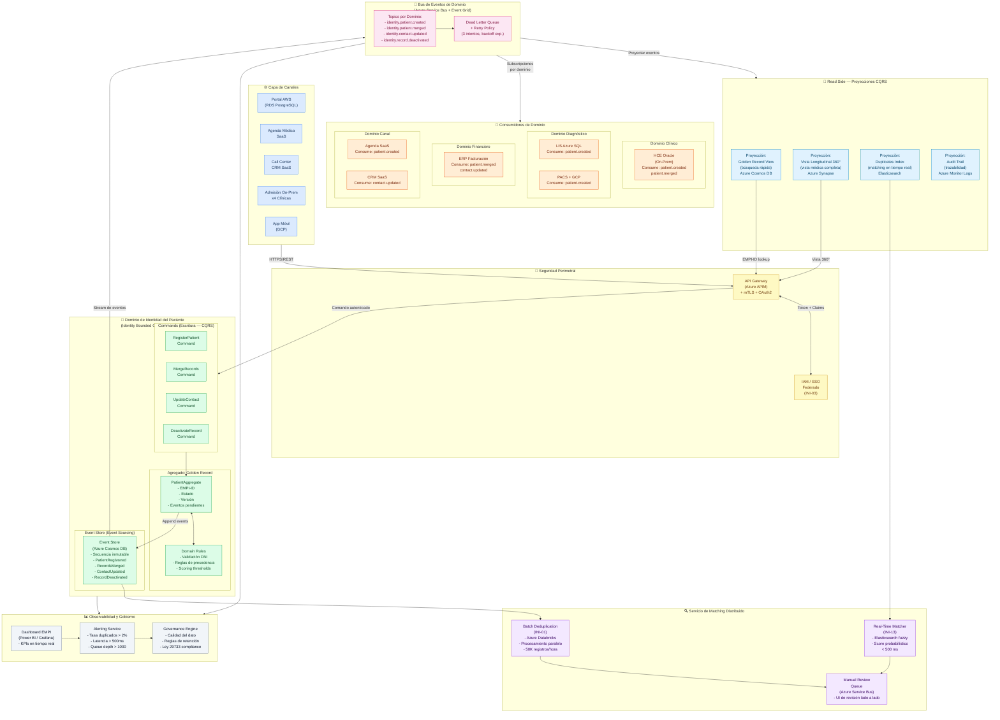
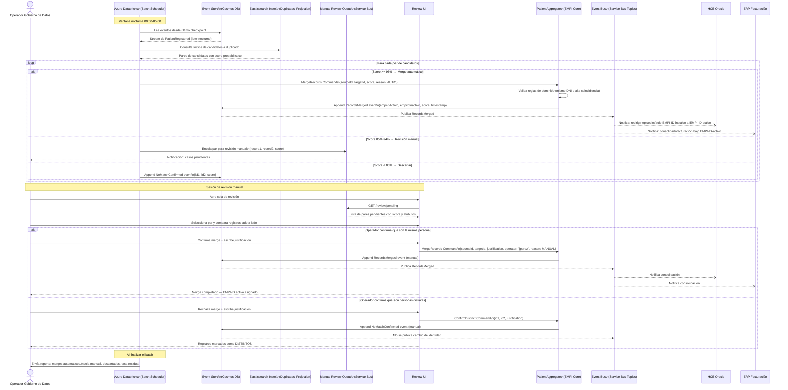
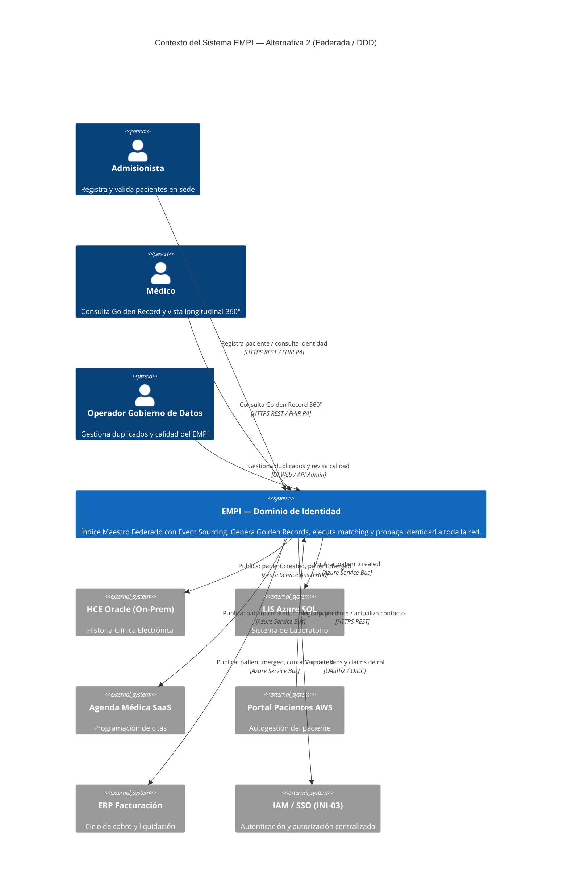

# Alternativa TO BE 2: EMPI Federado con Domain-Driven Design y Event Sourcing

## Diagrama de Arquitectura — Mermaid

---

## Diagrama de Flujo — Escenario: Deduplicación y Fusión de Registros Duplicados

---

## Diagrama C4 — Nivel Contexto: Dominio de Identidad del Paciente

