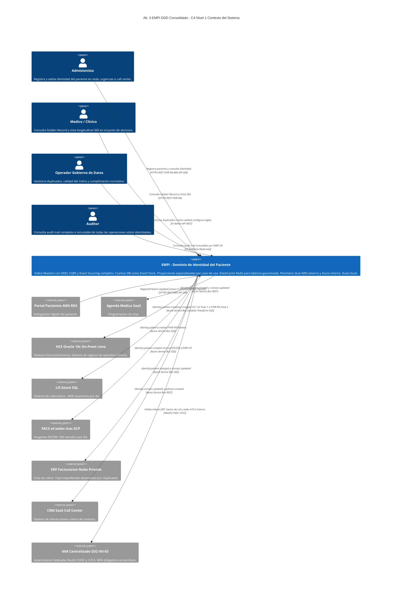

# Alternativa 3 — Diagramas C4 (Niveles 1–3) y ADRs
## EMPI DDD Consolidado: Event Sourcing Completo + Perímetro AWS + Dual-Cloud
## Iniciativa: Identidad Unificada de Pacientes (EMPI) | INI-01 / INI-13
## Clínica SanaRed Integrada — Hito 2

> **Modelo:** DDD + CQRS + Event Sourcing completo (Cosmos DB) + Perímetro AWS + Dual-Cloud.
> Construye la arquitectura correcta para los próximos 10 años sin restricción de cambio mínimo.

---

## ÍNDICE

- [Lineamientos de Arquitectura Aplicados](#lineamientos)
- [Patrones de Arquitectura Aplicados](#patrones)
- [C4 Nivel 1 — Contexto del Sistema](#c4-nivel-1)
- [C4 Nivel 2 — Contenedores](#c4-nivel-2)
- [C4 Nivel 3 — Componentes del EMPI Domain Service](#c4-nivel-3)
- [Architectural Decision Records (ADR)](#adrs)

---

## Lineamientos de Arquitectura Aplicados

| # | Lineamiento | Aplicación en Alt. 3 |
|---|---|---|
| **L-01** | **Seguridad por capas (Defense in Depth)** | Dual gateway: AWS API GW + WAF para canales externos y Azure APIM con mTLS para sistemas internos. RBAC a nivel de Command en PatientAggregate. Cifrado TLS 1.3 en tránsito y AES-256 en Cosmos DB. |
| **L-02** | **Integración por eventos (Event-Driven)** | Cosmos DB Change Feed nativo alimenta el Azure Service Bus con topics semánticos de dominio. DLQ por suscripción con retry backoff. Cero acoplamiento punto a punto. |
| **L-03** | **Observabilidad centralizada** | Grafana unificado conectado a CloudWatch (AWS) y Azure Monitor. Alertas por latencia, tasa de duplicados y profundidad de cola desde ambos planos cloud. |
| **L-04** | **Resiliencia y degradación elegante** | ElastiCache Redis con TTL extendido 24h en modo offline. Circuit breaker con fallback a Redis. DLQ en Service Bus y SQS. Si Elasticsearch falla el matching degrada a búsqueda exacta en Cosmos DB. |
| **L-05** | **Interoperabilidad por estándares** | FHIR R4 como formato nativo de cada evento de dominio. IHE PIXm/PDQm via Azure APIM. Lambda HL7v2 para coexistencia HCE Fase 1. |
| **L-06** | **Trazabilidad e inmutabilidad de auditoría** | El Event Store en Cosmos DB ES el audit log. Cada evento tiene actor, source_sys, timestamp y correlation_id. Imposible que ocurra una operación sin quedar registrada. |
| **L-07** | **Configurabilidad sin redespliegue** | Domain Rules del PatientAggregate (scoring thresholds y reglas de precedencia) gestionadas vía Azure App Configuration. Cache TTL 60s. Sin redeployment. |
| **L-08** | **Cumplimiento normativo incorporado** | Ley 29733: Cosmos DB cifrado AES-256, PIA pre go-live, archivado a Azure Blob Cool Tier a los 12 meses, eliminación segura a los 10 años, datos sintéticos en ambientes no productivos. |

---

## Patrones de Arquitectura Aplicados

| Patrón | Aplicación específica en Alt. 3 |
|---|---|
| **Domain-Driven Design (DDD) — Bounded Context** | El Dominio de Identidad del Paciente es un contexto acotado. PatientAggregate como Aggregate Root con 6 Commands. Los dominios clínico, financiero y canal consumen el EMPI solo a través de eventos publicados. |
| **CQRS (completo)** | Write Side: PatientAggregate persiste eventos en Cosmos DB. Read Side: cuatro proyecciones independientes en Cosmos DB, Elasticsearch, Synapse Analytics y Azure Monitor — cada una optimizada para su caso de uso. |
| **Event Sourcing (completo)** | Estado del Golden Record derivado exclusivamente del stream de eventos en Cosmos DB. Reversión como evento compensatorio MergeReverted. Nunca UPDATE ni DELETE sobre eventos. |
| **Materialized View** | Cuatro proyecciones independientes actualizadas asíncronamente desde el Cosmos DB Change Feed. Elimina joins en tiempo de consulta. El médico recibe la Vista 360 en menos de 2 s. |
| **API Gateway (dual)** | AWS API GW + WAF para tráfico externo. Azure APIM con mTLS para sistemas internos on-prem y Azure. Cada gateway optimizado para su tipo de tráfico. |
| **Cache-Aside / Write-Through** | Redis write-through en RegisterPatient. Absorbe 80% de lookups en menos de 50 ms. Fallback del circuit breaker del API GW. |
| **Event-Driven Architecture (EDA)** | Cosmos DB Change Feed alimenta Azure Service Bus con topics semánticos. Consumidores suscriben por dominio de negocio. Zero acoplamiento directo. |
| **Aggregate Root (DDD)** | PatientAggregate es el único punto de modificación de la identidad. Valida todas las invariantes de negocio antes de aceptar un Command. Sin dependencias de infraestructura. |
| **Saga (Coreografía)** | Batch: Step Functions orquesta el workflow. Databricks ejecuta el cómputo paralelo. Cada partición genera eventos que alimentan el siguiente estado de la saga. |
| **Sidecar / Adapter** | Lambda HL7 Transformer suscrita a queue-hce del Service Bus. Adapter puro sin lógica de negocio. Eliminable en Fase 2 sin afectar el dominio. |
| **Strangler Fig** | Los sistemas fuente migran gradualmente de propietarios de identidad a consumidores del EMPI-ID. Sin reemplazo de golpe. |
| **Master Data Management (MDM)** | El EMPI es el System of Record de identidad. Un único EMPI-ID canónico por paciente en toda la red dual-cloud. |

---

## C4 Nivel 1 — Diagrama de Contexto

---

## C4 Nivel 2 — Diagrama de Contenedores

```mermaid
C4Container
    title Alt. 3 EMPI DDD Consolidado - C4 Nivel 2 Contenedores

    Person(admisionista, "Admisionista / Medico", "Accede desde cualquier canal de la red SanaRed")
    Person(gobDatos, "Operador Gobierno de Datos", "Gestiona duplicados y calidad")

    System_Boundary(aws_plane, "AWS - Perimetro Externo y Orquestacion") {
        Container(apigw, "AWS API Gateway + WAF", "API Gateway WAF Lambda Authorizer", "Perimetro externo canales digitales y admision web. WAF inyecciones. Rate limiting por canal. Circuit breaker a Redis. L-01")
        Container(redis, "ElastiCache Redis", "Redis Multi-AZ", "Cache write-through DNI a EMPI-ID. 80pct lookups en menos 50ms. Modo offline TTL 24h. Fallback circuit breaker. L-04")
        Container(batch_sf, "Step Functions Orchestrator", "AWS Step Functions", "Orquesta batch inicio particion espera Databricks checkpointing reporte. Retoma desde checkpoint. INI-01")
        Container(hl7_lambda, "HL7 Transformer Lambda", "Lambda Node.js", "Adapter FHIR R4 a HL7 v2 para HCE Oracle Fase 1. Se elimina Fase 2. Patron Adapter L-05")
        Container(sqs_dlqs, "SQS Dead Letter Queues", "SQS FIFO DLQ por sistema", "Colas queue-hce queue-lis queue-erp queue-agenda queue-crm queue-pacs. DLQ retry 30s 60s 120s. L-02")
        Container(cloudwatch_aws, "CloudWatch", "CloudWatch SNS", "Metricas y logs perimetro AWS. Alertas latencia error rate queue depth. Dashboard Grafana. L-03")
    }

    System_Boundary(azure_plane, "Azure - Motor de Dominio y Proyecciones") {
        Container(apim, "Azure APIM", "API Management mTLS", "Perimetro interno HCE Oracle LIS ERP. mTLS autenticacion bidireccional por certificado. L-01")
        Container(empi_domain, "EMPI Domain Service", "Azure Container Apps Java Kotlin", "PatientAggregate 6 Commands. Reglas dominio DNI precedencia scoring. Escribe eventos Cosmos DB. Patron DDD CQRS Write Side")
        Container(cosmos_es, "Event Store", "Azure Cosmos DB append-only", "Secuencia inmutable eventos. Change Feed nativo sin polling. EMPI-ID event_type payload actor correlation_id. L-06 Patron Event Sourcing")
        Container(projector_svc, "Event Projector Service", "Azure Container Apps async", "Consume Cosmos Change Feed. Actualiza cuatro proyecciones. Latencia 1 a 5s. Patron Materialized View")
        Container(proj_cosmos, "Golden Record View", "Cosmos DB projection", "Lookup EMPI-ID o DNI. Estado actual Golden Record. Actualizacion menor 1s. Sirve admision ante cache miss")
        Container(proj_elastic, "Duplicate Index", "Elasticsearch Azure Elastic Cloud", "Indice fuzzy nombre fonetico fecha nacimiento celular. Matching tiempo real menor 200ms. Base batch Databricks. RNF-01.1")
        Container(proj_synapse, "Patient 360 View", "Azure Synapse Analytics", "Vista longitudinal materializada HCE LIS PACS Agenda. Respuesta menor 2s sin joins. RF-05 CA-03.5")
        Container(proj_monitor, "Audit Trail", "Azure Monitor Logs", "Proyeccion eventos con correlation_id. Consultable menor 10s. 100pct auditadas. RNF-03.4 CA-05.2")
        Container(service_bus, "Azure Service Bus", "Service Bus Topics", "Topics identity.patient.created merged contact.updated deactivated merge.reverted. Consumidores por dominio. L-02")
        Container(databricks, "Azure Databricks", "Databricks Spark", "Procesamiento paralelo batch. Lee particiones Elasticsearch. Scoring en paralelo mayor 50000 reg por h. INI-01")
        Container(review_ui, "UI Revision Manual", "Azure Container Apps React", "Side-by-side con historial eventos Event Store. Cola FIFO score desc. Justificacion operador. RF-02")
        Container(gov_engine, "Governance Engine", "Azure Container Apps scheduled", "Reporte semanal calidad. Alertas duplicados 2pct. Retencion Ley 29733. Archivado Glacier Blob. RF-07 L-08")
        Container(grafana, "Grafana Dashboard", "Grafana dual CloudWatch AzMonitor", "Dashboard KPIs desde CloudWatch y Azure Monitor. L-03")
    }

    System_Ext(hce_ext, "HCE Oracle 19c", "On-Prem Lima")
    System_Ext(lis_ext, "LIS Azure SQL", "Azure")
    System_Ext(erp_ext, "ERP Facturacion", "Nube Privada")
    System_Ext(agenda_ext, "Agenda SaaS", "SaaS externo")
    System_Ext(iam_svc, "IAM SSO INI-03", "OAuth2 OIDC y mTLS")

    Rel(admisionista, apigw, "HTTPS REST FHIR R4", "TLS 1.3")
    Rel(apigw, redis, "Cache lookup DNI a EMPI-ID", "Redis")
    Rel(apigw, empi_domain, "Command autenticado con JWT claims", "REST TLS")
    Rel(apigw, iam_svc, "Valida token JWT", "OAuth2 OIDC")
    Rel(apim, empi_domain, "Command desde HCE LIS ERP con mTLS", "HTTPS mTLS")
    Rel(apim, iam_svc, "Valida token y certificado cliente", "mTLS")
    Rel(empi_domain, cosmos_es, "Append evento de dominio", "Cosmos SDK TLS")
    Rel(empi_domain, redis, "Write-through nuevo Golden Record", "Redis")
    Rel(cosmos_es, projector_svc, "Change Feed nativo menor 500ms", "Cosmos Change Feed")
    Rel(projector_svc, proj_cosmos, "Actualiza Golden Record View", "Cosmos SDK")
    Rel(projector_svc, proj_elastic, "Actualiza Duplicate Index", "Elasticsearch API")
    Rel(projector_svc, proj_synapse, "Actualiza Patient 360 View", "Synapse pipeline")
    Rel(projector_svc, proj_monitor, "Escribe Audit Trail", "Azure Monitor API")
    Rel(cosmos_es, service_bus, "Change Feed publica evento semantico", "Service Bus SDK")
    Rel(service_bus, sqs_dlqs, "Enruta por sistema destino", "Service Bus SQS bridge")
    Rel(sqs_dlqs, hl7_lambda, "queue-hce trigger Lambda", "SQS")
    Rel(hl7_lambda, hce_ext, "HL7 v2 ADT ORU", "MLLP TCP")
    Rel(sqs_dlqs, lis_ext, "queue-lis FHIR Patient", "SQS REST")
    Rel(sqs_dlqs, erp_ext, "queue-erp patient.merged", "SQS")
    Rel(service_bus, agenda_ext, "identity.patient.created y contact.updated", "Service Bus REST")
    Rel(batch_sf, databricks, "Trigger job con particion y checkpoint", "Databricks API")
    Rel(databricks, proj_elastic, "Lee duplicate candidates", "Elasticsearch API")
    Rel(databricks, empi_domain, "MergeRecords y ConfirmDistinct commands", "REST TLS")
    Rel(review_ui, empi_domain, "MergeRecords y ConfirmDistinct manual", "REST JWT")
    Rel(review_ui, cosmos_es, "Lee historial eventos por EMPI-ID", "Cosmos SDK")
    Rel(gov_engine, proj_monitor, "Consulta metricas de calidad", "Azure Monitor Query")
    Rel(grafana, cloudwatch_aws, "Metricas AWS", "CloudWatch API")
    Rel(grafana, proj_monitor, "Metricas Azure", "Azure Monitor API")
    Rel(gobDatos, review_ui, "Revision de duplicados", "HTTPS")
    Rel(gobDatos, grafana, "KPIs y alertas del EMPI", "HTTPS")
```

---

## C4 Nivel 3 — Diagrama de Componentes (EMPI Domain Service)

```mermaid
C4Component
    title Alt. 3 EMPI DDD Consolidado - C4 Nivel 3 Componentes EMPI Domain Service

    Container_Boundary(domain_svc, "EMPI Domain Service - Azure Container Apps") {
        Component(fhir_adapter, "FHIR R4 Inbound Adapter", "REST Controller FHIR Parser", "Recibe FHIR R4 Patient o JSON canonico. Traduce al modelo de dominio interno. Patron Adapter L-05")
        Component(cmd_bus, "Command Bus", "In-process Command Dispatcher", "Enruta cada Command al Handler. Aplica middlewares de auditoria y validacion. Patron Command Bus Mediator")
        Component(auth_guard, "Auth and RBAC Guard", "JWT Verifier Domain Role Enforcer", "Verifica JWT RS256 desde IAM INI-03. Claims: rol, sede, source_system. Solo OPERADOR_DATOS puede MergeRecords. L-01 RNF-03.1")
        Component(patient_aggregate, "PatientAggregate", "DDD Aggregate Root Domain Model", "Entidad raiz del dominio. Encapsula estado Golden Record e invariantes del negocio. Genera eventos de dominio. Puro modelo de negocio. Patron Aggregate Root DDD")
        Component(domain_rules, "Domain Rules Engine", "Business Rules Azure App Config", "Validacion DNI peruano 8 digitos. Reglas precedencia por source_system. Scoring thresholds 85pct y 95pct desde App Configuration. RNF-06.2 L-07")
        Component(reg_cmd, "RegisterPatient Handler", "Command Handler", "Genera EMPI-ID UUID v7. Invoca Matching Engine. Llama PatientAggregate.register(). Persiste via EventStoreRepository. RF-01 CA-01.1")
        Component(merge_cmd, "MergeRecords Handler", "Command Handler", "Valida score minimo. Llama PatientAggregate.merge(). Inactiva registro secundario. Genera RecordsMerged event. RF-02 RF-03 CA-02.2")
        Component(update_cmd, "UpdateContact Handler", "Command Handler", "Aplica regla de precedencia del Domain Rules Engine. Llama PatientAggregate.updateContact(). Genera ContactUpdated event. RF-04")
        Component(deact_cmd, "DeactivateRecord Handler", "Command Handler", "Transicion a INACTIVO_FUSIONADO o INACTIVO_FALLECIDO. Bloquea citas si reason DECEASED. Genera RecordDeactivated event. RF-06")
        Component(revert_cmd, "RevertMerge Handler", "Command Handler", "Reactiva Golden Record secundario con datos historicos. Genera MergeReverted event con append nunca UPDATE. RF-06 CA-02.4")
        Component(confirm_cmd, "ConfirmDistinct Handler", "Command Handler", "Marca dos registros como NO_MATCH_CONFIRMED. Persiste regla de no-match. RF-02 Scenario 3")
        Component(matching_engine, "Matching Engine", "Probabilistic Scorer", "Pesos: DNI exacto 0.50 nombre Soundex 0.20 fecha nacimiento 0.15 celular 0.10 correo 0.05. Consulta Elasticsearch step 2. Score 0-100pct. RNF-01.1 CA-03.3")
        Component(es_repo, "EventStoreRepository", "Cosmos DB SDK append-only", "Persiste eventos en Cosmos DB con politica append-only. Optimistic locking por version del agregado. Patron Repository Event Sourcing L-06")
        Component(query_svc, "Query Service", "Read Service CQRS Read Side", "Sirve Golden Record desde Cosmos DB. Vista 360 desde Synapse. Cache-aside Redis primero. correlation_id en respuesta. RNF-01.2 RF-05 CA-03.5")
        Component(correlation_mw, "Correlation Middleware", "Request ID Propagator", "Genera correlation_id unico por request. Inyecta en eventos y headers downstream. Trazabilidad end-to-end. L-06")
    }

    Container_Ext(cosmos_ext, "Cosmos DB Event Store", "append-only collection")
    Container_Ext(redis_ext, "ElastiCache Redis", "Cache de lookups")
    Container_Ext(elastic_ext, "Elasticsearch", "Duplicate candidates index")
    Container_Ext(synapse_ext, "Azure Synapse", "Patient 360 projection")
    Container_Ext(appconfig_ext, "Azure App Configuration", "Reglas y umbrales")
    Container_Ext(apigw_ext, "AWS API Gateway y Azure APIM", "Perimetro de seguridad")

    Rel(apigw_ext, fhir_adapter, "Request FHIR R4 con JWT claims", "HTTPS TLS 1.3")
    Rel(fhir_adapter, correlation_mw, "Propaga o genera correlation_id", "interno")
    Rel(fhir_adapter, cmd_bus, "Despacha Command interno", "interno")
    Rel(cmd_bus, auth_guard, "Verifica permisos antes de ejecutar", "interno")
    Rel(cmd_bus, reg_cmd, "RegisterPatient Command", "interno")
    Rel(cmd_bus, merge_cmd, "MergeRecords Command", "interno")
    Rel(cmd_bus, update_cmd, "UpdateContact Command", "interno")
    Rel(cmd_bus, deact_cmd, "DeactivateRecord Command", "interno")
    Rel(cmd_bus, revert_cmd, "RevertMerge Command", "interno")
    Rel(cmd_bus, confirm_cmd, "ConfirmDistinct Command", "interno")
    Rel(cmd_bus, query_svc, "Query Golden Record y Vista 360", "interno")
    Rel(reg_cmd, matching_engine, "Score pre-registro", "interno")
    Rel(merge_cmd, matching_engine, "Valida score minimo para merge", "interno")
    Rel(reg_cmd, patient_aggregate, "PatientAggregate.register()", "interno")
    Rel(merge_cmd, patient_aggregate, "PatientAggregate.merge()", "interno")
    Rel(update_cmd, patient_aggregate, "PatientAggregate.updateContact()", "interno")
    Rel(deact_cmd, patient_aggregate, "PatientAggregate.deactivate()", "interno")
    Rel(revert_cmd, patient_aggregate, "PatientAggregate.revertMerge()", "interno")
    Rel(patient_aggregate, domain_rules, "Consulta reglas y umbrales", "interno")
    Rel(patient_aggregate, es_repo, "Persiste eventos generados", "interno")
    Rel(es_repo, cosmos_ext, "Append evento con optimistic lock", "Cosmos SDK TLS")
    Rel(matching_engine, elastic_ext, "Fuzzy query candidatos step 2", "Elasticsearch API TLS")
    Rel(matching_engine, domain_rules, "Lee umbrales de scoring", "interno")
    Rel(domain_rules, appconfig_ext, "GetConfiguration cache TTL 60s", "Azure SDK")
    Rel(query_svc, redis_ext, "GET por DNI hash o EMPI-ID", "Redis")
    Rel(query_svc, cosmos_ext, "GET Golden Record View si cache miss", "Cosmos SDK")
    Rel(query_svc, synapse_ext, "GET Patient 360 projection", "Synapse SQL TLS")
    Rel(reg_cmd, redis_ext, "Write-through SET empi:dni:hash TTL 300", "Redis")
```

---

# ARCHITECTURAL DECISION RECORDS (ADR)

> Formato: MADR — Markdown Architectural Decision Records
> Estados posibles: PROPUESTO, ACEPTADO, RECHAZADO, OBSOLETO, REEMPLAZADO

---

## ADR-A3-001 — Cosmos DB como Event Store Completo

| Campo | Detalle |
|---|---|
| **ID** | ADR-A3-001 |
| **Título** | Azure Cosmos DB como motor de persistencia del Event Store del EMPI |
| **Estado** | ACEPTADO |
| **Fecha** | 2025-01 |
| **RFs/RNFs relacionados** | RF-01, RF-06, RNF-03.4, RNF-07.2 |

### Contexto
El EMPI requiere un Event Store con semántica append-only, propagación en tiempo real a proyecciones sin polling, consulta eficiente por EMPI-ID y retención de 10 años.

### Opciones evaluadas
| Opción | Resultado |
|---|---|
| **A) Aurora PostgreSQL tabla append-only** | Conocido. Sin Change Feed nativo. Escalabilidad limitada. **Suficiente para una arquitectura híbrida con event log liviano, insuficiente para el Event Sourcing completo que requiere esta alternativa.** |
| **B) Azure Cosmos DB** | Change Feed nativo sin polling. JSON natural para eventos FHIR. Multi-región activable. Serverless en Fase 1. **Aceptado.** |
| **C) EventStoreDB** | Diseñado para Event Sourcing. Sin presencia en SanaRed. Menor soporte cloud managed. **Rechazado.** |

### Decisión
Azure Cosmos DB con colección de eventos append-only enforced a nivel de aplicación. Partition key: empiId para que todos los eventos de un Golden Record estén en la misma partición. Change Feed alimenta al Event Projector y al Service Bus sin polling. Cosmos DB Serverless en Fase 1 para controlar costos.

### Consecuencias
- El equipo debe capacitarse en Cosmos DB SDK y Change Feed antes del go-live.
- Consistencia eventual de proyecciones: menos de 500 ms de lag desde el evento. El canal recibe el EMPI-ID en la respuesta inmediata del Write Side.
- Archivado a Azure Blob Cool Tier a los 12 meses. Retención hasta 10 años.

---

## ADR-A3-002 — ElastiCache Redis como Cache Write-Through

| Campo | Detalle |
|---|---|
| **ID** | ADR-A3-002 |
| **Título** | ElastiCache Redis con write-through para garantizar latencia de admisión menor a 50 ms |
| **Estado** | ACEPTADO |
| **Fecha** | 2025-01 |
| **RFs/RNFs relacionados** | RNF-01.1, RNF-02.3, CA-03.1, CA-06.3 |

### Contexto
La Alt. 3 usa Elasticsearch como proyección de matching. Sin cache, incluso el paso 1 del algoritmo (búsqueda exacta por DNI) requiere consultar Cosmos DB o Elasticsearch (100-300 ms). El 80% de las admisiones son pacientes ya registrados.

### Decisión
Write-through en RegisterPatient exitoso. TTL 5 minutos activo. TTL extendido a 24 horas en modo offline. Fallback del circuit breaker del API GW. Tres claves: empi:dni:{hash}, empi:id:{empiId} y empi:match:{token} con TTL 30s para resultados de scoring recientes.

### Consecuencias
- Redis absorbe el 80% de lookups en menos de 50 ms, muy por debajo del SLA de 500 ms.
- Invalidación explícita en UpdateContact y MergeRecords necesaria para mantener consistencia.

---

## ADR-A3-003 — API Gateway Dual AWS + Azure APIM

| Campo | Detalle |
|---|---|
| **ID** | ADR-A3-003 |
| **Título** | Dual gateway: AWS API GW para tráfico externo y Azure APIM con mTLS para tráfico interno |
| **Estado** | ACEPTADO |
| **Fecha** | 2025-01 |
| **RFs/RNFs relacionados** | RNF-03.1, RNF-03.2, RNF-04.2 |

### Contexto
El EMPI recibe tráfico de canales digitales externos (Portal AWS, App Móvil) e Internet, y de sistemas internos on-premises y Azure (HCE Oracle, LIS, ERP) que operan en redes privadas. Cada tipo requiere mecanismos de autenticación distintos.

### Opciones evaluadas
| Opción | Resultado |
|---|---|
| **A) Solo AWS API GW** | Sin mTLS nativo. HCE Oracle atraviesa Internet. Suboptimo en seguridad interna. **Rechazado.** |
| **B) Solo Azure APIM** | Mayor latencia para canales externos en AWS. Sin WAF comparabledel de AWS. **Rechazado.** |
| **C) AWS API GW externo y Azure APIM interno** | Cada gateway optimizado para su tipo de tráfico. WAF para externos. mTLS para internos. **Aceptado.** |

### Decisión
AWS API GW con WAF para canales digitales externos. Azure APIM con mTLS para HCE Oracle vía ExpressRoute, LIS Azure y ERP en nube privada. Ambos validan contra el mismo IAM INI-03.

### Consecuencias
- Dos configuraciones de seguridad a mantener. Mitigado con IaC Terraform en un repositorio único.
- Se necesita Azure ExpressRoute o VPN Site-to-Site para conectar el HCE Oracle on-prem al Azure APIM con baja latencia.

---

## ADR-A3-004 — Batch: Step Functions Orquesta, Databricks Computa

| Campo | Detalle |
|---|---|
| **ID** | ADR-A3-004 |
| **Título** | Step Functions como orquestador de workflow y Databricks como motor de cómputo paralelo |
| **Estado** | ACEPTADO |
| **Fecha** | 2025-01 |
| **RFs/RNFs relacionados** | RF-02, RNF-01.3, RNF-05.3, CA-02.1 |

### Contexto
El batch debe procesar 126,000 duplicados en no más de 5 ventanas nocturnas de 5 horas. Tasa mínima 50,000 reg/hora. Un fallo a las 3 AM no puede obligar a reiniciar desde el inicio.

### Decisión
Step Functions gestiona el workflow: inicio, partición del índice Elasticsearch, trigger de Databricks, espera, checkpointing y generación del reporte. Databricks Job Cluster on-demand ejecuta el scoring paralelo distribuido sobre múltiples workers. Tasa estimada mayor a 200,000 reg/hora. Cluster Databricks se crea al inicio del batch y se destruye al terminar — sin costo base permanente.

### Consecuencias
- Cold start del cluster Databricks ~3 minutos. Se programa el inicio a las 23:55 para estar listo a las 00:00.
- Checkpoint en Step Functions Execution History. Retoma desde la última partición completada ante fallo.
- Service Principal de Databricks registrado en IAM INI-03 para autenticación de máquina.

---

## ADR-A3-005 — Lambda Transformadora HL7v2 para HCE Oracle Fase 1

| Campo | Detalle |
|---|---|
| **ID** | ADR-A3-005 |
| **Título** | Lambda transformadora como adapter HL7v2 a FHIR R4 para coexistencia con HCE Oracle |
| **Estado** | ACEPTADO |
| **Fecha** | 2025-01 |
| **RFs/RNFs relacionados** | RNF-04.3, CA-04.1 |

### Decisión
Lambda Node.js suscrita a queue-hce del Service Bus. Convierte payload FHIR R4 a HL7 v2 ADT^A28 y entrega al HCE via MLLP/TCP. Adapter puro sin lógica de negocio. En Fase 2, se desconecta sin afectar el Event Store ni el Domain Service.

### Consecuencias
- Concurrencia reservada en Lambda. DLQ y alertas CloudWatch si error rate mayor a 0%.
- Formato HL7 v2 parametrizable en configuración para adaptarse a la versión del HCE Oracle.

---

## ADR-A3-006 — CQRS Completo con Cuatro Proyecciones Especializadas

| Campo | Detalle |
|---|---|
| **ID** | ADR-A3-006 |
| **Título** | CQRS completo con proyecciones independientes en Cosmos DB, Elasticsearch, Synapse y Azure Monitor |
| **Estado** | ACEPTADO |
| **Fecha** | 2025-01 |
| **RFs/RNFs relacionados** | RF-05, RNF-01.1, RNF-01.2, CA-03.1, CA-03.5 |

### Contexto
Cuatro patrones de acceso radicalmente distintos que no pueden optimizarse con un único modelo de datos.

### Decisión

| Proyección | Tecnología | Caso de uso | Latencia objetivo |
|---|---|---|---|
| golden_record_view | Cosmos DB projection | Lookup admision | Menor a 1 s |
| duplicate_candidates | Elasticsearch | Matching fuzzy y batch | Menor a 200 ms |
| patient_360_longitudinal | Azure Synapse Analytics | Vista medica completa | Menor a 2 s |
| audit_trail | Azure Monitor Logs | Trazabilidad | Menor a 10 s |

Todas actualizadas asíncronamente por el Event Projector desde el Cosmos DB Change Feed. Write Side nunca consultado directamente por operaciones de lectura.

### Consecuencias
- El equipo opera cuatro tecnologías de lectura. Justificado por los distintos SLAs de latencia.
- Si Elasticsearch falla, el matching degrada a búsqueda exacta en la proyección Cosmos DB sin pérdida de historial.

---

## ADR-A3-007 — RBAC con JWT Claims, SSO Federado y MFA

| Campo | Detalle |
|---|---|
| **ID** | ADR-A3-007 |
| **Título** | RBAC basado en claims JWT con SSO federado y MFA obligatorio para operaciones de escritura |
| **Estado** | ACEPTADO |
| **Fecha** | 2025-01 |
| **RFs/RNFs relacionados** | RNF-03.1, RNF-03.2, CA-05.1 |

### Decisión
Todos los endpoints requieren token JWT del IAM INI-03 con claims: rol, sede y source_system. El PatientAggregate valida que el rol tiene permiso para el Command antes de ejecutarlo. MFA obligatorio para OPERADOR_DATOS y ADMINISTRADOR.

### Consecuencias
- Fallback JWT básico en Fase 1 semana 1. SSO federado completo antes del go-live.
- Los médicos afiliados reciben el claim sede actualizado en cada autenticación — sin permisos heredados de sedes anteriores.

---

## ADR-A3-008 — Event Store como Audit Log Primario e Inmutable

| Campo | Detalle |
|---|---|
| **ID** | ADR-A3-008 |
| **Título** | El Event Store en Cosmos DB ES el audit log — no hay log secundario |
| **Estado** | ACEPTADO |
| **Fecha** | 2025-01 |
| **RFs/RNFs relacionados** | RNF-03.4, RNF-07.2, CA-05.2, L-06 |

### Contexto
El Anexo señala que la auditoría requiere consultar logs separados de múltiples sistemas sin correlación única. RNF-03.4 exige 100% de operaciones auditadas.

### Decisión
Cosmos DB Event Store es la fuente de auditoría primaria. Cada evento tiene actor, source_sys, timestamp y correlation_id. La proyección audit_trail en Azure Monitor es una vista consultable derivada del Change Feed. Los errores se corrigen con eventos compensatorios, nunca con DELETE. Archivado a Azure Blob Cool Tier a los 12 meses. Retención 10 años.

### Consecuencias
- Imposible que ocurra una operación sin quedar registrada en el Event Store.
- El equipo de auditoría consulta todos los eventos de un EMPI-ID sin acceder a sistemas clínicos individuales.

---

## ADR-A3-009 — Versionado Semántico de la API con Soporte 6 Meses

| Campo | Detalle |
|---|---|
| **ID** | ADR-A3-009 |
| **Título** | Versionado en URL con soporte mínimo de 6 meses para versiones anteriores |
| **Estado** | ACEPTADO |
| **Fecha** | 2025-01 |
| **RFs/RNFs relacionados** | RNF-04.4 |

### Decisión
API versionada en URL: /empi/v1/patients. Breaking changes solo en versión mayor. La versión anterior se mantiene operativa durante al menos 6 meses desde el aviso de deprecación. AWS API GW y Azure APIM enrutan por prefijo de versión.

### Consecuencias
- En Fase 1 solo existe v1. El versionado se activa con la migración HCE a FHIR R4 en Fase 2.
- Los sistemas consumidores tienen 6 meses para migrar sin interrupción forzada.

---

## ADR-A3-010 — Modo Degradado Offline para Sedes con Redis TTL Extendido

| Campo | Detalle |
|---|---|
| **ID** | ADR-A3-010 |
| **Título** | Activación automática del modo cache-offline ante pérdida de conectividad de sede |
| **Estado** | ACEPTADO |
| **Fecha** | 2025-01 |
| **RFs/RNFs relacionados** | RNF-02.3, CA-04.2 |

### Contexto
En febrero de 2024, la pérdida de conectividad de una sede generó 1,400 admisiones en contingencia con 260 inconsistencias posteriores.

### Decisión
Redis extiende el TTL a 24 horas cuando el health check al EMPI falla por más de 10 segundos. Las admisiones offline se encolan en SQS localmente. Al reconectar, los eventos se procesan con matching prioritario. Los duplicados de contingencia se marcan con source CONTINGENCY para revisión prioritaria.

### Consecuencias
- Ventana máxima de inconsistencia: 24 horas (TTL del cache offline).
- Los nuevos pacientes en modo offline que ya existen en el EMPI generan duplicados detectados en el primer matching post-reconexión y resueltos en cola prioritaria.

---

*Documento generado para Hito 2 — Iniciativa EMPI | Clinica SanaRed Integrada*
*Alternativa 3: EMPI DDD Consolidado Dual-Cloud — C4 Niveles 1 a 3 y 10 ADRs en formato MADR*
