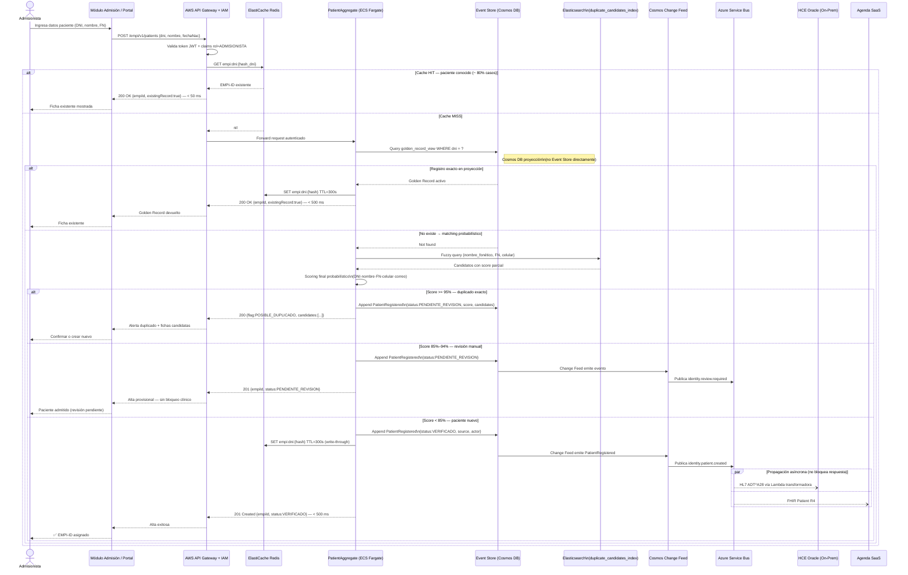
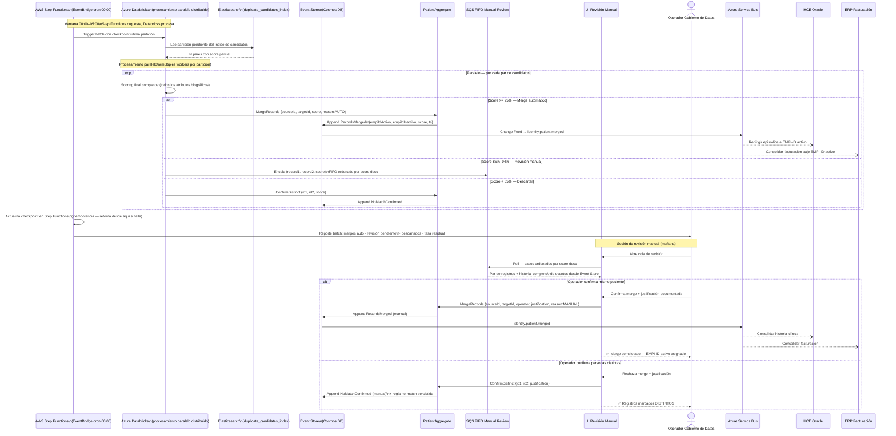
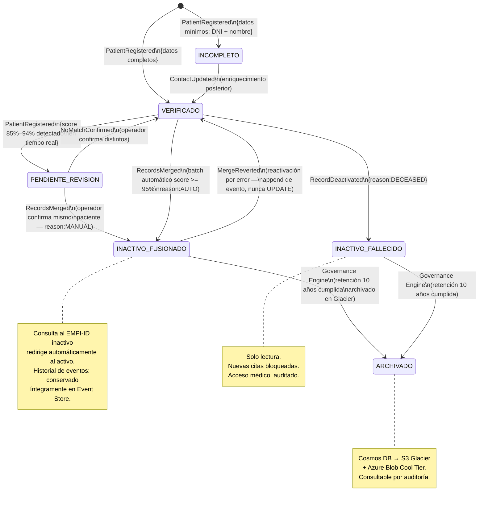
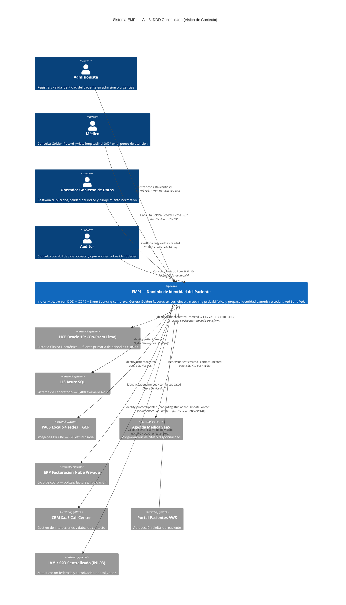

# Alternativa TO BE 3: EMPI DDD Consolidado — Event Sourcing Completo + Infraestructura de Producción Dual-Cloud

> **Principio rector:** Partir del modelo de dominio puro de la Alt. 2 (DDD + CQRS + Event Sourcing completo)
> e incorporar la solidez operativa probada de la Alt. 1: Redis Cache para latencia garantizada,
> AWS API Gateway como perímetro de seguridad unificado, Step Functions para orquestación batch con
> checkpointing, y el transformador HL7v2↔FHIR R4 para coexistencia con sistemas heredados.
> Sin restricciones de cambio mínimo — se construye la arquitectura correcta para los próximos 10 años.

---

## Diagrama de Arquitectura Principal — Mermaid

```mermaid
flowchart TD

    subgraph CANALES["🌐 Capa de Canales — Entrada de Identidad"]
        direction LR
        PA["Portal AWS\n(RDS PostgreSQL)"]
        AS["Agenda Médica\nSaaS"]
        CC["Call Center\nCRM SaaS"]
        ADM["Módulos Admisión\nOn-Prem x4 sedes"]
        APP["App Móvil\niOS/Android"]
        TELE["Teleconsulta\nSaaS"]
    end

    subgraph PERIMETER["🔐 Perímetro de Seguridad Unificado\n(Lo mejor de Alt.1: AWS API GW + Alt.2: mTLS interno)"]
        direction TB
        APIGW["AWS API Gateway\n(canal externo / inter-sistema)\n+ Rate Limiting por canal\n+ Circuit Breaker\n+ WAF integrado\n+ Logging centralizado"]
        APIGW_INT["Azure APIM\n(gateway interno para sistemas on-prem\ny Azure — mTLS)\nHCE Oracle · LIS · ERP"]
        IAM["IAM Centralizado\n+ SSO Federado\n+ MFA obligatorio escritura\n(INI-03)\nOAuth2/OIDC · token claims por rol y sede"]
        APIGW <-->|"Token validation\nOAuth2/OIDC"| IAM
        APIGW_INT <-->|"mTLS +\ntoken claims"| IAM
    end

    subgraph IDENTITY_DOMAIN["🧠 Dominio de Identidad del Paciente\n— Identity Bounded Context —\n(AWS ECS Fargate — multi-AZ)"]
        direction TB

        subgraph CMD["✏️ Write Side — Commands (CQRS)"]
            direction LR
            C1["RegisterPatient\nCommand"]
            C2["MergeRecords\nCommand"]
            C3["UpdateContact\nCommand"]
            C4["DeactivateRecord\nCommand"]
            C5["RevertMerge\nCommand"]
            C6["ConfirmDistinct\nCommand"]
        end

        subgraph AGG["🏛️ PatientAggregate — Núcleo del Dominio"]
            direction TB
            PA_AGG["PatientAggregate\n- EMPI-ID (UUID v7 — ordenable por tiempo)\n- Estado del registro\n- Versión (optimistic locking)\n- Eventos de dominio pendientes"]
            RULES["Domain Rules\n- Validación DNI peruano (8 dígitos)\n- Reglas de precedencia por sistema fuente\n- Scoring thresholds (configurables en caliente)\n- Política de inactivación y retención"]
            PA_AGG <--> RULES
        end

        subgraph ES["📋 Event Store — Azure Cosmos DB\n(Change Feed nativo → propagación sin polling)"]
            direction TB
            EV1["PatientRegistered\n{empiId, dni, nombre, FN, source, actor, ts}"]
            EV2["RecordsMerged\n{empiIdActivo, empiIdInactivo, score,\nreason:AUTO|MANUAL, actor, justification}"]
            EV3["ContactUpdated\n{empiId, field, oldVal, newVal,\nsource, precedence_applied}"]
            EV4["RecordDeactivated\n{empiId, reason:MERGED|DECEASED,\nactor, ts}"]
            EV5["MergeReverted\n{empiId, reactivated, actor,\njustification, ts}"]
            EV6["NoMatchConfirmed\n{id1, id2, score, actor, reason}"]
        end

        CMD --> AGG
        AGG -->|"Append-only\nevento de dominio"| ES
    end

    subgraph CACHE_LAYER["⚡ Capa de Caché de Alta Disponibilidad\n(Alt.1: ElastiCache Redis — garantía de latencia < 50 ms)"]
        direction LR
        REDIS["ElastiCache Redis Cluster\n(Multi-AZ — replicación sync)\n- empi:dni:{hash} → EMPI-ID  TTL 5 min\n- empi:id:{empiId} → Golden Record summary\n- empi:match:{token} → score cache 30s\n- Modo offline sede: TTL extendido 24h\n- Write-through en cada new Golden Record"]
    end

    subgraph READ_SIDE["📖 Read Side — Proyecciones CQRS Especializadas\n(cada proyección optimizada para su caso de uso)"]
        direction LR

        subgraph PROJ_COSMOS["Azure Cosmos DB — Búsqueda operativa"]
            P1["golden_record_view\n(lookup EMPI-ID / DNI)\nActualización: < 1 s desde evento\nConsistencia: sesión"]
        end

        subgraph PROJ_ES["Elasticsearch — Matching fuzzy"]
            P2["duplicate_candidates_index\n(matching fonético + probabilístico)\nActualización: < 2 s\nConsulta: < 200 ms"]
        end

        subgraph PROJ_SYNAPSE["Azure Synapse Analytics — Vista clínica"]
            P3["patient_360_longitudinal\n(vista médica completa multi-fuente)\nActualización: < 5 s\nCombina: HCE + LIS + PACS + Agenda"]
        end

        subgraph PROJ_MONITOR["Azure Monitor Logs — Auditoría"]
            P4["audit_trail_projection\n(traza completa por EMPI-ID)\nConsultable en < 10 s\nRetención: 12 meses hot + Glacier 10 años"]
        end
    end

    subgraph MATCHING["🔍 Servicio de Matching Distribuido\n(Alt.2: Elasticsearch fuzzy + Alt.1: Redis pre-filtro)"]
        direction TB
        RT_MATCH["Real-Time Matcher (INI-13)\nEstrategia en 3 pasos:\n1. Redis lookup exacto DNI → < 10 ms\n2. Elasticsearch fuzzy nombre+FN → < 200 ms\n3. Scoring probabilístico candidatos → P95 < 500 ms"]
        BATCH_SVC["Batch Deduplication (INI-01)\nAzure Databricks + AWS Step Functions\nDatabricks: procesamiento paralelo distribuido\nStep Functions: orquestación + checkpointing\n(lo mejor de Alt.1 + Alt.2)"]
        REVIEW_Q["Manual Review Queue\nAWS SQS FIFO\n(prioridad por score desc)\n85%–94% → operador\nUI side-by-side + historial eventos"]
        RT_MATCH --> REVIEW_Q
        BATCH_SVC --> REVIEW_Q
    end

    subgraph EVENT_BUS["📡 Bus de Eventos de Dominio\n(Alt.2: Azure Service Bus semántico + Alt.1: AWS SQS confiabilidad)"]
        direction TB
        CF["Cosmos DB Change Feed\n(trigger nativo sin polling)\nEmite eventos en < 500 ms post-commit"]
        SB_TOPICS["Azure Service Bus Topics\n(eventos semánticos de dominio)\n- identity.patient.created\n- identity.patient.merged\n- identity.contact.updated\n- identity.record.deactivated\n- identity.merge.reverted"]
        SQS_DLQ["AWS SQS Dead Letter Queues\n(por sistema destino)\n- dlq-hce · dlq-lis · dlq-erp\n- dlq-agenda · dlq-crm · dlq-pacs\nRetry backoff: 30s · 60s · 120s"]
        HL7_TF["Transformador HL7v2 ↔ FHIR R4\n(AWS Lambda)\nCoexistencia Fase 1 → Fase 2\nHCE Oracle recibe HL7 v2 sin cambios"]
        CF --> SB_TOPICS
        SB_TOPICS --> SQS_DLQ
        SQS_DLQ --> HL7_TF
    end

    subgraph CONSUMERS["🏥 Consumidores por Dominio de Negocio"]
        direction TB

        subgraph DOM_CLIN["Dominio Clínico"]
            HCE["⚙️ HCE Oracle 19c On-Prem\nFase 1: HL7 v2 ADT (sin cambio)\nFase 2: FHIR R4 Patient resource\nConsume: patient.created · patient.merged"]
            PACS["📁 PACS x4 sedes + GCP\nConsume: patient.created\nVincula DICOM a EMPI-ID"]
        end

        subgraph DOM_DIAG["Dominio Diagnóstico"]
            LIS["🗄️ LIS Azure SQL\nConsume: patient.created\n3,400 exámenes/día → EMPI-ID"]
        end

        subgraph DOM_FIN["Dominio Financiero"]
            ERP["💼 ERP Facturación\nConsume: patient.merged · contact.updated\nReduce expedientes observados 13%"]
            PAY["💳 Portal Pagos Azure\nConsume: contact.updated"]
        end

        subgraph DOM_CANAL["Dominio Canal"]
            AGN_C["📅 Agenda Médica SaaS\nConsume: patient.created · contact.updated\nReemplaza sync demorada (horas → < 30 s)"]
            CRM_C["📞 CRM SaaS\nConsume: contact.updated · patient.created"]
            TELE_C["🎥 Teleconsulta SaaS\nConsume: patient.created\nFutura integración estructurada"]
        end
    end

    subgraph OBS["📊 Observabilidad, Gobierno y Calidad\n(INI-06a / INI-06c)"]
        direction LR
        DASH["Dashboard EMPI\nGrafana (fuente dual:\nAWS CloudWatch + Azure Monitor)\nKPIs tiempo real"]
        ALERT["Alerting Service\nAWS CloudWatch Alarms\n+ Azure Monitor Alerts\n- Duplicados > 2%\n- Latencia P95 > 500ms\n- Queue depth > 1,000\n- Error rate > 0.1%"]
        GOV["Governance Engine\n- Reporte semanal calidad (RF-07)\n- Cumplimiento Ley 29733\n- PIA documentada\n- Retención: 10 años (RNF-07.2)\n- Archivado automático Glacier"]
        REVIEW_UI["UI Revisión Manual\nAWS ECS Fargate\nSide-by-side + historial\ncompleto de eventos\n(Event Store como fuente)"]
        DASH --> ALERT
        ALERT --> GOV
    end

    %% ─── FLUJOS PRINCIPALES ──────────────────────────────────────────

    CANALES -->|"HTTPS REST / FHIR R4"| APIGW
    APIGW -->|"Request autenticado\n+ claims de rol"| IDENTITY_DOMAIN

    %% Write → Cache + Event Store
    AGG -->|"Write-through\nnew Golden Record"| CACHE_LAYER
    ES -->|"Change Feed\n< 500 ms"| EVENT_BUS

    %% Cache en read path — garantía de latencia Alt.1
    APIGW -->|"Lookup rápido\nDNI → EMPI-ID"| CACHE_LAYER
    CACHE_LAYER -->|"Miss → fallback\na proyección"| READ_SIDE

    %% Event Bus → proyecciones Read Side
    EVENT_BUS -->|"Proyectar eventos\npor tipo"| READ_SIDE

    %% Matching consume proyecciones
    P2 --> RT_MATCH
    ES --> BATCH_SVC

    %% Read side responde queries
    READ_SIDE -->|"Consulta Golden Record\n/ Vista 360°"| APIGW

    %% Propagación a consumidores
    EVENT_BUS -->|"Notificación semántica\npor dominio"| CONSUMERS

    %% Gateway interno para sistemas on-prem y Azure
    APIGW_INT -->|"HCE / LIS / ERP\nsolicitudes de consulta"| IDENTITY_DOMAIN
    CONSUMERS -->|"Acknowledgment\npor cola"| SQS_DLQ

    %% Batch
    BATCH_SVC -->|"Lee duplicate_candidates\nindex"| P2
    BATCH_SVC -->|"MergeRecords /\nConfirmDistinct commands"| IDENTITY_DOMAIN
    REVIEW_Q -->|"Cola revisión"| OBS

    %% Gobierno y observabilidad
    OBS <-->|"Métricas, logs\ny eventos"| IDENTITY_DOMAIN
    OBS <-->|"Audit trail\nproyección"| READ_SIDE

    %% Estilos
    classDef canal    fill:#dbeafe,stroke:#3b82f6,color:#1e3a5f
    classDef perim    fill:#fef9c3,stroke:#ca8a04,color:#713f12
    classDef domain   fill:#dcfce7,stroke:#16a34a,color:#14532d
    classDef evstore  fill:#f0fdf4,stroke:#15803d,color:#14532d
    classDef cache    fill:#fff7ed,stroke:#c2410c,color:#7c2d12
    classDef read     fill:#e0f2fe,stroke:#0284c7,color:#0c4a6e
    classDef match    fill:#f3e8ff,stroke:#9333ea,color:#3b0764
    classDef evtbus   fill:#fce7f3,stroke:#db2777,color:#831843
    classDef consumer fill:#ffedd5,stroke:#ea580c,color:#7c2d12
    classDef obs      fill:#f1f5f9,stroke:#64748b,color:#0f172a

    class PA,AS,CC,ADM,APP,TELE canal
    class APIGW,APIGW_INT,IAM perim
    class C1,C2,C3,C4,C5,C6,PA_AGG,RULES domain
    class EV1,EV2,EV3,EV4,EV5,EV6 evstore
    class REDIS cache
    class P1,P2,P3,P4 read
    class RT_MATCH,BATCH_SVC,REVIEW_Q match
    class CF,SB_TOPICS,SQS_DLQ,HL7_TF evtbus
    class HCE,PACS,LIS,ERP,PAY,AGN_C,CRM_C,TELE_C consumer
    class DASH,ALERT,GOV,REVIEW_UI obs
```

---

## Diagrama de Secuencia — Alta de Paciente Nuevo (Tiempo Real)

---

## Diagrama de Secuencia — Deduplicación Batch con Checkpointing (INI-01)

---

## Diagrama de Estados — Golden Record (Event Sourcing Completo)

---

## Diagrama C4 — Contexto del Sistema EMPI (Alternativa 3)

