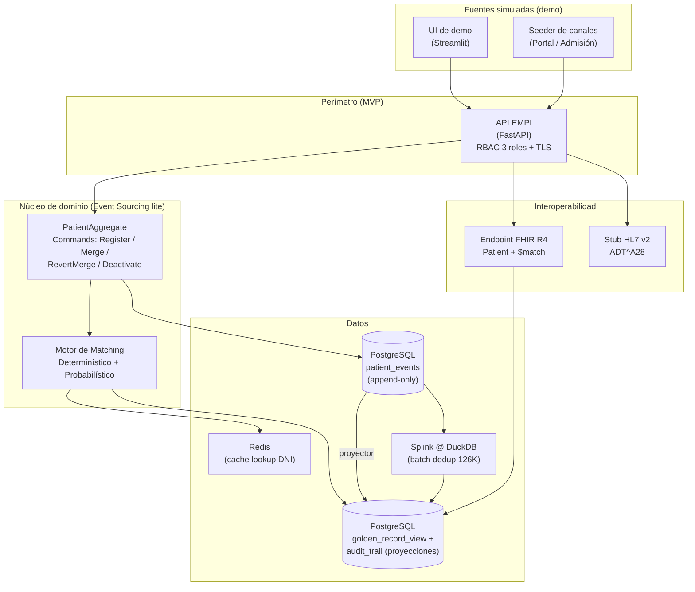
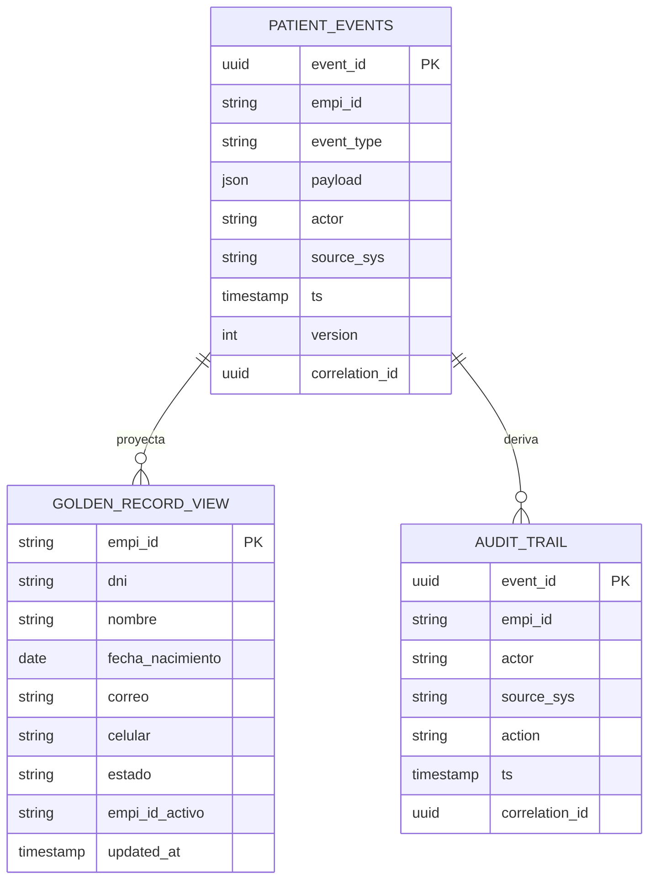
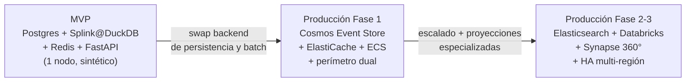

# Propuesta de MVP — EMPI (Identidad Unificada de Pacientes)
## Clínica SanaRed Integrada | Hito 3 | Iniciativas INI-01 (Batch) + INI-13 (Tiempo Real)

> **Objetivo del documento:** definir un MVP **construible y demostrable** que pruebe el valor central del EMPI —identidad única + deduplicación + vista 360° básica— con un stack realista, contenerizado y multicloud-portable, manteniéndose **fiel a la Alternativa 3** (DDD + Event Sourcing) pero sin su complejidad de producción de 3 nubes.

---

## 1. Filosofía del MVP: "reducido pero fiel"

El diseño elegido en el Hito 2 (Alt. 3, dual-cloud, Event Sourcing + CQRS + Cosmos DB + Elasticsearch + Databricks + Synapse + Redis + Step Functions + ECS + doble API Gateway) es una arquitectura **de producción**. El propio documento reconoce el riesgo: *"DDD + CQRS + Event Sourcing son avanzados para el equipo"* y *"complejidad operacional dual-cloud"*.

El MVP **no reproduce esa infraestructura**. En su lugar, implementa **los mismos patrones** con componentes ligeros, ejecutables localmente con un solo comando (`docker compose up`) y desplegables a cualquier nube sin reescribir código. Cada componente del MVP tiene una **contraparte de producción directa** (ver §4), de modo que el MVP no es un prototipo desechable, sino el **kernel evolutivo** de la Alt. 3.

**Los tres resultados que el MVP debe demostrar (la prueba de valor):**

1. **Identidad única** — un paciente = un `EMPI-ID` canónico, sin importar el canal de registro.
2. **Deduplicación medible** — reducir un corpus sintético de duplicados con métricas de precisión/recall verificables.
3. **Continuidad clínica** — resolver el escenario del *paciente anticoagulado*: consultar la vista 360° y encontrar el antecedente que hoy no aparece.

---

## 2. Alcance del MVP (dentro / fuera)

### 2.1 Requerimientos funcionales — subset del MVP

| RF (Hito 2) | En MVP | Alcance en el MVP |
|---|:---:|---|
| **RF-01** Creación de Golden Record (EMPI-ID único) | ✅ **Completo** | Alta desde API con generación de EMPI-ID, estado `VERIFICADO`/`INCOMPLETO`, evento `PatientRegistered`. |
| **RF-02** Matching y deduplicación batch (INI-01) | ✅ **Completo** | Batch sobre corpus sintético con clasificación auto-merge / revisión / descarte + reporte. |
| **RF-03** Matching en tiempo real (INI-13) | 🟡 **Núcleo** | Prevención de nuevos duplicados en el alta (exacto por DNI + probabilístico). Sin multi-región. |
| **RF-04** Integración con sistemas fuente | 🟡 **Simulado** | 2 "fuentes" simuladas (Portal, Admisión) publicando por API/eventos. HCE representado por un stub HL7v2→FHIR. |
| **RF-05** Búsqueda y consulta / vista 360° | ✅ **Básico** | Búsqueda por EMPI-ID y por atributos; vista 360° que consolida datos de fuentes simuladas. |
| **RF-06** Ciclo de vida (inactivación, reversión, deceso) | 🟡 **Parcial** | Solo inactivación post-fusión y reversión de merge (por su valor en la demo). Deceso → fuera. |
| **RF-07** Gobierno y calidad del dato | 🟡 **Métricas** | Panel simple con tasa de duplicados residual y cola de revisión. Alertas automáticas → fuera. |

### 2.2 Requerimientos no funcionales — subset del MVP

| RNF | En MVP | Nivel exigido en el MVP |
|---|:---:|---|
| **RNF-01** Latencia (P95 ≤ 500 ms) | ✅ | Medido en local sobre dataset de prueba. Objetivo demostrativo, no SLA productivo. |
| **RNF-02** Disponibilidad 99.9% / RTO-RPO / offline | ❌ | Fuera. El MVP corre en un nodo. HA y modo offline se documentan como evolución. |
| **RNF-03** Seguridad (RBAC, cifrado, auditoría) | 🟡 | RBAC de 3 roles + audit trail nativo (eventos) + TLS local. MFA/SSO federado → fuera. |
| **RNF-04** Interoperabilidad FHIR R4 / HL7 v2 | ✅ | Endpoint FHIR R4 `Patient` + stub HL7 v2 `ADT^A28`. Es diferencial del MVP. |
| **RNF-05** Escalabilidad ante picos | ❌ | Fuera. Se prueba en producción (autoscaling). |
| **RNF-06** Observabilidad | 🟡 | Logs estructurados + métricas básicas (Prometheus/consola). |
| **RNF-07** Ley 29733 | 🟡 | Datos **100% sintéticos** (cumple por diseño). PIA documentada como pendiente pre-producción. |

**Regla de oro del MVP:** todo dato es **sintético**; ningún dato real de paciente entra al MVP. Esto satisface RNF-07/CA-05.4 automáticamente y elimina el riesgo regulatorio durante la demostración.

---

## 3. Escenarios de demostración (guion de la demo)

Los cuatro escenarios provienen directamente del caso y de los Gherkin del Hito 2:

| # | Escenario | RF que ejercita | Qué prueba |
|---|---|---|---|
| **E1** | Registro de paciente nuevo → genera EMPI-ID en < 3 s | RF-01 | Identidad canónica |
| **E2** | Portal y Admisión registran al **mismo DNI** → el sistema devuelve el EMPI-ID existente, no crea duplicado | RF-03 | Prevención de nuevos duplicados |
| **E3** | **Batch** sobre 126,000 registros sintéticos → reduce ≥ 60% con precisión ≥ 98% / recall ≥ 90% | RF-02 | Resolución del problema heredado |
| **E4** | **Paciente anticoagulado**: llega a Emergencia con un registro; su antecedente está en otra "sede". La vista 360° lo consolida bajo el EMPI-ID y el médico lo ve | RF-05 | Continuidad asistencial (el caso crítico) |
| **E5** *(opcional)* | Dependiente familiar → EMPI-ID propio con relación `DEPENDIENTE_DE`, sin fusión | RF-03 | No sobre-fusionar |

---

## 4. Arquitectura del MVP y su mapeo a producción (Alt. 3)

### 4.1 Mapa de trazabilidad MVP ↔ Alt. 3 de producción

| Componente MVP | Contraparte Alt. 3 (producción) | Patrón preservado |
|---|---|---|
| Tabla `patient_events` append-only (PostgreSQL) | Azure Cosmos DB Event Store + Change Feed | **Event Sourcing** (fuente de verdad = eventos) |
| Proyector síncrono → `golden_record_view` | Proyector async desde Change Feed (ECS Fargate) | **CQRS** (lectura ≠ escritura) |
| Vista `audit_trail` derivada de eventos | `audit_trail_projection` (Azure Monitor) | **Auditoría nativa** + `correlation_id` |
| Redis local | ElastiCache Redis write-through | **Cache como acelerador** |
| `jellyfish`/`rapidfuzz` + `pg_trgm` (blocking) | Elasticsearch fuzzy + Real-Time Matcher | **Matching en 3 pasos con early-exit** |
| **Splink @ DuckDB** (batch) | Databricks + Step Functions | **Linkage probabilístico masivo** (backend swappable) |
| FastAPI + RBAC | AWS API GW (WAF) + Azure APIM (mTLS) | **Perímetro único + claims de rol/sede** |
| Stub Lambda HL7v2→FHIR | Lambda transformadora + `queue-hce` | **HCE sin cambios en Fase 1** |
| Docker Compose | ECS/AKS/Kubernetes multicloud | **Contenedores portables** |

> El punto clave: **Splink** se usa en el MVP sobre DuckDB (local, cero infraestructura) y en producción se cambia el *backend* a Spark/Databricks, BigQuery o Athena **sin reescribir la lógica de matching**. Es el puente natural MVP → producción → multicloud (ver documento `02_Estrategia_Multicloud_Alternativas.md`).

---

## 5. Stack tecnológico del MVP

| Capa | Tecnología | Justificación |
|---|---|---|
| **API / dominio** | Python 3.12 + **FastAPI** | Rápido de construir; OpenAPI 3.0 automático (RNF-06.3). |
| **Event store + proyecciones** | **PostgreSQL 16** (tabla append-only + vistas) | Emula Event Sourcing + CQRS sin Cosmos DB. `pg_trgm` para blocking. |
| **Cache** | **Redis 7** | Mismo patrón write-through que ElastiCache. |
| **Matching tiempo real** | `jellyfish` (Jaro-Winkler, Double Metaphone, Soundex) + `rapidfuzz` | Fonético para español ("Jhuan"/"Juan"); determinístico por DNI. |
| **Matching batch** | **Splink** sobre **DuckDB** | Linkage probabilístico (Fellegi-Sunter); backend swappable a Spark/BigQuery. |
| **Interoperabilidad** | `fhir.resources` (FHIR R4) + serializador HL7 v2 | Endpoint `Patient` + `$match`; stub `ADT^A28`. |
| **UI de demo** | **Streamlit** | Cola de revisión manual + vista 360° + panel de métricas en horas, no días. |
| **Datos sintéticos** | **Faker** (locale `es_PE`) + inyector de ruido | Genera 126K registros con duplicados etiquetados (ground truth). |
| **Orquestación** | **Docker Compose** | `docker compose up` levanta todo el MVP. |
| **IaC (bridge multicloud)** | **Terraform** (esqueleto) | Demuestra despliegue idéntico a EKS/AKS/GKE. |
| **Observabilidad** | Logs estructurados (JSON) + Prometheus opcional | Métricas de latencia y throughput. |

---

## 6. Motor de matching del MVP (el corazón técnico)

### 6.1 Tiempo real — estrategia de 3 pasos con *early exit* (fiel a Alt. 3 §2.6)

1. **Determinístico exacto** — hash del DNI en Redis → si hit, devuelve EMPI-ID en < 10 ms. Cubre el ~80% de admisiones conocidas.
2. **Blocking** — si miss, `pg_trgm` recupera candidatos por similitud de nombre + rango de fecha de nacimiento (±1 año) + celular parcial.
3. **Scoring probabilístico** — sobre los candidatos, se pondera con Jaro-Winkler (nombre), Double Metaphone (fonético), igualdad de fecha y celular. Produce un `match_score` ∈ [0,1].

### 6.2 Batch (INI-01) — Splink sobre DuckDB

Splink entrena un modelo Fellegi-Sunter (EM) y calcula pesos por comparación, generando pares con probabilidad de match. El corpus de 126K se resuelve en una sola ejecución local.

### 6.3 Reconciliación de umbrales (¡importante!)

El Hito 1 y el Hito 2 usan umbrales distintos. **El MVP fija un único criterio canónico** y lo deja configurable en caliente (RNF-06.2):

| Banda de score | Acción | Fuente reconciliada |
|---|---|---|
| **≥ 0.95** | Merge automático | Hito 2 (95%) ✅ adoptado |
| **0.85 – 0.949** | Cola de revisión manual | Hito 2 (85–94%) ✅ adoptado |
| **< 0.85** | Registros distintos | — |

> Se adopta la escala del **Hito 2 (95% / 85%)** como canónica y se **deprecia** la del Hito 1 (Jaro-Winkler 0.92/0.75), documentándolo en el registro de decisiones. Jaro-Winkler queda como *una de las comparaciones internas* del scoring, no como umbral global.

---

## 7. Dataset sintético (la base de la medición)

Sin un dataset **etiquetado** no se puede reportar precisión/recall (CA-03.3). El MVP genera el suyo:

- **Volumen:** 126,000 registros (replica el número del caso), de los cuales ~40–50% son duplicados inyectados.
- **Generación:** Faker `es_PE` produce pacientes base; un inyector crea duplicados aplicando ruido controlado y **etiquetado** (`true_cluster_id`):
  - Variación de nombre: "Juan Carlos" → "Juan C.", "Jhuan Carlos".
  - Typos y transposición de dígitos en DNI/celular.
  - Campos faltantes (sin correo / sin celular).
  - Cambio de canal (mismo paciente registrado en Portal vs. Admisión).
  - Dependientes familiares (mismo apellido + dirección, distinta persona → **no** deben fusionarse).
- **Ground truth:** cada registro conoce su cluster real → permite calcular TP/FP/FN → precisión, recall, F1.

---

## 8. Métricas y criterios de aceptación del MVP

Subset verificable de los Criterios de Aceptación del Hito 2, ajustado a la escala del MVP:

| Criterio MVP | Meta | Ref. Hito 2 |
|---|---|---|
| EMPI-ID único en 1,000 altas concurrentes, 0 colisiones | 100% | CA-01.1 |
| Prevención de duplicado exacto por DNI | 0 duplicados creados | CA-01.2 |
| Reducción de duplicados tras batch | **≥ 60%** resueltos | CA-02.1 |
| Precisión del matching | **≥ 98%** | CA-03.3 |
| Recall del matching | **≥ 90%** | CA-03.3 |
| F1-score | **≥ 0.94** | CA-03.3 |
| Latencia P95 de `/match` (local) | **≤ 500 ms** | CA-03.1 |
| Auditoría de operaciones sobre Golden Records | **100%** | CA-05.2 |
| Vista 360° sin datos de otro paciente | 0 cruces | CA-03.5 |

> **Nota sobre CA-07:** el checklist de go-live del Hito 2 aparece con casi todos los ítems marcados `[X]` cuando **no hay nada construido**. En el MVP, la tabla de arriba es la **verdad ejecutable**: cada meta se mide con el dataset sintético y se reporta con su valor real (no aspiracional).

---

## 9. Modelo de datos mínimo

`patient_events` es **append-only** (sin UPDATE/DELETE a nivel de aplicación). El estado del Golden Record se **deriva** reproduciendo eventos → esto conserva la propiedad clave de la Alt. 3: la auditoría **no puede** faltar porque *es* el event store.

---

## 10. Plan de construcción (6–8 semanas, incremental)

| Incremento | Semanas | Entregable ejecutable |
|---|---|---|
| **I1 — Núcleo + FHIR** | 1–2 | API + event store + proyección + `RegisterPatient` + endpoint FHIR `Patient`. Escenario **E1** funciona. |
| **I2 — Matching tiempo real + cache** | 3–4 | Redis + motor 3 pasos + prevención de duplicados. Escenarios **E2, E5** funcionan. |
| **I3 — Batch + dataset + métricas** | 5–6 | Generador sintético 126K + Splink@DuckDB + reporte + métricas P/R/F1. Escenario **E3** funciona. |
| **I4 — UI 360° + revisión + hardening** | 7–8 | Streamlit (cola de revisión, vista 360°, panel), RBAC 3 roles, stub HL7v2, guion de demo. Escenario **E4** funciona. |

Cada incremento es **demostrable por sí mismo** (no hay "big bang" al final).

---

## 11. Reconciliación de inconsistencias detectadas (cierre de deuda del Hito 2)

| Inconsistencia | Resolución en el MVP |
|---|---|
| Umbrales de matching (Hito 1 0.92/0.75 vs Hito 2 0.95/0.85) | Se adopta **0.95 / 0.85** (Hito 2) como canónico; ver §6.3. |
| Nomenclatura **EPID** (Hito 1) vs **EMPI-ID** (Hito 2) | Se adopta **`EMPI-ID`** como término único; EPID queda como sinónimo histórico. |
| RTO: RNF-02.2 dice 4 h; diseño Alt. 3 dice < 1 h | Se define **RTO objetivo < 1 h** (diseño) y **RTO contractual máximo ≤ 4 h** (piso). Ambos coexisten sin contradicción. |
| CA-07 marcado como completado sin implementación | Reemplazado por la tabla de métricas medibles del §8. |
| Fechas de roadmap (Q1 2025, ya pasadas) | El MVP se planifica en **semanas relativas** (T0 + 8 semanas), no en fechas absolutas obsoletas. |

---

## 12. Camino de evolución MVP → Alt. 3 de producción

Como cada componente MVP tiene contraparte directa (§4.1), la evolución es **sustitución de implementación**, no reescritura de arquitectura.

---

## 13. Riesgos del MVP y mitigaciones

| Riesgo | Impacto | Mitigación |
|---|---|---|
| El matching sintético no representa datos reales | Métricas optimistas | Inyectar ruido realista (typos, fonética española, campos faltantes) y reportar por tipo de duplicado. |
| Splink tiene curva de aprendizaje (modelo EM) | Retraso en I3 | Empezar con reglas determinísticas + Jaro-Winkler simple; Splink como mejora del mismo incremento. |
| "MVP eterno" que crece de alcance | No se termina | Congelar el alcance de §2; todo lo demás es evolución documentada. |
| Confundir MVP con producción ante el evaluador | Expectativa errónea | Este documento y el §4.1 dejan explícito qué es demo y qué es productivo. |

---

*Documento de Hito 3 — Propuesta de MVP | Iniciativa EMPI | Clínica SanaRed Integrada*
*Complementa: `02_Estrategia_Multicloud_Alternativas.md`*
