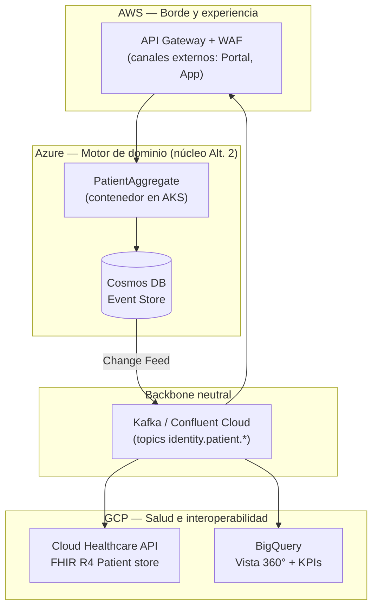
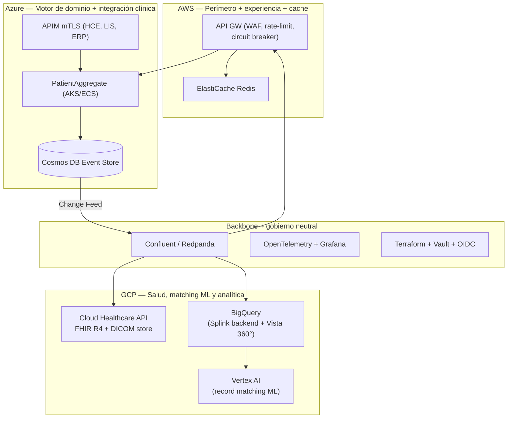
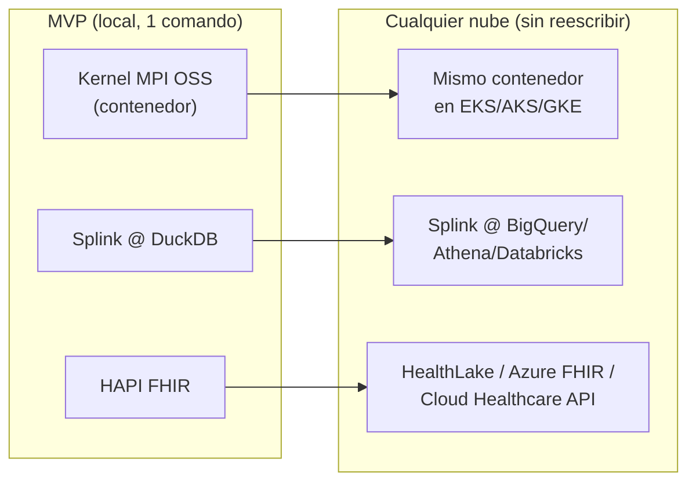

# Estrategia Multicloud de las Alternativas EMPI
## Clínica SanaRed Integrada | Hito 3 | Iniciativa Identidad Unificada (INI-01 / INI-13)

> **Objetivo del documento:** proponer cómo llevar las alternativas del Hito 2 a un modelo **genuinamente multicloud y gobernado** (alineado al principio **PT-02** del Hito 1), enfocándose en las Alternativas **2 y 3**, y **conservando la capacidad de convertirlas en MVP**. Al final se propone una **idea mejor** (recomendada) que resuelve multicloud y MVP a la vez.

---

## 1. Punto de partida: ¿qué tan "multicloud" es cada alternativa hoy?

| Alternativa | Nubes usadas | ¿Multicloud real? | Brecha frente a PT-02 |
|---|---|---|---|
| **Alt. 1 — Centralizada** | Solo AWS | ❌ No | Nube única; lock-in total en AWS. |
| **Alt. 2 — Federada DDD** | Solo Azure | ❌ No | Nube única; lock-in en Azure. Ironía: es "federada" en el dominio pero mono-nube en infraestructura. |
| **Alt. 3 — DDD Consolidada** | AWS + Azure | 🟡 Parcial (dual) | Usa 2 nubes, pero **ignora GCP**, que en el TO-BE del Hito 1 tiene asignados PACS y Analítica. No hay portabilidad: cada pieza está clavada a servicios propietarios. |

**El diagnóstico:** la Alt. 3 es *dual-cloud por reparto de responsabilidades* (AWS perímetro / Azure dominio), pero **no es portable**. Si mañana SanaRed quiere mover el motor de dominio de Azure a GCP, hay que reescribirlo (Cosmos DB → otra base, Service Bus → otro bus, Synapse → BigQuery). Multicloud "de verdad" no es solo *usar varias nubes*, es **poder mover cargas entre ellas sin reescribir**.

El caso, además, ya es intrínsecamente tri-cloud + on-prem + nube privada + SaaS. **GCP está infrautilizado** en las tres alternativas pese a tener la oferta de salud más fuerte para este problema (Cloud Healthcare API con FHIR/DICOM/HL7v2 nativos, BigQuery, Vertex AI).

---

## 2. Principios para un multicloud gobernado (no caótico)

Multicloud mal hecho = 3 veces la complejidad. Para que sume, se rige por 5 principios:

| Principio | Enunciado | Implicación técnica |
|---|---|---|
| **MC-1 — Estándar como lingua franca** | Los datos cruzan nubes en **FHIR R4**, no en formatos propietarios. | Cada nube expone/consume `Patient` FHIR; nadie depende del esquema interno de otra. |
| **MC-2 — Núcleo portable** | La lógica de dominio corre en **contenedores**, no en PaaS propietario. | Kubernetes (EKS/AKS/GKE) o compute portable; el `PatientAggregate` es una imagen, no un servicio-nube. |
| **MC-3 — Backbone de eventos neutral** | El bus de eventos **no** es Service Bus ni EventBridge, sino **Kafka-compatible** (Confluent Cloud / Redpanda). | Mismo topic funciona en cualquier nube; se elimina el lock-in de mensajería. |
| **MC-4 — Cada nube por su capacidad diferencial** | Se usa una nube por lo que hace *mejor*, no por inercia. | GCP → salud/analítica; AWS → borde/experiencia; Azure → integración clínica existente (LIS). |
| **MC-5 — Un solo plano de control** | Identidad, IaC, secretos y observabilidad son **transversales**, no por nube. | OIDC federado, Terraform, Vault, OpenTelemetry/Grafana. |

---

## 3. Habilitadores transversales (la "capa de gobierno multicloud")

Estos componentes son iguales para Alt. 2, Alt. 3 y la propuesta recomendada:

| Habilitador | Tecnología neutral | Qué resuelve |
|---|---|---|
| **Interoperabilidad** | FHIR R4 (`Patient`, `$match` estilo IHE PDQm/PIXm) | Portabilidad semántica de la identidad (MC-1). |
| **Compute portable** | Kubernetes + contenedores OCI (o Knative/Cloud Run/Container Apps/Fargate) | El dominio corre en cualquier nube (MC-2). |
| **Event backbone** | **Confluent Cloud** (multi-nube) o **Redpanda** self-host | Bus único cross-cloud (MC-3). |
| **IaC** | **Terraform** (módulos por nube, misma definición lógica) | Despliegue idéntico y reproducible en las 3 nubes. |
| **Identidad federada** | OIDC / SAML (Keycloak o el IAM de INI-03) | SSO y claims de rol/sede válidos en cualquier nube. |
| **Secretos** | **HashiCorp Vault** (o secrets manager federado) | Credenciales de máquina (mTLS) sin duplicar por nube. |
| **Observabilidad** | **OpenTelemetry + Grafana** (ya previsto en Alt. 3 §5) | Un solo panel para CloudWatch + Azure Monitor + Cloud Logging. |
| **Conectividad** | VPN / Cloud Interconnect / Megaport | Enlace privado on-prem (HCE Lima) ↔ nubes con baja latencia. |
| **Residencia de datos (Ley 29733)** | Colocación selectiva de PII por región/nube | Ubicar datos personales donde cumpla la ley; ventaja del multicloud. |

---

## 4. Alt. 2 → Multicloud (de Azure-only a tri-cloud portable)

**Idea:** conservar el núcleo DDD/Event Sourcing de la Alt. 2, pero (a) sacar la mensajería a un backbone neutral y (b) delegar analítica/FHIR a la nube que lo hace mejor.

| Función | Nube | Servicio | Por qué esa nube |
|---|---|---|---|
| Perímetro externo | AWS | API Gateway + WAF | Portal/App ya en AWS. |
| Dominio + Event Store | Azure | AKS + Cosmos DB | Núcleo Alt. 2 intacto; LIS ya en Azure. |
| Índice FHIR de identidad | GCP | Cloud Healthcare API (FHIR store) | FHIR/DICOM/HL7v2 nativos. |
| Vista 360° + analítica | GCP | BigQuery | Analítica a escala clínica (OE-07). |
| Bus de eventos | Neutral | Confluent/Redpanda | Rompe el lock-in de Service Bus. |

**Capacidad MVP:** la Alt. 2 multicloud es MVP-able reemplazando cada managed service por su equivalente local: Cosmos DB → PostgreSQL append-only, Confluent → Redpanda en Docker, GCP Healthcare API → HAPI FHIR server (open source, contenedor), BigQuery → DuckDB. **Todo el diagrama corre en `docker compose` y luego se "sube" servicio por servicio.**

---

## 5. Alt. 3 → Tri-cloud real (cerrando la brecha de GCP)

**Idea:** la Alt. 3 ya reparte AWS (perímetro) + Azure (dominio). Se le **añade GCP** para lo que el propio Hito 1 le asignó —PACS y analítica— y se **desacopla la mensajería** para que sea portable.

| Función | Nube (Alt. 3 original → tri-cloud) | Servicio |
|---|---|---|
| Perímetro externo + cache | AWS *(sin cambio)* | API GW + WAF + ElastiCache |
| Dominio + Event Store + integración interna | Azure *(sin cambio)* | AKS + Cosmos DB + APIM mTLS |
| **FHIR/DICOM nativo** | **GCP (nuevo)** | Cloud Healthcare API |
| **Batch dedup + Vista 360°** | **GCP (nuevo, reemplaza Synapse+Databricks)** | BigQuery (backend de Splink) |
| **Matching ML avanzado** | **GCP (nuevo)** | Vertex AI |
| Bus de eventos | **Neutral (reemplaza Service Bus)** | Confluent/Redpanda |
| Gobierno (IaC, secretos, obs., identidad) | Transversal | Terraform + Vault + OTel + OIDC |

**Ventaja concreta:** al mover analítica y FHIR a GCP se **elimina Synapse** (Azure) y se usa **BigQuery como backend de Splink** — que es exactamente el mismo motor de matching del MVP. Es decir: **el batch del MVP (Splink@DuckDB) y el batch de producción (Splink@BigQuery) son el mismo código con distinto backend.**

**Capacidad MVP:** idéntica al patrón del §4 — cada managed service tiene equivalente local contenerizado.

---

## 6. 💡 Idea mejor (recomendada): "Core cloud-neutral + kernel MPI open-source + Splink backend-swappable"

Las propuestas de §4 y §5 hacen las alternativas *multicloud*. Pero hay un enfoque que resuelve **multicloud Y MVP Y velocidad de construcción a la vez**, y que recomiendo como camino principal:

### 6.1 Las tres piezas

1. **Kernel MPI open-source en vez de construir el matcher desde cero.**
   Existen MPIs de referencia del ecosistema **OpenHIE**, diseñados exactamente para este problema, contenerizados y cloud-agnósticos:

   | Opción OSS | Stack | Fortaleza |
   |---|---|---|
   | **JEMPI** (Jembi / OpenHIE) | Java + Kafka + Dgraph | MPI moderno, diseñado para redes de salud, deploy Docker/Helm. |
   | **OpenCR** (OpenHIE Client Registry) | Node.js + Elasticsearch + FHIR | Basado en FHIR, matching configurable por reglas. |
   | **SanteMPI / SanteDB** | .NET + FHIR + IHE PIX/PDQ/PDQm/PIXm | Certificado en perfiles IHE de identidad. |

   Cualquiera de ellos corre en contenedores → **portable a las 3 nubes por definición** (MC-2). No se reinventa el EMPI; se **configura** uno probado.

2. **Splink como motor de linkage backend-swappable** (probabilístico, Fellegi-Sunter):
   - MVP → **DuckDB** (local, cero infra).
   - Producción AWS → **Athena/Spark**; Azure → **Spark/Databricks**; GCP → **BigQuery**.
   - **El mismo código de matching** cambia solo el backend por variable de entorno. Esto es multicloud *real* en la pieza más difícil (el matching masivo).

3. **FHIR R4 como capa portable** con un servidor FHIR open-source (**HAPI FHIR**) en el MVP, sustituible por el managed FHIR de cada nube en producción (ver §7). La identidad viaja como recurso `Patient` estándar; ninguna nube "posee" el modelo.

### 6.2 Por qué es superior

| Criterio | §5 Alt. 3 tri-cloud | §6 Idea recomendada |
|---|---|---|
| **Esfuerzo de construir el matcher** | Alto (se construye todo) | **Bajo (se configura un MPI probado)** |
| **Portabilidad real** | Media (managed services propietarios) | **Alta (contenedores + FHIR + Splink)** |
| **Camino MVP → producción** | Sustitución de servicios | **Cambio de backend por config** |
| **Riesgo para el equipo** | Alto (DDD+CQRS+ES desde cero) | **Menor (base OSS + estándares)** |
| **Alineación con OpenHIE / IHE** | Parcial | **Nativa (perfiles PIX/PDQ)** |
| **Lock-in** | Reducido pero presente | **Mínimo** |

> La idea recomendada **no descarta** la Alt. 3: la **acelera y la abarata**. El kernel OSS puede ser el `PatientAggregate` de facto en Fase 1, y migrar a Event Sourcing propio (Cosmos) solo si el volumen lo justifica. Es "comprar-antes-de-construir" aplicado al componente fundacional.

---

## 7. FHIR gestionado por nube: la clave de la portabilidad

Las **tres** nubes tienen un almacén FHIR R4 administrado. Esto convierte a FHIR en el punto de portabilidad natural del EMPI:

| Nube | Servicio FHIR gestionado | Notas |
|---|---|---|
| **AWS** | **HealthLake** | FHIR R4 + NLP integrado sobre datos clínicos. |
| **Azure** | **Health Data Services** (FHIR service) | FHIR R4; integra con el resto de Azure (LIS). |
| **GCP** | **Cloud Healthcare API** | FHIR R4 + DICOM + HL7v2 en un solo servicio. |
| **MVP / on-prem** | **HAPI FHIR** (open source) | Mismo API `Patient`; contenedor. |

**Consecuencia de diseño:** si la identidad se persiste/expone como `Patient` FHIR, mover el EMPI de una nube a otra es **cambiar el endpoint FHIR de destino**, no reescribir el dominio.

---

## 8. Cómo cada propuesta conserva la capacidad de MVP

La regla es **paridad local ↔ nube**: cada managed service tiene un equivalente contenerizado que corre en `docker compose`.

| Pieza | Equivalente MVP local | Equivalente producción (cualquier nube) |
|---|---|---|
| Event store | PostgreSQL append-only | Cosmos DB / DynamoDB / Spanner |
| Bus de eventos | Redpanda | Confluent Cloud (multi-nube) |
| FHIR store | HAPI FHIR | HealthLake / Azure FHIR / Cloud Healthcare API |
| Batch matching | Splink @ DuckDB | Splink @ Athena / Databricks / BigQuery |
| MPI kernel | JEMPI/OpenCR (contenedor) | El mismo contenedor en EKS/AKS/GKE |
| Cache | Redis local | ElastiCache / Azure Cache / Memorystore |
| Observabilidad | Grafana + OTel local | Grafana Cloud / managed |

> Por eso **multicloud y MVP no están en tensión**: si el MVP se construye sobre estándares abiertos y contenedores, **ya es** el punto de partida multicloud. La nube se elige al desplegar, no al programar.

---

## 9. Comparación final y recomendación

| Enfoque | Multicloud | MVP-able | Esfuerzo | Lock-in | Recomendación |
|---|:---:|:---:|:---:|:---:|---|
| Alt. 1 (AWS) | ❌ | 🟡 | Bajo | Alto | Descartada para multicloud |
| Alt. 2 mono-Azure | ❌ | 🟡 | Medio | Alto | Solo como base de dominio |
| **Alt. 2 → tri-cloud (§4)** | ✅ | ✅ | Medio | Medio | Válida |
| **Alt. 3 → tri-cloud (§5)** | ✅ | ✅ | Alto | Medio | Válida, la más completa |
| **💡 Core neutral + OSS MPI + Splink (§6)** | ✅✅ | ✅✅ | **Bajo-Medio** | **Mínimo** | **Recomendada** |

**Recomendación:** adoptar la **idea del §6 como capa de implementación** y usar la **Alt. 3 tri-cloud (§5) como arquitectura de referencia de destino**. En la práctica:

1. **MVP** → kernel MPI OSS + Splink@DuckDB + HAPI FHIR + Redpanda, todo en Docker Compose (ver `01_MVP_EMPI_Propuesta.md`).
2. **Fase 1 producción** → mismos contenedores en una nube (la de mayor afinidad, p. ej. Azure por LIS), backbone Confluent, FHIR gestionado.
3. **Fase 2-3** → distribución tri-cloud del §5 (AWS borde, Azure dominio, GCP salud/analítica) activando cada nube por su capacidad diferencial.

Así el equipo **no elige entre multicloud y MVP**: construye una vez, sobre estándares, y despliega donde convenga.

---

## 10. Riesgos del multicloud y mitigaciones

| Riesgo | Impacto | Mitigación |
|---|---|---|
| Complejidad operacional de 3 nubes | Sobrecarga del equipo | Un solo plano de control (Terraform + OTel + Vault); no operar 3 stacks distintos. |
| Costos de egreso entre nubes | Factura alta por tráfico cross-cloud | Minimizar cruces: eventos en batch/compresión; colocar datos calientes junto a su cómputo. |
| Latencia cross-cloud (dominio ↔ FHIR ↔ analítica) | Degradación | Interconnect privado; asincronía por eventos (no llamadas síncronas cross-cloud en el camino crítico). |
| Madurez del equipo en OSS MPI | Curva de aprendizaje | Elegir el MPI con mejor documentación/comunidad (JEMPI/SanteMPI); soporte comercial disponible. |
| Gobierno de datos disperso | Riesgo regulatorio (Ley 29733) | Catálogo único de datos + política de residencia por dato; PII en la nube/región conforme. |

---

*Documento de Hito 3 — Estrategia Multicloud | Iniciativa EMPI | Clínica SanaRed Integrada*
*Complementa: `01_MVP_EMPI_Propuesta.md` | Alineado a PT-02 (Estrategia Multinube Gobernada) del Hito 1*
