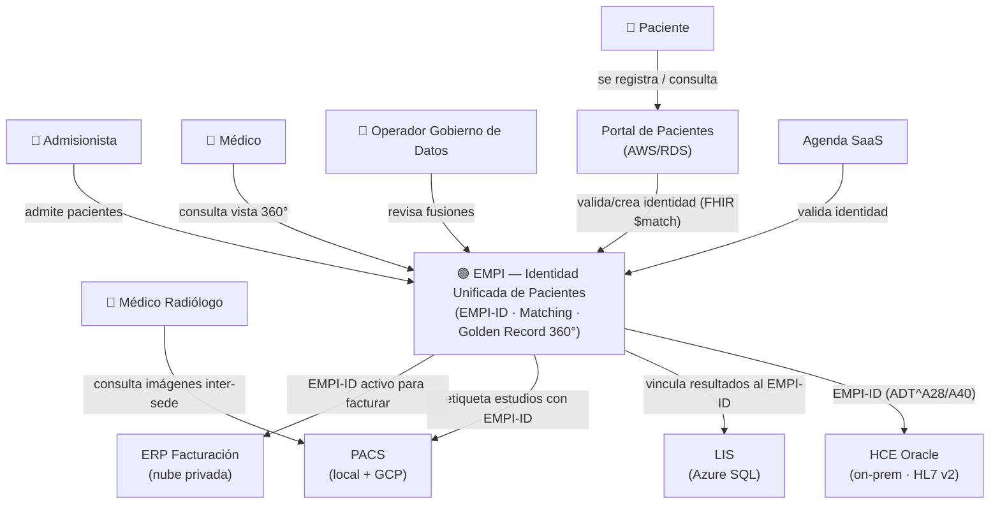
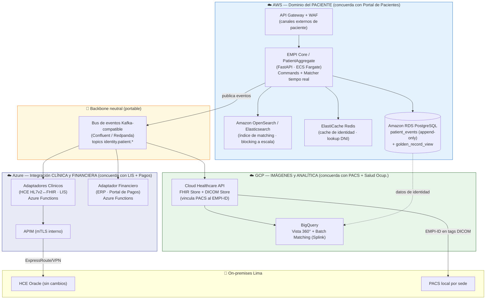
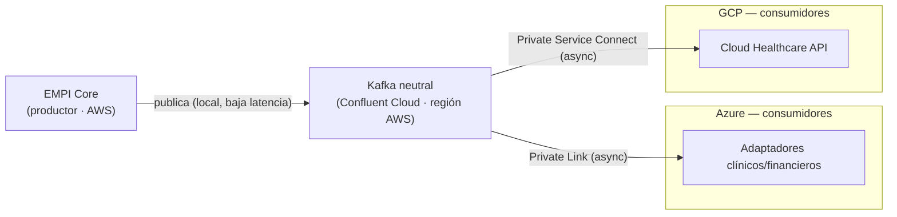
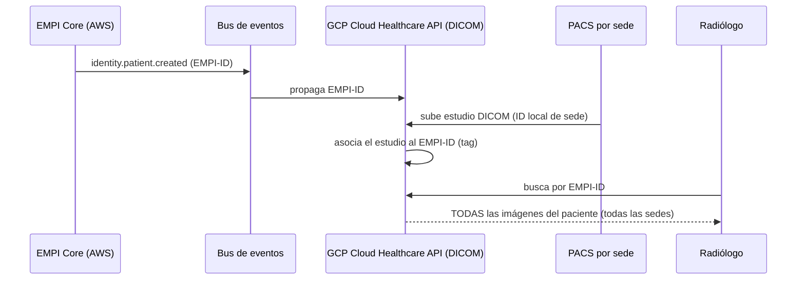

# Alternativa 3 Mejorada — Multicloud Concordante + PACS/EMPI + Perfil Demo
## Iniciativa: Identidad Unificada de Pacientes (EMPI) | INI-01 / INI-13 | Clínica SanaRed Integrada | Hito 3

> **Propósito:** revisar el **C4 y los ADR** de la Alternativa 3 para que sea (1) **multicloud por concordancia de dominio** —cada componente del EMPI reside en la nube que ya aloja la funcionalidad afín de SanaRed—, (2) **complementada con GCP + PACS** mostrando que las imágenes dependen del EMPI-ID, y (3) **reducida en complejidad** para ser implementable como **demo funcional end-to-end en laboratorio cloud con IaC y datos de prueba**.

---

## 0. Resumen de cambios vs. Alternativa 3 original

| # | Mejora pedida | Qué cambia respecto a la Alt. 3 original |
|---|---|---|
| **M1** | **Concordancia de dominio** | El núcleo de identidad **se mueve de Azure (Cosmos) a AWS**, porque el dominio del *paciente* ya vive en AWS (Portal de Pacientes + RDS). Azure pasa a ser el plano de **integración clínica y financiera** (concuerda con LIS y Portal de Pagos). |
| **M2** | **GCP + PACS** | Se **incorpora GCP** para imágenes (Cloud Healthcare API: FHIR + DICOM) y analítica (BigQuery), concordante con el PACS réplica y Salud Ocupacional que ya están en GCP. Se modela explícitamente que **el PACS necesita el EMPI-ID** para unificar imágenes inter-sede. |
| **M3** | **Menor complejidad (graduada, no a costa de la escala)** | Cosmos DB → **RDS PostgreSQL** (Event Sourcing relacional); Databricks + Synapse → **BigQuery/Splink backend-swappable**; Service Bus + EventBridge → **bus neutral Kafka-compatible**. El **índice de matching en tiempo real (OpenSearch/Elasticsearch) se conserva en producción** para garantizar rendimiento a alta volumetría; solo el **perfil demo** lo sustituye por pg_trgm. Todo desplegable por IaC. |
| **M4** | **Fichero para análisis** | Este documento. No sustituye los `Alternativa_3_*` del Hito 2; propone su evolución. |

---

## 1. Principio nuevo: **Concordancia de Dominio (co-locación por afinidad de negocio)**

> **Regla de asignación (ADR-A3M-001):** *cada componente del EMPI se despliega en la nube que ya aloja la funcionalidad de negocio afín de SanaRed. La identidad del paciente vive donde vive el paciente; la integración clínica donde vive lo clínico; las imágenes donde viven las imágenes.*

Mapeo del parque AS-IS de SanaRed a dominios de negocio y su nube:

| Nube | Dominio de negocio que ya aloja (AS-IS) | Componentes EMPI asignados (por concordancia) |
|---|---|---|
| **AWS** | **Paciente / experiencia digital** — Portal de Pacientes + Amazon RDS | **Núcleo de identidad**: PatientAggregate, Event Store, Golden Record (lectura), matcher en tiempo real + **índice OpenSearch/Elasticsearch (blocking a escala)**, cache de identidad, API Gateway externo (WAF) |
| **Azure** | **Clínico-diagnóstico + cobros** — LIS (Azure SQL MI) + Portal de Pagos | **Integración clínica y financiera**: APIM mTLS (interno), adaptadores LIS/HCE/ERP/Pagos, enrutamiento de eventos clínicos |
| **GCP** | **Imágenes + analítica + salud ocupacional** — PACS réplica + App Salud Ocupacional | **Imágenes y analítica**: FHIR+DICOM Store (vincula PACS al EMPI-ID), vista 360° y batch matching (BigQuery), salud ocupacional |
| **On-premises (Lima)** | **Historia clínica** — HCE Oracle + PACS local + Admisión | HCE **sin cambios**; adaptador HL7v2↔FHIR gobernado desde Azure |
| **Nube privada** | **Facturación** — ERP | Consumidor de eventos `patient.merged` vía adaptador financiero (Azure) |

**Por qué esto resuelve tu observación:** en la Alt. 3 original, la identidad del *paciente* quedaba en Azure —que en SanaRed es la nube de *diagnóstico y cobros*—. Con la concordancia, la identidad del paciente queda en **AWS**, que es la nube del *paciente*. Además, el Event Store en **RDS PostgreSQL** reutiliza la base que el Portal ya opera en AWS: **más concordante y más simple**.

### 1.1 Resumen QUÉ vs. DÓNDE — cómo se decide cada componente (vista para sustentación)

Cada componente resulta de **dos decisiones separadas**: el **QUÉ** (qué tecnología) y el **DÓNDE** (en qué nube). No siempre las gobierna el mismo criterio: la mayoría se ubica por **concordancia de dominio**, pero hay dos matices —el batch (QUÉ por complejidad, DÓNDE por concordancia) y el bus (neutralidad; la concordancia no aplica)—.

| Componente | QUÉ (tecnología) — motivo | DÓNDE (nube) — motivo | Regla dominante |
|---|---|---|---|
| **Núcleo identidad + Event Store** | RDS PostgreSQL (Event Sourcing relacional) — *reduce complejidad + reutiliza RDS existente* | **AWS** — *concordancia (dominio paciente)* | Concordancia |
| **Índice matching tiempo real** | OpenSearch/Elasticsearch — *volumetría / escala* | **AWS** — *concordancia (paciente, junto al core)* | Concordancia + volumetría |
| **Batch de deduplicación** | Splink — *complejidad + portabilidad (backend-swappable)* | **GCP / BigQuery** — *concordancia (analítica)* | **Mixto**: QUÉ=complejidad · DÓNDE=concordancia |
| **Vista 360°** | BigQuery — *analítica materializada* | **GCP** — *concordancia (analítica)* | Concordancia |
| **Imágenes (PACS↔EMPI)** | Cloud Healthcare API (FHIR+DICOM) — *nativo de salud* | **GCP** — *concordancia (imágenes)* | Concordancia |
| **Integración clínica y financiera** | Adaptadores + APIM mTLS | **Azure** — *concordancia (LIS + Portal de Pagos)* | Concordancia |
| **Perímetro externo** | API Gateway + WAF | **AWS** — *concordancia (canales de paciente)* | Concordancia |
| **Bus de eventos** | Kafka neutral (Confluent/Redpanda) — *anti-lock-in* | **Transversal** (junto al productor solo por latencia) | **Neutralidad** — concordancia NO aplica |

---

## 2. C4 — Nivel 1: Diagrama de Contexto



---

## 3. C4 — Nivel 2: Diagrama de Contenedores (multicloud concordante)



### 3.1 Mismo Nivel 2 en Structurizr DSL (para renderizar en tu toolchain)

```dsl
workspace "EMPI SanaRed — Alt. 3 Mejorada (Multicloud Concordante)" {
  model {
    paciente  = person "Paciente"
    admision  = person "Admisionista"
    medico    = person "Médico"
    radiologo = person "Médico Radiólogo"
    opDatos   = person "Operador Gobierno de Datos"

    empi = softwareSystem "EMPI — Identidad Unificada" {
      // AWS — dominio del paciente
      apiGw     = container "API Gateway + WAF"        "Perímetro externo canales paciente" "AWS API Gateway"
      core      = container "EMPI Core / PatientAggregate" "Identidad, matching RT, commands" "FastAPI / ECS Fargate"
      searchIdx = container "Índice de Matching"       "Blocking fuzzy a escala"            "Amazon OpenSearch / Elasticsearch"
      cache     = container "Cache de Identidad"       "Lookup DNI < 50 ms"                 "ElastiCache Redis"
      eventStore= container "Event Store + Golden Record" "Eventos append-only + proyección"  "Amazon RDS PostgreSQL"
      // Azure — integración clínica y financiera
      apim      = container "APIM (mTLS interno)"      "Perímetro sistemas internos"        "Azure API Management"
      adClinico = container "Adaptadores Clínicos"     "HCE HL7v2->FHIR, LIS"               "Azure Functions"
      adFinanc  = container "Adaptador Financiero"     "ERP, Portal de Pagos"               "Azure Functions"
      // GCP — imágenes y analítica
      healthcare= container "FHIR + DICOM Store"       "Vincula PACS al EMPI-ID"            "GCP Cloud Healthcare API"
      analytics = container "Analítica y Vista 360"    "360 + batch matching (Splink)"      "BigQuery"
      // Neutral
      bus       = container "Bus de Eventos"           "Propagación cross-cloud"            "Kafka (Confluent/Redpanda)"
    }

    hce   = softwareSystem "HCE Oracle" "Historia clínica (on-prem)"
    portal= softwareSystem "Portal de Pacientes" "AWS/RDS"
    agenda= softwareSystem "Agenda SaaS"
    lis   = softwareSystem "LIS" "Azure SQL MI"
    pacs  = softwareSystem "PACS" "Imágenes DICOM (local + GCP)"
    erp   = softwareSystem "ERP Facturación" "Nube privada"

    paciente  -> portal "Se registra / consulta"
    admision  -> apiGw  "Admite pacientes"
    portal    -> apiGw  "Valida/crea identidad (FHIR $match)"
    agenda    -> apiGw  "Valida identidad"
    apiGw     -> core   "Enruta"
    core      -> cache  "Lookup DNI"
    core      -> searchIdx "Blocking de candidatos"
    core      -> eventStore "Append eventos + proyecta"
    core      -> bus    "Publica identity.patient.*"
    bus       -> adClinico "identity.patient.*"
    bus       -> adFinanc  "identity.patient.merged"
    bus       -> healthcare "identity.patient.created"
    adClinico -> apim   "mTLS"
    apim      -> hce    "ADT^A28/A40 (HL7 v2)"
    apim      -> lis    "Vincula resultados al EMPI-ID"
    adFinanc  -> erp    "EMPI-ID activo"
    healthcare-> pacs   "Etiqueta estudios DICOM con EMPI-ID"
    healthcare-> analytics "Metadatos de imagen"
    eventStore-> analytics "Datos de identidad"
    radiologo -> pacs   "Consulta imágenes inter-sede (por EMPI-ID)"
    medico    -> analytics "Vista 360"
    opDatos   -> core   "Revisa fusiones"
  }
  views {
    systemContext empi "Contexto"     { include * autolayout lr }
    container     empi "Contenedores" { include * autolayout lr }
  }
}
```

### 3.2 Despliegue del bus de eventos neutral (producción y demo)

**Aclaración clave:** "neutral" es **lógico**, no físico. El bus **corre en algún sitio**; lo neutral es que el acoplamiento es al **protocolo Kafka**, no a la mensajería propietaria de una nube — se puede mover el broker (Confluent → MSK → Redpanda) **sin tocar el código** de productores ni consumidores.

**Opciones de producción:**

| Opción | Qué es | Neutralidad | Ops |
|---|---|---|---|
| **Confluent Cloud** *(recomendada)* | Kafka gestionado sobre AWS/Azure/GCP; PrivateLink a las 3 nubes + *cluster linking* | ✅ Alta | Baja (managed) |
| **Redpanda / Kafka en Kubernetes** | Broker en EKS/AKS/GKE (operador) | ✅ Alta | Media-alta |
| **AWS MSK / Azure Event Hubs (Kafka)** | Kafka gestionado atado a una nube | 🟡 Media (clientes portables por protocolo; broker no) | Baja |

**Colocación física (producción):** el bus vive **junto a su productor principal** (EMPI Core en AWS), porque publicar es el camino caliente (cada alta/merge publica un evento). Los consumidores en Azure y GCP se conectan como **consumidores remotos** por enlaces privados (AWS PrivateLink / Azure Private Link / GCP Private Service Connect). El consumo cross-cloud es **asíncrono y tolerante** (propagación de identidad, no el camino crítico de admisión) → el salto entre nubes es aceptable.



> Colocarlo en la región AWS **no lo vuelve "de AWS"**: sigue siendo neutral porque habla Kafka. Si el core migrara a otra nube, se mueve el cluster Confluent **sin cambiar el código** de productores/consumidores.

**Perfil demo/lab:** Redpanda como **1 contenedor** junto al EMPI Core en AWS (módulo `/neutral-bus` del IaC). Mismo protocolo Kafka → el contrato de la demo es el de producción. Los consumidores (Azure Functions, contenedores GCP) se suscriben remotamente; en el lab basta conectividad pública con TLS, sin los enlaces privados de producción.

**Seguridad y HA (producción):** SASL/mTLS + ACLs por topic; TLS en tránsito; replicación factor 3 multi-AZ (gestionada por Confluent); retención de topics + **DLQ por consumidor** (equivalente Kafka de las SQS DLQ de la Alt. 3 original).

---

## 4. Complemento GCP: **por qué el PACS necesita el EMPI** (M2)

### 4.1 El problema del PACS hoy (AS-IS)
- El PACS es **local por sede** con réplica **parcial** en GCP. Las imágenes se identifican con el **ID de paciente local de cada sede**.
- Consecuencia (GT-04 / GSI-08 del Hito 1): **un radiólogo no puede ver las imágenes de otra sede del mismo paciente**, porque no hay un identificador común que las una.

### 4.2 Cómo el EMPI habilita el PACS
El EMPI **no aloja imágenes** — aporta el **EMPI-ID** que las unifica. La dependencia es: *sin EMPI-ID, las imágenes siguen fragmentadas por sede.*



> **Relación clara:** el PACS **consume** el EMPI-ID (outbound del EMPI) para etiquetar sus estudios, y la **vista 360°** los referencia. Es un **complemento de Fase 2** (no prioridad de Fase 1), pero deja explícito que *la unificación de imágenes inter-sede es imposible sin el EMPI*.

---

## 5. Reducción de complejidad (M3): dos perfiles

La misma arquitectura concordante se entrega en **dos perfiles**. El perfil demo es **funcional de punta a punta**, solo con servicios más ligeros/baratos.

| Capa | Alt. 3 original | **Perfil Producción (concordante)** | **Perfil Demo / Lab (IaC + datos de prueba)** |
|---|---|---|---|
| Event Store | Cosmos DB (Azure) | **RDS PostgreSQL append-only (AWS)** | Postgres (RDS free-tier o contenedor) |
| Matcher tiempo real | Elasticsearch + matcher | **OpenSearch/Elasticsearch (blocking) + jellyfish (scoring)** — se conserva para garantizar volumetría | pg_trgm + jellyfish (sin OpenSearch) |
| Batch dedup | Databricks (Azure) | **Splink @ BigQuery (GCP)** | **Splink @ DuckDB** |
| Vista 360° | Azure Synapse | **BigQuery (GCP)** | BigQuery sandbox o DuckDB |
| Imágenes | (ausente) | **GCP Cloud Healthcare API** | **Orthanc (DICOM OSS) + HAPI FHIR** en GCP |
| Bus de eventos | Service Bus + EventBridge + SQS | **Kafka neutral (Confluent)** | **Redpanda** (1 contenedor) |
| Perímetro externo | AWS API GW (WAF) | AWS API GW (WAF) | AWS API GW o ALB |
| Perímetro interno | Azure APIM mTLS | Azure APIM mTLS | Azure Functions HTTP (mTLS simplificado) |
| Cómputo core | ECS Fargate | ECS Fargate / App Runner | 1 contenedor (Fargate / App Runner) |
| Cache | ElastiCache | ElastiCache | Redis (contenedor) |

**Idea clave:** la complejidad no se elimina, se **grada**. El perfil demo usa equivalentes OSS/ligeros pero **respeta la misma topología concordante tri-cloud**, de modo que la demo *demuestra la arquitectura real*, no una versión falsa.

> **Excepción por volumetría (importante):** el **índice de matching en tiempo real NO se degrada en producción**. Mientras que pg_trgm es suficiente para *demostrar funcionalidad* en la demo, el perfil de producción **conserva OpenSearch/Elasticsearch** como índice de blocking dedicado, porque a alta volumetría (millones de Golden Records, picos de campaña con volumen ×2) un índice de búsqueda dedicado **garantiza** el rendimiento del blocking que pg_trgm no sostiene en concurrencia. Aquí la prioridad es *garantizar la mejor solución a escala*, no reducir complejidad. Ver ADR-A3M-011.

> **QUÉ vs DÓNDE en el batch de deduplicación (Splink @ BigQuery):** son dos decisiones separadas con motivos distintos.
> - **QUÉ = Splink** → por **reducir complejidad + portabilidad**: librería de linkage probabilístico ya hecha (Fellegi-Sunter), **serverless** sobre BigQuery (sin clúster Spark que operar) y **backend-swappable** (mismo código en DuckDB para la demo y en BigQuery para producción).
> - **DÓNDE = BigQuery/GCP** → por **concordancia de dominio**: la deduplicación es un workload **analítico**, y GCP es el dominio de analítica del diseño (el Hito 1 asignó el Data Lakehouse/BigQuery a GCP en INI-16). Además, la **vista 360° vive en el mismo BigQuery**, así que co-locar el batch evita mover datos entre servicios.
>
> Contraste con el matcher en tiempo real: ese es *latencia-crítica y ligado al paciente* → va en **AWS**; el batch es *analítico* → va en **GCP**. **Misma capacidad ("matching"), repartida por naturaleza y concordancia.** Ver ADR-A3M-005 (DÓNDE) y ADR-A3M-009 (QUÉ).

---

## 6. Perfil Demo/Lab: despliegue por IaC y flujo funcional end-to-end

### 6.1 Topología del laboratorio (3 nubes, mínima pero real)

| Nube | Recurso desplegado por Terraform | Rol en la demo |
|---|---|---|
| **AWS** | 1 contenedor EMPI Core (App Runner/Fargate) + RDS PostgreSQL + Redis | Identidad, matching tiempo real (pg_trgm en demo · **OpenSearch en producción**), Event Store, Golden Record |
| **Azure** | 1 Azure Function (adaptador clínico) + 1 Function (adaptador financiero) | Recibe eventos y simula propagación a HCE/LIS/ERP |
| **GCP** | Orthanc (DICOM) + HAPI FHIR (contenedores en Cloud Run) + dataset BigQuery | Vincula estudios al EMPI-ID + vista 360° |
| **Neutral** | Redpanda (contenedor, en cualquiera de las 3) | Bus de eventos cross-cloud |

### 6.2 Estructura IaC (Terraform, un módulo por nube, misma definición lógica)
```
/iac
  /modules
    /aws-core        # API + RDS Postgres + Redis
    /azure-integ     # Functions adaptadores + cola
    /gcp-imaging     # Cloud Run Orthanc + HAPI FHIR + dataset BigQuery
    /neutral-bus     # Redpanda + topics
  main.tf            # orquesta los 3 módulos
  variables.tf       # credenciales/regiones por nube
  outputs.tf         # endpoints para el seeder de datos de prueba
```

### 6.3 Flujo funcional que la demo debe ejecutar **completo**
1. `terraform apply` despliega los 3 planos + el bus.
2. El **seeder** carga datos sintéticos (Faker `es_PE`) en AWS vía la API.
3. **E1** Alta → EMPI-ID generado (evento en RDS).
4. **E2** Mismo DNI desde otro canal → devuelve EMPI-ID existente (no duplica).
5. **E3** Batch Splink → deduplica el corpus sintético; reporte con precisión/recall.
6. Evento `identity.patient.created` viaja por Redpanda → **Azure** (adaptador clínico simula ADT al HCE) y → **GCP** (Healthcare API etiqueta un estudio DICOM de Orthanc con el EMPI-ID).
7. **E4** Vista 360° (BigQuery) consolida identidad + resultado + **imagen inter-sede** bajo un único EMPI-ID.
8. `terraform destroy` limpia todo.

> **Criterio de éxito de la demo:** los 8 pasos corren sin intervención manual y la vista 360° muestra, para un paciente, datos que **nacieron en las 3 nubes distintas** unificados por el EMPI-ID. Eso prueba *multicloud concordante real*, no un mock.

---

## 7. ADRs revisados / nuevos (Alt. 3 Mejorada)

| ID | Decisión | Por qué | Opción(es) rechazada(s) |
|---|---|---|---|
| **ADR-A3M-001** | **Concordancia de dominio** como principio de asignación de componentes a nubes | Evita que funcionalidad de paciente caiga en una nube de facturación; co-loca por afinidad de negocio | Reparto por preferencia técnica; nube única |
| **ADR-A3M-002** | Núcleo de identidad + Event Store en **AWS RDS PostgreSQL** | El dominio del paciente ya vive en AWS (Portal + RDS); reutiliza base existente y reduce complejidad | Cosmos DB (Azure) — concuerda con diagnóstico/pagos, no con paciente; DynamoDB |
| **ADR-A3M-003** | Perímetro **dual**: AWS API GW+WAF (canales de paciente) / Azure APIM mTLS (sistemas internos) | Tráfico externo necesita WAF; interno necesita autenticación de máquina | Solo un gateway |
| **ADR-A3M-004** | Plano de **integración clínica y financiera en Azure** | Concuerda con LIS (Azure SQL) y Portal de Pagos (Azure) ya existentes | Integración en AWS (rompe concordancia clínica) |
| **ADR-A3M-005** | **Imágenes y analítica en GCP** (Cloud Healthcare API + BigQuery) | Concuerda con PACS réplica y Salud Ocupacional ya en GCP; FHIR/DICOM nativos | Synapse+Databricks en Azure (rompe concordancia de imágenes) |
| **ADR-A3M-006** | **El PACS depende del EMPI-ID** para consolidación inter-sede (complemento Fase 2) | Sin identificador común, las imágenes siguen fragmentadas por sede | Mantener PACS con IDs locales |
| **ADR-A3M-007** | **Event Sourcing sobre PostgreSQL relacional** (tabla append-only + proyecciones) | Conserva el patrón de la Alt. 3 con menor complejidad operativa que Cosmos Change Feed | Cosmos DB Change Feed; EventStoreDB |
| **ADR-A3M-008** | **Bus de eventos neutral (Kafka-compatible)** para propagación cross-cloud | Evita lock-in de Service Bus/EventBridge y simplifica el modelo mental multicloud | Service Bus + EventBridge + SQS (3 tecnologías) |
| **ADR-A3M-009** | **Matching batch backend-swappable con Splink** (DuckDB en demo, BigQuery en prod) | **QUÉ** = reducir complejidad + portabilidad: mismo código de linkage probabilístico en demo y producción, serverless (sin clúster Spark). El **DÓNDE** (BigQuery/GCP) es por concordancia analítica → ver ADR-A3M-005 | Databricks-only (sin checkpointing); linkage por reglas fijas sin modelo probabilístico |
| **ADR-A3M-010** | **Perfil Demo/Lab con IaC (Terraform) tri-cloud** y datos sintéticos | El trabajo final exige implementar la solución en laboratorio cloud, funcional end-to-end | Demo mono-nube (no probaría multicloud); solo diagramas |
| **ADR-A3M-011** | **Índice de matching en tiempo real con OpenSearch/Elasticsearch en producción** (pg_trgm solo en el perfil demo) | **Garantiza** el rendimiento del blocking a **alta volumetría** (millones de Golden Records, picos de campaña ×2, alta concurrencia de admisión); prioriza la mejor solución a escala sobre la reducción de complejidad | pg_trgm/DB-only en producción (no escala en concurrencia); matching sin índice dedicado |

> **Nota sobre ADR-A3M-008 (bus de eventos) — QUÉ vs DÓNDE y por qué la concordancia NO aplica:**
> - **QUÉ = Kafka neutral (Confluent/Redpanda)** en lugar de Service Bus/EventBridge → por **neutralidad y portabilidad cross-cloud (anti-lock-in)**: el acoplamiento es al *protocolo Kafka*, no a la mensajería propietaria de una nube. Pasar de 3 tecnologías a 1 es un beneficio *secundario*, no el motivo.
> - **DÓNDE = ninguna nube por concordancia.** El bus es la **única pieza transversal**: su función es *cruzar* AWS↔Azure↔GCP para llevar el evento de identidad a todos los dominios. Por eso **no se rige por concordancia** —ponerlo "dentro" de un dominio lo volvería no-neutral—; físicamente se coloca junto al productor principal (EMPI Core en AWS) **solo por latencia de publicación**. Detalle de despliegue en **§3.2**.

---

## 8. Trazabilidad: sigue cumpliendo los requerimientos

| Requerimiento | Cómo lo mantiene la Alt. 3 Mejorada |
|---|---|
| **RF-01…RF-05** | Idénticos: el núcleo de identidad, matching y 360° se conservan (solo cambian de nube y de servicio, no de función). |
| **RNF-01** Latencia | Cache Redis + índice OpenSearch + matcher en AWS junto al canal de paciente → baja latencia y blocking escalable; evita el salto cross-cloud en el camino crítico. |
| **RNF-05** Escalabilidad (alta volumetría) | Índice **OpenSearch/Elasticsearch** para blocking + auto-scaling del core + **Splink@BigQuery** en batch → soporta millones de Golden Records y picos de campaña (volumen ×2) sin degradar el P95. |
| **RNF-03** Seguridad | RBAC en Core; APIM mTLS para internos; auditoría nativa (eventos en RDS). |
| **RNF-04** Interoperabilidad | FHIR R4 (`Patient`, `$match`) + HL7 v2 (adaptador) + DICOM (Healthcare API). |
| **PT-02** Multinube gobernada (Hito 1) | Ahora **sí** usa las 3 nubes de SanaRed por concordancia, no por inercia. |

---

## 9. Riesgos de la mejora y mitigaciones

| Riesgo | Mitigación |
|---|---|
| El bus cross-cloud añade latencia/egreso | Propagación **asíncrona** (fuera del camino crítico); el alta responde con el evento confirmado antes de propagar. |
| 3 nubes = 3 credenciales/regiones en el lab | Un solo `main.tf` con variables por nube; `terraform destroy` para controlar costo. |
| Cloud Healthcare API / BigQuery tienen costo | En el perfil demo se sustituyen por **Orthanc + HAPI FHIR + DuckDB** (OSS, bajo costo) sin cambiar la topología. |
| Mover el core a AWS reabre ADRs del Hito 2 | Este documento los revisa explícitamente (ADR-A3M-002/007); el patrón Event Sourcing se conserva. |
| El perfil demo (pg_trgm) no refleja la volumetría real | **Producción usa OpenSearch/Elasticsearch** como índice de blocking dedicado (ADR-A3M-011) → garantiza rendimiento a alta escala; la demo valida funcionalidad, no rendimiento a escala. |

---

*Documento de Hito 3 — Mejoras a la Alternativa 3 | Iniciativa EMPI | Clínica SanaRed Integrada*
*Complementa: `01_MVP_EMPI_Propuesta.md` y `02_Estrategia_Multicloud_Alternativas.md`*
