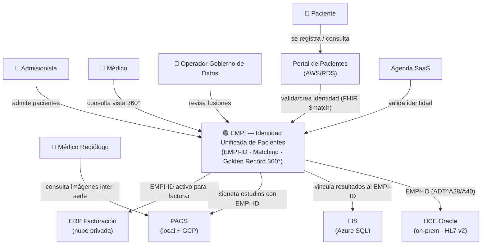
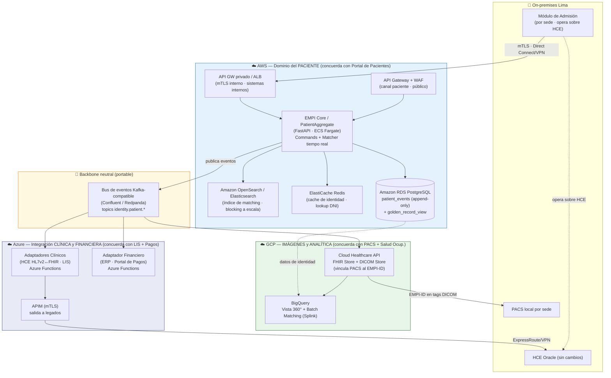
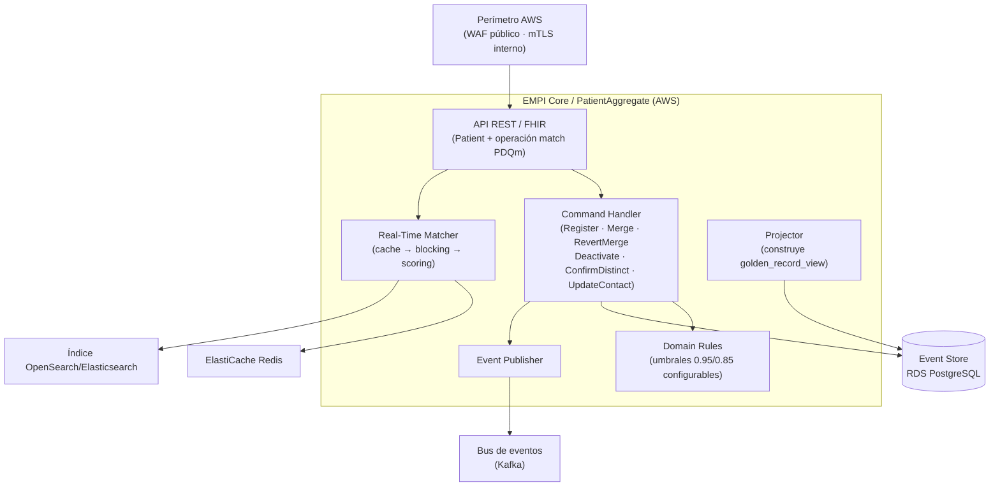
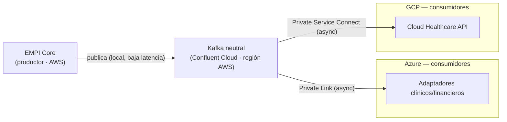

# C4 Model — Alternativa 3 Mejorada (EMPI Multicloud Concordante)
## Iniciativa: Identidad Unificada de Pacientes (EMPI) | INI-01 / INI-13 | Clínica SanaRed Integrada | Hito 3

> **Qué es este documento:** el **modelo C4** de la Alternativa 3 Mejorada y su explicación (Contexto, Contenedores, Componentes y Despliegue), extraído de `03_Alternativa3_Mejorada_Multicloud_Concordante.md`. La fuente **renderable** en Structurizr está en los archivos `.dsl` referenciados abajo; aquí se muestran las vistas en Mermaid con su explicación.

---

## Archivos Structurizr DSL (fuente renderable)

| Archivo | Vistas que genera |
|---|---|
| [`Alt3M_C4_Model.dsl`](Alt3M_C4_Model.dsl) | **Completo**: C1 Contexto · C2 Contenedores · C3 Componentes (EMPI Core) · C4 Despliegue multicloud |
| [`Alt3M_C4_Model_resumido.dsl`](Alt3M_C4_Model_resumido.dsl) | **Resumido**: C1 Contexto · C2 Contenedores (para una diapositiva) |

**Cómo renderizar:** con Structurizr Lite (`docker run -it --rm -p 8080:8080 -v "<ruta>/entregables_hito3:/usr/local/structurizr" structurizr/lite` → `http://localhost:8080`) o pegando el DSL en el editor de structurizr.com.

---

## Nivel 1 — Diagrama de Contexto

Sitúa el **EMPI** como sistema en foco frente a sus actores (paciente, admisionista, médico, radiólogo, operador de datos) y los **6 sistemas existentes** de SanaRed con los que se integra sin reemplazarlos.

**Lectura:** el EMPI recibe identidad desde los canales (Portal, Agenda, Admisión) y **propaga el EMPI-ID** a los sistemas clínicos y administrativos (HCE, LIS, PACS, ERP), cada uno en su protocolo nativo (HL7 v2, FHIR, DICOM).

---

## Nivel 2 — Diagrama de Contenedores (multicloud concordante)

Muestra los contenedores del EMPI **agrupados por nube según concordancia de dominio**: el paciente en AWS, lo clínico/financiero en Azure, imágenes/analítica en GCP, y el bus como pieza transversal neutral.

### Explicación del placement — QUÉ vs. DÓNDE

Cada componente resulta de **dos decisiones separadas**: el **QUÉ** (qué tecnología) y el **DÓNDE** (en qué nube). La mayoría se ubica por **concordancia de dominio**; hay dos matices —el batch (QUÉ por complejidad, DÓNDE por concordancia) y el bus (neutralidad; la concordancia no aplica)—.

| Componente | QUÉ (tecnología) — motivo | DÓNDE (nube) — motivo | Regla dominante |
|---|---|---|---|
| **Núcleo identidad + Event Store** | RDS PostgreSQL (Event Sourcing relacional) — *reduce complejidad + reutiliza RDS existente* | **AWS** — *concordancia (dominio paciente)* | Concordancia |
| **Índice matching tiempo real** | OpenSearch/Elasticsearch — *volumetría / escala* | **AWS** — *concordancia (paciente, junto al core)* | Concordancia + volumetría |
| **Batch de deduplicación** | Splink — *complejidad + portabilidad (backend-swappable)* | **GCP / BigQuery** — *concordancia (analítica)* | **Mixto**: QUÉ=complejidad · DÓNDE=concordancia |
| **Vista 360°** | BigQuery — *analítica materializada* | **GCP** — *concordancia (analítica)* | Concordancia |
| **Imágenes (PACS↔EMPI)** | Cloud Healthcare API (FHIR+DICOM) — *nativo de salud* | **GCP** — *concordancia (imágenes)* | Concordancia |
| **Integración clínica y financiera (salida)** | Adaptadores + APIM mTLS (perímetro de **salida** a legados) | **Azure** — *concordancia (LIS + Portal de Pagos)* | Concordancia |
| **Perímetro de entrada — paciente (público)** | API Gateway + WAF | **AWS** — *concordancia (canal de paciente)* | Concordancia |
| **Perímetro de entrada — sistemas internos** | API GW privado / ALB + mTLS (Direct Connect/VPN) | **AWS** — *entrada al core sin salto cross-cloud (RNF-01)* | Dirección de tráfico (ADR-A3M-003) |
| **Bus de eventos** | Kafka neutral (Confluent/Redpanda) — *anti-lock-in* | **Transversal** (junto al productor solo por latencia) | **Neutralidad** — concordancia NO aplica |

---

## Nivel 3 — Componentes del EMPI Core

Descompone el contenedor **EMPI Core / PatientAggregate** (AWS · FastAPI/ECS Fargate). Los componentes y sus relaciones están definidos en la vista `C3_ComponentesCore` del [`Alt3M_C4_Model.dsl`](Alt3M_C4_Model.dsl).

**Componentes:**
- **API REST / FHIR** — expone el recurso `Patient` y la operación de *match* (IHE PDQm).
- **Command Handler** — ejecuta los 6 commands de dominio (`RegisterPatient`, `MergeRecords`, `RevertMerge`, `DeactivateRecord`, `ConfirmDistinct`, `UpdateContact`).
- **Real-Time Matcher** — estrategia de 3 pasos con *early-exit*: cache (Redis) → blocking (OpenSearch) → scoring probabilístico.
- **Domain Rules** — umbrales 0.95/0.85 y reglas de precedencia, configurables en caliente.
- **Projector** — construye la proyección `golden_record_view` desde los eventos (CQRS).
- **Event Publisher** — publica los eventos de dominio al bus neutral.

---

## Nivel 4 — Despliegue (multicloud concordante)

La vista de despliegue completa (nodos AWS / Azure / GCP / Confluent / On-premises con cada contenedor en su nube) está en la vista `C4_Despliegue` del [`Alt3M_C4_Model.dsl`](Alt3M_C4_Model.dsl). A continuación, el detalle del componente cuyo despliegue tiene matices propios: el **bus de eventos neutral**.

### Despliegue del bus de eventos neutral (producción y demo)

**Aclaración clave:** "neutral" es **lógico**, no físico. El bus **corre en algún sitio**; lo neutral es que el acoplamiento es al **protocolo Kafka**, no a la mensajería propietaria de una nube — se puede mover el broker (Confluent → MSK → Redpanda) **sin tocar el código** de productores ni consumidores.

**Opciones de producción:**

| Opción | Qué es | Neutralidad | Ops |
|---|---|---|---|
| **Confluent Cloud** *(recomendada)* | Kafka gestionado sobre AWS/Azure/GCP; PrivateLink a las 3 nubes + *cluster linking* | ✅ Alta | Baja (managed) |
| **Redpanda / Kafka en Kubernetes** | Broker en EKS/AKS/GKE (operador) | ✅ Alta | Media-alta |
| **AWS MSK / Azure Event Hubs (Kafka)** | Kafka gestionado atado a una nube | 🟡 Media (clientes portables por protocolo; broker no) | Baja |

**Colocación física (producción):** el bus vive **junto a su productor principal** (EMPI Core en AWS), porque publicar es el camino caliente (cada alta/merge publica un evento). Los consumidores en Azure y GCP se conectan como **consumidores remotos** por enlaces privados (AWS PrivateLink / Azure Private Link / GCP Private Service Connect). El consumo cross-cloud es **asíncrono y tolerante** (propagación de identidad, no el camino crítico de admisión) → el salto entre nubes es aceptable.

> Colocarlo en la región AWS **no lo vuelve "de AWS"**: sigue siendo neutral porque habla Kafka. Si el core migrara a otra nube, se mueve el cluster Confluent **sin cambiar el código** de productores/consumidores.

**Perfil demo/lab:** Redpanda como **1 contenedor** junto al EMPI Core en AWS (módulo `/neutral-bus` del IaC). Mismo protocolo Kafka → el contrato de la demo es el de producción. Los consumidores (Azure Functions, contenedores GCP) se suscriben remotamente; en el lab basta conectividad pública con TLS, sin los enlaces privados de producción.

**Seguridad y HA (producción):** SASL/mTLS + ACLs por topic; TLS en tránsito; replicación factor 3 multi-AZ (gestionada por Confluent); retención de topics + **DLQ por consumidor** (equivalente Kafka de las SQS DLQ de la Alt. 3 original).

---

*Documento de Hito 3 — C4 Model de la Alternativa 3 Mejorada | Iniciativa EMPI | Clínica SanaRed Integrada*
*Extraído de `03_Alternativa3_Mejorada_Multicloud_Concordante.md` · Fuente renderable: `Alt3M_C4_Model.dsl` y `Alt3M_C4_Model_resumido.dsl`*
