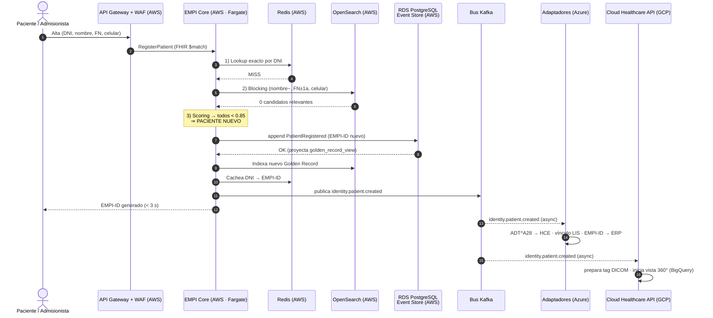
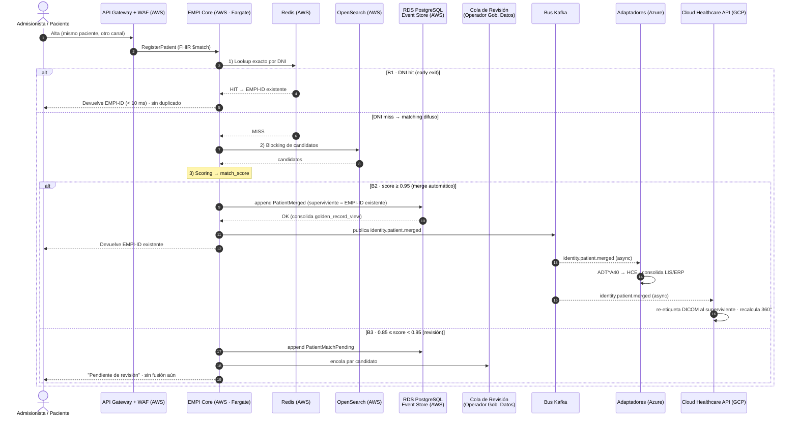
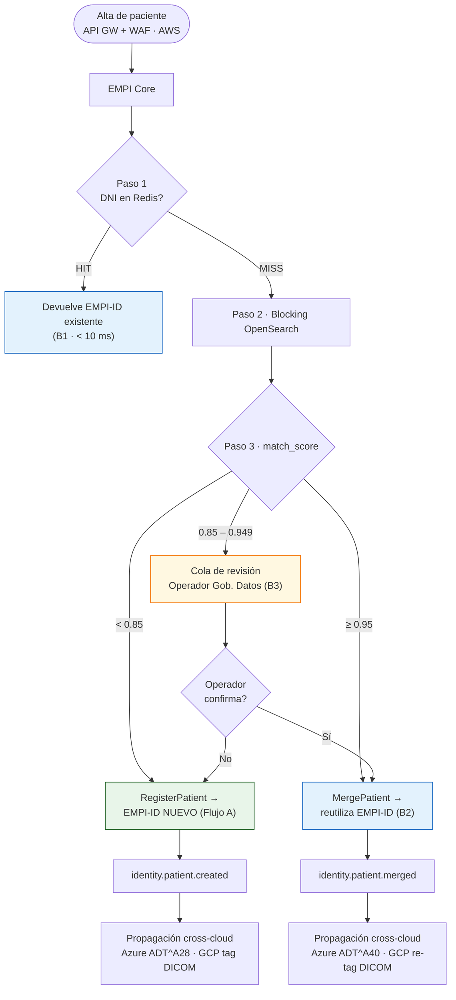

# Flujos de Registro de Paciente — Alternativa 3 Mejorada (EMPI Multicloud Concordante)
## Iniciativa: Identidad Unificada de Pacientes (EMPI) | INI-01 / INI-13 | Clínica SanaRed Integrada | Hito 3

> **Qué es este documento:** describe **dos flujos de registro de paciente** —uno para **paciente nuevo** y otro para **paciente ya existente**— tal como los resuelve la solución de la **Alternativa 3 Mejorada** (`03_Alternativa3_Mejorada_Multicloud_Concordante.md`). Usa los mismos componentes, nubes, umbrales y eventos ya definidos ahí y en el MVP (`01_MVP_EMPI_Propuesta.md`). El objetivo es dejar claro **cómo el EMPI decide si crea una identidad nueva o reutiliza una existente**, y qué se propaga cross-cloud en cada caso.

---

## 0. Idea central: **el registro no crea identidad, la resuelve**

En SanaRed hoy cada canal (Portal, Admisión, HCE) crea su propio registro → se generan duplicados. En la Alt. 3 Mejorada, **todo alta pasa primero por el motor de matching en tiempo real** antes de crear nada. El resultado del matching decide la rama:

- **No hay coincidencia** → es un **paciente nuevo** → se genera un `EMPI-ID` (Flujo A).
- **Sí hay coincidencia** → es un **paciente existente** → se **reutiliza** el `EMPI-ID` (Flujo B), y si había un duplicado latente, se **fusiona**.

Por eso ambos flujos comparten los **tres primeros pasos** (perímetro + matching) y se bifurcan solo al final.

---

## 1. Componentes que intervienen (referencia rápida)

| Componente | Nube (concordancia) | Rol en el registro |
|---|---|---|
| **API Gateway + WAF** | AWS | Perímetro de canales de paciente (Portal, Admisión). Enruta el alta al Core. |
| **EMPI Core / PatientAggregate** (FastAPI · ECS Fargate) | AWS | Orquesta el matching y ejecuta los comandos `RegisterPatient` / `MergePatient`. |
| **ElastiCache Redis** | AWS | Paso 1 del matching: *lookup* exacto por DNI (< 10 ms). |
| **OpenSearch / Elasticsearch** *(prod)* · pg_trgm *(demo)* | AWS | Paso 2 del matching: *blocking* difuso de candidatos a escala. |
| **RDS PostgreSQL** — `patient_events` (append-only) + `golden_record_view` | AWS | Event Store (fuente de verdad) + proyección de lectura del Golden Record. |
| **Bus de eventos Kafka** (Confluent/Redpanda) | Transversal | Publica `identity.patient.*` para propagación cross-cloud. |
| **Adaptadores Clínico / Financiero** (Azure Functions + APIM mTLS) | Azure | Propagan a HCE (HL7 v2 `ADT`), LIS y ERP. |
| **Cloud Healthcare API** (FHIR + DICOM) + **BigQuery** | GCP | Vinculan el estudio de imagen al EMPI-ID y consolidan la vista 360°. |

---

## 2. Regla de decisión del matching (única y canónica)

El EMPI aplica la **estrategia de 3 pasos con *early exit*** (fiel a Alt. 3 §2.6 y MVP §6). El `match_score ∈ [0,1]` resultante se clasifica con los **umbrales del Hito 2 (canónicos)**:

| Paso | Técnica | Resultado |
|---|---|---|
| **1 — Determinístico exacto** | Hash de DNI en Redis | *Hit* → devuelve EMPI-ID en < 10 ms (**early exit**, ~80% de admisiones conocidas) |
| **2 — Blocking** | OpenSearch (prod) / pg_trgm (demo): nombre similar + FN ±1 año + celular parcial | Recupera lista corta de candidatos |
| **3 — Scoring probabilístico** | Jaro-Winkler + Double Metaphone + igualdad FN/celular → `match_score` | Se clasifica según la banda ↓ |

| Banda de `match_score` | Interpretación | Acción |
|---|---|---|
| **≥ 0.95** | Es el mismo paciente | **Merge automático** → reutiliza EMPI-ID |
| **0.85 – 0.949** | Probable, requiere ojo humano | **Cola de revisión** (Operador Gobierno de Datos) |
| **< 0.85** | Personas distintas | **Registro nuevo** → genera EMPI-ID |

> Estos umbrales son los mismos del MVP §6.3 y de la reconciliación del Hito 2. Configurables en caliente (RNF-06.2).

---

## 3. Flujo A — Registro de **paciente NUEVO**

**Escenario (E1):** un paciente se registra por primera vez (desde el Portal como autoservicio, o el Admisionista lo da de alta en ventanilla). No existe en ningún sistema de SanaRed.

### 3.1 Pasos

1. **Inicio del alta.** El actor envía los datos (DNI, nombre completo, fecha de nacimiento, celular, correo). Canal → **AWS API Gateway + WAF** (Portal/Admisión), que valida y enruta al **EMPI Core**.
2. **Matching en tiempo real (3 pasos).**
   - **Paso 1 — Redis:** *miss* (el DNI no está cacheado).
   - **Paso 2 — OpenSearch:** *blocking* devuelve 0 candidatos (o candidatos irrelevantes).
   - **Paso 3 — Scoring:** todos los candidatos quedan con `match_score < 0.85` → **no hay coincidencia** → **es un paciente nuevo**.
3. **Comando `RegisterPatient`.** El `PatientAggregate` genera un **EMPI-ID nuevo**, con estado `VERIFICADO` (datos completos) o `INCOMPLETO` (faltan campos), y **añade el evento `PatientRegistered`** a `patient_events` (append-only) en RDS PostgreSQL.
4. **Proyección + indexación.** El proyector actualiza `golden_record_view`; el `audit_trail` se deriva del evento. El nuevo Golden Record se **indexa en OpenSearch** y el **DNI se cachea en Redis** (para que la próxima vez sea *hit* en el Paso 1).
5. **Publicación del evento.** El Core publica **`identity.patient.created`** (con el EMPI-ID) en el bus Kafka.
6. **Propagación cross-cloud (asíncrona, fuera del camino crítico):**
   - → **Azure (adaptador clínico):** emite **`ADT^A28`** (alta de paciente) al **HCE** vía APIM mTLS / ExpressRoute y prepara el vínculo con el **LIS**.
   - → **Azure (adaptador financiero):** registra el **EMPI-ID activo** en el **ERP** para habilitar facturación.
   - → **GCP (Cloud Healthcare API):** queda listo para **etiquetar futuros estudios DICOM** del paciente con su EMPI-ID; **BigQuery** inicia su vista 360°.
7. **Respuesta al actor.** El alta responde con el **EMPI-ID generado** en **< 3 s** (la respuesta se confirma con el evento antes de completar la propagación).

### 3.2 Diagrama de secuencia — paciente nuevo

### 3.3 Resultado

- **1 identidad nueva** = 1 `EMPI-ID` canónico, auditable desde su primer evento.
- Eventos generados: `PatientRegistered` → `identity.patient.created`.
- Ningún duplicado (el matching confirmó que no existía).

---

## 4. Flujo B — Registro de **paciente YA EXISTENTE**

**Escenario (E2):** el paciente ya tiene identidad en SanaRed (por ejemplo, se registró antes en el Portal) y ahora se le intenta registrar de nuevo desde otro canal (Admisión). El EMPI **debe reconocerlo y devolver su EMPI-ID existente, sin crear un duplicado**.

Este flujo tiene **tres ramas** según cómo se detecta la coincidencia:

| Rama | Cómo se detecta | Acción |
|---|---|---|
| **B1 — Coincidencia exacta** | DNI *hit* en Redis (Paso 1) | Devuelve EMPI-ID existente de inmediato (early exit) |
| **B2 — Coincidencia probabilística alta** | `match_score ≥ 0.95` (Paso 3) | **Merge automático** al EMPI-ID existente |
| **B3 — Coincidencia dudosa** | `0.85 ≤ match_score < 0.95` | **Cola de revisión** manual; sin fusión hasta decisión humana |

### 4.1 Pasos

1. **Inicio del alta.** Igual que en el Flujo A: el actor envía los datos → **API Gateway + WAF** → **EMPI Core**.
2. **Matching en tiempo real (3 pasos):**
   - **Rama B1 (lo más común, ~80%).** **Paso 1 — Redis:** el DNI hace *hit* → el Core **devuelve el EMPI-ID existente en < 10 ms** y termina (early exit). No se crea nada; solo se registra el evento de *acceso/consulta* si aplica. **Se previno el duplicado.**
   - Si el DNI no coincide (p. ej. tipeado con error), se continúa: **Paso 2 — OpenSearch** recupera candidatos; **Paso 3 — Scoring** calcula `match_score`.
     - **Rama B2** — `match_score ≥ 0.95` → el sistema concluye que es el **mismo paciente**: enlaza el registro entrante al **EMPI-ID existente** (merge automático).
     - **Rama B3** — `0.85 – 0.949` → el registro entra en la **cola de revisión** del Operador de Gobierno de Datos; se mantienen ambos registros como candidatos hasta que un humano confirme o rechace la fusión.
3. **Comando de resolución (según rama):**
   - **B1:** ningún comando de escritura de identidad; se devuelve el EMPI-ID. (Opcional: `PatientAccessed` para auditoría.)
   - **B2:** comando **`MergePatient`** → se elige el **registro superviviente** (el EMPI-ID existente), se marca el otro como `INACTIVO` con `empi_id_activo` apuntando al superviviente, y se **añade el evento `PatientMerged`** a `patient_events`.
   - **B3:** comando **`FlagForReview`** → evento `PatientMatchPending`; no altera el Golden Record hasta la decisión.
4. **Proyección + indexación.** En B2, `golden_record_view` consolida ambos registros bajo el EMPI-ID superviviente; OpenSearch y Redis se actualizan para reflejar la fusión.
5. **Publicación del evento (solo B2):** el Core publica **`identity.patient.merged`** en el bus Kafka.
6. **Propagación cross-cloud (asíncrona, solo B2):**
   - → **Azure (adaptador clínico):** emite **`ADT^A40`** (merge de pacientes) al **HCE** para que unifique las historias; actualiza el vínculo en el **LIS**.
   - → **Azure (adaptador financiero):** consolida las cuentas en el **ERP** bajo el EMPI-ID superviviente.
   - → **GCP (Cloud Healthcare API):** **re-etiqueta los estudios DICOM** del registro fusionado al EMPI-ID superviviente → las imágenes inter-sede quedan unificadas; **BigQuery** recalcula la vista 360°.
7. **Respuesta al actor.** Se devuelve el **EMPI-ID existente** (B1/B2) o un aviso de *"pendiente de revisión"* (B3). **En ningún caso se crea un EMPI-ID nuevo.**

### 4.2 Diagrama de secuencia — paciente existente (con las 3 ramas)

### 4.3 Resultado

- **0 identidades nuevas.** El EMPI-ID se **reutiliza** (B1/B2) o queda en espera de decisión (B3).
- Eventos: `PatientMerged` → `identity.patient.merged` (B2) · `PatientMatchPending` (B3) · ninguno de escritura en B1.
- **Se cumple la prevención de duplicados** (CA-01.2): el mismo DNI/persona no genera un segundo Golden Record.
- La fusión (B2) **propaga la unificación** a HCE (`ADT^A40`), ERP, LIS y **PACS/DICOM** (imágenes inter-sede bajo un solo EMPI-ID).

---

## 5. Comparación lado a lado

| Aspecto | Flujo A — Paciente NUEVO | Flujo B — Paciente EXISTENTE |
|---|---|---|
| **Disparador** | Persona sin identidad previa | Mismo paciente re-registrado en otro canal |
| **Resultado del matching** | `< 0.85` (sin coincidencia) | DNI *hit* · o `≥ 0.95` · o `0.85–0.949` |
| **Comando** | `RegisterPatient` | `MergePatient` (B2) / `FlagForReview` (B3) / — (B1) |
| **EMPI-ID** | **Se genera uno nuevo** | **Se reutiliza el existente** (nunca nuevo) |
| **Evento en RDS** | `PatientRegistered` | `PatientMerged` / `PatientMatchPending` |
| **Evento en bus** | `identity.patient.created` | `identity.patient.merged` (solo B2) |
| **Mensaje al HCE (Azure)** | `ADT^A28` (alta) | `ADT^A40` (merge) |
| **Efecto en PACS/GCP** | Prepara tag DICOM futuro | Re-etiqueta y unifica imágenes inter-sede |
| **Escenario del caso** | E1 | E2 (y E5 dependiente = registro nuevo con relación) |
| **Criterio de aceptación** | CA-01.1 (EMPI-ID único) | CA-01.2 (0 duplicados) / CA-02.1 |

---

## 6. Árbol de decisión unificado (ambos flujos)

---

## 7. Notas de fidelidad (demo vs. producción)

- **Blocking (Paso 2):** en **producción** es **OpenSearch/Elasticsearch** (garantiza volumetría — ADR-A3M-011); en el **perfil demo/lab** es **pg_trgm** sobre PostgreSQL. La **lógica del flujo no cambia**: solo el índice que resuelve el Paso 2.
- **Camino crítico vs. asíncrono:** la respuesta al actor (EMPI-ID) se confirma **antes** de que termine la propagación cross-cloud. El salto entre nubes (Azure/GCP) es **asíncrono y tolerante a fallos** (DLQ por consumidor), por lo que no afecta la latencia del alta (RNF-01).
- **Auditoría:** como `patient_events` es *append-only*, **cada** registro nuevo o fusión queda auditado por diseño (el evento *es* la auditoría) — cumple CA-05.2.
- **Dependiente familiar (E5):** un familiar con mismo apellido/dirección pero distinta persona cae en `< 0.85` → **Flujo A** (identidad propia) con relación `DEPENDIENTE_DE`; **no** se fusiona. Esto evita el sobre-merge.

---

## 8. Trazabilidad

| Elemento | Flujo A | Flujo B |
|---|---|---|
| **Requerimiento funcional** | RF-01 (Golden Record) | RF-03 (tiempo real) / RF-02 (dedup) |
| **Escenario de demo** | E1 | E2 (B1/B2), revisión (B3) |
| **Criterio de aceptación** | CA-01.1 | CA-01.2 / CA-02.1 |
| **ADR relevante** | A3M-002, A3M-007 | A3M-011 (índice), A3M-008 (bus), A3M-004 (Azure ADT) |
| **RNF** | RNF-01 (latencia), RNF-04 (FHIR/HL7) | RNF-01, RNF-03 (auditoría), RNF-05 (escala) |

---

*Documento de Hito 3 — Flujos de Registro de Paciente | Iniciativa EMPI | Clínica SanaRed Integrada*
*Complementa: `03_Alternativa3_Mejorada_Multicloud_Concordante.md` · `01_MVP_EMPI_Propuesta.md`*
