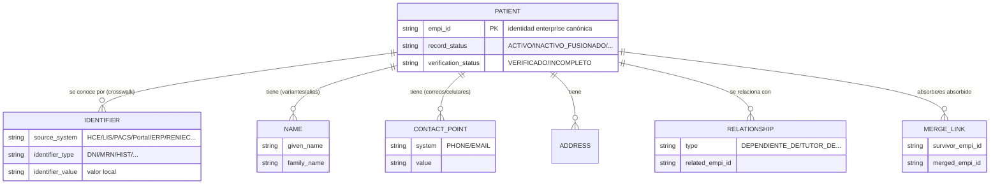
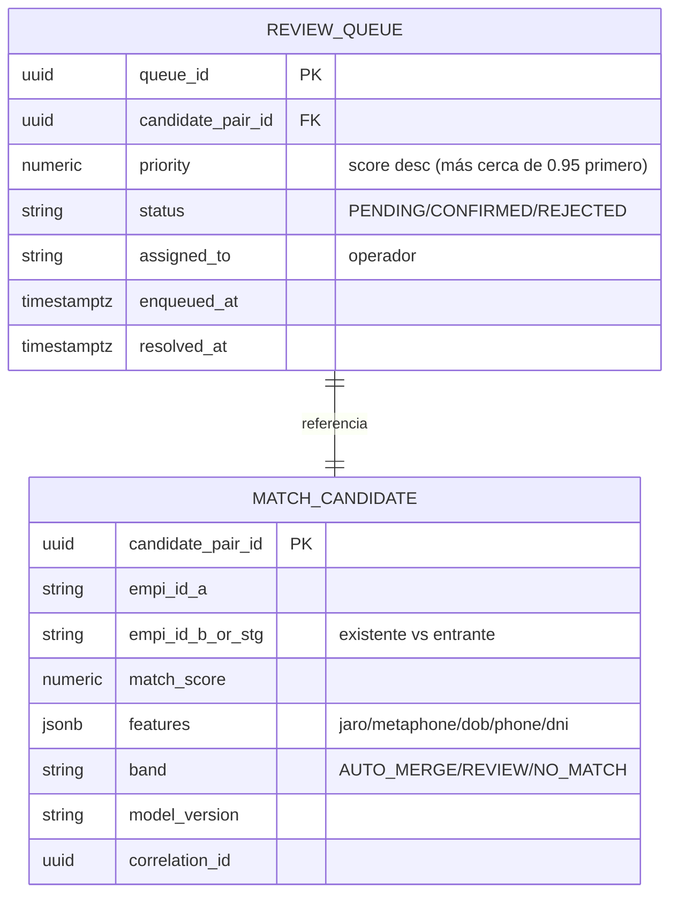
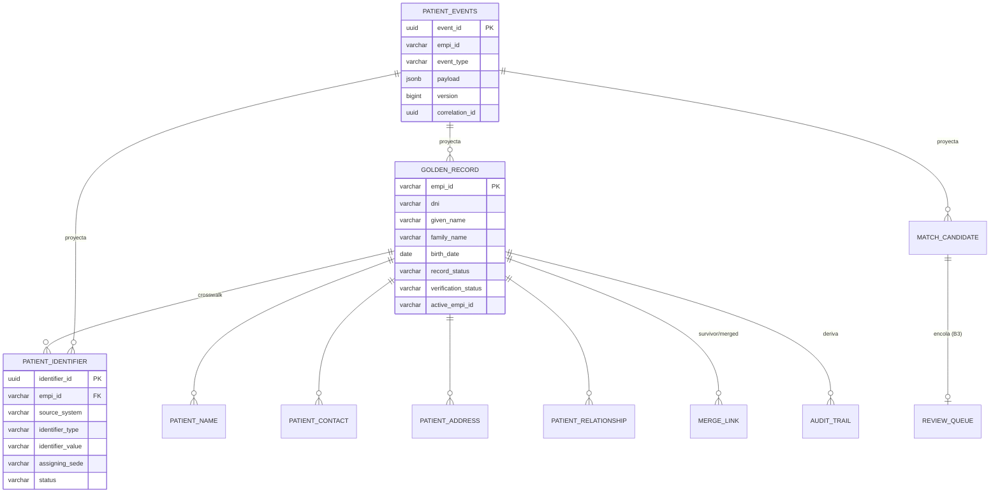
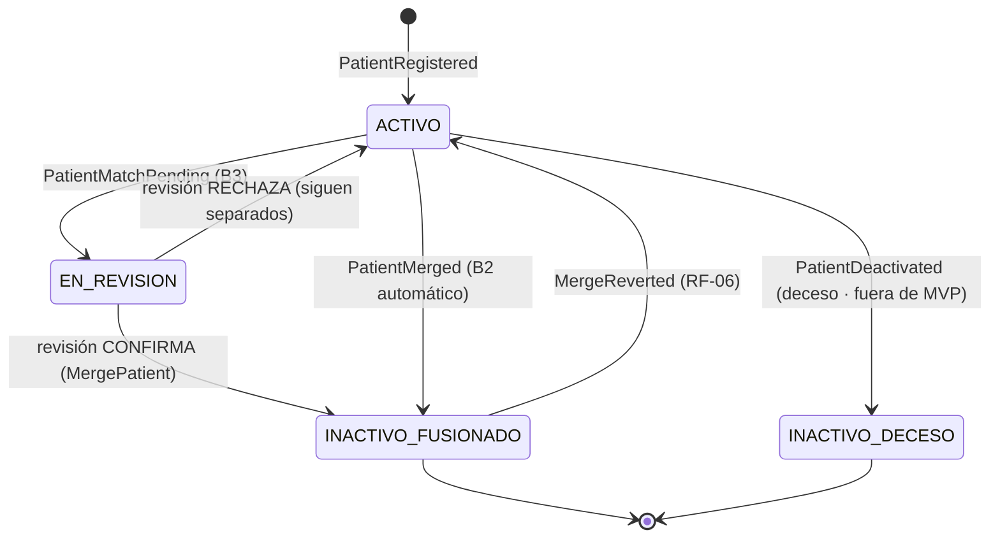

# Modelo de Datos del EMPI — Alternativa 3 Mejorada
## Iniciativa: Identidad Unificada de Pacientes (EMPI) | INI-01 / INI-13 | Clínica SanaRed Integrada | Hito 3

> **Qué es este documento:** define el **modelo de datos** que hace funcionar el EMPI de la **Alternativa 3 Mejorada** (`03_Alternativa3_Mejorada_Multicloud_Concordante.md`), fiel al patrón **Event Sourcing + CQRS** ya elegido y a los flujos de registro (`06_...Flujos_Registro.md`) y al MVP (`01_MVP_EMPI_Propuesta.md`). No inventa una arquitectura nueva: **detalla las estructuras de datos** —de escritura, de lectura, de índice, de referencia y analíticas— que ya estaban implícitas en esos documentos, y agrega la pieza que faltaba explicitar y que es **el corazón de todo EMPI: el crosswalk de identidad** (el mapa de identificadores locales de cada sistema → un único `EMPI-ID`).

---

## 0. Cómo leer este documento

Un EMPI **no es una base de pacientes más**: es el **índice maestro** que cruza las identidades que hoy viven fragmentadas en el parque de SanaRed (HCE Oracle, Portal AWS, LIS Azure, PACS por sede, ERP privado, Agenda SaaS). Por eso el modelo de datos tiene **cinco planos**, no uno solo:

| Plano | Rol | Dónde vive (concordancia) | Fuente de verdad |
|---|---|---|---|
| **1. Escritura (Event Store)** | Registra *qué pasó* (eventos inmutables) | **AWS RDS PostgreSQL** | ✅ **Sí** (única) |
| **2. Lectura (Proyecciones CQRS)** | Estado consultable derivado de los eventos | **AWS RDS PostgreSQL** | ❌ derivado (reconstruible) |
| **3. Índice / caché** | Acelera el matching (blocking + lookup) | **OpenSearch + ElastiCache Redis (AWS)** | ❌ derivado (reconstruible) |
| **4. Referencia (catálogos)** | Datos maestros del propio EMPI (sistemas, tipos, umbrales) | **RDS + SSM Parameter Store (AWS)** | ✅ Sí (config) |
| **5. Analítico (Vista 360°)** | Modelo desnormalizado para consulta clínica | **BigQuery (GCP)** | ❌ derivado |

**Regla de oro (Event Sourcing):** solo el plano 1 es fuente de verdad. Los planos 2, 3 y 5 son **proyecciones reconstruibles**: si se pierden, se **reproducen** desde `patient_events`. Esto es lo que garantiza que la **auditoría no pueda faltar** (el evento *es* la auditoría) y da concordancia con ADR-A3M-007.

---

## 1. Modelo de dominio conceptual (DDD) — el agregado `Patient`

Antes de las tablas, el **modelo lógico**. El agregado raíz es **`Patient`** (una identidad enterprise = un `EMPI-ID`). A su alrededor giran cinco entidades satélite, todas **poseídas por el agregado** (no existen sin él):



**El corazón del EMPI es `IDENTIFIER` (el crosswalk).** El caso lo justifica textualmente: *"Un DNI puede estar asociado a dos correos, **tres números de historia** y registros de dependientes familiares"* (Caso 3a). Es decir, **un mismo paciente** aparece hoy con:

- 1 **DNI** (RENIEC),
- **N números de historia clínica** (uno por sede/HCE),
- 1 ID en el **Portal de Pacientes** (AWS/RDS),
- 1 ID en el **LIS** (Azure),
- **N IDs de estudio locales en PACS** (uno por sede),
- 1 cuenta en el **ERP** de facturación,
- 1 ID en la **Agenda SaaS**.

El EMPI **no borra** esos identificadores: los **cruza** bajo un único `EMPI-ID`. Sin esta tabla, el EMPI sería solo "otra base de pacientes"; **con** ella, es lo que permite que:
- el **HCE** unifique historias al recibir `ADT^A40` (le decimos *qué dos números de historia* son la misma persona),
- el **PACS/DICOM** re-etiquete estudios inter-sede al `EMPI-ID` (Flujo B, doc 06 §4),
- la **vista 360°** consolide LIS + imágenes + historia bajo un solo paciente.

---

## 2. Plano 1 — Modelo de Escritura (Event Store)

### 2.1 Tabla `patient_events` (append-only) — el sobre del evento

Es la **única tabla en la que se escribe** el estado de identidad. Inmutable: sin `UPDATE`, sin `DELETE` a nivel de aplicación (ADR-A3M-007). Reutiliza el sobre ya definido en el Hito 2 (`event_id` UUID v7, `empi_id`, `event_type`, `payload`, `correlation_id`).

| Columna | Tipo | Descripción | Regla |
|---|---|---|---|
| `event_id` | `uuid` (v7) | PK. UUID v7 = ordenable por tiempo (útil para el proyector). | Único, inmutable |
| `empi_id` | `varchar(32)` | Identidad afectada. Formato `EMPI-YYYYMMDD-XXXXXXXX`. | Índice `(empi_id, version)` |
| `event_type` | `varchar(40)` | Tipo del evento (ver catálogo §2.2). FK lógica a `event_type` (catálogo). | No nulo |
| `event_version` | `smallint` | Versión del *esquema* del payload (evolución de contrato). | Default 1 |
| `version` | `bigint` | Nº de secuencia del agregado (concurrencia optimista). | `UNIQUE(empi_id, version)` |
| `payload` | `jsonb` | Datos del evento en formato **FHIR-compatible** (ver §2.2). | No nulo |
| `actor` | `varchar(64)` | Quién originó (rol + id: `ADMISIONISTA:u123`, `SISTEMA:portal`). | No nulo |
| `source_system` | `varchar(24)` | Sistema/canal de origen (FK catálogo `source_system`). | No nulo |
| `correlation_id` | `uuid` | Correlaciona con el request HTTP original y con todos los sistemas destino (trazabilidad end-to-end). | Índice |
| `causation_id` | `uuid` | `event_id` del evento que causó este (linaje causal). | Nullable |
| `occurred_at` | `timestamptz` | Momento del hecho de negocio. | No nulo |
| `recorded_at` | `timestamptz` | Momento de persistencia (default `now()`). | No nulo |

**Concurrencia optimista:** `UNIQUE(empi_id, version)` impide dos escrituras concurrentes sobre el mismo agregado — si dos canales (Portal y Admisión) intentan registrar el mismo DNI a la vez, uno gana y el otro re-evalúa el matching (soporta el escenario E2 sin duplicar).

**Append-only garantizado en la BD (no solo en la app):** se refuerza con un `REVOKE UPDATE, DELETE` sobre la tabla y/o un trigger `BEFORE UPDATE/DELETE` que lanza excepción. El equivalente a la política de indexación append-only que en el Hito 2 daba Cosmos DB.

### 2.2 Catálogo de eventos + esquema de `payload`

Estos son **todos** los eventos que el `PatientAggregate` puede emitir. La columna "Comando" es el `Command` que lo dispara; la "Topic bus" es lo que se publica cross-cloud (§6). Se **reconcilian los nombres** del Hito 1/2 (ver §13).

| Comando (entrada) | Evento (en `patient_events`) | Topic bus (salida) | Flujo | RF |
|---|---|---|---|---|
| `RegisterPatient` | `PatientRegistered` | `identity.patient.created` | A | RF-01 |
| `LinkIdentifier` | `IdentifierLinked` | `identity.patient.updated` | A/B | RF-04 |
| `UpdateContact` | `ContactUpdated` | `identity.patient.updated` | — | RF-05 |
| `FlagForReview` | `PatientMatchPending` | *(interno, no cruza)* | B3 | RF-02 |
| `MergePatient` | `PatientMerged` | `identity.patient.merged` | B2 | RF-02/03 |
| `RevertMerge` | `MergeReverted` | `identity.patient.merged` (revert=true) | — | RF-06 |
| `DeactivatePatient` | `PatientDeactivated` | `identity.patient.deactivated` | — | RF-06 |
| `RecordAccess` *(opcional)* | `PatientAccessed` | *(interno)* | B1 | RNF-03 |

**Ejemplos de `payload` (FHIR-compatible, resumidos):**

```jsonc
// PatientRegistered — Flujo A (paciente nuevo)
{
  "empi_id": "EMPI-20260711-8F3A1C7D",
  "identifiers": [
    { "system": "urn:pe:reniec:dni", "type": "DNI",  "value": "45678912", "use": "official" },
    { "system": "urn:sanared:portal", "type": "PID", "value": "PT-99182",  "use": "secondary" }
  ],
  "name":  { "given": "Juan Carlos", "family": "Ramírez Soto" },
  "birth_date": "1988-04-12",
  "gender": "male",
  "telecom": [
    { "system": "phone", "value": "+51987654321", "use": "mobile" },
    { "system": "email", "value": "jc.ramirez@correo.pe" }
  ],
  "verification_status": "VERIFICADO",
  "match_context": { "method": "no-match", "score": 0.41, "model_version": "fs-2026.1" },
  "source_system": "PORTAL"
}
```

```jsonc
// PatientMerged — Flujo B2 (merge automático score >= 0.95)
{
  "survivor_empi_id": "EMPI-20250115-0A11BB22",   // registro que SOBREVIVE (existente)
  "merged_empi_id":   "EMPI-20260711-8F3A1C7D",    // registro absorbido -> queda INACTIVO
  "decided_by": "AUTO",                             // AUTO | OPERADOR:u456
  "match_score": 0.971,
  "model_version": "fs-2026.1",
  "survivorship": {                                 // qué valor "gana" por precedencia de fuente
    "family": { "value": "Ramírez Soto", "won_by": "HCE" },
    "email":  { "value": "jc.ramirez@correo.pe", "won_by": "PORTAL" }
  },
  "retired_identifiers": [                           // IDs del absorbido que ahora apuntan al survivor
    { "system": "urn:sanared:hce", "type": "HIST", "value": "HIST-SEDE3-77123" }
  ]
}
```

```jsonc
// PatientMatchPending — Flujo B3 (revisión manual, 0.85–0.949)
{
  "candidate_pair_id": "c1f2...-uuid",
  "empi_id_existing": "EMPI-20250115-0A11BB22",
  "incoming_ref": "STG-2026-000481",               // registro entrante en staging
  "match_score": 0.902,
  "band": "REVIEW",
  "features": { "jaro_winkler_name": 0.94, "metaphone_match": true,
                "dob_equal": true, "phone_equal": false, "dni_equal": false }
}
```

> **Por qué `IdentifierLinked` es un evento propio:** cuando un paciente **ya existe** y llega desde un canal nuevo con un identificador local que el EMPI aún no conocía (p. ej. su número de historia de otra sede), **no** hay merge — hay **enriquecimiento del crosswalk**. Ese hecho merece su propio evento para que el xref crezca de forma auditable sin tocar el resto del Golden Record.

---

## 3. Plano 2 — Modelo de Lectura (proyecciones CQRS)

Un **proyector** consume `patient_events` en orden y mantiene estas tablas. Todas son **reconstruibles** reproduciendo eventos (por eso el diseño tolera reconstruir índices sin pérdida). Consistencia eventual < 1–5 s post-escritura (el `PatientAggregate` devuelve el evento confirmado en la respuesta inmediata, como definió el Hito 2).

### 3.1 `golden_record` — la identidad canónica (una fila por `EMPI-ID`)

Evoluciona el `golden_record_view` del MVP (doc 01 §9), **separando las dos dimensiones de estado** que el MVP había colapsado en un único campo `estado` (ver reconciliación §13):

| Columna | Tipo | Descripción |
|---|---|---|
| `empi_id` | `varchar(32)` PK | Identidad canónica. |
| `dni` | `varchar(12)` | DNI principal (denormalizado desde el xref para lookup rápido; el maestro está en `patient_identifier`). Índice único parcial `WHERE record_status='ACTIVO'`. |
| `given_name` | `varchar(120)` | Nombre(s) — valor *ganador* por survivorship. |
| `family_name` | `varchar(120)` | Apellidos — valor ganador por survivorship. |
| `birth_date` | `date` | Fecha de nacimiento. |
| `gender` | `varchar(12)` | Sexo/género (FHIR `administrative-gender`). |
| `primary_phone` | `varchar(20)` | Celular principal (denormalizado; maestro en `patient_contact`). |
| `primary_email` | `varchar(120)` | Correo principal (denormalizado). |
| `record_status` | `varchar(24)` | **Estado del registro:** `ACTIVO` / `INACTIVO_FUSIONADO` / `INACTIVO_DECESO` / `EN_REVISION`. |
| `verification_status` | `varchar(16)` | **Calidad del dato:** `VERIFICADO` (datos completos) / `INCOMPLETO`. |
| `active_empi_id` | `varchar(32)` | Si `INACTIVO_FUSIONADO`, apunta al `EMPI-ID` **superviviente**; si `ACTIVO`, = `empi_id`. (Era `empi_id_activo` en el MVP). |
| `source_precedence_hash` | `varchar(64)` | Huella de qué fuente aportó cada campo (para survivorship/auditoría). |
| `created_at` / `updated_at` | `timestamptz` | Alta y última proyección. |

> **Dos estados, no uno.** `record_status` responde *"¿esta identidad está viva o fue absorbida?"*; `verification_status` responde *"¿sus datos están completos?"*. El MVP las unía en `estado (VERIFICADO/INCOMPLETO/INACTIVO)`; en producción se separan porque un registro puede estar **ACTIVO e INCOMPLETO** a la vez (paciente de urgencias sin correo), y confundirlas rompería la lógica de merge.

### 3.2 `patient_identifier` — el **crosswalk** (corazón del EMPI) ⭐

Una fila por **cada identificador conocido** de cada paciente en cada sistema fuente. Es lo que convierte "otra base de pacientes" en un **índice maestro**.

| Columna | Tipo | Descripción |
|---|---|---|
| `identifier_id` | `uuid` PK | Clave subrogada. |
| `empi_id` | `varchar(32)` FK→`golden_record` | Identidad enterprise a la que pertenece. |
| `source_system` | `varchar(24)` FK→`source_system` | `RENIEC`/`HCE`/`LIS`/`PACS`/`PORTAL`/`ERP`/`AGENDA`. |
| `identifier_type` | `varchar(12)` | `DNI` / `HIST` (nº historia) / `MRN` / `PID` / `ACC` (cuenta ERP) / `ACCESSION` (estudio PACS). |
| `identifier_value` | `varchar(64)` | El valor local tal como lo emite el sistema fuente. |
| `assigning_sede` | `varchar(24)` | Sede que asignó el ID (clave para PACS/HCE **por sede**). Nullable. |
| `use` | `varchar(12)` | `official` / `secondary` / `old` (retirado tras merge). |
| `status` | `varchar(12)` | `ACTIVE` / `RETIRED` (cuando el registro fue absorbido, el ID se conserva pero apunta al survivor). |
| `first_seen_at` / `last_seen_at` | `timestamptz` | Trazabilidad temporal. |

**Restricción clave:** `UNIQUE(source_system, identifier_type, identifier_value) WHERE status='ACTIVE'`. Un mismo número de historia **activo** no puede colgar de dos EMPI-ID → **imposibilita el duplicado por diseño** a nivel de datos (refuerza CA-01.2). Tras un merge, el ID del absorbido pasa a `status='RETIRED'` + `use='old'` apuntando al survivor (así el HCE que aún cite el número viejo se resuelve correctamente).

> **Esto es lo que el caso pide:** *"un DNI... tres números de historia"* → tres filas `HIST` distintas, mismo `empi_id`. *"imágenes de otra sede"* → filas `ACCESSION` con `assigning_sede` distinto, mismo `empi_id` → el radiólogo las ve todas.

### 3.3 `patient_name`, `patient_contact`, `patient_address` — atributos multivaluados

El caso dice *"un DNI puede estar asociado a **dos correos, tres números** de historia"* → los contactos son **multivaluados** y su historia importa (para matching y para no perder un dato al fusionar).

| `patient_name` | `patient_contact` | `patient_address` |
|---|---|---|
| `empi_id`, `given_name`, `family_name`, `use` (official/alias/previous), `source_system`, `valid_from/to` | `empi_id`, `system` (PHONE/EMAIL), `value`, `use` (mobile/home/work), `source_system`, `verified` (bool) | `empi_id`, `line`, `city`, `district`, `postal_code`, `use`, `source_system` |

Se guardan **todas las variantes** vistas (p. ej. "Juan Carlos" / "Jhuan Carlos"): alimentan el scoring fonético y evitan perder información en el merge. El "ganador" que se muestra en `golden_record` sale de survivorship (§5.3).

### 3.4 `patient_relationship` — dependientes familiares (evita el sobre-merge)

Modela el escenario **E5** (doc 01 §3, doc 06 §7): un familiar con mismo apellido/dirección pero **distinta persona** obtiene identidad propia con una relación, **no** una fusión.

| Columna | Tipo | Descripción |
|---|---|---|
| `relationship_id` | `uuid` PK | |
| `empi_id` | `varchar(32)` | Titular. |
| `related_empi_id` | `varchar(32)` | Persona relacionada. |
| `type` | `varchar(20)` | `DEPENDIENTE_DE` / `TUTOR_DE` / `CONYUGE_DE` / `HERMANO_DE`. |
| `valid_from` / `valid_to` | `date` | Vigencia. |

### 3.5 `merge_link` — linaje de fusión (reversible)

Preserva la historia de fusiones para poder ejecutar `RevertMerge` (RF-06) sin perder información. Cada merge (B2) inserta una fila; un revert la marca revertida.

| Columna | Tipo | Descripción |
|---|---|---|
| `merge_id` | `uuid` PK | |
| `survivor_empi_id` | `varchar(32)` | Registro que sobrevive. |
| `merged_empi_id` | `varchar(32)` | Registro absorbido (queda `INACTIVO_FUSIONADO`). |
| `match_score` | `numeric(4,3)` | Score que motivó la fusión (auditable). |
| `decided_by` | `varchar(32)` | `AUTO` o `OPERADOR:uXXX`. |
| `merged_at` | `timestamptz` | |
| `reverted` | `boolean` | `true` si se deshizo. |
| `reverted_at` / `reverted_by` | | Trazabilidad del revert. |
| `merge_event_id` | `uuid` FK→`patient_events` | Evento que lo originó. |

### 3.6 `review_queue` + `match_candidate` — la cola B3 y la evidencia del scoring

En la Alt. 3 Mejorada la cola de revisión es una **tabla-proyección en RDS** (aparece como `review_queue` en el diagrama granular de doc 06 §9), no una SQS. Se acompaña de `match_candidate`, que guarda **el par candidato y su vector de features** — sirve para (a) que el Operador de Gobierno decida con evidencia, (b) auditar por qué el sistema propuso una fusión, y (c) reentrenar el modelo Fellegi-Sunter.



**Prioridad de la cola** = score descendente: los casos más cercanos a 0.95 se revisan primero (minimiza riesgo clínico — criterio ya definido en el Hito 2). El resultado del operador (`CONFIRMED`→`MergePatient` / `REJECTED`→se mantienen separados) **vuelve como comando** al agregado, cerrando el ciclo del árbol de decisión (doc 06 §6).

### 3.7 `audit_trail` — proyección de auditoría

Derivada de **cada** evento (no es opcional: es una vista del propio Event Store). Cumple CA-05.2 por diseño.

| `event_id` | `empi_id` | `actor` | `source_system` | `action` | `correlation_id` | `occurred_at` |
|---|---|---|---|---|---|---|

> Como `patient_events` es la fuente, `audit_trail` **no puede desincronizarse** de lo que realmente pasó: es una re-lectura, no un registro paralelo que alguien deba "acordarse" de escribir.

### 3.8 ER completo de las proyecciones (lo que vive en RDS)



---

## 4. Plano 3 — Índices y cachés (aceleradores, no otra verdad)

Ni OpenSearch ni Redis son fuente de verdad: **se reconstruyen** desde las proyecciones/eventos. Son los pasos 1 y 2 del matching (doc 06 §2).

### 4.1 OpenSearch / Elasticsearch — documento de *blocking* (Paso 2, producción)

Un documento por Golden Record **activo**, optimizado para *blocking* difuso a escala (ADR-A3M-011). No guarda el registro completo: solo lo que el blocking necesita.

```jsonc
// índice: golden-record-idx  (documento por EMPI-ID activo)
{
  "empi_id": "EMPI-20250115-0A11BB22",
  "dni": "45678912",
  "name_phonetic": ["JN KRLS", "RMRS ST"],   // Double Metaphone (español)
  "name_ngram": "jua rui...",                 // edge-ngram para fuzzy
  "birth_year": 1988,                          // para rango FN ±1 año
  "phone_last4": "4321",                       // celular parcial
  "sede": "SEDE-CENTRAL",
  "record_status": "ACTIVO"
}
```

- **Actualización:** el proyector reindexa en cada `PatientRegistered` / `ContactUpdated`, y **elimina/re-apunta** en `PatientMerged` (el absorbido sale del índice para no ser candidato otra vez).
- **Demo:** se sustituye por **`pg_trgm`** sobre `golden_record` (misma función de blocking, sin OpenSearch) — la lógica del flujo no cambia (doc 06 §7).

### 4.2 ElastiCache Redis — lookup exacto (Paso 1) y anti-recálculo

Reutiliza exactamente las claves definidas en el Hito 2:

| Clave | Valor | TTL | Uso |
|---|---|---|---|
| `empi:dni:{sha256(dni)}` | `EMPI-ID` | 5 min (24 h en modo offline) | Paso 1 — *hit* del ~80% de admisiones conocidas (rama B1, < 10 ms). |
| `empi:id:{source}:{value}` | `EMPI-ID` | 5 min | Lookup por identificador local (HIST/PID) además del DNI. |
| `empi:match:{token_biográfico}` | `{score, candidatos[]}` | 30 s | Evita recalcular scoring cuando Portal y Admisión mandan al mismo paciente casi simultáneamente. |

> El DNI se **hashea** (SHA-256) como clave de caché: no se guarda el DNI en claro en Redis (minimización, §10). **Modo degradado offline** (RNF-02.3): el TTL se extiende a 24 h por sede para que urgencias siga admitiendo sin conectividad.

---

## 5. Plano 4 — Datos de referencia (catálogos del EMPI)

Datos maestros **del propio EMPI** (no de pacientes). Viven en RDS salvo los umbrales, que van en SSM Parameter Store para ser configurables en caliente (RNF-06.2).

### 5.1 `source_system` — catálogo de sistemas fuente + **precedencia de survivorship**

Este catálogo es doble-propósito: identifica el origen **y** define **qué fuente “gana”** cuando dos registros aportan el mismo campo con valores distintos (regla que el Hito 2 ya ubicaba en Parameter Store: *"reglas de precedencia por sistema fuente"*).

| `source_system` | Nube (AS-IS) | `identifier_type` que emite | Precedencia (1=mayor) |
|---|---|---|---|
| `RENIEC` | externo | `DNI` | **1** (dato legal) |
| `HCE` | On-prem Oracle | `HIST` (por sede) | 2 (dato clínico) |
| `LIS` | Azure SQL MI | `MRN` | 3 |
| `PORTAL` | AWS/RDS | `PID` | 4 (autoservicio, menos confiable) |
| `PACS` | Local por sede + GCP | `ACCESSION` (por sede) | 5 |
| `ERP` | Nube privada | `ACC` (cuenta) | 5 |
| `AGENDA` | SaaS | `SCHED-ID` | 6 |

> **Cómo se usa:** en un `PatientMerged`, si HCE dice apellido "Ramírez Soto" y Portal dice "Ramirez", **gana HCE** (precedencia 2 > 4). El campo `survivorship` del payload (§2.2) deja registrado *quién ganó cada atributo* → auditable y reversible.

### 5.2 Otros catálogos

| Catálogo | Valores | Nota |
|---|---|---|
| `event_type` | `PatientRegistered`, `IdentifierLinked`, `ContactUpdated`, `PatientMatchPending`, `PatientMerged`, `MergeReverted`, `PatientDeactivated`, `PatientAccessed` | Contrato de eventos (§2.2). |
| `identifier_type` | `DNI`, `HIST`, `MRN`, `PID`, `ACCESSION`, `ACC`, `SCHED-ID` | Tipos del crosswalk. |
| `record_status` | `ACTIVO`, `INACTIVO_FUSIONADO`, `INACTIVO_DECESO`, `EN_REVISION` | Ciclo de vida (§8). |
| `match_config` (SSM) | `threshold_auto=0.95`, `threshold_review=0.85`, `model_version`, `precedence_rules` | **Configurable en caliente** (RNF-06.2), cache TTL 60 s. |

---

## 6. Propagación cross-cloud — el contrato del evento en el bus

El modelo de datos **no termina en RDS**: cada evento se publica en el bus Kafka con un **contrato estable** (topics `identity.patient.*`) que Azure y GCP consumen (doc 03 §3.2, doc 06 §6). El **envelope del mensaje** es un subconjunto del evento (nunca el registro completo — minimización):

```jsonc
// topic: identity.patient.merged
{
  "event_id": "uuid-v7",
  "event_type": "PatientMerged",
  "empi_id": "EMPI-20250115-0A11BB22",         // survivor
  "correlation_id": "uuid",
  "occurred_at": "2026-07-11T14:32:10Z",
  "data": {
    "survivor_empi_id": "EMPI-20250115-0A11BB22",
    "merged_empi_id":   "EMPI-20260711-8F3A1C7D",
    "retired_identifiers": [
      { "system": "urn:sanared:hce", "type": "HIST", "value": "HIST-SEDE3-77123" }
    ]
  }
}
```

**Quién consume qué del contrato:**

| Consumidor | Nube | Qué hace con el dato del evento |
|---|---|---|
| Adaptador Clínico | Azure Functions | `PatientMerged` → `ADT^A40` al HCE con el **par de números de historia** (`retired_identifiers` ↔ survivor) para que unifique. `PatientRegistered` → `ADT^A28`. |
| Adaptador Financiero | Azure Functions | consolida cuentas ERP bajo `survivor_empi_id`. |
| Cloud Healthcare API | GCP | re-etiqueta estudios DICOM del `merged` al `survivor` (imágenes inter-sede). |
| BigQuery | GCP | recalcula la vista 360°. |

> El HCE recibe *exactamente* el dato que necesita (qué dos historias son la misma persona) porque el crosswalk (§3.2) lo tiene. Sin ese plano, el `ADT^A40` no podría construirse.

---

## 7. Plano 5 — Vista analítica 360° (BigQuery, GCP)

Modelo **desnormalizado** de solo-lectura, materializado en BigQuery por concordancia analítica (ADR-A3M-005). Consolida bajo un `EMPI-ID`: identidad + últimos resultados de LIS + estudios de imagen + episodios — datos que **nacieron en las 3 nubes** (criterio de éxito de la demo, doc 03 §6.3). Es el que resuelve el escenario del **paciente anticoagulado** (E4).

```jsonc
// tabla materializada: patient_360  (1 fila por EMPI-ID activo)
{
  "empi_id": "EMPI-20250115-0A11BB22",
  "identity": { "dni": "45678912", "name": "Juan Carlos Ramírez Soto", "birth_date": "1988-04-12" },
  "identifiers": [ /* proyección del crosswalk: dónde existe este paciente */ ],
  "lab_results":  [ /* desde LIS (Azure) vía evento/adaptador */ ],
  "imaging_studies": [ /* estudios DICOM inter-sede, ya unificados por EMPI-ID (GCP) */ ],
  "encounters": [ /* episodios desde HCE */ ],
  "flags": ["ANTICOAGULADO"],                  // el antecedente crítico del caso E4
  "last_refreshed": "2026-07-11T14:35:00Z"
}
```

> Se alimenta de: (a) `identity.patient.*` del bus (identidad + crosswalk), (b) datos de LIS/HCE vía adaptadores, (c) metadatos DICOM de Cloud Healthcare API. **Demo:** DuckDB/BigQuery sandbox con el mismo esquema (doc 03 §5).

---

## 8. Representación canónica FHIR R4 + mapeo HL7 v2

El `payload` de los eventos es **FHIR-compatible** (Hito 2). El recurso canónico es **`Patient`** (FHIR R4). El mapeo directo del modelo:

| Elemento del modelo | FHIR R4 `Patient` | HL7 v2 (adaptador Azure) |
|---|---|---|
| `EMPI-ID` | `identifier` con `system="urn:sanared:empi"`, `use=official` | `PID-3` (con `assigning authority = SANARED-EMPI`) |
| `DNI` | `identifier` `system="urn:pe:reniec:dni"` | `PID-3` repetición con `authority=RENIEC` |
| ID de cada sistema fuente (crosswalk §3.2) | `identifier` (uno por `source_system`, con su `system` URI) | `PID-3` repeticiones |
| `given_name` / `family_name` | `name` (`HumanName`) | `PID-5` |
| `birth_date` | `birthDate` | `PID-7` |
| `gender` | `gender` | `PID-8` |
| contactos | `telecom` (`ContactPoint`) | `PID-13/14` |
| dependiente (E5) | `contact` / `RelatedPerson` | `NK1` |
| **merge** (registro absorbido) | `active=false` + `link{ type=replaced-by, other=survivor }`; en el survivor `link{ type=replaces }` | **`ADT^A40`** con segmento **`MRG`** (el `MRG-1` lleva el ID retirado) |
| alta nueva | `Patient` `active=true` | **`ADT^A28`** |
| actualización | — | **`ADT^A31`** |

> **El puente merge ↔ ADT^A40 es exacto:** el `MRG` de HL7 v2 necesita *"este ID viejo se fusiona en este ID nuevo"* — es literalmente el par `retired_identifiers` ↔ `survivor_empi_id` que el crosswalk mantiene. Coherencia total con doc 06 §4.

---

## 9. Ciclo de vida del Golden Record (máquina de estados)

`record_status` evoluciona **solo por eventos** (nunca por UPDATE directo):



- **`INACTIVO_FUSIONADO`** conserva `active_empi_id` → cualquier consulta con el ID viejo se **redirige** al superviviente (no se pierde nada). Reversible vía `merge_link` (§3.5).
- El **deceso** queda fuera del MVP pero el modelo lo prevé (`INACTIVO_DECESO`) para no rediseñar en Fase 2.

---

## 10. Seguridad, PII y Ley 29733 sobre el modelo

Clasificación de campos y controles (concordante con RNF-03 y las piezas transversales AWS de doc 06 §9.2):

| Campo | Sensibilidad | Control en el modelo de datos |
|---|---|---|
| `dni`, nombres, contactos | **PII / dato personal** | Cifrado en reposo con **AWS KMS** (RDS, OpenSearch, ElastiCache, Secrets); en Redis el DNI va **hasheado** (SHA-256), nunca en claro. |
| `payload` de eventos | PII embebida | Cifrado KMS a nivel de RDS; **no** se replica el payload completo al bus (solo el subconjunto necesario — §6). |
| Datos clínicos (360°) | **Dato sensible de salud** | Solo en BigQuery (GCP) con IAM restrictivo; acceso por rol (Médico) vía APIM/claims. |
| Auditoría | — | `audit_trail` inmutable (deriva del Event Store); `correlation_id` para trazar accesos. |

- **Minimización:** el bus transporta identificadores y el hecho, no la ficha completa; cada consumidor pide a la fuente lo que necesita.
- **Retención / derecho de supresión (Ley 29733):** como el Event Store es append-only, el "borrado" se implementa con **crypto-shredding** (destruir la clave KMS del sujeto) + evento de tombstone, no con `DELETE` físico — preservando la integridad del log y cumpliendo la ley.
- **Demo:** datos **100% sintéticos** (Faker `es_PE`) → cumple RNF-07 por diseño; ningún dato real entra al modelo (doc 01 §2.2).

---

## 11. Cómo el modelo soporta cada flujo (trazabilidad con doc 06)

| Paso del flujo (doc 06) | Estructura de datos que lo resuelve |
|---|---|
| **Paso 1 — lookup DNI (B1)** | Redis `empi:dni:{sha256}` → si *hit*, devuelve `EMPI-ID` sin tocar RDS. |
| **Paso 2 — blocking (B2/B3)** | OpenSearch `golden-record-idx` (prod) / `pg_trgm` (demo). |
| **Paso 3 — scoring** | `match_candidate.features` (guarda el vector) + `match_config` (umbrales SSM). |
| **Flujo A — paciente nuevo** | `PatientRegistered` → `golden_record` (ACTIVO/VERIFICADO) + filas iniciales en `patient_identifier`. |
| **B2 — merge automático** | `PatientMerged` → `merge_link` + `active_empi_id` + `patient_identifier.status=RETIRED` del absorbido. |
| **B3 — revisión** | `PatientMatchPending` → `match_candidate` + `review_queue` (prioridad por score). |
| **Enriquecer crosswalk** | `IdentifierLinked` → nueva fila en `patient_identifier` sin merge. |
| **Propagación** | contrato del bus (§6) → Azure `ADT^A28/A40`, GCP re-tag DICOM, BigQuery 360°. |
| **Continuidad clínica (E4)** | `patient_360` (BigQuery) unifica LIS+imágenes+HCE bajo un `EMPI-ID`. |

---

## 12. Dónde vive cada estructura — Demo vs. Producción (concordancia)

| Estructura | Nube (concordancia) | Producción | Demo / Lab |
|---|---|---|---|
| `patient_events` (Event Store) | **AWS** (dominio paciente) | RDS PostgreSQL append-only | Postgres contenedor / RDS free-tier |
| Proyecciones (`golden_record`, `patient_identifier`, `merge_link`, `review_queue`, `audit_trail`) | **AWS** | RDS PostgreSQL | Postgres contenedor |
| Índice de blocking | **AWS** | **OpenSearch/Elasticsearch** (ADR-A3M-011) | `pg_trgm` |
| Caché de identidad | **AWS** | ElastiCache Redis | Redis contenedor |
| Umbrales / precedencia | **AWS** | SSM Parameter Store | archivo `.env` / tfvars |
| Vista 360° / batch | **GCP** (analítica) | BigQuery + Splink | DuckDB + Splink |
| Contrato de eventos (bus) | **Transversal** | Kafka (Confluent) | Redpanda (1 contenedor) |
| Recurso canónico | — | FHIR R4 (`Patient`) + HL7 v2 | HAPI FHIR / Orthanc |

> **La topología del dato no se degrada en la demo:** mismo esquema, mismos eventos, mismos contratos; solo cambia el *motor* (pg_trgm por OpenSearch, DuckDB por BigQuery), fiel al principio de perfiles del doc 03 §5.

---

## 13. Reconciliación y consistencia con los demás documentos

| Punto | Resolución en este modelo |
|---|---|
| **Estado único del MVP** (`estado: VERIFICADO/INCOMPLETO/INACTIVO`) | Se **separa en dos dimensiones**: `record_status` (vida/merge/deceso) + `verification_status` (completitud). El MVP puede seguir usando el campo colapsado; producción usa los dos (§3.1). |
| **Nombres de eventos** (H2 usaba `RecordsMerged`, `UpdateContact`; H3 usa `PatientMerged`) | Catálogo canónico único en §2.2; `RecordsMerged` queda como **sinónimo histórico** de `PatientMerged`. |
| **`empi_id_activo` (MVP)** vs **`active_empi_id`** | Mismo concepto; se adopta `active_empi_id` (consistente en inglés con el resto de columnas). |
| **`review_queue` SQS (H2)** vs **tabla RDS (H3)** | En la Alt. 3 Mejorada es **tabla-proyección en RDS** (aparece así en el diagrama granular de doc 06 §9); la SQS del Hito 2 queda superada. |
| **Crosswalk ausente en docs previos** | Se **explicita** como `patient_identifier` (§3.2): el Hito 2 lo mencionaba como *"referencias a sistemas fuente"* dentro del `golden_record_view`; aquí se normaliza a su propia tabla, que es lo correcto para un EMPI. |
| **Formato EMPI-ID** | `EMPI-YYYYMMDD-XXXXXXXX` (Hito 2), reutilizado sin cambios. |
| **Umbrales 0.95 / 0.85** | En `match_config` (SSM), idénticos a doc 01 §6.3 y doc 06 §2. |

---

## 14. Trazabilidad final

| Elemento del modelo | RF / RNF / CA | ADR | Documento fuente |
|---|---|---|---|
| `patient_events` append-only | RNF-03 (auditoría), CA-05.2 | A3M-007 | 01 §9, 03 §7 |
| `patient_identifier` (crosswalk) | RF-04, CA-01.2 | A3M-001/006 | 03 §1, 06 §4 (novedad explícita) |
| `golden_record` (2 estados) | RF-01/06 | A3M-002 | 01 §9 |
| `match_candidate` + `review_queue` | RF-02, CA-02.1 | A3M-011 | 06 §9 |
| `merge_link` (revert) | RF-06 | A3M-007 | 06 §4 |
| OpenSearch idx / Redis | RNF-01/05 | A3M-011 | 06 §2 |
| `match_config` (umbrales/precedencia) | RNF-06.2 | A3M-009 | 01 §6.3 |
| Contrato de eventos (bus) | RNF-04, PT-02 | A3M-008 | 03 §3.2, 06 §6 |
| `patient_360` (BigQuery) | RF-05 (E4) | A3M-005 | 03 §4, 06 §9 |
| FHIR R4 / HL7 v2 | RNF-04 | A3M-004 | 06 §4 |
| Cifrado KMS / crypto-shredding | RNF-03, RNF-07 (Ley 29733) | A3M-002 | 01 §2.2 |

---

*Documento de Hito 3 — Modelo de Datos del EMPI | Iniciativa EMPI | Clínica SanaRed Integrada*
*Complementa: `01_MVP_EMPI_Propuesta.md` · `03_Alternativa3_Mejorada_Multicloud_Concordante.md` · `06_Alternativa3_Mejorada_Flujos_Registro.md`*
