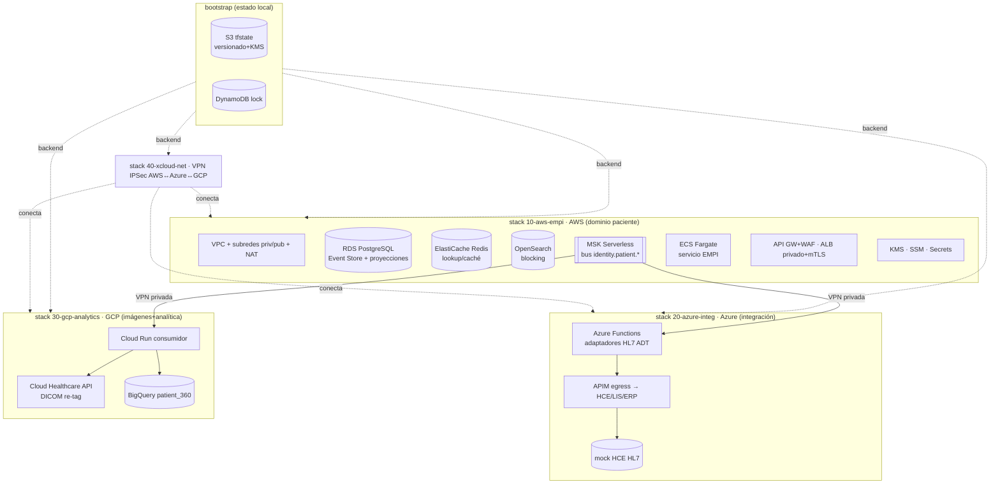
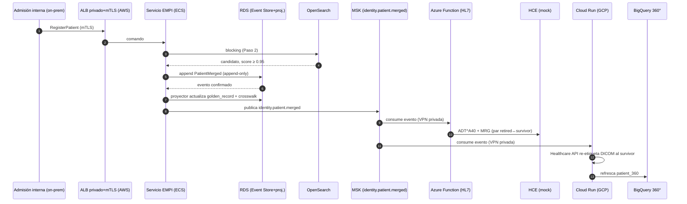

# Plan de Puesta en Escena de la Solución — Alternativa 3 Mejorada
## Iniciativa: Identidad Unificada de Pacientes (EMPI) | INI-01 / INI-13 | Clínica SanaRed Integrada | Hito 3

> **Qué es este documento:** el **plan de implementación y despliegue** que lleva la Alternativa 3 Mejorada del papel a una solución **ejecutable multinube real**. Define el alcance, las decisiones tomadas, la arquitectura de Infraestructura como Código (Terraform), el flujo que se demostrará end-to-end, el plan por fases y el estado de avance. Es fiel a `03_Alternativa3_Mejorada_Multicloud_Concordante.md` (arquitectura), `06_..._Flujos_Registro.md` (flujos) y `07_..._Modelo_Datos.md` (datos), y materializa los dos entregables técnicos del Hito 3: **(1) IaC Terraform de la arquitectura multinube** y **(2) ejecución de un flujo de la solución**.

---

## 0. Cómo leer este documento

Este no es un documento de arquitectura (ese es el doc 03) ni de datos (doc 07): es el **plan de obra**. Responde tres preguntas: *¿qué se construye?*, *¿en qué orden?* y *¿cómo se demuestra que funciona?*. La premisa acordada con el negocio es construir la solución **tal como es** —multinube real, sin reducir su complejidad— delimitándola correctamente a lo que el proyecto EMPI **construye** (el TO-BE), no a los sistemas legados que solo **integra**.

---

## 1. Alcance — la solución son tres capas, no dos

Los entregables del hito son dos (IaC + ejecución de flujo), pero entre ellos existe una capa intermedia ineludible: el **código de la solución**. Reconocerla evita subestimar el trabajo.

| Capa | Qué es | Artefacto | Estado |
|---|---|---|---|
| **1. IaC (Terraform)** | Provisiona la infraestructura multinube TO-BE | `infra/terraform/` | 🟡 en construcción (Fase 0+1 AWS) |
| **2. Código de la solución** | Servicio EMPI (FastAPI + proyector CQRS); adaptadores HL7 (Azure), consumidores (GCP) por crear | `services/empi-service/` | 🟢 servicio EMPI verificado; adaptadores pendientes |
| **3. Ejecución del flujo** | Correr el golden path B2 sobre 1+2 | script de demo + evidencias | 🟡 Flujo A/B1/B2/B3 corren local; falta cross-cloud |

> El **modelo de datos y los scripts** ya generados (`07_Scripts_Modelo_Datos/`: `sql/`, `schemas/`, `opensearch/`, `bigquery/`) son el **cimiento de la capa 2**: el RDS se inicializa con `sql/`, y los `schemas/` son el contrato del bus. Se empieza con ventaja.

---

## 2. Principio de fidelidad — provisionar el TO-BE, simular los legados

"Sin reducir la complejidad" **no** significa desplegar los sistemas legados. HCE (Oracle on-prem), LIS (Azure SQL MI) y PACS son **AS-IS**: el EMPI se **integra** con ellos, no los despliega. Por diseño:

- **El IaC provisiona los componentes del EMPI** (TO-BE) en las 3 nubes.
- **Los legados se representan con endpoints simulados** fieles a su contrato: un *mock* HL7 v2 (HCE), **Orthanc** para DICOM (PACS), un Postgres haciendo de LIS.

Esto **no recorta la solución** —mantiene topología, eventos y contratos reales— y de paso elimina el mayor costo evitable (Azure SQL MI ≈ US$700/mes), que ni siquiera es parte del EMPI.

---

## 3. Decisiones de puesta en escena (tomadas)

| Decisión | Elección | Implicación |
|---|---|---|
| **Fidelidad de despliegue** | **3 nubes reales** (AWS+Azure+GCP con cuentas y billing propios) | Máxima fidelidad; costo real acotado con SKUs mínimos y disciplina `apply`/`destroy`. Legados mockeados. |
| **Flujo a demostrar** | **B2 — merge automático cross-cloud** | Ejercita las 3 nubes y el crosswalk; demuestra el valor completo del EMPI. |
| **Punto de arranque** | **Fase 0 + Fase 1 (AWS core)** | Reutiliza `07_Scripts_Modelo_Datos/sql/` para inicializar RDS; deja Flujo A corriendo pronto en AWS. |
| **Motor IaC** | **Terraform** (multi-provider `aws`/`azurerm`/`google`) | Estado remoto S3+DynamoDB; 4 stacks separados cableados por `terraform_remote_state`. |
| **Perfiles** | `demo` (SKUs mínimos) vs `prod` (SKUs del doc §12) | Misma topología, distinto tamaño/motor — fiel al principio de perfiles del doc 03 §5. |

---

## 4. Arquitectura del IaC — 4 stacks con estado remoto separado

No un mega-`apply`, sino cuatro stacks independientes (menor *blast radius*, patrón real de producción), cableados entre sí por `terraform_remote_state` y aplicados en orden `bootstrap → 10 → 20/30 → 40`.



### 4.1 Estructura de carpetas

```
infra/terraform/
├── bootstrap/            # (1º, estado LOCAL) backend remoto: S3 + DynamoDB lock
├── stacks/
│   ├── 10-aws-empi/      # ★ FASE 1: núcleo EMPI (red, datos, bus, cómputo, edge)
│   ├── 20-azure-integ/   #   FASE 2: adaptadores HL7 (Functions), APIM egress, mock HCE
│   ├── 30-gcp-analytics/ #   FASE 3: Healthcare API (DICOM), BigQuery 360, Cloud Run
│   └── 40-xcloud-net/    #   FASE 2-3: túneles VPN IPSec AWS↔Azure↔GCP
└── modules/              # módulos reutilizables (aws-network, ...)
```

### 4.2 Conectividad inter-nube (punto de fidelidad)

PrivateLink (AWS), Private Link (Azure) y PSC (GCP) son mecanismos **intra-nube**: exponen servicios de forma privada dentro de cada nube. El salto **entre** nubes es una **VPN IPSec** (AWS VPN GW ↔ Azure VPN Gateway ↔ GCP HA VPN) o un interconnect tipo Megaport. El stack `40-xcloud-net` modela esto de verdad. Los rangos no se solapan: **AWS `10.20.0.0/16`**, **Azure `10.30.0.0/16`**, **GCP `10.40.0.0/16`**.

### 4.3 Cómputo por nube

| Componente | Servicio | Nube |
|---|---|---|
| Servicio EMPI (API + agregado + proyector) | **ECS Fargate** | AWS |
| Adaptadores HL7 (ADT^A28/A31/A40) | **Azure Functions** | Azure |
| Consumidores (re-tag DICOM, refresh 360°) | **Cloud Run** | GCP |

---

## 5. El flujo a demostrar — golden path B2 (merge cross-cloud)

Es el flujo que ejercita las 3 nubes y el crosswalk; demuestra el valor completo del EMPI.



**Verificación (evidencias de la demo):** `golden_record_view` (survivor ACTIVO, absorbido INACTIVO_FUSIONADO), `patient_crosswalk_view` (IDs consolidados), el mensaje `ADT^A40` emitido, `audit_trail` (derivado del Event Store) y la fila de `patient_360`.

> Antes del golden path, la **Fase 1 sola** ya permite demostrar el **Flujo A** (alta de paciente nuevo) íntegramente dentro de AWS.

---

## 6. Plan por fases

| Fase | Objetivo | Entregables clave | Depende de |
|---|---|---|---|
| **0 · Fundaciones** | Repo IaC, estado remoto, convenciones, seguridad base, CI | `bootstrap/`, providers/tags, backend S3+DynamoDB, pipeline `validate/plan/checkov` | — |
| **1 · AWS core** | Núcleo EMPI en AWS | red, KMS/SSM/Secrets, RDS (init con `sql/`), Redis, OpenSearch, MSK, ECS, edge (API GW+WAF/ALB+mTLS) | 0 · capa 2 (ECS/edge) |
| **2 · Bus + Azure** | Integración clínica y merge→ADT | topics `identity.patient.*`, Azure Function (ADT^A40), APIM egress, mock HCE, VPN AWS↔Azure | 1 |
| **3 · GCP** | Imágenes + analítica | Cloud Healthcare API (DICOM), BigQuery `patient_360`, Cloud Run, VPN AWS↔GCP | 1 |
| **4 · Golden path** | Ejecución end-to-end B2 | datos sintéticos `es_PE`, script de demo reproducible, observabilidad, evidencias | 1·2·3 |

**Ruta crítica hacia el entregable "ejecución de flujo":** Fase 1 requiere la **capa 2** (servicio EMPI) para el cómputo (ECS) y el edge. Por eso, tras el núcleo de datos/bus, el siguiente hito es construir el **esqueleto del servicio EMPI**.

---

## 7. Estado de avance (a 2026-07-11)

Validado con `terraform validate` (Terraform 1.9.8). **Aún sin `apply`** (requiere credenciales de nube) → **sin costo incurrido**.

| Fase | Componente | Estado |
|---|---|---|
| 0 | `bootstrap` (S3+DynamoDB) + convenciones (providers/tags/perfiles) | ✅ escrito · `validate` OK |
| 1 | `10-aws-empi` · red (VPC/subredes/NAT/endpoints) | ✅ escrito · `validate` OK |
| 1 | `10-aws-empi` · seguridad (KMS, SSM umbrales, Secrets vía RDS-managed) | ✅ escrito · `validate` OK |
| 1 | `10-aws-empi` · datos (RDS PostgreSQL 16, ElastiCache Redis, OpenSearch) | ✅ escrito · `validate` OK |
| 1 | `10-aws-empi` · bus (MSK Serverless SASL/IAM) | ✅ escrito · `validate` OK |
| **Capa 2** | servicio EMPI (`services/empi-service/`: API, matcher, Event Store, proyector, Docker) | ✅ construido · **verificado E2E** (pytest + HTTP: REGISTERED/LINKED/MERGED/REVIEW) |
| 1 | `10-aws-empi` · cómputo (ECR + ECS Fargate + IAM + CloudWatch logs) | ✅ escrito · `validate` OK |
| 1 | `10-aws-empi` · edge (ALB privado+mTLS, NLB, API GW+WAF) | ✅ escrito · `validate` OK |
| 0/1 | CI GitHub Actions (fmt/validate/plan/checkov) | ✅ `.github/workflows/iac.yml` |
| **Capa 2** | adaptador HL7 (`services/hl7-adapter/`: `ADT^A28`/`ADT^A40`+`MRG`) | ✅ construido · **verificado** (pytest 3/3) |
| 2 | `20-azure-integ` (VNet, Functions, APIM egress, mock HCE) | ✅ escrito · `validate` OK |
| 2 | `40-xcloud-net` (VPN IPSec AWS↔Azure) | ✅ escrito · `validate` OK |
| 3 | `30-gcp-analytics` + `40-xcloud-net` (AWS↔GCP) | ⬜ pendiente |
| 4 | Golden path B2 + demo reproducible | ⬜ pendiente |

**Fidelidad al modelo (ya en el IaC):** cifrado KMS en todo el plano de datos (RNF-03 / Ley 29733); RDS/Redis/OpenSearch/MSK en **subredes privadas**; umbrales `0.95/0.85` en SSM (configurables en caliente, RNF-06.2); *security groups* least-privilege (solo la app alcanza los datos) con hueco `9098` para consumidores cross-cloud (Azure/GCP).

---

## 8. Prerrequisitos y herramientas

| Herramienta | Uso | Estado en el equipo |
|---|---|---|
| Terraform ≥ 1.6 | motor IaC | ⚠️ no instalado (se usó binario 1.9.8 portable para validar) |
| AWS CLI v2 | credenciales AWS | ⚠️ no instalado |
| Azure CLI / gcloud | credenciales Azure/GCP (Fases 2-3) | ⚠️ no instalado |
| Docker | mocks y contenedores | ✅ disponible |
| checkov (opc.) | escaneo de seguridad del IaC | ⬜ por instalar |

**Datos que el usuario debe proveer (en `*.tfvars`, nunca al repo):** AWS (cuenta con billing, región, perfil), Azure (`subscription_id`, `tenant_id`, región), GCP (`project_id`, región, service account).

---

## 9. Secuencia de despliegue (Fase 0 + 1)

```bash
# 0) Backend remoto (una sola vez; estado local -> crea S3+DynamoDB)
cd infra/terraform/bootstrap
terraform init && terraform apply        # anota outputs: state_bucket, lock_table

# 1) Núcleo EMPI en AWS
cd ../stacks/10-aws-empi
cp backend.hcl.example backend.hcl          # pega el bucket del paso 0
cp terraform.tfvars.example terraform.tfvars # ajusta región, cidr, environment
terraform init -backend-config=backend.hcl
terraform plan          # revisar
terraform apply

# 2) Inicializar el esquema (desde dentro de la VPC: CI/ECS/bastión)
#    psql "$DSN" -f entregables_hito3/07_Scripts_Modelo_Datos/sql/00_extensions.sql ... 99_seed_demo.sql
```

---

## 10. Disciplina de costo (por elegir "3 nubes reales")

- **SKUs mínimos** por defecto: RDS `db.t4g.micro`, OpenSearch `t3.small.search` (1 nodo), ElastiCache `cache.t4g.micro`, **MSK Serverless**, 1 NAT Gateway (perfil `demo`).
- **`terraform destroy` al cerrar cada sesión de demo.** El estado remoto permite recrear idéntico.
- Etiqueta `managed_by=terraform` + `cost_center=hito3-empi` en todo (barrido/auditoría de costo).
- **Sin datos reales:** solo sintéticos `es_PE` (RNF-07); el "borrado" es crypto-shredding sobre el log append-only (doc 07 §10).

---

## 11. Trazabilidad con el resto del Hito 3

| Elemento del plan | Documento / artefacto fuente |
|---|---|
| Concordancia de dominio (EMPI→AWS, integración→Azure, analítica→GCP) | 03 §1-3, ADR-A3M-001 |
| Perímetro por dirección (WAF público / ALB mTLS interno / APIM egress) | 06 §9, ADR-A3M-003 |
| Golden path B2 (merge cross-cloud) | 06 §4-6 |
| Esquema RDS + `sql/` de init | 07 §2-3, `07_Scripts_Modelo_Datos/sql/` |
| Contrato de eventos del bus | 07 §6, `07_Scripts_Modelo_Datos/schemas/bus/` |
| Índice de blocking / vista 360° | 07 §4.1/§7, `opensearch/`, `bigquery/` |
| Umbrales/precedencia en SSM | 07 §5.2, ADR-A3M-009 |
| Cifrado KMS / minimización | 07 §10, RNF-03, Ley 29733 |

---

## 12. Riesgos y decisiones abiertas

| Riesgo / decisión | Mitigación / opción |
|---|---|
| **Costo de 3 nubes encendidas** | SKUs mínimos + `destroy` disciplinado; provisionar por ventanas de demo. |
| **Capa 2 (servicio EMPI) es ruta crítica** | Priorizar el esqueleto tras el núcleo de datos; ECS/edge quedan bloqueados sin él. |
| **VPN inter-nube (complejidad real)** | Aislada en `40-xcloud-net`; validable por tramos (AWS↔Azure primero). |
| **Migraciones en subredes privadas** | Ejecutar `sql/` desde CI con acceso a VPC / tarea ECS de arranque / bastión efímero (no desde Terraform). |
| **Fork inmediato** | (A) construir servicio EMPI → desbloquea ejecución de flujo; (B) IaC-first (ECS placeholder + Azure/GCP + VPN). **Recomendado: A.** |

---

*Documento de Hito 3 — Plan de Puesta en Escena | Iniciativa EMPI | Clínica SanaRed Integrada*
*Complementa: `03_..._Multicloud_Concordante.md` · `06_..._Flujos_Registro.md` · `07_..._Modelo_Datos.md` · `07_Scripts_Modelo_Datos/` · `infra/terraform/`*
